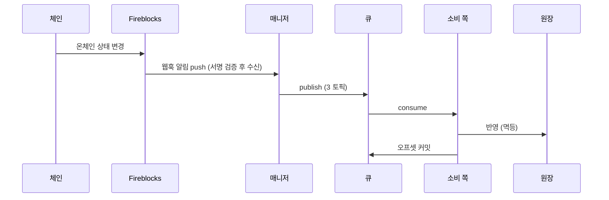

# Blockchain Manager API

`v0.7.0`

블록체인 매니저는 사내의 별도 서비스로, 온체인 거래(노드 연동)를 담당한다.
호출 쪽 백엔드(Service·Admin)는 이 HTTP API 로 계정·주소·잔액·거래를 다루고,
온체인 상태 변경은 메시지 큐 이벤트로 받는다.

아래 규약은 **모든 엔드포인트에 공통** 적용된다.

## 응답 형식

성공·목록·에러 모두 같은 구조로 돌려준다. `meta.requestId` 로 요청을 추적한다. 스키마 이름은 단건이 `<타입>Response`, 목록이 `<타입>ListResponse` 다.

단일 리소스:

```json
{
  "data": {
    "accountType": "CUSTOMER",
    "ref": "000123",
    "accountId": "acct_01H8X"
  },
  "meta": {
    "requestId": "3f9a1c2e-7b4d-4e2a-9c1f-0a2b3c4d5e6f"
  }
}
```

페이지네이션 목록:

```json
{
  "data": [
    { "txId": "tx_9f2a", "status": "FINALIZED", "amount": "1.5" }
  ],
  "meta": {
    "requestId": "3f9a1c2e-7b4d-4e2a-9c1f-0a2b3c4d5e6f"
  },
  "pagination": {
    "nextCursor": "eyJsYXN0IjoxNzUxMzM2MDAwMDAwfQ",
    "hasMore": true
  }
}
```

에러:

```json
{
  "error": {
    "code": "ACCOUNT_NOT_FOUND",
    "message": "account not found"
  },
  "meta": {
    "requestId": "3f9a1c2e-7b4d-4e2a-9c1f-0a2b3c4d5e6f"
  }
}
```

## 데이터 포맷

- **시각** — ISO 8601, UTC, 밀리초. 예: `2026-07-13T04:05:06.789Z`
- **금액** — 문자열(decimal). 예: `"1.5"`. float 가 아니라 decimal 로 파싱한다.
- **필드명** — camelCase (`externalTxId` · `numOfConfirmations`)
- **요청 추적** — 모든 응답에 `meta.requestId`
- **온체인 해시** — 전파 후 채워짐(그 전엔 null), `txHash`

## 에러 코드

판단은 `error.code` 로 한다.

| 코드 | HTTP | 뜻 |
|---|---|---|
| `VALIDATION_FAILED` | 400 | 요청 형식·값이 규약에 안 맞음 |
| `ACCOUNT_NOT_FOUND` | 404 | 계정 없음 (주소 미발급과 구분) |
| `ASSET_NOT_SUPPORTED` | 400 | 우리가 지원하지 않는 (네트워크, 토큰) — 요청 형식은 맞다 |
| `NOT_FOUND` | 404 | 그 밖의 리소스 없음 |
| `CONFLICT` | 409 | 같은 멱등 키에 다른 내용이 왔다 (예: 이미 쓴 externalTxId 로 금액·목적지가 다른 제출) |
| `SUBMIT_IN_PROGRESS` | 503 | 같은 `externalTxId` 의 앞선 제출이 처리 중이다 — **오류가 아니라 지연**이다. `Retry-After` 뒤에 같은 요청을 그대로 다시 보낸다 |
| `RELAY_REJECTED` | 502 | 대납 relay 가 전송을 못 대거나 거절 |
| `INTERNAL` | 500 | 서버 내부 오류 |

`SUBMIT_IN_PROGRESS` 를 `CONFLICT` 와 나눈 이유 — `CONFLICT` 는 "키를 잘못 썼다"는 확정 오류라 재시도해도 같은 답이 온다.
`SUBMIT_IN_PROGRESS` 는 잠시 뒤 성공할 상황이다. 둘을 한 코드로 묶으면 호출 쪽이 사고와 지연을 구분할 수 없다.

`INTERNAL`(500) 은 모든 엔드포인트에서 날 수 있어, 오퍼레이션별 응답 표기에서는 생략한다.

## 페이지네이션

목록은 **커서 방식**이다. `limit`(기본 200, 최대 500)으로 크기를 정하고, 응답 `pagination.nextCursor` 를 다음 요청 `cursor` 로 넘겨 이어받는다. 지금 이어받을 페이지가 있는지는 `hasMore` 로 판단한다 — false 면 현재 시점 마지막 페이지다.

`nextCursor` 는 **마지막 페이지에서도 항상 채워진다** — 이번 응답 마지막 항목의 다음 위치를 가리킨다. `order=asc` 조회에서는 이 커서를 보관했다가 나중에 같은 값으로 재요청하면 그 사이 새로 쌓인 내역만 이어받는다(증분 폴링). `order=desc`(기본, 최신순)는 커서가 과거 방향으로 진행하므로 페이지 순회용이다.

`cursor`/`nextCursor` 는 **불투명 토큰**이라 파싱·구성 대상이 아니며, 받은 값을 그대로 전달한다(다음 위치·필터·정렬 방향이 토큰에 담겨 있다). 커서 요청에서는 첫 요청의 조회 조건이 토큰으로 이어지므로, 함께 보낸 다른 파라미터는 무시된다.

## 인증

**없음 (2026-08-05 확정)** — 호출 쪽과 매니저는 내부망 경계를 신뢰한다. securitySchemes 를 정의하지 않는다.

## 멱등

- **계정 생성** — `createAccount` 는 (`accountType`, `ref`) 로 멱등하다. 같은 값으로 재요청하면 매니저가 같은 결과를 돌려준다(호출 쪽이 별도 멱등키를 넣지 않는다).
- **주소 발급** — `createDepositAddresses` 는 네트워크마다 `(accountId, network, symbol)` 로 멱등하다. 부분 실패해도 성공분은 남으므로 같은 요청을 그대로 재시도할 수 있다.
- **출금 제출** — 본문 `externalTxId` 가 멱등 키다. **같은 키로 같은 내용을 재제출하면 처음의 `txId` 를 그대로 돌려준다** — 응답을 못 받아 재시도하는 경우가 정상 경로다. 같은 키인데 **내용이 다르면** `409 CONFLICT` 다. 어느 쪽이든 벤더로 중복 전송되지 않는다.

## 이벤트 (메시지 큐)

온체인 상태 변경(입금 감지·출금 확정 등)은 이 HTTP API 가 아니라 **메시지 큐 이벤트**로 온다. 호출 쪽은 토픽별 컨슈머로 받는다.



| 토픽 | 담는 이벤트 | 파티션 키 |
|---|---|---|
| `deposit-events` | 고객 입금 (`DEPOSIT`) | 고객 accountId |
| `withdrawal-events` | 외부 출금 (`WITHDRAWAL`) | 출금 풀 vault 의 accountId |
| `internal-events` | 내부 이체 (`INTERNAL` — delta 정산만 · sweep 은 매니저 내부라 싣지 않는다) | 출발 계정 accountId |

귀속 불명 입금(매핑에 없는 주소)은 큐에 싣지 않는다 — 별도 알림 채널로 통지된다.

**ChainEvent** — 큐로 오는 이벤트 형태 (타입 [ChainEvent](#chainevent)):

```json
{
  "eventId": "0198c0de-7a2b-7c3d-8e4f-5a6b7c8d9e0f",
  "type": "WITHDRAWAL",
  "txId": "tx_9f2a",
  "txHash": "0x4e1d...ab",
  "externalTxId": "wd-260713-0042",
  "accountId": "acct_pool_02",
  "network": "ETHEREUM",
  "symbol": "USDC",
  "to": "0x9f...E2",
  "from": "0xAb3...C9",
  "amount": "100",
  "status": "FINALIZED",
  "numOfConfirmations": 12
}
```

- `eventId` — 이벤트 고유 id (UUID v7). **중복 제거 기준은 이 값 하나다**
- [`type`](#eventtype) — DEPOSIT · WITHDRAWAL · INTERNAL
- [`status`](#txstatus) — 공통 상태 다섯 (아래 "상태 (TxStatus) 기준"). 소비 쪽은 이것으로만 판단한다
- `amount` — 이동 금액. **문자열 decimal** 이다(정밀도). 입금은 `externalTxId` 가 없으므로 **금액의 출처가 이 값뿐이다**
- `from` — 발신 주소. 입금은 항상 채워진다 — 입금 판별을 의뢰할 때 쓴다
- `txHash` — 전파 후 채워짐
- RBF 대체 거래는 별도 고객 거래가 아니다. 조회 응답과 이벤트의 `txId`·`externalTxId`는 최초 거래 값을 유지하고,
  `txHash`는 root 계열에서 실제로 채굴된 승자 거래 값으로 바뀔 수 있다
- 벤더의 `subStatus`·`networkStatus` 는 이벤트에 싣지 않는다 — 매니저가 번역에 쓰는 내부 값이다

전달 보장:

- **at-least-once** — 같은 이벤트가 드물게 두 번 올 수 있다. **`eventId` 유일 기준으로 중복을 버린다** — 한 거래(txId)에서 감지·확정·실패 이벤트가 각각 오므로 `txId` 로 중복 제거하면 뒤 이벤트가 버려진다.
- **오프셋 커밋** — 원장 반영이 성공한 뒤에만.
- **순서** — 같은 계정은 파티션 키가 보장.
- ★ **한 거래의 순서는 매니저가 보장한다** — 한 `txId` 에 대해 받는 순서는 항상 `감지 → 확정` 또는 `감지 → 무효` 다. 매니저가 감지를 아직 발행하지 않은 상태에서 확정·거부 알림을 먼저 받으면 **감지 이벤트를 합성해 먼저 발행**한 뒤 그 상태를 발행한다. 소비 쪽은 "감지 없는 확정" 을 다루지 않는다.
- **입금 시작 상태** — 입금은 `SUBMITTED` 없이 `CONFIRMED` 부터 온다 (`SUBMITTED` 는 우리가 제출하는 거래에서만 관찰).
- `REJECTED`(일시적) ≠ `FAILED`(영구). 확정(`FINALIZED`) 판정은 **매니저가** `numOfConfirmations` 를 체인별 임계와 비교해 내린다 — 컨슈머는 `status` 로만 판단한다.

## 상태 (TxStatus) 기준

거래·이벤트의 `status` 는 이 다섯이 기준이다. 벤더 원어는 매니저가 이 다섯으로 번역한다. 아래 표의 `subStatus`·`networkStatus` 열은 **매니저가 번역에 쓰는 벤더 내부 값** — 이벤트에는 `status`(TxStatus) 만 싣는다.

| 공통 상태 | 뜻 | 블록체인 상태 (Pending → Confirmed → Finalized) | 벤더(Fireblocks) 원어 | 대표 subStatus | networkStatus |
|---|---|---|---|---|---|
| `SUBMITTED` | 제출됨 — 서명·전파 준비 중, 아직 체인 미등장 (출금만 관찰) | 아직 없음 → 전파되면 Pending | PENDING_SIGNATURE · QUEUED · BROADCASTING | — | 서명 단계엔 없음 → BROADCASTING |
| `CONFIRMED` | 전파 후 체인 등장, 컨펌 누적 중 (미확정) | Confirmed — 블록에 포함, finality 전 | CONFIRMING | PENDING_BLOCKCHAIN_CONFIRMATIONS | CONFIRMING |
| `FINALIZED` | 확정 — 확정 정책(DCCP) 임계 컨펌 도달 | Finalized | COMPLETED | CONFIRMED | CONFIRMED |
| `REJECTED` | 거부·차단 — 정책·스크리닝에 막힘. 영구 실패가 아니라 사람 개입 여지 | 출금 차단은 체인에 없음 · 입금 동결은 Finalized | REJECTED · BLOCKED | AUTO_FREEZE · FROZEN_MANUALLY · REJECTED_AML_SCREENING | 출금(전파 전 차단)은 없음 · 입금 동결은 CONFIRMED |
| `FAILED` | 영구 실패 — 사유 동반 (수수료 부족·revert 등) | Pending 에서 증발 · revert 는 Confirmed 이후 | FAILED | DROPPED_BY_BLOCKCHAIN (reorg 증발) · 그 외 | FAILED (revert) · DROPPED (mempool 누락) |

판단은 다섯(`status`)으로 한다. `REJECTED`(일시적) ≠ `FAILED`(영구) 구분이 원장·화면 처리를 가른다.

이 다섯은 매니저와 호출 쪽 사이의 **계약 어휘**다 — 이 문서에 남아 있는 `CONFIRMING`·`COMPLETED` 표기는 전부 **벤더(Fireblocks) 원어**다.

- ★ **`CONFIRMED` 는 미확정이다** — 벤더 subStatus/networkStatus 의 `CONFIRMED`(임계 도달, COMPLETED 동반)와 철자가 같지만 가리키는 단계가 다르다. 확정은 `FINALIZED` 다.
- ★ **`FINALIZED` 는 체인 finality 가 아니다** — DCCP 정책 임계 도달일 뿐이고, `FINALIZED` → `FAILED`(reorg 증발, `DROPPED_BY_BLOCKCHAIN`) 전이가 존재한다. 상태에 서열을 매겨 "뒤로 가면 무시"로 구현하면 안 된다.

## API

### Accounts
계정과 입금 주소

#### `POST` https://{baseUrl}/blockchain/manage-api/accounts

**계정 생성**

vault 를 만들고 `ref ↔ accountId` 매핑을 반환한다. `ref` 는 호출 쪽 계정 ID 를 그대로 쓴다.

- (`accountType`, `ref`) 로 멱등하다 — 재요청하면 같은 `accountId` 를 돌려준다.
- 고객·시스템(운영) 계정을 같은 오퍼레이션으로 만든다. **두 유형의 ID 는 값이 겹칠 수 있어 `accountType` 이 필수**다.
- 매니저는 `ref` 를 불투명 문자열로 다루고 내용을 파싱해 분기하지 않는다.

```bash
curl -X POST "https://{baseUrl}/blockchain/manage-api/accounts" \
  -H "Content-Type: application/json" \
  -d '{
  "accountType": "CUSTOMER",
  "ref": "000123"
}'
```

_요청 본문_

```json
{
  "accountType": "CUSTOMER",
  "ref": "000123"
}
```

| 필드 | 타입 | 필수 | 설명 |
|---|---|---|---|
| `accountType` | AccountType | 필수 | `CUSTOMER` `SYSTEM` |
| `ref` | string | 필수 | 우리 참조 키 — 호출 쪽 계정 ID 그대로. 접두사가 붙지 않으므로 `accountType` 과 짝이어야 유일하다. 자리수·형식은 호출 쪽 규칙을 따른다. 초과 시 `400 VALIDATION_FAILED`. |


_응답_

`201` — 생성됨(또는 멱등 재요청)

```json
{
  "data": {
    "accountType": "CUSTOMER",
    "ref": "000123",
    "accountId": "acct_01H8X"
  },
  "meta": {
    "requestId": "3f9a1c2e-7b4d-4e2a-9c1f-0a2b3c4d5e6f"
  }
}
```

| 필드 | 타입 | 필수 | 설명 |
|---|---|---|---|
| `data` | Account | 필수 |  |
| `meta` | Meta | 필수 |  |


`400` — 요청 검증 실패

```json
{
  "error": {
    "code": "VALIDATION_FAILED",
    "message": "amount must be a decimal string"
  },
  "meta": {
    "requestId": "3f9a1c2e-7b4d-4e2a-9c1f-0a2b3c4d5e6f"
  }
}
```

| 필드 | 타입 | 필수 | 설명 |
|---|---|---|---|
| `error` | ErrorBody | 필수 |  |
| `meta` | Meta | 필수 |  |


#### `POST` https://{baseUrl}/blockchain/manage-api/accounts/{accountId}/addresses

**입금 주소 여러 자산 한 번에 발급**

한 토큰의 입금 주소를 여러 네트워크에 발급한다. `(accountId, network, symbol)` 로 **네트워크마다 멱등**하다.

- 결과는 항목마다 `address` 또는 `error` 로 온다 — **둘 중 하나만** 채워진다. HTTP 는 항목 결과와 무관하게 `200` 이고, 응답은 요청과 같은 순서다.
- 지원하지 않는 네트워크가 **하나라도 섞이면 아무것도 발급하지 않고 `400`** 이다. 발급을 시도했다가 전부 실패한 것(`200`, 모든 항목에 `error`)과 구분된다.
- **재시도는 같은 요청을 그대로 보낸다** — 이미 발급된 네트워크는 벤더를 부르지 않고 같은 주소가 오고, 실패분만 다시 시도된다. 실패분만 골라 보내도 결과는 같다.
- 한 요청 **20네트워크**까지. 네트워크마다 벤더를 한 번 부른다.
- 네트워크 목록은 호출 쪽이 정한다 — 매니저가 토큰만 받아 네트워크를 채우지 않는다.

```bash
curl -X POST "https://{baseUrl}/blockchain/manage-api/accounts/acct_01H8X/addresses" \
  -H "Content-Type: application/json" \
  -d '{
  "symbol": "USDC",
  "networks": [
    "ETHEREUM"
  ]
}'
```

_파라미터_

| 이름 | 위치 | 타입 | 필수 | 예시 | 설명 |
|---|---|---|---|---|---|
| `accountId` | path | string | 필수 | acct_01H8X | 매니저가 돌려준 vault 핸들 (DB ext_acnt_id = vaultAccountId) |


_요청 본문_

```json
{
  "symbol": "USDC",
  "networks": [
    "ETHEREUM"
  ]
}
```

| 필드 | 타입 | 필수 | 설명 |
|---|---|---|---|
| `symbol` | string | 필수 | 심볼 — 이 요청의 모든 네트워크에 공통 |
| `networks` | string[] | 필수 | 주소를 받을 네트워크 1~20개. 빈 배열·초과는 `400 VALIDATION_FAILED`. 같은 네트워크가 두 번 들어오면 발급은 한 번만 하고 두 항목에 같은 결과를 담는다. |


_응답_

`200` — 네트워크별 결과 — 전부 성공·일부 실패·전부 실패가 모두 이 응답이다

```json
{
  "data": [
    {
      "network": "ETHEREUM",
      "symbol": "USDC",
      "address": "0xAb3...C9",
      "memoTag": "string",
      "error": {
        "code": "ACCOUNT_NOT_FOUND",
        "message": "account not found"
      }
    }
  ],
  "meta": {
    "requestId": "3f9a1c2e-7b4d-4e2a-9c1f-0a2b3c4d5e6f"
  }
}
```

| 필드 | 타입 | 필수 | 설명 |
|---|---|---|---|
| `data` | DepositAddressResult[] | 필수 | 요청과 같은 순서의 네트워크별 결과 |
| `meta` | Meta | 필수 |  |


`400` — 발급 전 거절 — 아무것도 발급되지 않았다

```json
{
  "error": {
    "code": "ACCOUNT_NOT_FOUND",
    "message": "account not found"
  },
  "meta": {
    "requestId": "3f9a1c2e-7b4d-4e2a-9c1f-0a2b3c4d5e6f"
  }
}
```

| 필드 | 타입 | 필수 | 설명 |
|---|---|---|---|
| `error` | ErrorBody | 필수 |  |
| `meta` | Meta | 필수 |  |


`404` — 계정 없음

```json
{
  "error": {
    "code": "ACCOUNT_NOT_FOUND",
    "message": "account not found"
  },
  "meta": {
    "requestId": "3f9a1c2e-7b4d-4e2a-9c1f-0a2b3c4d5e6f"
  }
}
```

| 필드 | 타입 | 필수 | 설명 |
|---|---|---|---|
| `error` | ErrorBody | 필수 |  |
| `meta` | Meta | 필수 |  |


#### `GET` https://{baseUrl}/blockchain/manage-api/accounts/{accountId}/addresses

**발급된 입금 주소 조회**

그 계정에 발급된 입금 주소를 돌려준다 — 매니저 DB 를 읽을 뿐 벤더 왕복이 없다.

`symbol` · `network` 로 걸러 받을 수 있고 둘 다 없으면 그 계정의 전체다. 같은 토큰을 여러 네트워크로 받는 고객 화면은 `symbol` 하나만 걸어 한 번에 받는다.

**미발급은 배열에 담기지 않는다** — 계정은 있는데 주소가 없으면 빈 배열이고, 계정 자체가 없으면 `404` 다. 발급(`POST`)과 경로가 같아 메서드만 다르다.

```bash
curl "https://{baseUrl}/blockchain/manage-api/accounts/acct_01H8X/addresses?symbol=USDC&network=BASE"
```

_파라미터_

| 이름 | 위치 | 타입 | 필수 | 예시 | 설명 |
|---|---|---|---|---|---|
| `accountId` | path | string | 필수 | acct_01H8X | 매니저가 돌려준 vault 핸들 (DB ext_acnt_id = vaultAccountId) |
| `symbol` | query | string | - | USDC | 토큰 심볼로 거른다 (선택) |
| `network` | query | string | - | BASE | 네트워크 코드로 거른다 (선택) |


_응답_

`200` — 발급된 주소 목록 (미발급이면 빈 배열)

```json
{
  "data": [
    {
      "network": "BASE",
      "symbol": "USDC",
      "address": "0xAb3...C9",
      "memoTag": "string"
    }
  ],
  "meta": {
    "requestId": "3f9a1c2e-7b4d-4e2a-9c1f-0a2b3c4d5e6f"
  }
}
```

| 필드 | 타입 | 필수 | 설명 |
|---|---|---|---|
| `data` | DepositAddress[] | 필수 | 발급된 주소 목록 — 미발급은 담기지 않는다 |
| `meta` | Meta | 필수 |  |


`404` — 계정 없음

```json
{
  "error": {
    "code": "ACCOUNT_NOT_FOUND",
    "message": "account not found"
  },
  "meta": {
    "requestId": "3f9a1c2e-7b4d-4e2a-9c1f-0a2b3c4d5e6f"
  }
}
```

| 필드 | 타입 | 필수 | 설명 |
|---|---|---|---|
| `error` | ErrorBody | 필수 |  |
| `meta` | Meta | 필수 |  |


### Balances
잔액 조회

#### `GET` https://{baseUrl}/blockchain/manage-api/accounts/{accountId}/balances

**vault 잔액 조회**

벤더가 보는 **vault 잔액** — 대사 재료이지 고객별 귀속 잔액이 아니다.

- `network` · `symbol` 으로 거른다. 둘 다 없으면 **그 계정에 주소가 발급된 자산 전부**다.
- **주소 없이 vault 에 들어온 자산은 나오지 않는다** — 매니저가 아는 자산 집합이 발급 기록뿐이다.
- 자산마다 벤더를 한 번 부른다.

```bash
curl "https://{baseUrl}/blockchain/manage-api/accounts/acct_01H8X/balances?network=BASE&symbol=USDC"
```

_파라미터_

| 이름 | 위치 | 타입 | 필수 | 예시 | 설명 |
|---|---|---|---|---|---|
| `accountId` | path | string | 필수 | acct_01H8X | 매니저가 돌려준 vault 핸들 (DB ext_acnt_id = vaultAccountId) |
| `network` | query | string | - | BASE | 네트워크 코드로 거른다 (선택) |
| `symbol` | query | string | - | USDC | 토큰 심볼로 거른다 (선택) |


_응답_

`200` — 자산별 잔액 (해당 자산이 없으면 빈 배열)

```json
{
  "data": [
    {
      "network": "BASE",
      "symbol": "USDC",
      "available": "10.5",
      "pending": "1.0",
      "locked": "0.3"
    }
  ],
  "meta": {
    "requestId": "3f9a1c2e-7b4d-4e2a-9c1f-0a2b3c4d5e6f"
  }
}
```

| 필드 | 타입 | 필수 | 설명 |
|---|---|---|---|
| `data` | AssetBalance[] | 필수 | 자산별 잔액 — 요청 필터에 걸린 것만 |
| `meta` | Meta | 필수 |  |


`404` — 계정 없음

```json
{
  "error": {
    "code": "ACCOUNT_NOT_FOUND",
    "message": "account not found"
  },
  "meta": {
    "requestId": "3f9a1c2e-7b4d-4e2a-9c1f-0a2b3c4d5e6f"
  }
}
```

| 필드 | 타입 | 필수 | 설명 |
|---|---|---|---|
| `error` | ErrorBody | 필수 |  |
| `meta` | Meta | 필수 |  |


### Transactions
수수료 견적·출금 제출·거래 조회

#### `POST` https://{baseUrl}/blockchain/manage-api/transactions

**출금 제출**

출금(또는 내부 이체)을 제출한다. 응답은 벤더 tx id(`txId`)이고 상태 진행은 큐 이벤트로 따라간다(Events).

- `externalTxId` 가 멱등 키다. **같은 키 + 같은 내용**을 다시 보내면 처음의 `txId` 를 돌려주므로 **재시도가 안전**하다.
- 같은 키인데 **내용이 다르면** `409` 다.
- 제출한 건은 `GET /transactions/external/{externalTxId}` 로 찾는다 — 출금은 출금 풀 vault 에서 나가 계정별 목록에는 없다.

**"같은 내용"의 범위** — 자금이 어디서 어디로 얼마나 움직이는지를 규정하는 값만 본다:
`from.type` · `from.accountId` · `to.type` · `to` 의 식별값(`address`·`accountId`·`walletId` 중 채워진 하나) · `network` · `symbol` · `amount`.

- `note` 와 `travelRule` 은 **비교하지 않는다.** 메모는 자금 이동을 바꾸지 않고, 트래블룰 산출물은 다시 만들면 값이 달라질 수 있어 정당한 재시도를 막게 된다.
- `amount` 는 금액으로 비교한다 — `"1.50"` 과 `"1.5"` 는 같다.
- 나머지는 **문자 그대로** 비교한다. 주소·네트워크·심볼은 대소문자를 바꾸지 않으므로, 재시도할 때는 처음 보낸 문자열을 그대로 보내야 한다.

**응답을 못 받았을 때** — `5xx` 나 타임아웃은 제출이 나갔는지 알 수 없다는 뜻이지 실패했다는 뜻이 아니다.
같은 요청을 그대로 다시 보내면 되고(멱등), 확인만 하려면 `GET /transactions/external/{externalTxId}` 를 쓴다.

**같은 키를 동시에 보냈을 때** — 앞선 요청이 아직 처리 중이면 `503 SUBMIT_IN_PROGRESS` 와 `Retry-After` 가 온다.
중복 제출이 아니라 **아직 결과를 모른다**는 뜻이라, 그 시간만큼 기다렸다 같은 요청을 그대로 다시 보내면 된다.

```bash
curl -X POST "https://{baseUrl}/blockchain/manage-api/transactions" \
  -H "Content-Type: application/json" \
  -d '{
  "externalTxId": "wd-260713-0042",
  "from": {
    "type": "ACCOUNT",
    "accountId": "acct_pool_02"
  },
  "to": {
    "type": "ADDRESS",
    "address": "0x9f...E2"
  },
  "network": "ETHEREUM",
  "symbol": "USDC",
  "amount": "1.5",
  "note": null,
  "travelRule": null
}'
```

_요청 본문_

```json
{
  "externalTxId": "wd-260713-0042",
  "from": {
    "type": "ACCOUNT",
    "accountId": "acct_pool_02"
  },
  "to": {
    "type": "ADDRESS",
    "address": "0x9f...E2"
  },
  "network": "ETHEREUM",
  "symbol": "USDC",
  "amount": "1.5",
  "note": null,
  "travelRule": null
}
```

| 필드 | 타입 | 필수 | 설명 |
|---|---|---|---|
| `externalTxId` | string | 필수 | 우리 요청 키 — 승인 완료된 출금 지시 1건과 1:1. 재제출 중복 차단·완료 대응. 초과 시 `400 VALIDATION_FAILED`. |
| `from` | TransferPeer | 필수 | 보내는 쪽 — type=ACCOUNT 만 허용 |
| `to` | TransferPeer | 필수 | 목적지 |
| `network` | string | 필수 | 네트워크 코드 |
| `symbol` | string | 필수 | 토큰 심볼 |
| `amount` | string | 필수 | 금액(문자열 · 부동소수 금지). **0보다 커야 하고**, 정수부 최대 18자리 · 소수부 최대 18자리다. 반올림 없이 그대로 보관할 수 있는 범위이며, 벗어나면 `400 VALIDATION_FAILED` 다. 부호·지수 표기(`1e-3`)·앞뒤 공백은 허용하지 않는다. 멱등 비교는 금액으로 하므로 `"1.50"` 과 `"1.5"` 는 같은 요청이다.  |
| `note` | string \\| null | - | 벤더 거래 기록 메모 |
| `travelRule` | TravelRule \\| null | - | 트래블룰 게이트가 만든 암호화 산출물 — 해외(Notabene) 출금만 싣고, 국내(VerifyVASP)·개인지갑은 null |


_응답_

`202` — 접수됨(제출)

```json
{
  "data": {
    "txId": "tx_9f2a"
  },
  "meta": {
    "requestId": "3f9a1c2e-7b4d-4e2a-9c1f-0a2b3c4d5e6f"
  }
}
```

| 필드 | 타입 | 필수 | 설명 |
|---|---|---|---|
| `data` | SubmitResult | 필수 |  |
| `meta` | Meta | 필수 |  |


`400` — 요청 검증 실패

```json
{
  "error": {
    "code": "VALIDATION_FAILED",
    "message": "amount must be a decimal string"
  },
  "meta": {
    "requestId": "3f9a1c2e-7b4d-4e2a-9c1f-0a2b3c4d5e6f"
  }
}
```

| 필드 | 타입 | 필수 | 설명 |
|---|---|---|---|
| `error` | ErrorBody | 필수 |  |
| `meta` | Meta | 필수 |  |


`404` — 계정 없음

```json
{
  "error": {
    "code": "ACCOUNT_NOT_FOUND",
    "message": "account not found"
  },
  "meta": {
    "requestId": "3f9a1c2e-7b4d-4e2a-9c1f-0a2b3c4d5e6f"
  }
}
```

| 필드 | 타입 | 필수 | 설명 |
|---|---|---|---|
| `error` | ErrorBody | 필수 |  |
| `meta` | Meta | 필수 |  |


`409` — 상태·멱등 충돌

```json
{
  "error": {
    "code": "CONFLICT",
    "message": "externalTxId already used"
  },
  "meta": {
    "requestId": "3f9a1c2e-7b4d-4e2a-9c1f-0a2b3c4d5e6f"
  }
}
```

| 필드 | 타입 | 필수 | 설명 |
|---|---|---|---|
| `error` | ErrorBody | 필수 |  |
| `meta` | Meta | 필수 |  |


`502` — relay 가 전송을 대지 못함·거절 (대납 구성)

```json
{
  "error": {
    "code": "RELAY_REJECTED",
    "message": "relay refused to sponsor gas"
  },
  "meta": {
    "requestId": "3f9a1c2e-7b4d-4e2a-9c1f-0a2b3c4d5e6f"
  }
}
```

| 필드 | 타입 | 필수 | 설명 |
|---|---|---|---|
| `error` | ErrorBody | 필수 |  |
| `meta` | Meta | 필수 |  |


`503` — 같은 `externalTxId` 의 앞선 제출이 처리 중이다. 중복 제출이 아니라 아직 결과를 모른다는 뜻이고,
`Retry-After` 초 뒤에 같은 요청을 그대로 다시 보내면 된다.


```json
{
  "error": {
    "code": "SUBMIT_IN_PROGRESS",
    "message": "submission for this externalTxId is in progress"
  },
  "meta": {
    "requestId": "3f9a1c2e-7b4d-4e2a-9c1f-0a2b3c4d5e6f"
  }
}
```

| 필드 | 타입 | 필수 | 설명 |
|---|---|---|---|
| `error` | ErrorBody | 필수 |  |
| `meta` | Meta | 필수 |  |


#### `GET` https://{baseUrl}/blockchain/manage-api/transactions/external/{externalTxId}

**우리 요청 키로 거래 조회**

`externalTxId` 로 제출한 건을 찾는다. 출금은 고객 계정이 아니라 **출금 풀 vault 에서 나가므로** 계정별 목록 조회로는 찾을 수 없다 — 호출 쪽이 자기 출금을 아는 유일한 키가 `externalTxId` 라 이 경로가 필요하다.

제출 응답을 못 받았을 때의 확인, 그리고 대사에서 우리 기록과 벤더 기록을 잇는 데 쓴다.

```bash
curl "https://{baseUrl}/blockchain/manage-api/transactions/external/wd-260713-0042"
```

_파라미터_

| 이름 | 위치 | 타입 | 필수 | 예시 | 설명 |
|---|---|---|---|---|---|
| `externalTxId` | path | string | 필수 | wd-260713-0042 | 제출할 때 실은 우리 요청 키 |


_응답_

`200` — 조회 결과

```json
{
  "data": {
    "txId": "tx_9f2a",
    "txHash": "0x4e1d...ab",
    "externalTxId": "wd-260713-0042",
    "network": "ETHEREUM",
    "symbol": "USDC",
    "amount": "1.5",
    "from": "0xA1...C9",
    "to": "0x9f...E2",
    "status": "FINALIZED",
    "numOfConfirmations": 12,
    "createdAt": "2026-07-13T04:05:06.789Z",
    "lastUpdated": "2026-07-13T04:06:10.120Z"
  },
  "meta": {
    "requestId": "3f9a1c2e-7b4d-4e2a-9c1f-0a2b3c4d5e6f"
  }
}
```

| 필드 | 타입 | 필수 | 설명 |
|---|---|---|---|
| `data` | Transfer | 필수 |  |
| `meta` | Meta | 필수 |  |


`404` — 리소스 없음

```json
{
  "error": {
    "code": "NOT_FOUND",
    "message": "transaction not found"
  },
  "meta": {
    "requestId": "3f9a1c2e-7b4d-4e2a-9c1f-0a2b3c4d5e6f"
  }
}
```

| 필드 | 타입 | 필수 | 설명 |
|---|---|---|---|
| `error` | ErrorBody | 필수 |  |
| `meta` | Meta | 필수 |  |


#### `GET` https://{baseUrl}/blockchain/manage-api/transactions/{txId}

**거래 단건 조회**

벤더 tx id(`txId`)로 거래 1건을 조회한다. `txId` 는 출금 제출 응답이나 큐 이벤트에서 얻는다.

```bash
curl "https://{baseUrl}/blockchain/manage-api/transactions/tx_9f2a"
```

_파라미터_

| 이름 | 위치 | 타입 | 필수 | 예시 | 설명 |
|---|---|---|---|---|---|
| `txId` | path | string | 필수 | tx_9f2a | 벤더 tx id |


_응답_

`200` — 거래

```json
{
  "data": {
    "txId": "tx_9f2a",
    "txHash": "0x4e1d...ab",
    "externalTxId": "wd-260713-0042",
    "network": "ETHEREUM",
    "symbol": "USDC",
    "amount": "1.5",
    "from": "0xA1...C9",
    "to": "0x9f...E2",
    "status": "FINALIZED",
    "numOfConfirmations": 12,
    "createdAt": "2026-07-13T04:05:06.789Z",
    "lastUpdated": "2026-07-13T04:06:10.120Z"
  },
  "meta": {
    "requestId": "3f9a1c2e-7b4d-4e2a-9c1f-0a2b3c4d5e6f"
  }
}
```

| 필드 | 타입 | 필수 | 설명 |
|---|---|---|---|
| `data` | Transfer | 필수 |  |
| `meta` | Meta | 필수 |  |


`404` — 리소스 없음

```json
{
  "error": {
    "code": "NOT_FOUND",
    "message": "transaction not found"
  },
  "meta": {
    "requestId": "3f9a1c2e-7b4d-4e2a-9c1f-0a2b3c4d5e6f"
  }
}
```

| 필드 | 타입 | 필수 | 설명 |
|---|---|---|---|
| `error` | ErrorBody | 필수 |  |
| `meta` | Meta | 필수 |  |


#### `GET` https://{baseUrl}/blockchain/manage-api/accounts/{accountId}/transactions

**거래 목록 조회**

거래 이력을 **거래 시각(createdAt) 기준**으로 조회한다 — 기본 최신순, `order=asc` 면 과거→최신. 기간(`after`/`before`)·상태로 좁히고 커서로 페이지네이션한다.
`order=asc` + `before` 생략 조합이면 마지막 `nextCursor` 를 보관했다가 재요청해 새로 쌓인 내역만 이어받는 증분 폴링이 된다.
상태 변경 실시간 감지는 이 목록이 아니라 이벤트 큐가 담당한다(매니저의 웹훅 감지와 별개).

**커서는 매니저가 발급한다** — 벤더 커서를 그대로 넘겨주지 않는다. 최초 요청의 필터와 정렬, 그리고 이어받을 위치를
매니저가 토큰에 담으므로, 마지막 페이지에서도 `nextCursor` 가 채워지고 그 값으로 증분 폴링이 성립한다.
`hasMore=false` 는 "지금 시점에 더 없다"는 뜻이지 커서가 끝났다는 뜻이 아니다.

**매핑되지 않은 자산의 거래는 목록에서 빠진다** — 우리가 등록하지 않은 벤더 자산이 섞여 오면 그 건만 제외하고 나머지를 돌려준다.
빠뜨린 건은 조용히 버리지 않고 운영 알림으로 올린다(등록 누락이면 고쳐야 할 설정이다).

```bash
curl "https://{baseUrl}/blockchain/manage-api/accounts/acct_01H8X/transactions?after=2026-07-01T00:00:00.000Z&before=2026-07-13T00:00:00.000Z&order=desc&status=FINALIZED&limit=200&cursor=eyJsYXN0IjoxNzUxMzM2MDAwMDAwfQ"
```

_파라미터_

| 이름 | 위치 | 타입 | 필수 | 예시 | 설명 |
|---|---|---|---|---|---|
| `accountId` | path | string | 필수 | acct_01H8X | 매니저가 돌려준 vault 핸들 (DB ext_acnt_id = vaultAccountId) |
| `after` | query | string (ISO 8601) | - | 2026-07-01T00:00:00.000Z | 시작 시각 — 거래 시각(createdAt) 기준 (ISO 8601 UTC). **첫 요청(`cursor` 없음)에는 필수**고, 없으면 `400 VALIDATION_FAILED` 다. `cursor` 가 있으면 조회 조건이 토큰에 들어 있어 이 값은 무시되므로 생략한다.  |
| `before` | query | string (ISO 8601) | - | 2026-07-13T00:00:00.000Z | 종료 시각 — 거래 시각(createdAt) 기준 (ISO 8601 UTC). 생략하면 상한 없음 — 증분 폴링(`order=asc`) 조회는 생략한다. |
| `order` | query | string | - | desc | 정렬 방향 — 거래 시각(createdAt) 기준. 기본 desc(최신순). 마지막 커서를 보관해 새 내역을 이어받는 증분 폴링은 `asc` 조회에서만 성립한다. |
| `status` | query | TxStatus | - | FINALIZED | 상태 필터 (선택) |
| `limit` | query | integer | - | 200 | 페이지 크기 — 기본 200, 최대 500 (벤더 한도). 1 미만이거나 500 초과면 `400 VALIDATION_FAILED`. |
| `cursor` | query | string | - | eyJsYXN0IjoxNzUxMzM2MDAwMDAwfQ | 다음 위치 커서 — 이전 응답의 `pagination.nextCursor` 를 그대로 넣는다. 불투명 토큰이라 직접 만들거나 해석하지 않는다. 첫 요청엔 생략. cursor 가 있으면 조회 조건은 토큰이 우선이라 함께 보낸 `after`/`before`·`status`·`order`·`limit` 는 무시된다. |


_응답_

`200` — 거래 목록

```json
{
  "data": [
    {
      "txId": "tx_9f2a",
      "txHash": "0x4e1d...ab",
      "externalTxId": "wd-260713-0042",
      "network": "ETHEREUM",
      "symbol": "USDC",
      "amount": "1.5",
      "from": "0xA1...C9",
      "to": "0x9f...E2",
      "status": "FINALIZED",
      "numOfConfirmations": 12,
      "createdAt": "2026-07-13T04:05:06.789Z",
      "lastUpdated": "2026-07-13T04:06:10.120Z"
    }
  ],
  "meta": {
    "requestId": "3f9a1c2e-7b4d-4e2a-9c1f-0a2b3c4d5e6f"
  },
  "pagination": {
    "nextCursor": "eyJsYXN0IjoxNzUxMzM2MDAwMDAwfQ",
    "hasMore": true
  }
}
```

| 필드 | 타입 | 필수 | 설명 |
|---|---|---|---|
| `data` | Transfer[] | 필수 |  |
| `meta` | Meta | 필수 |  |
| `pagination` | Pagination | 필수 |  |


`400` — 요청 검증 실패

```json
{
  "error": {
    "code": "VALIDATION_FAILED",
    "message": "amount must be a decimal string"
  },
  "meta": {
    "requestId": "3f9a1c2e-7b4d-4e2a-9c1f-0a2b3c4d5e6f"
  }
}
```

| 필드 | 타입 | 필수 | 설명 |
|---|---|---|---|
| `error` | ErrorBody | 필수 |  |
| `meta` | Meta | 필수 |  |


`404` — 계정 없음

```json
{
  "error": {
    "code": "ACCOUNT_NOT_FOUND",
    "message": "account not found"
  },
  "meta": {
    "requestId": "3f9a1c2e-7b4d-4e2a-9c1f-0a2b3c4d5e6f"
  }
}
```

| 필드 | 타입 | 필수 | 설명 |
|---|---|---|---|
| `error` | ErrorBody | 필수 |  |
| `meta` | Meta | 필수 |  |


### Admin
운영자 도구 — 네트워크 채택과 자산 매핑. 호출 주체를 Admin 백엔드로 한정하는 **망 수준 제한이 별도로 필요하다**
(경로를 나눈 것만으로는 경계가 생기지 않는다).
상태를 바꾸는 오퍼레이션은 감사 흔적을 위해 `X-Employee-No` · `X-Branch-Code` 헤더를 요구한다.


#### `GET` https://{baseUrl}/blockchain/manage-api/admin/networks

**네트워크 목록**

쓸 수 있는 체인과, 그중 우리가 이름을 붙여 채택한 것을 함께 읽는다.

- `adopted=true` 면 채택한 것만, `false` 면 아직 안 붙인 후보만.
- `code` 는 채택했을 때만 채워진다. 채택 전 행을 가리킬 때 쓰는 `candidateId` 는 **해석하지 말고 그대로 되돌려 보내는 값**이다.
- **채택 전 목록은 길다.** `q` 로 이름을 좁히고, EVM 이면 `chainId` 로 한 건까지 좁힌다.

```bash
curl "https://{baseUrl}/blockchain/manage-api/admin/networks?q=base&chainId=8453"
```

_파라미터_

| 이름 | 위치 | 타입 | 필수 | 예시 | 설명 |
|---|---|---|---|---|---|
| `q` | query | string | - | base | 이름 일부로 좁힌다 — 대소문자를 가리지 않는다 |
| `chainId` | query | integer | - | 8453 | EIP-155 chainId 로 정확히 좁힌다 — EVM 이면 한 건이다. 비 EVM 에는 이 값이 없어 이름으로 찾는다 |
| `adopted` | query | boolean | - |  |  |
| `testnet` | query | boolean | - |  |  |


_응답_

`200` — 네트워크 목록

```json
{
  "data": [
    {
      "candidateId": "string",
      "code": "BASE",
      "displayName": "Base",
      "chainId": 8453,
      "testnet": false,
      "deprecated": false,
      "syncedAt": "202608060310"
    }
  ],
  "meta": {
    "requestId": "3f9a1c2e-7b4d-4e2a-9c1f-0a2b3c4d5e6f"
  }
}
```

| 필드 | 타입 | 필수 | 설명 |
|---|---|---|---|
| `data` | Network[] | 필수 |  |
| `meta` | Meta | 필수 |  |


#### `PUT` https://{baseUrl}/blockchain/manage-api/admin/networks/{code}

**네트워크 채택**

후보 하나에 우리 이름을 붙인다 — **이 한 번이 "이 체인을 쓴다"는 결정**이고, 누가 언제 했는지 남는다.

같은 후보에 같은 이름을 다시 보내면 아무 일도 일어나지 않는다. 이름이 이미 **다른** 후보를 가리키면 `409` 다 — 이미 발급된 주소가 가리키는 체인이 조용히 바뀌면 안 된다.

```bash
curl -X PUT "https://{baseUrl}/blockchain/manage-api/admin/networks/BASE" \
  -H "Content-Type: application/json" \
  -d '{
  "candidateId": "string"
}'
```

_파라미터_

| 이름 | 위치 | 타입 | 필수 | 예시 | 설명 |
|---|---|---|---|---|---|
| `code` | path | string | 필수 | BASE | 우리 네트워크 코드 |
| `X-Employee-No` | header | string | 필수 | 123456 | 조작한 직원 번호 — 감사 흔적으로 남는다 |
| `X-Branch-Code` | header | string | 필수 | 0001 | 조작한 부점 코드 |


_요청 본문_

```json
{
  "candidateId": "string"
}
```

| 필드 | 타입 | 필수 | 설명 |
|---|---|---|---|
| `candidateId` | string | 필수 | 네트워크 목록에서 받은 값을 그대로 넣는다 |


_응답_

`200` — 채택됨

```json
{
  "data": {
    "candidateId": "string",
    "code": "BASE",
    "displayName": "Base",
    "chainId": 8453,
    "testnet": false,
    "deprecated": false,
    "syncedAt": "202608060310"
  },
  "meta": {
    "requestId": "3f9a1c2e-7b4d-4e2a-9c1f-0a2b3c4d5e6f"
  }
}
```

| 필드 | 타입 | 필수 | 설명 |
|---|---|---|---|
| `data` | Network | 필수 |  |
| `meta` | Meta | 필수 |  |


`400` — 요청 검증 실패

```json
{
  "error": {
    "code": "VALIDATION_FAILED",
    "message": "amount must be a decimal string"
  },
  "meta": {
    "requestId": "3f9a1c2e-7b4d-4e2a-9c1f-0a2b3c4d5e6f"
  }
}
```

| 필드 | 타입 | 필수 | 설명 |
|---|---|---|---|
| `error` | ErrorBody | 필수 |  |
| `meta` | Meta | 필수 |  |


`409` — 상태·멱등 충돌

```json
{
  "error": {
    "code": "CONFLICT",
    "message": "externalTxId already used"
  },
  "meta": {
    "requestId": "3f9a1c2e-7b4d-4e2a-9c1f-0a2b3c4d5e6f"
  }
}
```

| 필드 | 타입 | 필수 | 설명 |
|---|---|---|---|
| `error` | ErrorBody | 필수 |  |
| `meta` | Meta | 필수 |  |


#### `DELETE` https://{baseUrl}/blockchain/manage-api/admin/networks/{code}

**네트워크 채택 해제**

자산 매핑이 하나라도 남아 있으면 `409` 다. 매핑을 먼저 지운다.

```bash
curl -X DELETE "https://{baseUrl}/blockchain/manage-api/admin/networks/BASE"
```

_파라미터_

| 이름 | 위치 | 타입 | 필수 | 예시 | 설명 |
|---|---|---|---|---|---|
| `code` | path | string | 필수 | BASE | 우리 네트워크 코드 |
| `X-Employee-No` | header | string | 필수 | 123456 | 조작한 직원 번호 — 감사 흔적으로 남는다 |
| `X-Branch-Code` | header | string | 필수 | 0001 | 조작한 부점 코드 |


_응답_

`204` — 해제됨


`404` — 리소스 없음

```json
{
  "error": {
    "code": "NOT_FOUND",
    "message": "transaction not found"
  },
  "meta": {
    "requestId": "3f9a1c2e-7b4d-4e2a-9c1f-0a2b3c4d5e6f"
  }
}
```

| 필드 | 타입 | 필수 | 설명 |
|---|---|---|---|
| `error` | ErrorBody | 필수 |  |
| `meta` | Meta | 필수 |  |


`409` — 상태·멱등 충돌

```json
{
  "error": {
    "code": "CONFLICT",
    "message": "externalTxId already used"
  },
  "meta": {
    "requestId": "3f9a1c2e-7b4d-4e2a-9c1f-0a2b3c4d5e6f"
  }
}
```

| 필드 | 타입 | 필수 | 설명 |
|---|---|---|---|
| `error` | ErrorBody | 필수 |  |
| `meta` | Meta | 필수 |  |


#### `GET` https://{baseUrl}/blockchain/manage-api/admin/asset-candidates

**등록 가능한 자산 후보**

**심볼로 찾고 네트워크는 결과로 받는다.** `symbol=USDC` 하나면 채택한 네트워크마다 잡히는 USDC 가 한 번에 온다 — 네트워크를 먼저 고를 필요가 없다.

운영자가 **컨트랙트 주소를 눈으로 대조**하는 자리다. 발행사 공식 문서의 주소와 같은 행을 찾으면, 그 행의 `network` 와 `contractAddress` 를 그대로 등록에 쓴다.

**채택한 네트워크에서만 찾는다.** 찾던 네트워크가 안 보이면 아직 채택하지 않은 것이므로 `PUT /admin/networks/{code}` 를 먼저 한다.

계약에서 자산 코드 이름은 `symbol` 하나로 통일한다. 단, 후보 조회의 `symbol` 은 아직 우리 코드가 아닌 벤더 표기이며, 등록할 때 우리 `symbol` 값을 정한다 — 대개 같지만 같아야 하는 것은 아니다.

읽기 전용이고 아무것도 바꾸지 않는다.

```bash
curl "https://{baseUrl}/blockchain/manage-api/admin/asset-candidates?symbol=USDC&network=BASE"
```

_파라미터_

| 이름 | 위치 | 타입 | 필수 | 예시 | 설명 |
|---|---|---|---|---|---|
| `symbol` | query | string | 필수 | USDC | 심볼로 찾는다 — 대소문자를 가리지 않는다. 벤더 표기가 우리 코드와 다를 수 있다 |
| `network` | query | string | - | BASE | 특정 네트워크로 좁힌다 (선택) |


_응답_

`200` — 자산 후보 목록

```json
{
  "data": [
    {
      "network": "BASE",
      "symbol": "USDC",
      "displayName": "USD Coin",
      "decimals": 6,
      "contractAddress": "0x833589fCD6eDb6E08f4c7C32D4f71b54bdA02913",
      "native": false
    }
  ],
  "meta": {
    "requestId": "3f9a1c2e-7b4d-4e2a-9c1f-0a2b3c4d5e6f"
  }
}
```

| 필드 | 타입 | 필수 | 설명 |
|---|---|---|---|
| `data` | AssetCandidate[] | 필수 |  |
| `meta` | Meta | 필수 |  |


`400` — 요청 검증 실패

```json
{
  "error": {
    "code": "VALIDATION_FAILED",
    "message": "amount must be a decimal string"
  },
  "meta": {
    "requestId": "3f9a1c2e-7b4d-4e2a-9c1f-0a2b3c4d5e6f"
  }
}
```

| 필드 | 타입 | 필수 | 설명 |
|---|---|---|---|
| `error` | ErrorBody | 필수 |  |
| `meta` | Meta | 필수 |  |


#### `POST` https://{baseUrl}/blockchain/manage-api/admin/asset-mappings

**자산 매핑 등록**

우리 (네트워크, 토큰) 이 어느 자산인지 **컨트랙트 주소로** 지정한다. 등록은 어쩌다 한 번이지만 여기서 틀리면 자금이 엉뚱한 체인으로 가므로 관문 넷을 지난다.

- **채택한 네트워크만** — 이름을 붙이지 않은 네트워크로는 등록할 수 없다 (`400`).
- **주소로 자산이 하나만 잡혀야 한다** — 그 네트워크에 그 컨트랙트 주소가 없으면 `400`, 둘 이상이면 `409` 다. 잘못된 주소는 여기서 그냥 아무것도 찾지 못한다.
- **덮어쓰지 않는다** — 이미 등록된 (네트워크, 토큰) 은 `409` 다. 고치려면 지우고 다시 넣는다.
- **한 자산은 한 매핑** — 다른 (네트워크, 토큰) 이 이미 그 자산이면 `409` 다.

네이티브 자산(ETH 등)은 컨트랙트 주소가 없으므로 `contractAddress` 를 `null` 로 보낸다 — 그 네트워크의 네이티브 자산으로 해석한다.

```bash
curl -X POST "https://{baseUrl}/blockchain/manage-api/admin/asset-mappings" \
  -H "Content-Type: application/json" \
  -d '{
  "network": "BASE",
  "symbol": "USDC",
  "contractAddress": "0x833589fCD6eDb6E08f4c7C32D4f71b54bdA02913"
}'
```

_파라미터_

| 이름 | 위치 | 타입 | 필수 | 예시 | 설명 |
|---|---|---|---|---|---|
| `X-Employee-No` | header | string | 필수 | 123456 | 조작한 직원 번호 — 감사 흔적으로 남는다 |
| `X-Branch-Code` | header | string | 필수 | 0001 | 조작한 부점 코드 |


_요청 본문_

```json
{
  "network": "BASE",
  "symbol": "USDC",
  "contractAddress": "0x833589fCD6eDb6E08f4c7C32D4f71b54bdA02913"
}
```

| 필드 | 타입 | 필수 | 설명 |
|---|---|---|---|
| `network` | string | 필수 | 채택한 네트워크 코드 |
| `symbol` | string | 필수 | 우리 심볼 — 여기서 정하고, 이후 모든 계약에서 이 값을 쓴다 |
| `contractAddress` | string \\| null | 필수 | 발행사 공식 문서에서 확인한 컨트랙트 주소. 네이티브 자산이면 null |


_응답_

`201` — 등록됨

```json
{
  "data": {
    "network": "BASE",
    "symbol": "USDC",
    "contractAddress": "0x833589fCD6eDb6E08f4c7C32D4f71b54bdA02913",
    "registeredAt": "202608060310"
  },
  "meta": {
    "requestId": "3f9a1c2e-7b4d-4e2a-9c1f-0a2b3c4d5e6f"
  }
}
```

| 필드 | 타입 | 필수 | 설명 |
|---|---|---|---|
| `data` | AssetMapping | 필수 |  |
| `meta` | Meta | 필수 |  |


`400` — 요청 검증 실패

```json
{
  "error": {
    "code": "VALIDATION_FAILED",
    "message": "amount must be a decimal string"
  },
  "meta": {
    "requestId": "3f9a1c2e-7b4d-4e2a-9c1f-0a2b3c4d5e6f"
  }
}
```

| 필드 | 타입 | 필수 | 설명 |
|---|---|---|---|
| `error` | ErrorBody | 필수 |  |
| `meta` | Meta | 필수 |  |


`409` — 상태·멱등 충돌

```json
{
  "error": {
    "code": "CONFLICT",
    "message": "externalTxId already used"
  },
  "meta": {
    "requestId": "3f9a1c2e-7b4d-4e2a-9c1f-0a2b3c4d5e6f"
  }
}
```

| 필드 | 타입 | 필수 | 설명 |
|---|---|---|---|
| `error` | ErrorBody | 필수 |  |
| `meta` | Meta | 필수 |  |


#### `GET` https://{baseUrl}/blockchain/manage-api/admin/asset-mappings

**자산 매핑 목록**

등록된 (네트워크, 토큰) 을 읽는다. `network` · `symbol` 으로 거른다.

```bash
curl "https://{baseUrl}/blockchain/manage-api/admin/asset-mappings"
```

_파라미터_

| 이름 | 위치 | 타입 | 필수 | 예시 | 설명 |
|---|---|---|---|---|---|
| `network` | query | string | - |  |  |
| `symbol` | query | string | - |  |  |


_응답_

`200` — 매핑 목록

```json
{
  "data": [
    {
      "network": "BASE",
      "symbol": "USDC",
      "contractAddress": "0x833589fCD6eDb6E08f4c7C32D4f71b54bdA02913",
      "registeredAt": "202608060310"
    }
  ],
  "meta": {
    "requestId": "3f9a1c2e-7b4d-4e2a-9c1f-0a2b3c4d5e6f"
  }
}
```

| 필드 | 타입 | 필수 | 설명 |
|---|---|---|---|
| `data` | AssetMapping[] | 필수 |  |
| `meta` | Meta | 필수 |  |


#### `DELETE` https://{baseUrl}/blockchain/manage-api/admin/asset-mappings/{network}/{symbol}

**자산 매핑 삭제**

잘못 등록한 것을 되돌린다. **그 (네트워크, 토큰) 으로 발급된 주소가 하나도 없을 때만** 허용하고, 있으면 `409` 다 — 주소가 이미 나갔다면 매핑 수정이 아니라 사고 처리다.

수정 오퍼레이션은 두지 않는다. 가리키는 자산을 바꾸면 이미 나간 주소와 앞으로 나갈 주소가 서로 다른 자산이 되기 때문이다.

```bash
curl -X DELETE "https://{baseUrl}/blockchain/manage-api/admin/asset-mappings/{network}/{symbol}"
```

_파라미터_

| 이름 | 위치 | 타입 | 필수 | 예시 | 설명 |
|---|---|---|---|---|---|
| `network` | path | string | 필수 |  |  |
| `symbol` | path | string | 필수 |  |  |
| `X-Employee-No` | header | string | 필수 | 123456 | 조작한 직원 번호 — 감사 흔적으로 남는다 |
| `X-Branch-Code` | header | string | 필수 | 0001 | 조작한 부점 코드 |


_응답_

`204` — 삭제됨


`404` — 리소스 없음

```json
{
  "error": {
    "code": "NOT_FOUND",
    "message": "transaction not found"
  },
  "meta": {
    "requestId": "3f9a1c2e-7b4d-4e2a-9c1f-0a2b3c4d5e6f"
  }
}
```

| 필드 | 타입 | 필수 | 설명 |
|---|---|---|---|
| `error` | ErrorBody | 필수 |  |
| `meta` | Meta | 필수 |  |


`409` — 상태·멱등 충돌

```json
{
  "error": {
    "code": "CONFLICT",
    "message": "externalTxId already used"
  },
  "meta": {
    "requestId": "3f9a1c2e-7b4d-4e2a-9c1f-0a2b3c4d5e6f"
  }
}
```

| 필드 | 타입 | 필수 | 설명 |
|---|---|---|---|
| `error` | ErrorBody | 필수 |  |
| `meta` | Meta | 필수 |  |


#### `GET` https://{baseUrl}/blockchain/manage-api/admin/transaction-investigations/{identifier}

**거래 운영 조사**

root txId, active·대체 txId, externalTxId 또는 sweep executionId 하나로 같은 논리 거래의
제출·웹훅·공통 상태·outbox 발행·대사·boost·sweep·allowance·당시 fee quote를 연결한다.
수신 원문 payload와 서명, 제출 calldata, 벤더 자산 id는 응답하지 않는다.

```bash
curl "https://{baseUrl}/blockchain/manage-api/admin/transaction-investigations/{identifier}"
```

_파라미터_

| 이름 | 위치 | 타입 | 필수 | 예시 | 설명 |
|---|---|---|---|---|---|
| `identifier` | path | string | 필수 |  |  |


_응답_

`200` — 구조화된 거래 운영 조사 결과

```json
{
  "data": {
    "summary": {
      "rootTransactionId": "string",
      "activeTransactionId": "string",
      "externalTransactionId": "string",
      "transactionHash": "string",
      "accountId": "string",
      "network": "string",
      "symbol": "string",
      "transactionType": "string",
      "status": "string",
      "confirmationCount": 0,
      "vendorSubStatus": "string",
      "vendorNetworkStatus": "string",
      "submissionStatus": "string",
      "amount": "string",
      "senderAccountId": "string",
      "receiverType": "string",
      "receiverValue": "string",
      "sweepExecutionId": "string",
      "submissionRequestedAt": "2026-07-13T04:05:06.789Z",
      "submissionRespondedAt": "2026-07-13T04:05:06.789Z",
      "vendorCreatedAt": "2026-07-13T04:05:06.789Z",
      "firstDetectedAt": "2026-07-13T04:05:06.789Z",
      "lastChangedAt": "2026-07-13T04:05:06.789Z",
      "reconciliationCheckedAt": "2026-07-13T04:05:06.789Z",
      "reconciliationCheckCount": 0,
      "reconciliationStoppedAt": "2026-07-13T04:05:06.789Z"
    },
    "timeline": [
      {
        "source": "string",
        "code": "string",
        "status": "string",
        "observedAt": "2026-07-13T04:05:06.789Z",
        "identifier": "string"
      }
    ],
    "boosts": [
      {
        "attemptSequence": 0,
        "externalTransactionId": "string",
        "status": "string",
        "replacedTransactionId": "string",
        "replacedTransactionHash": "string",
        "newTransactionId": "string",
        "feeLevel": "string",
        "gasless": false,
        "requestedAt": "2026-07-13T04:05:06.789Z",
        "respondedAt": "2026-07-13T04:05:06.789Z"
      }
    ],
    "sweepExecution": {
      "executionId": "string",
      "externalTransactionId": "string",
      "status": "string",
      "operatorAccountId": "string",
      "contractAddress": "string",
      "requestedTotalAmount": "string",
      "actualTotalAmount": "string",
      "transactionId": "string",
      "transactionHash": "string",
      "requestedAt": "2026-07-13T04:05:06.789Z",
      "finishedAt": "2026-07-13T04:05:06.789Z",
      "items": [
        {
          "sequence": 0,
          "accountId": "string",
          "sourceAddress": "string",
          "requestedAmount": "string",
          "actualAmount": "string",
          "status": "string",
          "failureCode": "string",
          "logIndex": 0
        }
      ]
    },
    "allowances": [
      {
        "accountId": "string",
        "network": "string",
        "symbol": "string",
        "contractAddress": "string",
        "cap": "string",
        "observedAllowance": "string",
        "status": "string",
        "checkedAt": "2026-07-13T04:05:06.789Z"
      }
    ],
    "feeQuotes": [
      {
        "context": "string",
        "level": "string",
        "observedAt": "2026-07-13T04:05:06.789Z",
        "feePerByte": "string",
        "gasPrice": "string",
        "networkFee": "string",
        "baseFee": "string",
        "priorityFee": "string"
      }
    ],
    "truncatedSources": [
      "string"
    ]
  },
  "meta": {
    "requestId": "3f9a1c2e-7b4d-4e2a-9c1f-0a2b3c4d5e6f"
  }
}
```

| 필드 | 타입 | 필수 | 설명 |
|---|---|---|---|
| `data` | AdminTransactionInvestigation | 필수 |  |
| `meta` | Meta | 필수 |  |


`404` — 리소스 없음

```json
{
  "error": {
    "code": "NOT_FOUND",
    "message": "transaction not found"
  },
  "meta": {
    "requestId": "3f9a1c2e-7b4d-4e2a-9c1f-0a2b3c4d5e6f"
  }
}
```

| 필드 | 타입 | 필수 | 설명 |
|---|---|---|---|
| `error` | ErrorBody | 필수 |  |
| `meta` | Meta | 필수 |  |


#### `GET` https://{baseUrl}/blockchain/manage-api/admin/contracts

**Admin 컨트랙트 레지스트리 조회**

불변 컨트랙트 버전, 현재 binding, 최신 독립 2-RPC evidence 상태를 조회한다. RPC URL·credential은 반환하지 않는다.

```bash
curl "https://{baseUrl}/blockchain/manage-api/admin/contracts"
```

_응답_

`200` — 컨트랙트 버전 목록

```json
{
  "data": [
    {
      "versionId": "string",
      "scopeId": "string",
      "network": "string",
      "use": "string",
      "version": "string",
      "address": "string",
      "state": "CANDIDATE",
      "runtimeCodeHash": "string",
      "evidenceStatus": "VALID",
      "evidenceValidUntil": "2026-07-13T04:05:06.789Z",
      "active": false
    }
  ],
  "meta": {
    "requestId": "3f9a1c2e-7b4d-4e2a-9c1f-0a2b3c4d5e6f"
  }
}
```

| 필드 | 타입 | 필수 | 설명 |
|---|---|---|---|
| `data` | AdminContract[] | 필수 |  |
| `meta` | Meta | 필수 |  |


#### `GET` https://{baseUrl}/blockchain/manage-api/admin/policies

**Admin 실행 정책 조회**

불변 정책 버전의 파생 상태와 배포 hard ceiling 통과 여부를 조회한다.

```bash
curl "https://{baseUrl}/blockchain/manage-api/admin/policies"
```

_응답_

`200` — 정책 버전 목록

```json
{
  "data": [
    {
      "versionId": "string",
      "scopeId": "string",
      "versionNumber": 0,
      "schemaVersion": "string",
      "state": "DRAFT",
      "policyHash": "string",
      "ceilingPassed": false,
      "active": false,
      "registeredAt": "2026-07-13T04:05:06.789Z"
    }
  ],
  "meta": {
    "requestId": "3f9a1c2e-7b4d-4e2a-9c1f-0a2b3c4d5e6f"
  }
}
```

| 필드 | 타입 | 필수 | 설명 |
|---|---|---|---|
| `data` | AdminPolicy[] | 필수 |  |
| `meta` | Meta | 필수 |  |


#### `GET` https://{baseUrl}/blockchain/manage-api/admin/band-s

**Admin 밴드S 운영 원장 조회**

DAW-CORE가 계산해 등록한 최신 100개 밴드S snapshot·simulation·이동안과 승인·실행 상태를
같은 policy/input/proposal hash 문맥으로 조회한다. 상태와 실행 금지 사유는 서버가 파생하며,
이 읽기 API는 실행·승인 기능이나 원문 credential을 노출하지 않는다.

```bash
curl "https://{baseUrl}/blockchain/manage-api/admin/band-s"
```

_응답_

`200` — 밴드S 제안과 실행 원장 목록

```json
{
  "data": [
    {
      "proposalId": "string",
      "sourceProposalId": "string",
      "snapshotId": "string",
      "sourceRequestId": "string",
      "policyVersionId": "string",
      "snapshotHash": "string",
      "inputHash": "string",
      "observedAt": "2026-07-13T04:05:06.789Z",
      "expiresAt": "2026-07-13T04:05:06.789Z",
      "inputComplete": false,
      "issueCodes": [
        "string"
      ],
      "totalAssetKrwAmount": "string",
      "observedHotKrwAmount": "string",
      "observedColdKrwAmount": "string",
      "effectiveHotKrwAmount": "string",
      "hotRatio": "string",
      "lowerRatio": "string",
      "targetRatio": "string",
      "upperRatio": "string",
      "direction": "HOT_TO_COLD",
      "proposalHash": "string",
      "totalKrwAmount": "string",
      "afterHotRatio": "string",
      "state": "PROPOSED",
      "requestId": "string",
      "requestState": "PENDING",
      "approvalCount": 0,
      "requiredApprovals": 0,
      "executionId": "string",
      "executionStatus": "EXECUTING",
      "reservedAt": "2026-07-13T04:05:06.789Z",
      "executionReady": false,
      "disabledReasons": [
        "string"
      ],
      "items": [
        {
          "sequence": 0,
          "dependsOnSequence": 0,
          "legType": "INTERNAL_TO_EGRESS",
          "network": "string",
          "tokenSymbol": "string",
          "sourceVaultId": "string",
          "destinationVaultId": "string",
          "destinationAddress": "string",
          "amount": "string",
          "krwAmount": "string",
          "expectedFeeAmount": "string",
          "itemHash": "string",
          "executable": false,
          "blockReason": "string",
          "executionStatus": "RESERVED"
        }
      ]
    }
  ],
  "meta": {
    "requestId": "3f9a1c2e-7b4d-4e2a-9c1f-0a2b3c4d5e6f"
  }
}
```

| 필드 | 타입 | 필수 | 설명 |
|---|---|---|---|
| `data` | AdminBandS[] | 필수 |  |
| `meta` | Meta | 필수 |  |


#### `GET` https://{baseUrl}/blockchain/manage-api/admin/execution-gates

**Admin 비상 실행 게이트 조회**

채택 네트워크별 출금·sweep·정상 allowance approve의 신규 실행 가능 상태를 조회한다.
행이 없는 범위도 `OPEN`으로 포함하며, 기존 실행 복구와 비상 `approve(0)` 허용 여부는 서버가 계산한다.
최신 TAP batch 차단·컨트랙트 pause·운영자 제거 외부 관찰 증적도 함께 반환한다.
최대 300개 게이트와 네트워크별 최신 증적 100개를 반환하고 초과 여부는 `truncated`로 알린다.
이 읽기 API는 중지·외부 조치·재개 mutation을 노출하지 않는다.

```bash
curl "https://{baseUrl}/blockchain/manage-api/admin/execution-gates"
```

_응답_

`200` — 서버 계산 실행 게이트 현황

```json
{
  "data": {
    "observedAt": "2026-07-13T04:05:06.789Z",
    "truncated": false,
    "gates": [
      {
        "network": "string",
        "type": "WITHDRAWAL",
        "state": "OPEN",
        "stoppedAt": "2026-07-13T04:05:06.789Z",
        "reason": "string",
        "workTicket": "string",
        "actorEmployeeNo": "string",
        "sequence": 0,
        "newExecutionAllowed": false,
        "existingExecutionRecoveryAllowed": false,
        "emergencyRevocationAllowed": false,
        "disabledReasons": [
          "string"
        ]
      }
    ],
    "externalControls": [
      {
        "evidenceId": "string",
        "network": "string",
        "contractVersionId": "string",
        "status": "CONFIRMED",
        "completionReady": false,
        "snapshotHash": "string",
        "tapSourceId": "string",
        "tapBlocked": false,
        "pinnedBlockNumber": "string",
        "expectedOperatorSetHash": "string",
        "firstEndpointId": "string",
        "firstPaused": false,
        "firstOperatorSetHash": "string",
        "secondEndpointId": "string",
        "secondPaused": false,
        "secondOperatorSetHash": "string",
        "observedAt": "2026-07-13T04:05:06.789Z",
        "validUntil": "2026-07-13T04:05:06.789Z",
        "reason": "string",
        "workTicket": "string",
        "actorEmployeeNo": "string",
        "issues": [
          "string"
        ]
      }
    ],
    "allowanceRevocations": [
      {
        "executionId": "string",
        "requestId": "string",
        "network": "string",
        "contractVersionId": "string",
        "contractBindingRevision": 0,
        "sweepContractAddress": "string",
        "targetSnapshotHash": "string",
        "status": "READY",
        "totalCount": 0,
        "zeroConfirmedCount": 0,
        "submittingCount": 0,
        "failedCount": 0,
        "registeredAt": "2026-07-13T04:05:06.789Z",
        "items": [
          {
            "sequence": 0,
            "accountId": "string",
            "network": "string",
            "symbol": "string",
            "sourceVaultId": "string",
            "ownerAddress": "string",
            "tokenContractAddress": "string",
            "beforeObservedAllowance": "string",
            "externalTransactionId": "string",
            "latestStatus": "RESERVED",
            "vendorTransactionId": "string",
            "observedAllowance": "string",
            "observedAt": "2026-07-13T04:05:06.789Z",
            "errorCode": "string",
            "occurredAt": "2026-07-13T04:05:06.789Z"
          }
        ],
        "retryable": false,
        "retryCondition": "string",
        "statusPath": "/admin/execution-gates"
      }
    ],
    "webhookRecoveries": [
      {
        "requestId": "string",
        "webhookId": "string",
        "state": "ACCEPTED",
        "scope": "FAILED_LAST_24H",
        "requiredEvents": [
          "string"
        ],
        "requestedAt": "2026-07-13T04:05:06.789Z",
        "requestedByEmployeeNo": "string",
        "approvedAt": "2026-07-13T04:05:06.789Z",
        "approvedByEmployeeNo": "string",
        "reason": "string",
        "workTicket": "string",
        "latestEvent": "STATUS_INTENT",
        "callType": "STATUS_QUERY",
        "calledAt": "2026-07-13T04:05:06.789Z",
        "resultAt": "2026-07-13T04:05:06.789Z",
        "previousStatus": "string",
        "currentStatus": "string",
        "missingRequiredEvents": [
          "string"
        ],
        "scopeFrom": "2026-07-13T04:05:06.789Z",
        "scopeTo": "2026-07-13T04:05:06.789Z",
        "scheduledNotificationCount": 0,
        "errorCode": "string",
        "retryable": false,
        "retryCondition": "string",
        "statusPath": "/admin/execution-gates"
      }
    ],
    "resumes": [
      {
        "resumeId": "string",
        "requestId": "string",
        "network": "string",
        "type": "WITHDRAWAL",
        "state": "PENDING",
        "stoppedEventId": "string",
        "contractVersionId": "string",
        "contractEvidenceId": "string",
        "revocationExecutionId": "string",
        "causeEvidenceUri": "string",
        "causeEvidenceHash": "string",
        "requestedAt": "2026-07-13T04:05:06.789Z",
        "expiresAt": "2026-07-13T04:05:06.789Z",
        "requestedByEmployeeNo": "string",
        "approvalCount": 0,
        "requiredApprovals": 0,
        "securityApprovalCount": 0,
        "latestCheckStatus": "READY",
        "latestCheckObservedAt": "2026-07-13T04:05:06.789Z",
        "latestCheckValidUntil": "2026-07-13T04:05:06.789Z",
        "issues": [
          "string"
        ],
        "resumeReady": false,
        "disabledReasons": [
          "string"
        ],
        "retryable": false,
        "retryCondition": "string",
        "statusPath": "/admin/execution-gates"
      }
    ]
  },
  "meta": {
    "requestId": "3f9a1c2e-7b4d-4e2a-9c1f-0a2b3c4d5e6f"
  }
}
```

| 필드 | 타입 | 필수 | 설명 |
|---|---|---|---|
| `data` | AdminExecutionGateOverview | 필수 |  |
| `meta` | Meta | 필수 |  |


#### `GET` https://{baseUrl}/blockchain/manage-api/admin/change-requests/{requestId}

**Admin 변경 요청 상세 조회**

요청 snapshot, 서버 계산 diff·영향, 승인 정족수, 판단, 활성화 가능 여부와 금지 사유를 조회한다.

```bash
curl "https://{baseUrl}/blockchain/manage-api/admin/change-requests/{requestId}"
```

_파라미터_

| 이름 | 위치 | 타입 | 필수 | 예시 | 설명 |
|---|---|---|---|---|---|
| `requestId` | path | string | 필수 |  |  |


_응답_

`200` — 변경 요청 상세

```json
{
  "data": {
    "requestId": "string",
    "targetType": "POLICY",
    "scopeId": "string",
    "targetVersionId": "string",
    "state": "PENDING",
    "risk": "GENERAL",
    "snapshotHash": "string",
    "diff": "string",
    "impact": "string",
    "reason": "string",
    "workTicket": "string",
    "requesterEmployeeNo": "string",
    "requestedAt": "2026-07-13T04:05:06.789Z",
    "expiresAt": "2026-07-13T04:05:06.789Z",
    "requiredApprovals": 0,
    "approvalCount": 0,
    "securityApprovalRequired": false,
    "securityApprovalCount": 0,
    "activationReady": false,
    "disabledReasons": [
      "string"
    ],
    "decisions": [
      {
        "employeeNo": "string",
        "role": "BCM_APPROVER",
        "decision": "APPROVE",
        "opinion": "string",
        "decidedAt": "2026-07-13T04:05:06.789Z"
      }
    ]
  },
  "meta": {
    "requestId": "3f9a1c2e-7b4d-4e2a-9c1f-0a2b3c4d5e6f"
  }
}
```

| 필드 | 타입 | 필수 | 설명 |
|---|---|---|---|
| `data` | AdminChangeRequest | 필수 |  |
| `meta` | Meta | 필수 |  |


`404` — 리소스 없음

```json
{
  "error": {
    "code": "NOT_FOUND",
    "message": "transaction not found"
  },
  "meta": {
    "requestId": "3f9a1c2e-7b4d-4e2a-9c1f-0a2b3c4d5e6f"
  }
}
```

| 필드 | 타입 | 필수 | 설명 |
|---|---|---|---|
| `error` | ErrorBody | 필수 |  |
| `meta` | Meta | 필수 |  |


## 타입

### Network

우리가 쓸 수 있는 체인 하나. 벤더 카탈로그를 하루 한 번 동기화한 우리 표에서 읽는다.

| 필드 | 타입 | 필수 | 설명 |
|---|---|---|---|
| `candidateId` | string | 필수 | 아직 채택하지 않은 행을 가리키는 손잡이 — 목록에서 받은 값을 그대로 되돌려 보내는 용도이고, 뜻을 해석하거나 보관하지 않는다 |
| `code` | string \\| null | - | 우리 네트워크 코드 — 채택했을 때만 채워진다 |
| `displayName` | string | 필수 |  |
| `chainId` | integer \\| null | - | EIP-155 chainId — EVM 계열만 |
| `testnet` | boolean | 필수 |  |
| `deprecated` | boolean | 필수 | 더는 권장되지 않는 체인 |
| `syncedAt` | string | 필수 | 이 행을 마지막으로 동기화한 시각 |


### NetworkListResponse

| 필드 | 타입 | 필수 | 설명 |
|---|---|---|---|
| `data` | Network[] | 필수 |  |
| `meta` | Meta | 필수 |  |


### NetworkResponse

| 필드 | 타입 | 필수 | 설명 |
|---|---|---|---|
| `data` | Network | 필수 |  |
| `meta` | Meta | 필수 |  |


### AdoptNetworkRequest

| 필드 | 타입 | 필수 | 설명 |
|---|---|---|---|
| `candidateId` | string | 필수 | 네트워크 목록에서 받은 값을 그대로 넣는다 |


### AssetCandidate

등록할 수 있는 자산 하나 — 어느 네트워크의 것인지까지 담는다.

| 필드 | 타입 | 필수 | 설명 |
|---|---|---|---|
| `network` | string | 필수 | 이 자산이 있는 우리 네트워크 코드 |
| `symbol` | string | 필수 | 벤더가 이 자산에 붙인 표기 — 등록할 때 이 값을 그대로 쓰거나 우리 값을 따로 정한다 |
| `displayName` | string \\| null | - |  |
| `decimals` | integer \\| null | - |  |
| `contractAddress` | string \\| null | - | 네이티브 자산은 null |
| `native` | boolean | 필수 | 그 체인의 네이티브 자산인지 |


### AssetCandidateListResponse

| 필드 | 타입 | 필수 | 설명 |
|---|---|---|---|
| `data` | AssetCandidate[] | 필수 |  |
| `meta` | Meta | 필수 |  |


### AssetMapping

등록된 (네트워크, 토큰) 하나.

| 필드 | 타입 | 필수 | 설명 |
|---|---|---|---|
| `network` | string | 필수 |  |
| `symbol` | string | 필수 |  |
| `contractAddress` | string \\| null | - | 네이티브 자산은 null |
| `registeredAt` | string | 필수 |  |


### AssetMappingListResponse

| 필드 | 타입 | 필수 | 설명 |
|---|---|---|---|
| `data` | AssetMapping[] | 필수 |  |
| `meta` | Meta | 필수 |  |


### AssetMappingResponse

| 필드 | 타입 | 필수 | 설명 |
|---|---|---|---|
| `data` | AssetMapping | 필수 |  |
| `meta` | Meta | 필수 |  |


### AdminTransactionInvestigationResponse

| 필드 | 타입 | 필수 | 설명 |
|---|---|---|---|
| `data` | AdminTransactionInvestigation | 필수 |  |
| `meta` | Meta | 필수 |  |


### AdminTransactionInvestigation

| 필드 | 타입 | 필수 | 설명 |
|---|---|---|---|
| `summary` | AdminTransactionInvestigationSummary | 필수 |  |
| `timeline` | AdminTransactionTimelineEntry[] | 필수 |  |
| `boosts` | AdminTransactionBoost[] | 필수 |  |
| `sweepExecution` | AdminTransactionSweepExecution \\| null | 필수 |  |
| `allowances` | AdminTransactionAllowance[] | 필수 |  |
| `feeQuotes` | AdminTransactionFeeQuote[] | 필수 |  |
| `truncatedSources` | string[] | 필수 | 상세당 100건 상한으로 일부만 반환된 원장 이름 |


### AdminTransactionInvestigationSummary

| 필드 | 타입 | 필수 | 설명 |
|---|---|---|---|
| `rootTransactionId` | string | 필수 |  |
| `activeTransactionId` | string | 필수 |  |
| `externalTransactionId` | string \\| null | 필수 |  |
| `transactionHash` | string \\| null | 필수 |  |
| `accountId` | string | 필수 |  |
| `network` | string | 필수 |  |
| `symbol` | string | 필수 |  |
| `transactionType` | string \\| null | 필수 |  |
| `status` | string | 필수 |  |
| `confirmationCount` | integer | 필수 |  |
| `vendorSubStatus` | string \\| null | 필수 |  |
| `vendorNetworkStatus` | string \\| null | 필수 |  |
| `submissionStatus` | string \\| null | 필수 |  |
| `amount` | string \\| null | 필수 | 정밀 십진 문자열 |
| `senderAccountId` | string \\| null | 필수 |  |
| `receiverType` | string \\| null | 필수 |  |
| `receiverValue` | string \\| null | 필수 |  |
| `sweepExecutionId` | string \\| null | 필수 |  |
| `submissionRequestedAt` | string (ISO 8601) \\| null | 필수 |  |
| `submissionRespondedAt` | string (ISO 8601) \\| null | 필수 |  |
| `vendorCreatedAt` | string (ISO 8601) | 필수 |  |
| `firstDetectedAt` | string (ISO 8601) | 필수 |  |
| `lastChangedAt` | string (ISO 8601) | 필수 |  |
| `reconciliationCheckedAt` | string (ISO 8601) \\| null | 필수 |  |
| `reconciliationCheckCount` | integer | 필수 |  |
| `reconciliationStoppedAt` | string (ISO 8601) \\| null | 필수 |  |


### AdminTransactionTimelineEntry

| 필드 | 타입 | 필수 | 설명 |
|---|---|---|---|
| `source` | string | 필수 |  |
| `code` | string | 필수 |  |
| `status` | string \\| null | 필수 |  |
| `observedAt` | string (ISO 8601) \\| null | 필수 |  |
| `identifier` | string \\| null | 필수 |  |


### AdminTransactionBoost

| 필드 | 타입 | 필수 | 설명 |
|---|---|---|---|
| `attemptSequence` | integer | 필수 |  |
| `externalTransactionId` | string | 필수 |  |
| `status` | string | 필수 |  |
| `replacedTransactionId` | string | 필수 |  |
| `replacedTransactionHash` | string | 필수 |  |
| `newTransactionId` | string \\| null | 필수 |  |
| `feeLevel` | string | 필수 |  |
| `gasless` | boolean | 필수 |  |
| `requestedAt` | string (ISO 8601) | 필수 |  |
| `respondedAt` | string (ISO 8601) \\| null | 필수 |  |


### AdminTransactionSweepExecution

| 필드 | 타입 | 필수 | 설명 |
|---|---|---|---|
| `executionId` | string | 필수 |  |
| `externalTransactionId` | string | 필수 |  |
| `status` | string | 필수 |  |
| `operatorAccountId` | string | 필수 |  |
| `contractAddress` | string | 필수 |  |
| `requestedTotalAmount` | string | 필수 |  |
| `actualTotalAmount` | string \\| null | 필수 |  |
| `transactionId` | string \\| null | 필수 |  |
| `transactionHash` | string \\| null | 필수 |  |
| `requestedAt` | string (ISO 8601) | 필수 |  |
| `finishedAt` | string (ISO 8601) \\| null | 필수 |  |
| `items` | AdminTransactionSweepItem[] | 필수 |  |


### AdminTransactionSweepItem

| 필드 | 타입 | 필수 | 설명 |
|---|---|---|---|
| `sequence` | integer | 필수 |  |
| `accountId` | string | 필수 |  |
| `sourceAddress` | string | 필수 |  |
| `requestedAmount` | string | 필수 |  |
| `actualAmount` | string \\| null | 필수 |  |
| `status` | string | 필수 |  |
| `failureCode` | string \\| null | 필수 |  |
| `logIndex` | integer \\| null | 필수 |  |


### AdminTransactionAllowance

| 필드 | 타입 | 필수 | 설명 |
|---|---|---|---|
| `accountId` | string | 필수 |  |
| `network` | string | 필수 |  |
| `symbol` | string | 필수 |  |
| `contractAddress` | string | 필수 |  |
| `cap` | string | 필수 |  |
| `observedAllowance` | string | 필수 |  |
| `status` | string | 필수 |  |
| `checkedAt` | string (ISO 8601) | 필수 |  |


### AdminTransactionFeeQuote

| 필드 | 타입 | 필수 | 설명 |
|---|---|---|---|
| `context` | string | 필수 |  |
| `level` | string | 필수 |  |
| `observedAt` | string (ISO 8601) | 필수 |  |
| `feePerByte` | string \\| null | 필수 |  |
| `gasPrice` | string \\| null | 필수 |  |
| `networkFee` | string \\| null | 필수 |  |
| `baseFee` | string \\| null | 필수 |  |
| `priorityFee` | string \\| null | 필수 |  |


### AdminContractListResponse

| 필드 | 타입 | 필수 | 설명 |
|---|---|---|---|
| `data` | AdminContract[] | 필수 |  |
| `meta` | Meta | 필수 |  |


### AdminContract

| 필드 | 타입 | 필수 | 설명 |
|---|---|---|---|
| `versionId` | string | 필수 |  |
| `scopeId` | string | 필수 |  |
| `network` | string | 필수 |  |
| `use` | string | 필수 |  |
| `version` | string | 필수 |  |
| `address` | string | 필수 |  |
| `state` | string | 필수 | `CANDIDATE` `VERIFIED` `ACTIVE` `PAUSED` `RETIRED` |
| `runtimeCodeHash` | string | 필수 |  |
| `evidenceStatus` | string \\| null | 필수 |  |
| `evidenceValidUntil` | string (ISO 8601) \\| null | 필수 |  |
| `active` | boolean | 필수 |  |


### AdminPolicyListResponse

| 필드 | 타입 | 필수 | 설명 |
|---|---|---|---|
| `data` | AdminPolicy[] | 필수 |  |
| `meta` | Meta | 필수 |  |


### AdminPolicy

| 필드 | 타입 | 필수 | 설명 |
|---|---|---|---|
| `versionId` | string | 필수 |  |
| `scopeId` | string | 필수 |  |
| `versionNumber` | integer | 필수 |  |
| `schemaVersion` | string | 필수 |  |
| `state` | string | 필수 | `DRAFT` `IN_REVIEW` `APPROVED` `ACTIVE` `SUPERSEDED` |
| `policyHash` | string | 필수 |  |
| `ceilingPassed` | boolean | 필수 |  |
| `active` | boolean | 필수 |  |
| `registeredAt` | string (ISO 8601) | 필수 |  |


### AdminBandSListResponse

| 필드 | 타입 | 필수 | 설명 |
|---|---|---|---|
| `data` | AdminBandS[] | 필수 |  |
| `meta` | Meta | 필수 |  |


### AdminBandS

| 필드 | 타입 | 필수 | 설명 |
|---|---|---|---|
| `proposalId` | string | 필수 |  |
| `sourceProposalId` | string | 필수 |  |
| `snapshotId` | string | 필수 |  |
| `sourceRequestId` | string | 필수 |  |
| `policyVersionId` | string | 필수 |  |
| `snapshotHash` | string | 필수 |  |
| `inputHash` | string | 필수 |  |
| `observedAt` | string (ISO 8601) | 필수 |  |
| `expiresAt` | string (ISO 8601) | 필수 |  |
| `inputComplete` | boolean | 필수 |  |
| `issueCodes` | string[] | 필수 |  |
| `totalAssetKrwAmount` | string | 필수 |  |
| `observedHotKrwAmount` | string | 필수 |  |
| `observedColdKrwAmount` | string | 필수 |  |
| `effectiveHotKrwAmount` | string | 필수 |  |
| `hotRatio` | string | 필수 |  |
| `lowerRatio` | string | 필수 |  |
| `targetRatio` | string | 필수 |  |
| `upperRatio` | string | 필수 |  |
| `direction` | string | 필수 | `HOT_TO_COLD` `COLD_TO_HOT` |
| `proposalHash` | string | 필수 |  |
| `totalKrwAmount` | string | 필수 |  |
| `afterHotRatio` | string | 필수 |  |
| `state` | string | 필수 | `PROPOSED` `BLOCKED` `STALE` `PENDING` `APPROVED` `REJECTED` `EXPIRED` `EXECUTING` `PARTIAL` `COMPLETED` `FAILED` |
| `requestId` | string \\| null | 필수 |  |
| `requestState` | string \\| null | 필수 |  |
| `approvalCount` | integer | 필수 |  |
| `requiredApprovals` | integer | 필수 |  |
| `executionId` | string \\| null | 필수 |  |
| `executionStatus` | string \\| null | 필수 |  |
| `reservedAt` | string (ISO 8601) \\| null | 필수 |  |
| `executionReady` | boolean | 필수 | 인증 경계를 제외한 도메인 예약 조건 충족 여부 |
| `disabledReasons` | string[] | 필수 |  |
| `items` | AdminBandSItem[] | 필수 |  |


### AdminBandSItem

| 필드 | 타입 | 필수 | 설명 |
|---|---|---|---|
| `sequence` | integer | 필수 |  |
| `dependsOnSequence` | integer \\| null | 필수 |  |
| `legType` | string | 필수 | INTERNAL_TO_EGRESS는 영속/API 호환 코드명이며 1차 설계에서는 출금 풀 등 hot vault에서 omnibus로 회수하는 내부이체를 뜻한다. `INTERNAL_TO_EGRESS` `EXTERNAL_COLD` `COLD_DEPOSIT` `HOT_REDISTRIBUTE` |
| `network` | string | 필수 |  |
| `tokenSymbol` | string | 필수 |  |
| `sourceVaultId` | string \\| null | 필수 |  |
| `destinationVaultId` | string \\| null | 필수 |  |
| `destinationAddress` | string \\| null | 필수 |  |
| `amount` | string | 필수 |  |
| `krwAmount` | string | 필수 |  |
| `expectedFeeAmount` | string | 필수 |  |
| `itemHash` | string | 필수 |  |
| `executable` | boolean | 필수 |  |
| `blockReason` | string \\| null | 필수 |  |
| `executionStatus` | string \\| null | 필수 |  |


### AdminExecutionGateOverviewResponse

| 필드 | 타입 | 필수 | 설명 |
|---|---|---|---|
| `data` | AdminExecutionGateOverview | 필수 |  |
| `meta` | Meta | 필수 |  |


### AdminExecutionGateOverview

| 필드 | 타입 | 필수 | 설명 |
|---|---|---|---|
| `observedAt` | string (ISO 8601) | 필수 |  |
| `truncated` | boolean | 필수 |  |
| `gates` | AdminExecutionGate[] | 필수 |  |
| `externalControls` | AdminExternalControlEvidence[] | 필수 |  |
| `allowanceRevocations` | AdminAllowanceRevocation[] | 필수 |  |
| `webhookRecoveries` | AdminWebhookRecovery[] | 필수 |  |
| `resumes` | AdminExecutionGateResume[] | 필수 |  |


### AdminExecutionGateResume

| 필드 | 타입 | 필수 | 설명 |
|---|---|---|---|
| `resumeId` | string | 필수 |  |
| `requestId` | string | 필수 |  |
| `network` | string | 필수 |  |
| `type` | string | 필수 | `WITHDRAWAL` `SWEEP` `APPROVE` |
| `state` | string | 필수 | `PENDING` `APPROVED` `BLOCKED` `READY` `RESUMED` |
| `stoppedEventId` | string | 필수 |  |
| `contractVersionId` | string | 필수 |  |
| `contractEvidenceId` | string | 필수 |  |
| `revocationExecutionId` | string | 필수 |  |
| `causeEvidenceUri` | string | 필수 |  |
| `causeEvidenceHash` | string | 필수 |  |
| `requestedAt` | string (ISO 8601) | 필수 |  |
| `expiresAt` | string (ISO 8601) | 필수 |  |
| `requestedByEmployeeNo` | string | 필수 |  |
| `approvalCount` | integer | 필수 |  |
| `requiredApprovals` | integer | 필수 |  |
| `securityApprovalCount` | integer | 필수 |  |
| `latestCheckStatus` | string \\| null | 필수 |  |
| `latestCheckObservedAt` | string (ISO 8601) \\| null | 필수 |  |
| `latestCheckValidUntil` | string (ISO 8601) \\| null | 필수 |  |
| `issues` | string[] | 필수 |  |
| `resumeReady` | boolean | 필수 |  |
| `disabledReasons` | string[] | 필수 |  |
| `retryable` | boolean | 필수 |  |
| `retryCondition` | string | 필수 |  |
| `statusPath` | string | 필수 | `/admin/execution-gates` |


### AdminWebhookRecovery

| 필드 | 타입 | 필수 | 설명 |
|---|---|---|---|
| `requestId` | string | 필수 |  |
| `webhookId` | string | 필수 |  |
| `state` | string | 필수 | `ACCEPTED` `IN_PROGRESS` `AMBIGUOUS` `FAILED` `COMPLETED` |
| `scope` | string | 필수 | `FAILED_LAST_24H` |
| `requiredEvents` | string[] | 필수 |  |
| `requestedAt` | string (ISO 8601) | 필수 |  |
| `requestedByEmployeeNo` | string | 필수 |  |
| `approvedAt` | string (ISO 8601) | 필수 |  |
| `approvedByEmployeeNo` | string | 필수 |  |
| `reason` | string | 필수 |  |
| `workTicket` | string | 필수 |  |
| `latestEvent` | string \\| null | 필수 |  |
| `callType` | string \\| null | 필수 |  |
| `calledAt` | string (ISO 8601) \\| null | 필수 |  |
| `resultAt` | string (ISO 8601) \\| null | 필수 |  |
| `previousStatus` | string \\| null | 필수 |  |
| `currentStatus` | string \\| null | 필수 |  |
| `missingRequiredEvents` | string[] | 필수 |  |
| `scopeFrom` | string (ISO 8601) \\| null | 필수 |  |
| `scopeTo` | string (ISO 8601) \\| null | 필수 |  |
| `scheduledNotificationCount` | integer \\| null | 필수 |  |
| `errorCode` | string \\| null | 필수 |  |
| `retryable` | boolean | 필수 |  |
| `retryCondition` | string | 필수 |  |
| `statusPath` | string | 필수 | `/admin/execution-gates` |


### AdminExecutionGate

| 필드 | 타입 | 필수 | 설명 |
|---|---|---|---|
| `network` | string | 필수 |  |
| `type` | string | 필수 | `WITHDRAWAL` `SWEEP` `APPROVE` |
| `state` | string | 필수 | `OPEN` `STOPPED` |
| `stoppedAt` | string (ISO 8601) \\| null | 필수 |  |
| `reason` | string \\| null | 필수 |  |
| `workTicket` | string \\| null | 필수 |  |
| `actorEmployeeNo` | string \\| null | 필수 |  |
| `sequence` | integer \\| null | 필수 |  |
| `newExecutionAllowed` | boolean | 필수 |  |
| `existingExecutionRecoveryAllowed` | boolean | 필수 |  |
| `emergencyRevocationAllowed` | boolean | 필수 |  |
| `disabledReasons` | string[] | 필수 |  |


### AdminExternalControlEvidence

| 필드 | 타입 | 필수 | 설명 |
|---|---|---|---|
| `evidenceId` | string | 필수 |  |
| `network` | string | 필수 |  |
| `contractVersionId` | string | 필수 |  |
| `status` | string | 필수 | `CONFIRMED` `DRIFT` `STALE` `UNCONFIRMED` `ERROR` |
| `completionReady` | boolean | 필수 |  |
| `snapshotHash` | string | 필수 |  |
| `tapSourceId` | string | 필수 |  |
| `tapBlocked` | boolean \\| null | 필수 |  |
| `pinnedBlockNumber` | string | 필수 |  |
| `expectedOperatorSetHash` | string | 필수 |  |
| `firstEndpointId` | string | 필수 |  |
| `firstPaused` | boolean \\| null | 필수 |  |
| `firstOperatorSetHash` | string \\| null | 필수 |  |
| `secondEndpointId` | string | 필수 |  |
| `secondPaused` | boolean \\| null | 필수 |  |
| `secondOperatorSetHash` | string \\| null | 필수 |  |
| `observedAt` | string (ISO 8601) | 필수 |  |
| `validUntil` | string (ISO 8601) | 필수 |  |
| `reason` | string | 필수 |  |
| `workTicket` | string | 필수 |  |
| `actorEmployeeNo` | string | 필수 |  |
| `issues` | string[] | 필수 |  |


### AdminAllowanceRevocation

| 필드 | 타입 | 필수 | 설명 |
|---|---|---|---|
| `executionId` | string | 필수 |  |
| `requestId` | string | 필수 |  |
| `network` | string | 필수 |  |
| `contractVersionId` | string | 필수 |  |
| `contractBindingRevision` | integer | 필수 |  |
| `sweepContractAddress` | string | 필수 |  |
| `targetSnapshotHash` | string | 필수 |  |
| `status` | string | 필수 | `READY` `IN_PROGRESS` `PARTIAL` `COMPLETED` |
| `totalCount` | integer | 필수 |  |
| `zeroConfirmedCount` | integer | 필수 |  |
| `submittingCount` | integer | 필수 |  |
| `failedCount` | integer | 필수 |  |
| `registeredAt` | string (ISO 8601) | 필수 |  |
| `items` | AdminAllowanceRevocationItem[] | 필수 |  |
| `retryable` | boolean | 필수 |  |
| `retryCondition` | string | 필수 |  |
| `statusPath` | string | 필수 | `/admin/execution-gates` |


### AdminAllowanceRevocationItem

| 필드 | 타입 | 필수 | 설명 |
|---|---|---|---|
| `sequence` | integer | 필수 |  |
| `accountId` | string | 필수 |  |
| `network` | string | 필수 |  |
| `symbol` | string | 필수 |  |
| `sourceVaultId` | string | 필수 |  |
| `ownerAddress` | string | 필수 |  |
| `tokenContractAddress` | string | 필수 |  |
| `beforeObservedAllowance` | string | 필수 |  |
| `externalTransactionId` | string | 필수 |  |
| `latestStatus` | string \\| null | 필수 |  |
| `vendorTransactionId` | string \\| null | 필수 |  |
| `observedAllowance` | string | 필수 |  |
| `observedAt` | string (ISO 8601) | 필수 |  |
| `errorCode` | string \\| null | 필수 |  |
| `occurredAt` | string (ISO 8601) \\| null | 필수 |  |


### AdminChangeRequestResponse

| 필드 | 타입 | 필수 | 설명 |
|---|---|---|---|
| `data` | AdminChangeRequest | 필수 |  |
| `meta` | Meta | 필수 |  |


### AdminChangeRequest

| 필드 | 타입 | 필수 | 설명 |
|---|---|---|---|
| `requestId` | string | 필수 |  |
| `targetType` | string | 필수 | `POLICY` `CONTRACT` `BAND_S` `ALLOWANCE_REVOKE` `EXECUTION_GATE` |
| `scopeId` | string | 필수 |  |
| `targetVersionId` | string | 필수 |  |
| `state` | string | 필수 | `PENDING` `APPROVED` `REJECTED` `EXPIRED` `CANCELLED` `ACTIVATED` `EXECUTED` |
| `risk` | string | 필수 | `GENERAL` `SECURITY` `RESUME` `FUND` |
| `snapshotHash` | string | 필수 |  |
| `diff` | string | 필수 | 서버가 생성한 JSON diff snapshot |
| `impact` | string | 필수 | 서버가 생성한 JSON 영향 snapshot |
| `reason` | string | 필수 |  |
| `workTicket` | string | 필수 |  |
| `requesterEmployeeNo` | string | 필수 |  |
| `requestedAt` | string (ISO 8601) | 필수 |  |
| `expiresAt` | string (ISO 8601) | 필수 |  |
| `requiredApprovals` | integer | 필수 |  |
| `approvalCount` | integer | 필수 |  |
| `securityApprovalRequired` | boolean | 필수 |  |
| `securityApprovalCount` | integer | 필수 |  |
| `activationReady` | boolean | 필수 |  |
| `disabledReasons` | string[] | 필수 |  |
| `decisions` | AdminChangeDecision[] | 필수 |  |


### AdminChangeDecision

| 필드 | 타입 | 필수 | 설명 |
|---|---|---|---|
| `employeeNo` | string | 필수 |  |
| `role` | string | 필수 | `BCM_APPROVER` `BCM_SECURITY_APPROVER` |
| `decision` | string | 필수 | `APPROVE` `REJECT` |
| `opinion` | string \\| null | 필수 |  |
| `decidedAt` | string (ISO 8601) | 필수 |  |


### RegisterAssetMappingRequest

| 필드 | 타입 | 필수 | 설명 |
|---|---|---|---|
| `network` | string | 필수 | 채택한 네트워크 코드 |
| `symbol` | string | 필수 | 우리 심볼 — 여기서 정하고, 이후 모든 계약에서 이 값을 쓴다 |
| `contractAddress` | string \\| null | 필수 | 발행사 공식 문서에서 확인한 컨트랙트 주소. 네이티브 자산이면 null |


### Meta

| 필드 | 타입 | 필수 | 설명 |
|---|---|---|---|
| `requestId` | string | 필수 | 요청 추적 id (모든 응답에 포함) |


### Pagination

| 필드 | 타입 | 필수 | 설명 |
|---|---|---|---|
| `nextCursor` | string | 필수 | 다음 위치 커서 (불투명 토큰) — 다음 요청 `cursor` 로 그대로 전달. 마지막 페이지에서도 항상 채워지며, `order=asc` 조회면 보관해 뒀다가 이후 새로 쌓인 내역을 이어받는 시작점(증분 폴링)으로 쓴다. |
| `hasMore` | boolean | 필수 | 지금 이어받을 다음 페이지가 있는지 — false 면 현재 시점 마지막 페이지 |


### ErrorBody

| 필드 | 타입 | 필수 | 설명 |
|---|---|---|---|
| `code` | string | 필수 | 에러 코드 (API Conventions 표 참조) |
| `message` | string | 필수 | 사람이 읽는 설명 — 분기 판단은 `code` 로 한다 |


### ErrorResponse

| 필드 | 타입 | 필수 | 설명 |
|---|---|---|---|
| `error` | ErrorBody | 필수 |  |
| `meta` | Meta | 필수 |  |


### Account

| 필드 | 타입 | 필수 | 설명 |
|---|---|---|---|
| `accountType` | AccountType | 필수 | `CUSTOMER` `SYSTEM` |
| `ref` | string | 필수 | 우리 참조 키 — 호출 쪽 계정 ID 그대로. 접두사는 붙지 않는다 |
| `accountId` | string | 필수 | 매니저가 돌려주는 vault 핸들 (DB ext_acnt_id = vaultAccountId) |


### Transfer

거래 1건. 요청의 `from`/`to`(TransferPeer)는 여기선 확정된 온체인 주소 문자열로 나온다.
RBF 대체 거래가 생겨도 `txId`·`externalTxId`는 최초 root 거래 값을 유지하고,
`txHash`는 root 계열에서 실제로 채굴된 승자 거래 값으로 바뀔 수 있다.

| 필드 | 타입 | 필수 | 설명 |
|---|---|---|---|
| `txId` | string | 필수 | 최초 root 거래의 벤더 tx id |
| `txHash` | string \\| null | - | 온체인 거래해시 — 전파 후 채워짐 |
| `externalTxId` | string \\| null | - | 우리 요청 키 |
| `network` | string | 필수 | 네트워크 코드 |
| `symbol` | string | 필수 | 토큰 심볼 |
| `amount` | string | 필수 | 금액(문자열) |
| `from` | string \\| null | 필수 | 발신 (확정 온체인 주소). **`SUBMITTED` 구간에는 비어 있을 수 있다** — 거래가 체인에 오르기 전에는 벤더가 주소를 확정하지 않는다. 키는 항상 있고 값만 `null` 이다.  |
| `to` | string \\| null | 필수 | 목적지 (확정 온체인 주소). `from` 과 같은 이유로 `SUBMITTED` 구간에는 비어 있을 수 있다. |
| `status` | TxStatus | 필수 | `SUBMITTED` `CONFIRMED` `FINALIZED` `REJECTED` `FAILED` |
| `numOfConfirmations` | integer | 필수 | 누적 컨펌 수 |
| `createdAt` | string (ISO 8601) | 필수 | 거래 생성 시각 (목록 정렬·기간 필터 기준) |
| `lastUpdated` | string (ISO 8601) | 필수 | 마지막 상태 변경 시각 |


### ChainEvent

큐로 오는 온체인 상태 변경 이벤트 (HTTP 응답이 아니라 메시지 큐로 전달).
RBF 대체 거래가 생겨도 `txId`·`externalTxId`는 최초 root 거래 값을 유지하고,
`txHash`는 root 계열에서 실제로 채굴된 승자 거래 값으로 바뀔 수 있다.

| 필드 | 타입 | 필수 | 설명 |
|---|---|---|---|
| `eventId` | string | 필수 | 이벤트 고유 id (UUID v7) — 컨슈머 중복 제거 기준 |
| `type` | EventType | 필수 | `DEPOSIT` `WITHDRAWAL` `INTERNAL` |
| `txId` | string | 필수 | 최초 root 거래의 벤더 tx id |
| `txHash` | string \\| null | - | 온체인 거래해시 — 전파 후 채워짐 |
| `externalTxId` | string \\| null | - | 우리 요청 키 (출금·내부이체) |
| `accountId` | string | 필수 | 파티션 키 (vault 핸들) |
| `network` | string | 필수 | 네트워크 코드 |
| `symbol` | string | 필수 | 토큰 심볼 |
| `to` | string \\| null | 필수 | 목적지 주소 — 입금 판별. **입금은 항상 채워진다.** 출금·내부이체의 `SUBMITTED` 이벤트는 아직 체인에 오르기 전이라 비어 있을 수 있다 |
| `from` | string \\| null | - | 발신 주소 — 입금은 항상 채워진다. 호출 쪽이 입금 판별을 의뢰할 때 쓴다 |
| `amount` | string | 필수 | 이동 금액 — 그 자산 단위의 **문자열 decimal**. 입금은 `externalTxId` 가 없어 이 값이 금액의 유일한 출처다. 숫자가 아니라 문자열인 것은 정밀도 때문이다 |
| `status` | TxStatus | 필수 | `SUBMITTED` `CONFIRMED` `FINALIZED` `REJECTED` `FAILED` |
| `numOfConfirmations` | integer | 필수 | 누적 컨펌 수 |


### TxStatus

공통 상태 다섯 — 매니저와 호출 쪽 사이의 계약 어휘 (벤더 원어와 구분).

| 값 | 설명 |
|---|---|
| `SUBMITTED` | 제출 — 체인 미등장 |
| `CONFIRMED` | 체인 등장·컨펌 누적 (미확정 — 확정은 FINALIZED) |
| `FINALIZED` | 확정 — DCCP 임계 도달 (체인 finality 아님 — reorg 시 FAILED 전이 존재) |
| `REJECTED` | 거부·차단 (일시적) |
| `FAILED` | 영구 실패 |


### AccountType

계정 유형 — `ref` 가 어느 ID 공간의 값인지 가린다. 접두사가 없어 두 유형의 ID 값이 겹칠 수 있다.

| 값 | 설명 |
|---|---|
| `CUSTOMER` | 고객 계정 |
| `SYSTEM` | 시스템(운영) 계정 |


### EventType

이벤트 분류. 매니저가 발신자가 우리 vault 인지로 가른다. 귀속 불명 입금은 큐 대신 별도 알림 채널로 통지된다.

| 값 | 설명 |
|---|---|
| `DEPOSIT` | 고객 입금 (매핑된 주소로 수신) |
| `WITHDRAWAL` | 외부 출금 |
| `INTERNAL` | 내부 이체 — delta 정산 (sweep 은 매니저 내부 처리라 이벤트에 실리지 않는다) |


### SubmitResult

| 필드 | 타입 | 필수 | 설명 |
|---|---|---|---|
| `txId` | string | 필수 | 벤더 tx id |


### CreateAccountRequest

| 필드 | 타입 | 필수 | 설명 |
|---|---|---|---|
| `accountType` | AccountType | 필수 | `CUSTOMER` `SYSTEM` |
| `ref` | string | 필수 | 우리 참조 키 — 호출 쪽 계정 ID 그대로. 접두사가 붙지 않으므로 `accountType` 과 짝이어야 유일하다. 자리수·형식은 호출 쪽 규칙을 따른다. 초과 시 `400 VALIDATION_FAILED`. |


### TransactionRequest

| 필드 | 타입 | 필수 | 설명 |
|---|---|---|---|
| `externalTxId` | string | 필수 | 우리 요청 키 — 승인 완료된 출금 지시 1건과 1:1. 재제출 중복 차단·완료 대응. 초과 시 `400 VALIDATION_FAILED`. |
| `from` | TransferPeer | 필수 | 보내는 쪽 — type=ACCOUNT 만 허용 |
| `to` | TransferPeer | 필수 | 목적지 |
| `network` | string | 필수 | 네트워크 코드 |
| `symbol` | string | 필수 | 토큰 심볼 |
| `amount` | string | 필수 | 금액(문자열 · 부동소수 금지). **0보다 커야 하고**, 정수부 최대 18자리 · 소수부 최대 18자리다. 반올림 없이 그대로 보관할 수 있는 범위이며, 벗어나면 `400 VALIDATION_FAILED` 다. 부호·지수 표기(`1e-3`)·앞뒤 공백은 허용하지 않는다. 멱등 비교는 금액으로 하므로 `"1.50"` 과 `"1.5"` 는 같은 요청이다.  |
| `note` | string \\| null | - | 벤더 거래 기록 메모 |
| `travelRule` | TravelRule \\| null | - | 트래블룰 게이트가 만든 암호화 산출물 — 해외(Notabene) 출금만 싣고, 국내(VerifyVASP)·개인지갑은 null |


### TransferPeer

벤더 TransferPeerPath 대응. from·to 공통. type 에 따라 필요한 식별 필드가 정해진다.

| 필드 | 타입 | 필수 | 설명 |
|---|---|---|---|
| `type` | PeerType | 필수 | `ADDRESS` `ACCOUNT` `WHITELISTED` |
| `address` | string \\| null | - | 온체인 주소 (type=ADDRESS 일 때 필수) |
| `accountId` | string \\| null | - | 우리 계정 (type=ACCOUNT 일 때 필수) |
| `walletId` | string \\| null | - | 사전 등록 지갑 id (type=WHITELISTED 일 때 필수) |


### PeerType

| 값 | 설명 |
|---|---|
| `ADDRESS` | 온체인 주소 (외부 출금 → ONE_TIME_ADDRESS) |
| `ACCOUNT` | 우리 계정 (내부 이동 → VAULT_ACCOUNT) |
| `WHITELISTED` | 사전 등록 지갑 (→ EXTERNAL_WALLET) |


### TravelRule

트래블룰 게이트가 만든 **암호화 산출물**이다. 이 API(매니저)는 운반만 하고
내용을 파싱하지 않으므로, 여기서는 내부 구조를 펼치지 않고 불투명한 객체로 둔다.

- 실제 구조의 기준은 **IVMS101 표준 + 트래블룰 솔루션 스펙**(게이트 쪽 문서)이다.
- 시나리오별로 실림 여부가 다르다 — 해외(Notabene)=메시지 있음, 국내(VerifyVASP)·개인지갑=없음(`null`).
- 컴플라이언스가 내보내는 `travelRuleMessage`(암호화 문자열)를 호출 쪽이 이 필드로 실어 보낸다 — 정확한 형태는 구현 때 확정.

### AccountResponse

| 필드 | 타입 | 필수 | 설명 |
|---|---|---|---|
| `data` | Account | 필수 |  |
| `meta` | Meta | 필수 |  |


### CreateAddressesRequest

| 필드 | 타입 | 필수 | 설명 |
|---|---|---|---|
| `symbol` | string | 필수 | 심볼 — 이 요청의 모든 네트워크에 공통 |
| `networks` | string[] | 필수 | 주소를 받을 네트워크 1~20개. 빈 배열·초과는 `400 VALIDATION_FAILED`. 같은 네트워크가 두 번 들어오면 발급은 한 번만 하고 두 항목에 같은 결과를 담는다. |


### AssetBalance

자산 하나의 vault 잔액. 세 칸으로 접어 돌려준다.

| 필드 | 타입 | 필수 | 설명 |
|---|---|---|---|
| `network` | string | 필수 |  |
| `symbol` | string | 필수 |  |
| `available` | string | 필수 | 가용 — 지금 출금에 쓸 수 있는 잔액 |
| `pending` | string | 필수 | 대기 — 들어왔지만 확정 전 |
| `locked` | string | 필수 | 잠김 — 나가는 중이거나 정책상 묶인 분 (벤더 lockedAmount + frozen) |


### AssetBalanceListResponse

| 필드 | 타입 | 필수 | 설명 |
|---|---|---|---|
| `data` | AssetBalance[] | 필수 | 자산별 잔액 — 요청 필터에 걸린 것만 |
| `meta` | Meta | 필수 |  |


### DepositAddress

발급된 입금 주소 하나.

| 필드 | 타입 | 필수 | 설명 |
|---|---|---|---|
| `network` | string | 필수 |  |
| `symbol` | string | 필수 |  |
| `address` | string | 필수 | 온체인 입금 주소 |
| `memoTag` | string \\| null | - | 체인이 요구하는 태그·메모 — EVM 은 null |


### DepositAddressListResponse

| 필드 | 타입 | 필수 | 설명 |
|---|---|---|---|
| `data` | DepositAddress[] | 필수 | 발급된 주소 목록 — 미발급은 담기지 않는다 |
| `meta` | Meta | 필수 |  |


### DepositAddressResult

네트워크 하나의 발급 결과 — 조회 항목(`DepositAddress`)과 같은 필드에 `error` 가 더해진 모양이다. 성공이면 `address`, 실패면 `error` 가 채워진다 (둘 중 하나만). **다섯 필드가 항상 있고, 해당 없으면 `null`** 이라 `error` 유무로 판단할 수 있다.

| 필드 | 타입 | 필수 | 설명 |
|---|---|---|---|
| `network` | string | 필수 |  |
| `symbol` | string | 필수 |  |
| `address` | string \\| null | 필수 | 발급된 주소 — 실패 시 null |
| `memoTag` | string \\| null | 필수 | 체인이 요구하는 태그·메모 — EVM 은 null |
| `error` | ErrorBody \\| null | 필수 | 실패 사유 — 성공 시 null. 코드 체계는 공통 에러 코드 표와 같다 |


### DepositAddressResultListResponse

| 필드 | 타입 | 필수 | 설명 |
|---|---|---|---|
| `data` | DepositAddressResult[] | 필수 | 요청과 같은 순서의 네트워크별 결과 |
| `meta` | Meta | 필수 |  |


### TransferResponse

| 필드 | 타입 | 필수 | 설명 |
|---|---|---|---|
| `data` | Transfer | 필수 |  |
| `meta` | Meta | 필수 |  |


### TransferListResponse

| 필드 | 타입 | 필수 | 설명 |
|---|---|---|---|
| `data` | Transfer[] | 필수 |  |
| `meta` | Meta | 필수 |  |
| `pagination` | Pagination | 필수 |  |


### SubmitResponse

| 필드 | 타입 | 필수 | 설명 |
|---|---|---|---|
| `data` | SubmitResult | 필수 |  |
| `meta` | Meta | 필수 |  |

