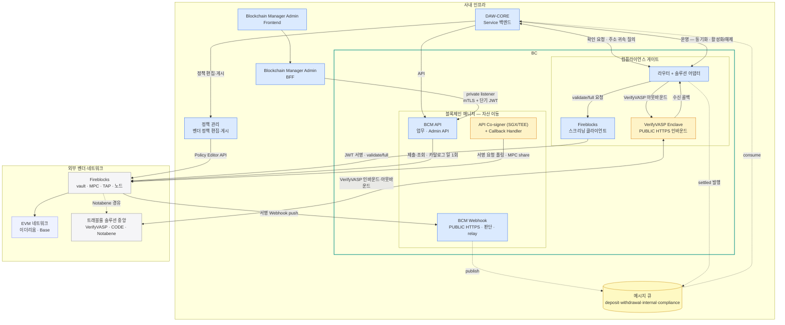
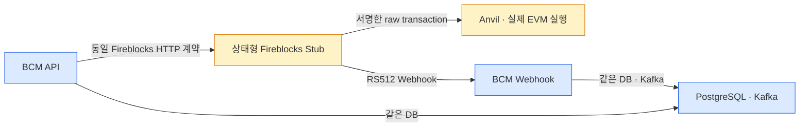
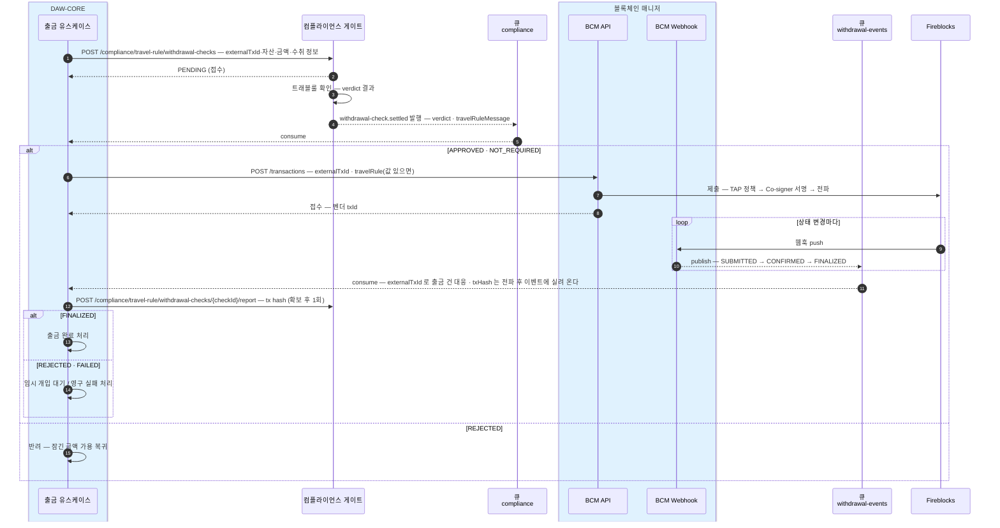
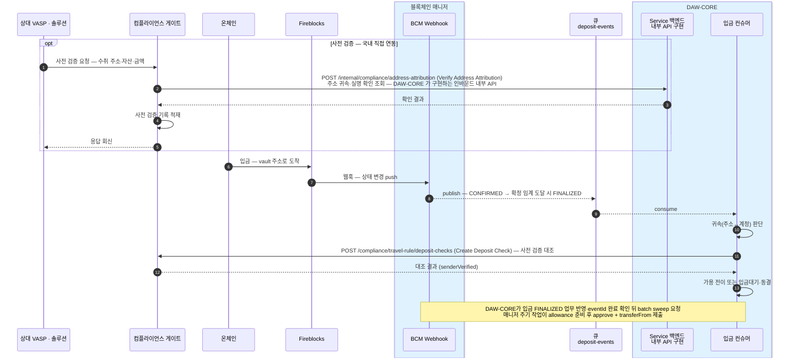

시스템 전체의 구성 요소·메시지 큐·DB·보안 경계, 출금·입금 전체 시퀀스.
이 문서 묶음만으로 구현한다. 미확정 항목은 각 장 끝 "미확정" 절에만 있다.

## 문서 구성

개발·연동 담당자를 위한 구성 요소와 보안 경계의 정본이다.
업무별 읽기 순서는 [설계 안내](README.md), HTTP 계약은 [OpenAPI](../api/openapi.yaml)를 따른다.
컴플라이언스·Co-signer 설명은 설계 안내의 외부 시스템 맥락에서 찾는다.

## DAW-CORE와 BCM 책임

이 문서의 CORE는 **DAW-CORE**다. 설계자 원장 v0.1.2의 DAWBC 범위는 BCM에 대응한다(2026-09-08 확정).
DAW-CORE는 고객·회사 소유권 원장과 업무 정책을, BCM은 온체인 거래·상태·이동 증적 및 회사·고객 관리 주소별 온체인 잔고를 관리한다.
주소·vault의 역할은 [매핑 기준](09-asset-map.md#주소와-vault-매핑), 잔고 저장의 구현 상태는 [DB 설계](03-bcm-db.md#주소별-온체인-잔고--구현-대상-설계)에 명시한다.
PDF의 all sync는 변경 예정 설명이다. 업무 접수·외부 실행·체인 확정·이벤트 소비의 완료 시점을 분리하고 기존 inbox/outbox·멱등 계약을 유지한다.

## 첫 번째 목표 — Fireblocks·Dfns·로컬 블록체인 호환

2026-09-14 사용자 정정: **세 실행 환경을 동일 BCM API·업무·이벤트·복구 계약으로 지원**한다.
Fireblocks와 Dfns는 공통 제공자 포트에 연결하며 **시작 시 `BCM_PROVIDER=fireblocks|dfns|local`로 실행 구현 하나를 선택**하는 계획이다.
선택값에 따라 클라이언트·웹훅 검증/parser·대사/수수료까지 함께 조립하고 API/Webhook/BAT 설정을 일치시킨다.
비선택 벤더 자격은 요구하지 않으며 요청별 다중 벤더 routing은 초기 범위에 넣지 않는다. 내부 제공자·체인 환경은 별도로 검증한다.
미설정/잘못된 값은 기동 오류로 처리하며 기존 실행 예제에 명시적 값을 추가한다.
이 선택·검증은 `ProviderConfiguration`으로 구현했고 Fireblocks·로컬은 조건부로 조립된다 — `dfns`는 값으로는 선택되지만 Baseline 수용 전까지 기동 자체를 거절한다([계약13](13-dfns-contracts.md)).
구체 포트·호출 시간·설정 조립 계약은 [제공자 호환 설계](12-provider-compatibility.md)를 따른다.
로컬은 현행 `FireblocksClient → 상태형 Stub → Anvil`을 재사용하며 Dfns Stub 경로도 같은 업무 시나리오로 확장하는 계획이다.
실제 토큰 이동·receipt·로그·잔고·복구를 검증하고, 로컬 정책 모사와 벤더 실제 MPC/정책 수용 증적은 구분한다.
로컬 구동에 실제 Dfns 플랫폼 설치를 요구하지 않는다. 별도 직접 RPC 로컬 어댑터 필요성은 DF1에서 판단한다.
Fireblocks 지원 종료·자산 이전, 추가 체인 실구현, #51 신규 기능은 첫 번째 호환 완료의 조건이 아니다.
공통 인터페이스와 상세 단계는 [호환 계획](../dfns-compatibility-plan.md)을 따른다. 아래 Dfns 구성은 세 대상 중 해당 경로의 목표안이다.

## Dfns Baseline 전환 목표 (2026-09-14)

사용자가 지정한 목표는 **직접 노드를 운영하는 업체 + Dfns Baseline + DAWBC + DAW-CORE**다.
모델 목표는 Ethereum·Base·Solana, 대상 종목은 USDC·KRWK다. 실제 발행/배포 조합은 [자산 설계](07-asset-master.md)에서 구분한다.
Baseline은 고객 환경에 설치하는 전체 플랫폼의 HashiCorp Vault 기반 배포 프로필이며 단순 서명 요금제가 아니다.
일반 전송은 CORE→DAWBC→내부 Dfns API→위탁 RPC로 구성·서명·전파하고, 입금은 Dfns 인덱싱/Webhook→BCM inbox/outbox→CORE로 전달하는 목표안이다.
BCM 직접 RPC 경로는 독립 검증·대사·관찰 보완용으로 두며, 거래별 방송·재시도 책임은 하나로 고정한다.

노드 운영업체는 체인 동기화·RPC·과거 데이터·장애 복구를 맡는다. Dfns 플랫폼의 K8s·Vault·MPC/keyshares·DB·Kafka·Redis
설치/패치/백업/당직은 별도 담당을 지정하며 노드 외주에 자동 포함하지 않는다. Dfns 내부 저장소/토픽과 BCM·CORE 계약은 분리한다.
BCM API 자격·정책 승인 자격·지갑 MPC 키·Vault 관리 키는 별개이며, 노드 업체에 업무 서명·정책 변경 권한을 주지 않는다.
자산 식별·확정 근거·가스 대납은 체인별로 구현하고 기존 API·이벤트·보안·복구 결과를 보존한다.

사용자 후속 지시에 따라 초기에는 자산 식별·확정 판단·가스 대납의 인터페이스와 초기 실행 경로를 마련하고, 추가 체인 실구현은 후속으로 미룬다.
기존 벤더 포트를 대조해 최소 경계를 추출하며 미구현 체인은 제출 전에 거절한다. 초기 Dfns 체인/자산은 DF0에서 고정한다.
사내 지원·RPC·초기 승인/대납은 초기 인수 대상이며 Solana 집금·노드·감사는 후속 체인 인수 대상으로 분리한다.
참고한 wiki의 내용과 인수표·단계별 완료 기준은 [전환 계획](../dfns-compatibility-plan.md)에 기록했다.
현재 코드는 아래 Fireblocks 구성이다. 이 목표 기록은 DDL/API/상태 전이 변경이나 배포 완료를 뜻하지 않는다.

## 구성 요소 — 한 장

아래 도식은 현행 Fireblocks 구현 기준이다.

파랑 = 직접 만들고 운영하는 서비스, 노랑 = 벤더가 요구해 우리 인프라 안에 두는 설치물, 회색 = 외부 벤더·네트워크.

| 구성 요소 | 역할 |
|---|---|
| DAW-CORE Service | 고객 원장·업무 유스케이스 |
| Blockchain Manager Admin Frontend·BFF | 매니저 저장소의 독립 운영·기능 테스트 콘솔. 브라우저 요청을 BCM Admin API 계약으로 중계 |
| BCM API | 계정·주소·거래 제출·조회와 private Admin API. 외부 Webhook endpoint와 상시 판단·발행 작업을 소유하지 않음 |
| BCM Webhook | Fireblocks PUBLIC HTTPS 수신, 서명 검증·인박스 적재, 판단 워커와 outbox relay. BCM API와 DB·Kafka 계약만 공유하는 독립 BootJar·프로세스 |
| API Co-signer + Callback Handler | MPC 공동서명. 서명 직전 검증(승인·거부) |
| 정책 관리 | 벤더 정책(TAP) 편집·게시 대행 |
| 컴플라이언스 게이트 | 규제 확인의 솔루션 연동 창구. 솔루션 원어를 공통 verdict(TrVerdict)로 번역 |
| Fireblocks 스크리닝 클라이언트 | validate/full 호출 전용 |
| VerifyVASP Enclave | 상대 VASP 발신을 받아 게이트의 수신 콜백을 내부망으로 호출 |
| 메시지 큐 | 매니저·게이트가 발행한 이벤트를 DAW-CORE에 전달 |

### 로컬 통합 테스트 배치

Fireblocks 사용 가능 여부와 무관하게 유지하는 BCM 전용 테스트 장치다. 운영 Domain Port를 바꾸지 않고 기존
`FireblocksClient`의 Base URL과 EVM RPC 설정만 로컬로 돌린다.

허용 조합은 `STUB+LOCAL`, `FIREBLOCKS+TESTNET`, `FIREBLOCKS+MAINNET`뿐이다. 폐쇄망 일반 Linux 서버에는
Anvil·Stub·bootstrap을 버전 고정 파일로 배포하며 Docker와 번들 PostgreSQL·Kafka를 요구하지 않는다. 상세 API 지원표,
실제·시뮬레이션 경계, 키 분리, reset 소유권과 실 Fireblocks 계약 테스트 승인선은
[로컬 블록체인 + Fireblocks Stub](10-local-fireblocks-integration.md)이 원천이다.

## 보안 경계

- **PUBLIC 인바운드는 둘** — VerifyVASP Enclave(상대 VASP 발신), BCM Webhook(Fireblocks 발신 · 서명 검증). 밖으로 여는 인바운드는 이 둘뿐이다. BCM API는 PUBLIC Webhook 경로를 노출하지 않으며, 두 프로세스는 독립 배포·기동·health·로그·수평 확장 단위다.
- **벤더 API user 는 셋으로 분리** — 블록체인 매니저(거래 제출) · 정책 관리(정책 편집) · 스크리닝 클라이언트(validate/full).
- **서명은 벤더 단독으로 되지 않는다** — MPC share 하나는 API Co-signer(SGX/TEE)에 있고, 서명 직전에 Callback Handler 가 승인·거부를 판단한다.
- **일반 내부 API는 내부망 경계를 신뢰한다** — DAW-CORE Service↔매니저·게이트의 일반 업무 API에는 애플리케이션 인증을 추가하지 않는다.
- **매니저의 `/admin/*` 는 강화된 별도 경계다** — 같은 `bcm-api` 애플리케이션의 private listener/ingress로 분리하고 Blockchain Manager Admin BFF만 접근시킨다. 공유 환경에서는 BFF와 BCM이 mTLS 서비스 신원과 5분 이하 단기 JWT를 함께 검증하며 직원번호·부점코드 헤더만으로 인증하지 않는다. T10.2의 읽기 전용 기능 테스트 profile은 frontend·BFF와 대상 BCM을 loopback에만 바인딩하고 상태 변경 API를 노출하지 않는다. 상세는 [Admin](08-bcm-admin.md).
- **밴드S 외부 출구는 옴니버스 하나다** — 고객 vault는 기존 sweep으로, 출금 풀 초과분은 회수 내부이체로 옴니버스에 모은 뒤 TAP allowlist의 고정 외부 콜드 주소로만 전송한다. cold→hot 서명은 Admin 밖의 외부 콜드 절차다. (treasury egress vault 는 1차 설계에서 제외 — 외부 전송 권한을 별도 vault 로 격리할 필요가 생기면 재검토, [sweep](06-sweep.md))

## 메시지 큐 — 5 토픽

| 토픽 | 담는 것 | 파티션 키 | 발행 | 소비 |
|---|---|---|---|---|
| `deposit-events` | 고객 입금 (DEPOSIT) | 고객 accountId | 매니저 | DAW-CORE 입금 컨슈머 |
| `withdrawal-events` | 외부 출금 (WITHDRAWAL) | 출금 풀 vault 의 accountId | 매니저 | DAW-CORE 출금 컨슈머 |
| `internal-events` | delta 정산 (INTERNAL) | 출발 계정 accountId | 매니저 | DAW-CORE 정산 컨슈머 |
| `sweep-events` | DAW 요청 sweep 항목의 체인 상태·항목 결과 | 고객 accountId | 매니저 | DAW-CORE sweep 컨슈머 |
| `compliance` | withdrawal-check.settled | accountId | 게이트 | DAW-CORE |

**파티션 키는 수신자가 아니라 순서 보장 단위다** — 다섯 토픽 모두 소비자는 DAW-CORE 다.

- 출금의 키가 출금 풀인 이유 — 출금은 고객 vault 가 아니라 공용 출금 풀에서 나가므로, 매니저가 아는 계정이 그 풀뿐이다.
- "어느 고객의 출금인가"는 DAW-CORE 가 이벤트의 `externalTxId` 로 자기 출금 지시와 대응한다.
- 한 tx 의 이벤트들은 같은 풀에서 나가므로 같은 파티션에 순서대로 담긴다.

**토픽을 계열별로 나눈 이유 셋:**

- **파티션 키 전략이 계열마다 다르다** — 위 표. 한 토픽이면 키의 의미가 레코드마다 달라진다.
- **폭주 격리** — 입금이 한꺼번에 몰려도 출금(돈 나가는 경로) 이벤트 처리가 밀리지 않는다.
- **소비·장애·재처리 단위가 계열이다** — 컨슈머 그룹이 분리돼 한쪽의 장애·리플레이가 다른 계열에 번지지 않는다.

전달 규약:

- **at-least-once** — 같은 이벤트가 드물게 두 번 온다. DAW-CORE는 두 번 받아도 한 번만 반영한다 — 매니저 이벤트는 **이벤트 id(`evnt_id`)** 로, 게이트의 settled 이벤트는 `checkId` 로 이미 처리한 건지 가린다. 매니저 이벤트를 `txId` 로 가리면 한 tx 의 감지·확정·무효화가 같은 키가 되어 **확정이 버려진다** — 이벤트 단위로 가린다.
- **오프셋 커밋은 처리 성공 후에만** 한다. 실패하면 커밋하지 않아 재소비된다.
- 매니저 이벤트는 DAW-CORE 업무 트랜잭션 커밋 뒤 `eventId` 처리 완료 확인까지 성공한 다음 오프셋을 커밋한다.
  outbox 발행 성공과 소비 완료는 별도 원장이다.
- **같은 계정의 순서는 파티션 키가 보장**한다.
- **컨슈머 그룹은 토픽마다 하나** — 인스턴스가 여러 대여도 분배는 큐가 한다.
- 막힘 경보와 귀속 불명 입금(매핑에 없는 주소)은 데이터 토픽이 아니라 **별도 알림 채널**로 흐른다.

## DB — 셋

| DB | 담는 것 | 테이블 접두 |
|---|---|---|
| DAW-CORE DB | 고객 원장 · 출금 지시 · VASP 마스터 | `daw_` |
| 블록체인 매니저 DB | 계정·주소 매핑 · 거래 체크포인트 · 발행 outbox · boost 이력 · 거래 원본 · **자산 매핑 · 블록체인 카탈로그** | `bcm_` |
| 컴플라이언스 DB | VASP 레지스트리 · 출금 트래블룰 check · 발행 outbox · 사전 검증 기록 | `cmpl_` |

## 출금 전체 시퀀스

수취처가 VASP 인 출금 기준. 상세는 [블록체인 매니저 — 흐름](02-bcm-flow.md) · [컴플라이언스 게이트 — 흐름](context/04-compliance-flow.md).

## 입금 전체 시퀀스

## 미확정

- **Dfns 전환 인수 계약** — 사내 Baseline 지원/릴리스·플랫폼 운영자·위탁 RPC 연결·복구·독립 승인·초기 대납/집금은 [PLAN DF0~2](../../PLAN.md), 추가 체인 상세는 MC0~2에서 확정한다.
- **막힘 경보 채널의 구체 수단** — 운영 알림·모니터링·별도 큐 중 무엇으로 흘릴지는 운영 설계에서 정한다.
- **Admin 역할 그룹 매핑** — 실제 사내 인증 제공자 그룹을 [Admin](08-bcm-admin.md)의 BCM 역할 claim에 연결하는 배포 환경별 값.
