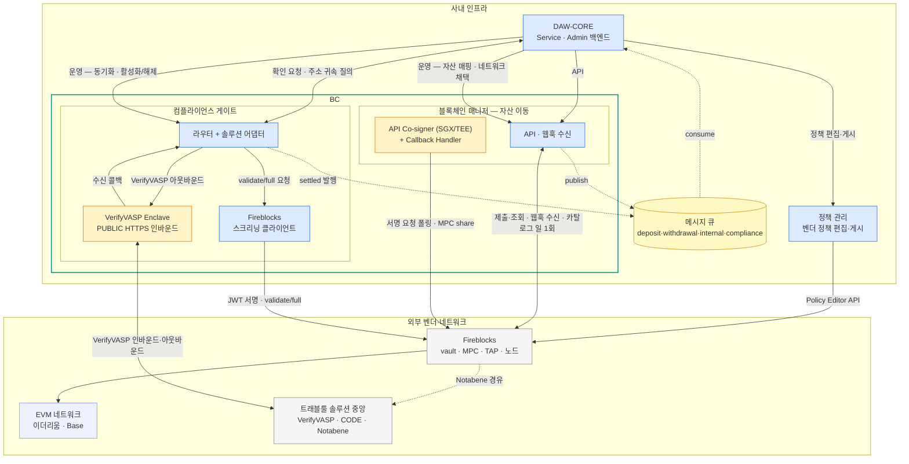
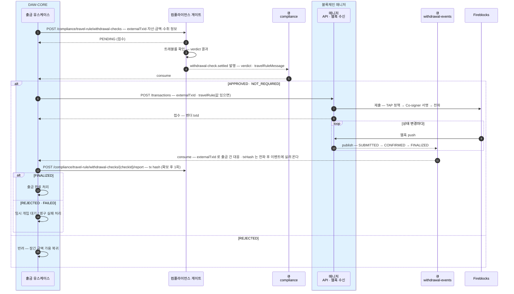
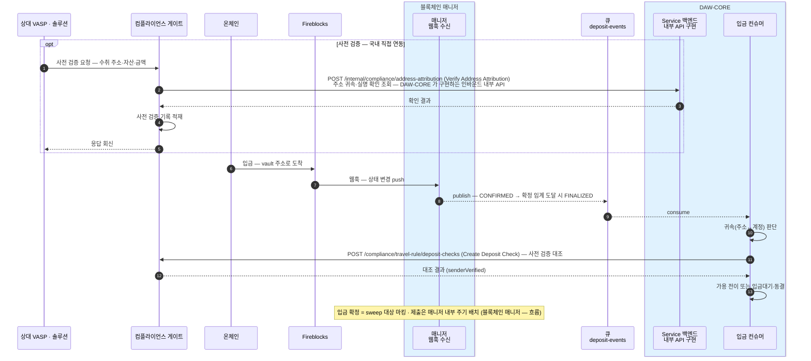

시스템 전체의 구성 요소·메시지 큐·DB·보안 경계, 출금·입금 전체 시퀀스.
이 문서 묶음만으로 구현한다. 미확정 항목은 각 장 끝 "미확정" 절에만 있다.

## 문서 구성

이 문서(개요)에서 시작해 아래 순서로 읽는다. API 명세는 이 문서 묶음이 아니라 각 카테고리의 API 뷰어([블록체인 매니저](?cat=블록체인매니저&sub=API) · [컴플라이언스](?cat=컴플라이언스&sub=API))에 있다.

| 문서 | 내용 |
|---|---|
| [블록체인 매니저 — 흐름](02-bcm-flow.md) | 계정·주소·감지(웹훅)·입금·sweep·출금·boost 상세 흐름 + 상태 enum |
| [블록체인 매니저 — DB](03-bcm-db.md) | ERD · 테이블 · 입금 시나리오 |
| [컴플라이언스 게이트 — 흐름](04-compliance-flow.md) | 출금 확인·입금 판별·VASP 온보딩·주기 배치 + verdict |
| [컴플라이언스 게이트 — DB](05-compliance-db.md) | ERD · 테이블 4개(레지스트리·확인·사전 검증·outbox) · 필드 |
| [sweep 설계 — 정책 적용](06-sweep.md) | 입금 모으기·핫콜드 밴드S — 트리거·배치 실행 방식·Fireblocks 대응 (정책 일부 수신 — 진행 중) |
| [벤더 자산 매핑](07-asset-master.md) | 우리 (네트워크, 토큰) ↔ 벤더 assetId · 등록 관문 · Admin API |

## 구성 요소 — 한 장

파랑 = 직접 만들고 운영하는 서비스, 노랑 = 벤더가 요구해 우리 인프라 안에 두는 설치물, 회색 = 외부 벤더·네트워크.

| 구성 요소 | 역할 |
|---|---|
| DAW-CORE | 고객 원장·업무 유스케이스. Service·Admin 두 백엔드 |
| 블록체인 매니저 | 온체인 자산 이동의 단일 창구. 벤더 원어를 공통 상태(TxStatus)로 번역 |
| API Co-signer + Callback Handler | MPC 공동서명. 서명 직전 검증(승인·거부) |
| 정책 관리 | 벤더 정책(TAP) 편집·게시 대행 |
| 컴플라이언스 게이트 | 규제 확인의 솔루션 연동 창구. 솔루션 원어를 공통 verdict(TrVerdict)로 번역 |
| Fireblocks 스크리닝 클라이언트 | validate/full 호출 전용 |
| VerifyVASP Enclave | 상대 VASP 발신을 받아 게이트의 수신 콜백을 내부망으로 호출 |
| 메시지 큐 | 매니저·게이트가 발행한 이벤트를 DAW-CORE에 전달 |

## 보안 경계

- **PUBLIC 인바운드는 둘** — VerifyVASP Enclave(상대 VASP 발신), 블록체인 매니저 웹훅 수신(Fireblocks 발신 · 서명 검증). 밖으로 여는 인바운드는 이 둘뿐이고, 나머지 구성 요소는 아웃바운드만 연다.
- **벤더 API user 는 셋으로 분리** — 블록체인 매니저(거래 제출) · 정책 관리(정책 편집) · 스크리닝 클라이언트(validate/full).
- **서명은 벤더 단독으로 되지 않는다** — MPC share 하나는 API Co-signer(SGX/TEE)에 있고, 서명 직전에 Callback Handler 가 승인·거부를 판단한다.
- **매니저의 `/admin/*` 는 Admin 백엔드만 부를 수 있어야 한다** — 매니저 API 는 인증 없이 내부망을 신뢰하는 구성이라, 경로를 나눈 것만으로는 경계가 생기지 않는다. 이 경로로 자산 매핑과 네트워크 채택이 바뀌므로 **망 수준 제한**(방화벽 규칙·별도 리스너 등)이 필요하다. 수단은 배포 환경에서 정한다. 상세는 [벤더 자산 매핑](07-asset-master.md).

## 메시지 큐 — 4 토픽

| 토픽 | 담는 것 | 파티션 키 | 발행 | 소비 |
|---|---|---|---|---|
| `deposit-events` | 고객 입금 (DEPOSIT) | 고객 accountId | 매니저 | DAW-CORE 입금 컨슈머 |
| `withdrawal-events` | 외부 출금 (WITHDRAWAL) | 출금 풀 vault 의 accountId | 매니저 | DAW-CORE 출금 컨슈머 |
| `internal-events` | delta 정산 (INTERNAL) | 출발 계정 accountId | 매니저 | DAW-CORE 정산 컨슈머 |
| `compliance` | withdrawal-check.settled | accountId | 게이트 | DAW-CORE |

**파티션 키는 수신자가 아니라 순서 보장 단위다** — 네 토픽 모두 소비자는 DAW-CORE 다.

- 출금의 키가 출금 풀인 이유 — 출금은 고객 vault 가 아니라 공용 출금 풀에서 나가므로, 매니저가 아는 계정이 그 풀뿐이다.
- "어느 고객의 출금인가"는 DAW-CORE 가 이벤트의 `externalTxId` 로 자기 출금 지시와 대응한다.
- 한 tx 의 이벤트들은 같은 풀에서 나가므로 같은 파티션에 순서대로 담긴다.

**토픽을 계열별로 나눈 이유 셋:**

- **파티션 키 전략이 계열마다 다르다** — 위 표. 한 토픽이면 키의 의미가 레코드마다 달라진다.
- **폭주 격리** — 입금이 한꺼번에 몰려도 출금(돈 나가는 경로) 이벤트 처리가 밀리지 않는다.
- **소비·장애·재처리 단위가 계열이다** — 컨슈머 그룹이 분리돼 한쪽의 장애·리플레이가 다른 계열에 번지지 않는다.

전달 규약:

- **at-least-once** — 같은 이벤트가 드물게 두 번 온다. DAW-CORE는 두 번 받아도 한 번만 반영한다 — 매니저 이벤트는 **이벤트 id(`evnt_id`)** 로, 게이트의 settled 이벤트는 `checkId` 로 이미 처리한 건지 가린다. 매니저 이벤트를 `txId` 로 가리면 한 tx 의 감지·확정·무효화가 같은 키가 되어 **확정이 버려진다** — 이벤트 단위로 가린다.
- **오프셋 커밋은 처리 성공 후에만** 한다. 실패하면 커밋하지 않아 재소비된다.
- **같은 계정의 순서는 파티션 키가 보장**한다.
- **컨슈머 그룹은 토픽마다 하나** — 인스턴스가 여러 대여도 분배는 큐가 한다.
- 막힘 경보와 귀속 불명 입금(매핑에 없는 주소)은 데이터 토픽이 아니라 **별도 알림 채널**로 흐른다.

## DB — 셋

| DB | 담는 것 | 테이블 접두 |
|---|---|---|
| DAW-CORE DB | 고객 원장 · 출금 지시 · VASP 마스터 | `daw_` |
| 블록체인 매니저 DB | 계정·주소 매핑 · 거래 체크포인트 · 발행 outbox · boost 이력 · 거래 원본 · **자산 매핑 · 블록체인 카탈로그** | `bcm_` |
| 컴플라이언스 DB | VASP 레지스트리 · 출금 트래블룰 check · 발행 outbox · 사전 검증 기록 | `cmpl_` |

## 출금 전체 시퀀스

수취처가 VASP 인 출금 기준. 상세는 [블록체인 매니저 — 흐름](02-bcm-flow.md) · [컴플라이언스 게이트 — 흐름](04-compliance-flow.md).

## 입금 전체 시퀀스

## 미확정

- **서비스 간 인증 방식** — DAW-CORE↔매니저·DAW-CORE↔게이트·인바운드 내부 API 의 인증은 인프라 결정과 함께 확정한다.
- **막힘 경보 채널의 구체 수단** — 운영 알림·모니터링·별도 큐 중 무엇으로 흘릴지는 운영 설계에서 정한다.
- **콜드월렛 계층** — 핫·콜드 균형(밴드S)이 콜드월렛을 전제하는데 **현 설계에 그 계층이 없다.** 무엇으로 둘지(별도 워크스페이스·별도 vault 등) 확정되면 구성 요소와 DB 에 반영한다. 후보는 [sweep 설계](06-sweep.md).
