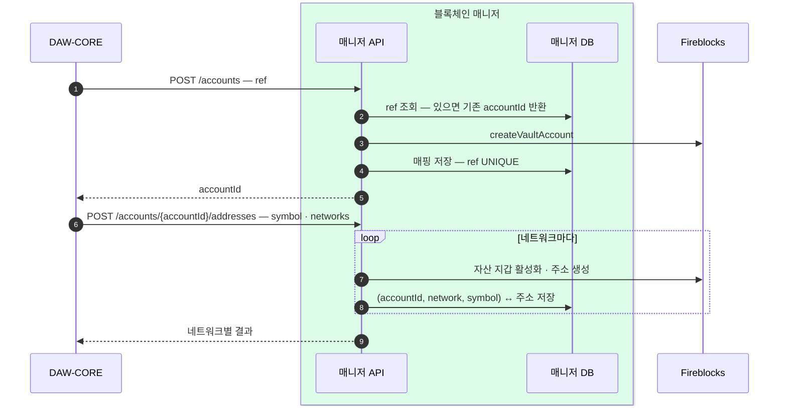
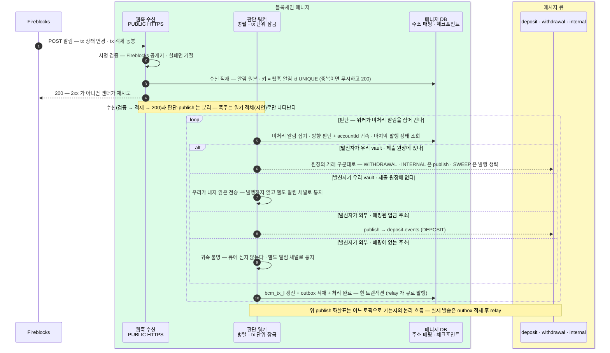
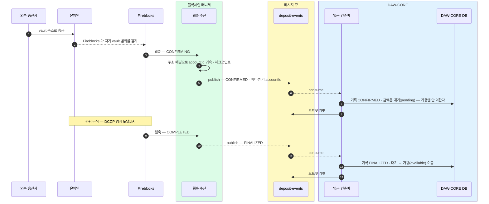
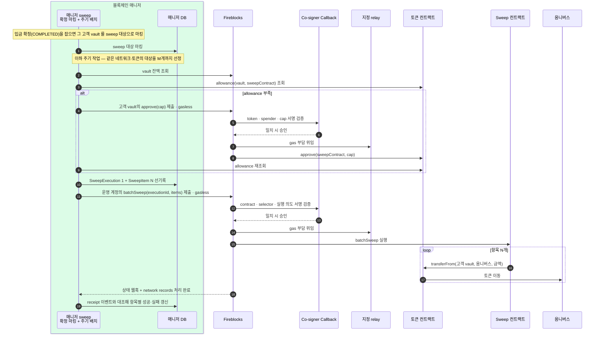
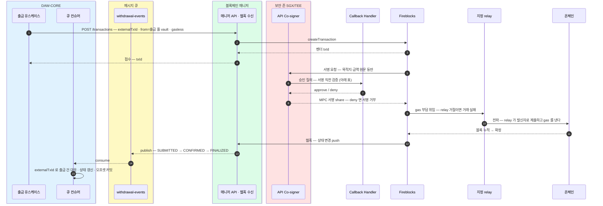
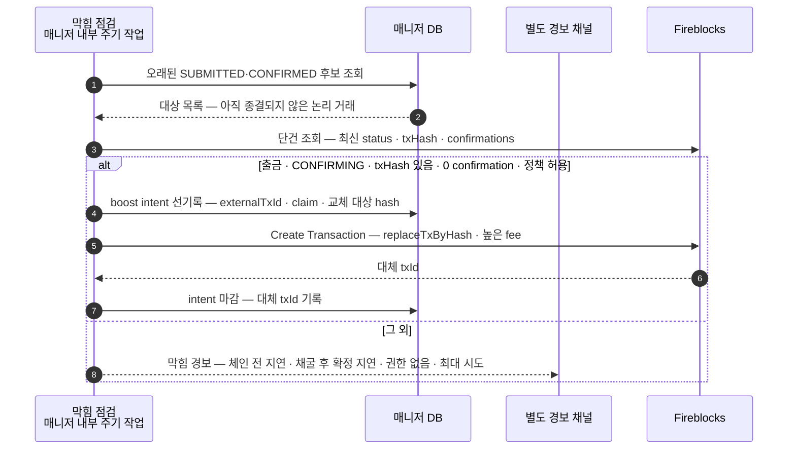

블록체인 매니저의 모든 흐름 — 계정·주소, 감지(웹훅), 입금, sweep, 출금, boost, 수수료·잔액·대사. 상태 enum 포함.
요청·응답의 필드 상세는 [블록체인 매니저 API](?cat=블록체인매니저&sub=API).

## 계정 생성 · 입금 주소 발급 · 조회

| 오퍼레이션 | API | 하는 일 | 멱등 |
|---|---|---|---|
| `createAccount` | `POST /accounts` | vault 를 만들고 ref↔accountId 매핑을 반환한다. ref = DAW-CORE 계정 ID (접두사 없음), 유형(`CUSTOMER`·`SYSTEM`)을 함께 받는다 | 같은 (유형, ref) → 같은 accountId. 매니저 DB 의 복합 UNIQUE 가 최종 방어 — 경합해도 이긴 값을 반환 |
| `createDepositAddresses` | `POST /accounts/{accountId}/addresses` | **한 토큰을 여러 네트워크로** 한 요청에 발급한다 (`symbol` + `networks`). 최대 20네트워크 · 네트워크별 결과 | 네트워크마다 단건과 같은 기준으로 멱등. 계정 없음은 전체 404, 네트워크별 실패는 부분 성공으로 남아 재시도 안전 |
| `depositAddressesOf` | `GET /accounts/{accountId}/addresses` | 발급된 주소를 매니저 DB 에서 읽는다 — 벤더 왕복 없음. `symbol`·`network` 로 걸러 받는다 | 발급분 배열 · 미발급은 빈 배열 · 계정 없음 → `404 ACCOUNT_NOT_FOUND` |

경로는 base(`/blockchain/manage-api`)를 뗀 표기 — 전체 경로·필드는 [블록체인 매니저 API](?cat=블록체인매니저&sub=API).

## 감지 — 웹훅 수신

온체인 상태 변경은 Fireblocks 웹훅으로 받는다. 매니저가 계열을 가려 세 토픽으로 publish 하고, 백엔드는 토픽별 컨슈머로 consume 한다. 감지용 상시 폴링은 없다 — 놓친 웹훅은 tx 대사(10분 주기 목록 대조)가 복구한다.

### 웹훅 계열 분류 — 제출 원장이 기준이다

알림 1건이 어느 토픽으로 갈지는 두 단계로 가른다.

| 순서 | 보는 값 | 판정 |
|---|---|---|
| 1 | `data.source.type` 이 vault 가 **아니다** (외부 발신) | 목적지 주소를 주소 매핑에서 찾는다 — 있으면 `DEPOSIT`, 없으면 **귀속 불명**(발행 없음 · 알림 채널 통지) |
| 2 | `data.source.type` 이 **vault** (우리가 낸 전송) | `data.externalTxId` 로 [제출 원장](03-bcm-db.md) 을 찾는다 — 행의 `tx_dvcd` 가 곧 계열이다. `WITHDRAWAL`·`INTERNAL` 은 해당 토픽으로 발행, **`SWEEP` 은 발행하지 않는다**(매니저 내부 이동) |
| 3 | vault 발신인데 제출 원장에 없다 | 우리가 내지 않은 전송(콘솔 수동 조작 등) — **발행하지 않고** 별도 알림 채널로 통지 |

- ★ **주소로 계열을 추론하지 않는다.** 출금·내부이체·sweep 은 셋 다 우리 vault 에서 나가고, 내부이체와 sweep 은 목적지까지 우리 vault 라 주소만으로는 갈리지 않는다. 잘못 가르면 sweep 이 고객 토픽에 실려 유령 이벤트가 되고 대사가 어긋난다. **제출 시점에 우리가 아는 값을 못박아 두는 것이 유일하게 확실한 기준**이라, 제출하는 쪽(출금·내부이체·sweep 전부)이 `bcm_sbmt_l` 에 행을 남긴다.
- sweep 도 `externalTxId` 를 붙여 제출한다 — 백엔드 지시가 아니라 매니저가 만드는 키다(`swp-` 접두 + UUID v7). 이 키가 있어야 sweep 웹훅이 원장에서 자기 행을 찾아 발행 생략으로 갈린다.
- 위 2 에서 찾은 행의 `vndr_tx_id` 가 비어 있으면 이때 채운다 — 제출 응답을 못 받은 건이 웹훅으로 회수된다.

수신·발행 규칙:

| 규칙 | 내용 |
|---|---|
| 서명 검증 | 모든 알림은 서명을 검증하고 통과한 것만 받는다 — JWKS 방식(`Fireblocks-Webhook-Signature` 헤더 · 공개키 자동 조회·로테이션). 발신 IP allowlist 를 겹친다 |
| 수신 확인 | 2xx 를 돌려줘야 전달 완료 — 아니면 벤더가 지수 백오프로 재시도한다(총 10회 시도 후 failed 마킹). 오류율이 높은 수신 endpoint 는 벤더가 자동 비활성화하므로 즉시 2xx + 비동기 처리 분리가 필수 |
| 유실 복구 | 재시도로도 못 받은 알림은 재전송 API(`resend_failed` — v2 는 30일)로 다시 받는다. 수신기 재기동 후 1회 호출한다 |
| 상태 전이만 outbox 적재 | 마지막 발행 상태와 **허용 전이 표**(아래 상태 절)를 대조해 표에 있는 전이만 넣는다 |
| 원자 기록 (outbox) | bcm_tx_l 갱신·outbox 적재·처리 완료를 **한 트랜잭션**으로 — relay 가 큐로 발행(at-least-once)하고 재발송분은 아래 중복 반영 방지가 거른다 |
| 중복 반영 방지 | dedup 은 **이벤트 id(`evnt_id`)** 단위다 — tx 단위로 가리면 확정이 버려진다 |
| 반영 판정 | dedup 을 통과한 뒤 **허용 전이 표**로 가린다 |
| 발행 순서 | relay 는 **같은 계정 안에서 `evnt_id` 순으로 순차 발송**한다 (계정이 다르면 병렬 가능) |
| 오프셋 커밋 | 원장 반영 성공 후에만 커밋한다. 실패하면 재소비된다 |
| 최종 안전망 | **tx 대사**(10분 주기 — 벤더 거래 목록과 기록을 대조)가 놓친 웹훅을 자동 복구하고 운영 알림을 올린다. 회계 숫자는 별도의 주기·일마감 대사 |

> 웹훅이 **한꺼번에 몰릴 때**(수신 3단계 고정·병렬 워커)와 **놓쳤을 때**의 정지·장애 시나리오는 참고 문서 [웹훅 감지 상세](99-detection-detail.md)에 있다.

## 상태 enum

### TxStatus — 공통 상태 다섯

| TxStatus | 뜻 | 블록체인 상태 (Pending → Confirmed → Finalized) | Fireblocks 원어 | 함께 실리는 subStatus (대표) | networkStatus |
|---|---|---|---|---|---|
| `SUBMITTED` | 제출됨 — 서명·전파 준비 중, 체인 미등장. 출금에서만 관찰 | 아직 없음 → 전파되면 Pending | PENDING_SIGNATURE · QUEUED · BROADCASTING | — | 서명 단계엔 없음 → BROADCASTING |
| `CONFIRMED` | 체인에 등장, 컨펌 누적 중 — 미확정 | Confirmed — 블록에 포함, finality 전 | CONFIRMING | PENDING_BLOCKCHAIN_CONFIRMATIONS | CONFIRMING |
| `FINALIZED` | 확정 — {{DCCP::Deposit Control & Confirmation Policy — 입금을 확정으로 볼 컨펌 수를 정하는 Fireblocks 정책. 상세는 아래 확정 기준 절}} 임계 컨펌 도달 | Finalized | COMPLETED | CONFIRMED | CONFIRMED |
| `REJECTED` | 거부·차단 — 임시. 사람 개입 여지 | 출금 차단은 체인에 없음 · 입금 동결은 Finalized | REJECTED · BLOCKED | AUTO_FREEZE · FROZEN_MANUALLY · REJECTED_AML_SCREENING | 출금은 없음 · 입금 동결은 CONFIRMED |
| `FAILED` | 영구 실패 — 사유 동반 | Pending 에서 증발 · revert 는 Confirmed 이후 | FAILED | DROPPED_BY_BLOCKCHAIN · SMART_CONTRACT_EXECUTION_FAILED — 컨트랙트 revert, 사유는 errorDescription · 그 외 | FAILED · DROPPED |

판단은 TxStatus 다섯으로 한다. `REJECTED`(임시) ≠ `FAILED`(영구). 위 표의 subStatus·networkStatus 열은 **매니저가 벤더에게서 받아 번역에 쓰는 내부 값** — 어떤 TxStatus·이벤트를 낼지 매니저가 이 값으로 가른다. **이벤트에는 TxStatus 만 싣고 DAW-CORE 는 그것으로만 판단한다.**

**이 다섯은 블록체인 매니저 ↔ DAW-CORE 의 계약 어휘다** — 벤더 원어는 매니저 안에서 번역되고, 벤더가 바뀌어도 이 다섯은 유지된다. 계약 어휘와 벤더 원어는 철자부터 다르다 — 이 문서 묶음에서 `CONFIRMING`·`COMPLETED` 표기가 남아 있으면 전부 **벤더 원어**다.

- ★ **`CONFIRMED` 는 미확정이다** — 벤더 subStatus/networkStatus 의 `CONFIRMED`(임계 도달, COMPLETED 동반)와 철자가 같지만 가리키는 단계가 다르다. DAW-CORE `tx_stcd` 반영도 어긋난다: 이벤트 `CONFIRMED` → `tx_stcd` 는 `PENDING` 유지, 이벤트 `FINALIZED` → `tx_stcd` `CONFIRMED`(확정).
- ★ **`FINALIZED` 는 체인 finality 가 아니다** — DCCP 정책 임계 도달일 뿐이고(기본 임계 대부분 1, Base 는 시퀀서 soft confirmation 시점), 아래 전이 표대로 reorg 증발 시 `FAILED` 로 무효화될 수 있다.

### 허용 전이 표 — 매니저·DAW-CORE 공용 계약

판정 기준은 알림 도착 순서가 아니라 **직전 상태와의 전이가 이 표에 있는지**다 — 벤더 알림은 순서가 뒤바뀌어 도착한다.

| 직전 상태 | 새 상태 | 처리 |
|---|---|---|
| (없음) | `SUBMITTED`(출금) · `CONFIRMED`(입금) | 신규 — 발행·반영 |
| (없음) | **`FINALIZED` · `REJECTED`** | 기록을 만들고 **감지 이벤트를 합성해 먼저 발행한 뒤** 그 상태를 발행한다 — 순서 계약을 매니저가 지킨다 (아래) |
| (없음) | **`FAILED`** | 기록만 남기고 **발행하지 않는다** — 반영할 자금이 없다 |
| `SUBMITTED` | `CONFIRMED` · `FINALIZED` · `REJECTED` · `FAILED` | 발행·반영 |
| `CONFIRMED` | `FINALIZED` · `REJECTED` · `FAILED` | 발행·반영 |
| `FINALIZED` | **`FAILED`**(reorg 증발 — subStatus `DROPPED_BY_BLOCKCHAIN`) | **발행·반영** — 무효화다. 잔액을 되돌린다 |
| `FINALIZED` | **`REJECTED`**(확정 후 동결 — subStatus `AUTO_FREEZE` · `FROZEN_MANUALLY` · `REJECTED_AML_SCREENING`) | **발행·반영** — 가용에서 되돌려 잠근다 |
| `FINALIZED` | `CONFIRMED` · `SUBMITTED` · `FINALIZED` | 무시 (늦게 온 옛 알림) |
| `REJECTED` | `FINALIZED` · `FAILED` (동결 해제·최종 실패) | 발행·반영 |
| `FAILED` | 그 외 전부 | 무시 (영구 실패는 종결) |
| 같은 상태 재도착 | — | 무시 (중간 컨펌 갱신은 기록만) |

- ★ **`FINALIZED → FAILED`(reorg 무효화)는 발행·반영한다.** 상태에 서열을 매겨 "뒤로 가면 무시"로 구현하면 잔액이 되돌려지지 않는다 — FINALIZED 라는 이름이 되돌릴 수 없음을 보장하지 않는다.
- **`REJECTED` 는 종결이 아니다** — 입금 동결은 Admin 해제로 결과가 바뀐다(출금 `REJECTED`·`BLOCKED` 는 벤더 기준 종결).
- ★ **`FINALIZED → REJECTED`(확정 후 동결)도 발행·반영한다** (2026-08-06 확정). 입금 동결은 자금이 도착·확정된 뒤 벤더 장부만 잠그는 것이라, 확정을 이미 발행한 뒤에 올 수 있다. 이 전이를 무시하면 **DAW-CORE 가 동결을 영원히 모르고 가용 잔액이 남는다.** 되돌리는 방향이라는 점에서 `FINALIZED → FAILED` 와 같은 부류이고, 차이는 임시(해제 시 `REJECTED → FINALIZED` 로 복원)라는 것뿐이다.
- **`cnfm_cnt`·마지막 갱신 시각은 줄지 않는다** — 큰 값으로만 갱신한다.
- ★ **이벤트 순서는 매니저가 보장한다** — DAW-CORE 가 받는 순서는 한 tx 에 대해 항상 `감지 → (확정 | 무효)` 다. 앞 단계를 아직 발행하지 않았으면 **감지 이벤트를 합성해 먼저 발행**하고, 두 이벤트를 같은 트랜잭션에 outbox 적재해 relay 가 `evnt_id` 순으로 내보낸다. 소비 쪽은 "감지 없는 확정"을 다루지 않는다.
- 이 표는 매니저의 발행 판정과 DAW-CORE 의 반영 판정에 같이 쓴다.
- ★ **이벤트는 금액과 발신 주소를 싣는다** (2026-08-06 확정). 입금은 `externalTxId` 가 없어(96 실측) DAW-CORE 가 금액을 알 길이 이벤트뿐이고, [입금 판별](04-compliance-flow.md)에서 DAW-CORE 가 게이트로 보내는 `source·자산·금액·tx hash` 의 출처도 이 이벤트뿐이다. **금액은 문자열**로 싣는다 — 벤더가 숫자와 문자열로 둘 다 주는데 정밀도 때문에 문자열 쪽을 쓴다(96). 발신 주소는 입금에서 항상 채워진다.
- 벤더의 전달 순서 보장은 미확인 — 순서를 믿지 않는 쪽으로 설계했다([Fireblocks QnA](?cat=BC&sub=Fireblocks%20QnA) 대기 문의).

### EventType — 이벤트 분류 셋

| EventType | 뜻 | 토픽 |
|---|---|---|
| `DEPOSIT` | 고객 입금 — 매핑된 주소로 수신 | deposit-events |
| `WITHDRAWAL` | 외부 출금 | withdrawal-events |
| `INTERNAL` | delta 정산 | internal-events |

## 확정 기준 — DCCP

벤더 상태 CONFIRMING 을 COMPLETED 로 바꾸는 — 즉 계약 상태 `FINALIZED` 발행의 근거가 되는 — 임계 컨펌 수는 {{DCCP::Deposit Control & Confirmation Policy — 벤더 공식 약어. support 문서가 이 표기를 그대로 쓴다}}(확정 정책)가 정한다.

- 기본 임계 — 대부분의 체인 1 (이더리움·Base 포함) · ETC 372 · 컨트랙트 호출 3 권장. 한도: EVM 최소 1 · 이더리움 최대 100 · 신규 EVM L2 최대 30.
- 커스텀 임계는 정책 템플릿을 Fireblocks Support 에 제출해 검토·승인 후 반영된다. 요청 값은 Admin 이 정한다.
- **확정 판단은 status 만 보지 않는다** — `numOfConfirmations` 를 임계와 직접 비교한다. zero-confirmation 설정에서는 COMPLETED 가 블록 등장 시점에 먼저 뜰 수 있다.

## 입금

- 입금이 지나는 상태는 넷 — CONFIRMED · FINALIZED · REJECTED · FAILED. SUBMITTED 는 안 본다.
- **동결(REJECTED)** — subStatus `AUTO_FREEZE` · `FROZEN_MANUALLY` · `REJECTED_AML_SCREENING`. 돈은 체인에 도착·확정된 상태로 벤더 장부만 잠긴다. 해제(unfreeze)는 Admin 이 벤더 콘솔에서 하고, 상태 변경은 평소처럼 웹훅으로 잡힌다.
- **reorg 무효화(FAILED + `DROPPED_BY_BLOCKCHAIN`)** — 반영해 둔 잔액만 되돌리고 입금 기록은 보존한다. CONFIRMING 은 BROADCASTING 으로 되돌아가지 않는다.
- **귀속 불명** — 매핑에 없는 주소의 입금은 큐에 싣지 않고 별도 알림 채널로 통지한다. 수동 매핑 해소를 기다린다.

## sweep — 매니저 내부

입금이 확정되면 매니저가 내부에서 고객 vault 의 자산을 옴니버스 vault 로 옮긴다. 실행 방식은 `approve + transferFrom`이다. 확정 관찰은 sweep 대상만 마킹하고, 주기 작업이 allowance 준비와 `batchSweep` 제출을 수행한다. 백엔드는 sweep 을 호출하지 않고 큐 이벤트도 받지 않는다. 고객 원장은 불변이다.

| vault | 역할 |
|---|---|
| 고객별 vault (intermediate) | 입금 식별·수신 전용 — 보관처 아님 |
| 옴니버스 vault (omnibus deposits) | sweep 으로 모이는 중앙 보관처 |
| 출금 풀 (withdrawal pool) | 출금 전용 — 복수 vault round-robin |

approve와 batchSweep 제출은 모두 [제출 원장](03-bcm-db.md)에 각각 `tx_dvcd = SWEEP_APPROVE`·`SWEEP_BATCH`로 선기록하고 `externalTxId`를 붙인다. batch 제출 원장은 `SweepExecution` 하나를 가리키고, 그 아래 N개 `SweepItem`이 원천 vault 이동을 나타낸다. 그래야 최상위 웹훅 한 건을 고객 거래로 잘못 발행하지 않고 항목별 결과로 펼칠 수 있다.

최상위 batch 거래의 `COMPLETED`만으로 N개 항목을 모두 성공 처리하지 않는다. `transaction.network_records.processing_completed` 뒤 network records와 receipt의 항목별 이벤트를 요청 목록과 대조한다. 성공 항목은 잔액을 재확인해 대상에서 정리하고, 실패하거나 잔액이 남은 항목은 다음 회차 대상으로 되돌린다. sweep 거래도 막힘 점검 대상이지만 Universal Gasless + RBF는 별도 기능 게이트를 따른다.

## 출금

승인 완료된 출금 지시를 DAW-CORE가 `POST /transactions` 로 제출한다. `externalTxId` 가 멱등 키 — 같은 키 재제출은 중복 전송되지 않는다.

### 멱등 — 같은 키를 다시 받으면

판정은 **벤더를 부르기 전에** 끝난다. 제출 요청이 오면 [제출 원장](03-bcm-db.md) `bcm_sbmt_l` 에 먼저 행을 넣고, PK 가 충돌하면 이미 받은 키다.

| 기존 행 | 요청 내용 | 응답 |
|---|---|---|
| (없음) | — | 행을 넣으며 **소유권을 잡고** 벤더 제출 → `202` + 벤더 tx id |
| 어떤 상태든 | **다르다** | **`409`** — 승인된 출금 지시 1건에 키 하나라는 약속이 깨진 것이다. 키 생성 버그거나 키 재사용 사고다 |
| `SUBMITTED` | 같다 | 처음의 `txId` 로 **`202`** — 재시도가 안전하다 |
| `REQUESTED` · 유효한 소유권 있음 | 같다 | 앞선 요청이 지금 벤더를 부르고 있다 — **`503 SUBMIT_IN_PROGRESS`** + `Retry-After` |
| `REQUESTED` · 소유권 없음·만료 | 같다 | 소유권을 뺏은 뒤 **벤더에 `externalTxId` 로 조회부터** 한다. 있으면 그 `txId` 를 채우고 `202`, 없을 때만 제출한다 |
| `FAILED` | 같다 | 벤더가 검증으로 거절했던 건이다. 소유권을 잡고 다시 제출한다 |

### 같은 키가 동시에 들어오면 — 소유권 하나만 벤더를 부른다

행을 먼저 넣는 것만으로는 부족하다. 앞선 요청이 행을 만들고 벤더를 부르는 **중**일 때 재시도가 들어오면, 둘 다 `REQUESTED` 를 보고 둘 다 제출해 버린다.

그래서 원장 행에 **소유권(토큰 + 만료 시각)** 을 함께 둔다.

- 소유권은 **조건부 갱신 한 번으로** 잡는다 — "소유자가 없거나 만료됐을 때만 내 토큰으로 바꿔라"를 한 문장으로 실행하고, 실제로 바뀐 행이 1이면 내가 소유자다. 읽고 나서 쓰면 그 사이에 끼어들 수 있다.
- **벤더 호출은 여전히 DB 트랜잭션 밖**이다. 소유권을 잡는 짧은 트랜잭션은 커밋하고 나가서 부른다.
- 소유권을 못 잡은 후발 요청은 **기다리지 않는다.** 기다리면 스레드와 커넥션을 쥔 채 앞 요청의 벤더 응답에 묶이고, 벤더가 느려진 순간 대기 요청이 쌓여 API 전체가 막힌다. 즉시 `503 SUBMIT_IN_PROGRESS` 와 `Retry-After` 를 돌려주고 호출 쪽이 다시 묻게 한다. **`409` 를 쓰지 않는 이유** — `409` 는 "키 재사용 사고"라는 확정 오류로 이미 쓰고 있어, 잠시 뒤 성공할 상황과 섞이면 호출 쪽이 사고와 지연을 구분할 수 없다.
- **만료 뒤 뺏은 소유자는 제출하기 전에 벤더 조회부터 한다.** 앞 소유자가 죽기 직전에 제출을 마쳤을 수 있다. 조회를 건너뛰면 그게 곧 이중 출금이다.
- 만료 길이는 **벤더 제출 호출 타임아웃보다 길게** 잡는다(운영 설정값). 짧으면 살아 있는 소유자의 것을 뺏고, 길면 죽은 소유자의 키가 그만큼 묶인다. 그래서 **벤더 제출 호출에는 명시적 타임아웃이 반드시 있어야 한다** — 타임아웃이 없으면 만료를 정할 기준 자체가 없다.

"같은 내용"의 범위와 정규화 규칙은 [DB](03-bcm-db.md) 의 canonical 요청 절에 있다 — 자금이 어디서 어디로 얼마나 움직이는지를 규정하는 7개 값만 본다. `note`·`travelRule` 은 보지 않는다.

### 벤더에 나갔는데 우리 기록이 없을 때

돈이 걸린 구간이라 순서를 뒤집어 막는다 — **원장을 먼저 적고 벤더를 부른다.** 그래서 어느 지점에서 죽어도 `ext_tx_id` 행은 남고, 재시도가 위 표의 `REQUESTED` 경로로 들어와 벤더 조회로 결말을 확인한다. 벤더 호출은 DB 트랜잭션 밖에서 한다 — 외부 통신을 트랜잭션 안에 두면 커넥션이 그 시간만큼 잠긴다.

벤더 응답별 처리:

| 벤더 응답 | 처리 |
|---|---|
| 성공 | `vndr_tx_id`·`rsp_dttm` 기록, `SUBMITTED` |
| **`400` — 전부** | 중복인지 그 밖의 검증 실패인지를 **응답만으로 가르지 않는다.** 먼저 `externalTxId` 로 조회한다 — ① 거래가 있으면 그 `txId` 를 회수해 `SUBMITTED` ② 조회가 성공했는데 없으면 `FAILED` ③ **조회 자체가 실패하면(5xx·타임아웃·무응답) `REQUESTED` 로 둔다** |
| **`409` · `422`** | 요청 자체가 거절된 것이 확실하다 — `FAILED` 로 두고 오류를 그대로 돌려준다. 행은 지우지 않는다(같은 키의 재사용을 계속 잡아야 한다) |
| **`401` · `403` · `404` · `408` · `429`** | 요청 내용이 아니라 **자격·경로·일시적 사정**의 문제다. 설정을 고치거나 잠시 뒤 다시 보내면 성공할 수 있으므로 `FAILED` 로 굳히지 않고 **`REQUESTED` 로 둔다** |
| 그 밖의 `4xx` | **`REQUESTED` 로 둔다.** 분류가 없는 응답을 확정 거절로 읽으면, 실제로 나간 거래가 원장에 실패로 남을 수 있다. 되살리는 비용(재시도 한 번)보다 놓치는 비용이 훨씬 크다 |
| `5xx`·타임아웃·무응답 | **`REQUESTED` 로 남긴다.** 나갔는지 모르므로 지우면 안 된다. 호출 쪽에는 실패로 응답하되 **재시도가 안전**하다 |

`FAILED` 는 "다시 보내도 같은 이유로 거절된다"가 확실할 때만 붙인다. 애매하면 `REQUESTED` 다 — 그 쪽은 재시도가 벤더 조회를 한 번 더 하는 것으로 끝나지만, 반대로 틀리면 나간 돈을 놓친다.

- 근거는 벤더 문서다 — Fireblocks 는 `externalTxId` 를 **영구 보관**하고(멱등 키 24시간과 다르다), 같은 값의 추가 요청을 **처리하지 않고 `400`** 을 준다. 그리고 오류·무응답 시 `GET /v1/transactions/external_tx_id/{externalTxId}` 로 생성 여부를 확인하라고 명시한다. 이 설계는 그 권장 절차를 그대로 따른 것이고, **벤더의 영구 차단이 우리 원장 뒤의 마지막 방어선**이다.
- ★ **벤더 오류 코드 번호로 중복을 가르지 않는다.** "이 코드면 중복"이라는 식별자는 확답받은 근거가 없다. 근거 없는 상수 하나가 틀리면 **실제로 나간 거래가 `FAILED` 로 굳고 호출 쪽에는 확정 거절이 나간다** — 그 뒤에 웹훅이 같은 거래를 되살리므로, 백엔드는 실패로 응답받은 출금의 성공 이벤트를 나중에 받게 된다. 그래서 `400` 은 전부 조회로 확인한다. 조회 한 번이 추가될 뿐이고, 판정 근거가 추측이 아니라 벤더에 실재하는 거래가 된다. 코드 번호 확답을 받더라도 이 절차를 지름길로 바꾸지 않는다 — 조회가 더 강한 근거다.
- `REQUESTED` 로 남은 채 재시도가 오지 않는 건은 **미결 제출 점검**이 회수한다 — 오래된 `REQUESTED` 를 주기로 훑어 벤더 조회로 마감한다. 막힘 점검과 같은 주기 작업에 얹되, **이 점검 자체는 거래를 다시 제출하지 않는다.** 유효한 소유권이 있으면 건너뛰고, 소유권이 없거나 만료된 행만 `externalTxId` 로 조회한다. 거래가 있으면 `SUBMITTED` 로 회수하고, 없거나 조회가 실패하면 `REQUESTED` 로 둔 채 마지막 확인 시각·횟수만 갱신해 백오프·경보에 쓴다. 일반 출금의 전체 원문(`travelRule` 포함)을 저장하지 않으므로 백그라운드가 요청을 온전히 재구성할 수도 없고, **"없다"를 본 직후 원 API 요청이 제출할 수도 있어** 점검기가 재제출하면 중복 위험이 생긴다. 조회 결과가 없을 때 실제 재제출할 수 있는 쪽은 전체 요청 문맥과 새 소유권을 가진 원 제출 경로(API 재시도·sweep 실행기)뿐이다.
- 웹훅이 벤더 응답보다 먼저 올 수 있다. 그때는 웹훅이 원장의 빈 `vndr_tx_id` 를 채워 같은 결과에 도달한다.
- **`FAILED` 로 적어 둔 건에 웹훅이 오면 되살린다** — 우리가 거절로 읽었지만 벤더는 거래를 만든 경우다. 웹훅이 더 나중이고 더 정확한 사실이라 `SUBMITTED` 로 회수한다. 허용 경로와 예외는 [DB](03-bcm-db.md) 의 `sbmt_stcd` 전이 표에 있다.

### 대납(gasless) 적용 범위

| 계열 | 대납 | 근거 |
|---|---|---|
| 출금 | **적용** | 출금 풀 vault 에서 나가는 전송을 relay 가 대납한다 (위 출금 시퀀스) |
| sweep | **적용** | 고객 vault → 옴니버스. Universal Gasless 로 relay 가 부담한다 ([sweep](06-sweep.md) 수수료 표) |
| 내부이체(delta) | **미확정 — 켜지 않는다** | 대납을 적용할 근거가 아직 없다. 근거 없는 설정을 넣지 않는다는 뜻이고, 안 켜도 된다고 확인한 것은 아니다 |

내부이체는 vault 에서 vault 로 가는 온체인 전송이라 gas 가 필요하고, 대납을 켜지 않으면 **출발 vault 에 native 자산이 있어야** 성립한다(벤더 규칙상 토큰 전송 수수료는 같은 vault 의 base asset 에서 나간다 — 아래 미확정 절의 `INSUFFICIENT_FUNDS_FOR_FEE`). 그 운영이 가능한지, 아니면 대납을 켜야 하는지는 확인 대상이다. 확인 전까지 내부이체는 gas 부족으로 실패할 수 있다는 것을 전제로 둔다.

서명은 두 겹이다:

| 서명 | 누가 | 강제하는 것 |
|---|---|---|
| 안쪽 — vault 승인 서명 | MPC — 벤더 share + Co-signer share. Callback Handler 검증 통과 건에만 share 를 보탠다 | 목적지·금액이 승인 기록과 다르면 서명이 만들어지지 않는다 |
| 바깥 — relay 거래 서명 | relay 가 자기 계정으로 서명·제출하고 gas 를 낸다 | relay 는 낼지 말지만 정한다 — 내용 위조 불가 |

### 서명 직전 검증 — Callback Handler 가 보는 것

네 항목 모두 DAW-CORE DB 읽기 전용 복제본으로 판단한다. 하나라도 어긋나면 deny — 서명이 만들어지지 않는다.

| 항목 | 확인하는 것 |
|---|---|
| 원문 일치 | 서명 요청의 chain·자산·금액·발신 vault·목적지가 접수·승인한 출금 지시와 같은가 |
| 요청 유효성 | 대응하는 출금 요청이 존재하고, 승인 완료 상태(트래블룰 확인 통과 포함)이며, 만료되지 않았는가 |
| 소비 상태 | 이 externalTxId 로 이미 서명이 만들어지지 않았는가 — 승인된 지시 1건에 서명 1번 |
| 운영 차단 상태 | 동결·비상 중지·체인 비활성에 걸리지 않는가 |

관문 밖에서 강제되는 것 — 고정 목적지 화이트리스트·한도는 벤더 정책(TAP), 고객 출금 주소는 접수 단계의 주소록 검사, 재제출 중복은 벤더의 externalTxId 차단.

### 출금 실패 — 체인에 나가기 전과 후

- **나가기 전** — 컴플라이언스 차단(→ REJECTED)과 잔액·최소 금액 미달(`INSUFFICIENT_FUNDS` · `AMOUNT_TOO_SMALL` 등 → FAILED). tx hash 없이 종결된다.
- **나간 뒤(revert)** — 토큰 컨트랙트가 실행을 거부한 경우. 예: 발행사가 블랙리스트에 올린 주소로의 토큰 전송. 블록에 포함된 뒤 실패하며 FAILED + subStatus `SMART_CONTRACT_EXECUTION_FAILED`, revert 사유는 `errorDescription` 필드로 온다. 사유 문자열은 컨트랙트가 정하므로 파싱해 분기하지 않는다 — 기록·경보용.

어느 쪽이든 이벤트에는 TxStatus 만 실린다. tx hash 는 있으면 실리므로 hash 유무가 두 실패를 가르는 단서다. 상세는 [6장 상태 절](../../블록체인매니저/설계/06-withdrawal.md#상태--공통-어휘로-나간다).

## 막힘 점검 · 자동 boost

막힌 tx 는 상태 변화가 없어 일반 상태 웹훅이 더 오지 않을 수 있다. 주기 작업(예: 5분)이 DB 에서 오래 미확정인 건을 후보로 고른 뒤, **조치 직전에 벤더 단건 조회로 최신 상태·tx hash·confirmation 수를 다시 확인**한다. DB 조회는 후보 선별이고 벤더 재조회가 RBF 가능 여부의 최종 판정이다.

공통 상태만으로 boost 가능 여부를 가르지 않는다. Fireblocks RBF 는 `replaceTxByHash`가 필수이고, 공식 stuck 알림도 EVM 거래가 `CONFIRMING`인 때 `txHash`와 함께 온다. 이 값은 매니저 공통 상태로는 `CONFIRMED`에 해당한다. 따라서:

| 최신 벤더 관찰 | 처리 |
|---|---|
| 체인 전 단계(`SUBMITTED`·`PENDING_SIGNATURE`·`QUEUED`·`BROADCASTING`) | RBF 하지 않고 지연 경보 — 교체할 온체인 hash가 확정되지 않았다 |
| `CONFIRMING` + `txHash` 있음 + `numOfConfirmations = 0` + 우리가 제출한 EVM 출금 | 자동 boost 후보 — 운영 정책과 기능 게이트를 통과하면 RBF |
| 같은 조건의 sweep(`SWEEP_APPROVE`·`SWEEP_BATCH`) | CONTRACT_CALL RBF가 원 calldata를 다시 실행한다는 실측·확답 전까지 경보-only |
| `CONFIRMING` + confirmation 1 이상 | 이미 채굴된 확정 지연 — boost 하지 않고 경보 |
| 입금 또는 우리가 제출하지 않은 거래 | boost 권한 없음 — 경보 |
| 조회 시 이미 종결 | 최신 관찰을 정상 상태 처리 경로로 흘리고 boost 하지 않음 |

- **RBF 도 제출 원장과 같은 선기록 원칙**을 쓴다. 호출 전에 `bcm_boost_l`에 매니저가 만든 `bst-` + UUID v7 externalTxId·교체 대상 vendor tx/hash·claim을 커밋하고, DB 트랜잭션 밖에서 벤더를 부른다. 응답을 잃으면 externalTxId 조회로 대체 txId를 회수한다. intent 없이 먼저 호출하지 않는다.
- Fireblocks 공식 문서상 CONTRACT_CALL을 RBF하면 새 거래는 TRANSFER로 만들어진다. 원 calldata가 다시 실행된다는 근거가 없으므로 sweep approve·batch는 sandbox 실측 또는 담당자 확답 전까지 intent를 만들지 않고 경보만 한다.
- 대체 거래는 고객에게 별도 거래가 아니다. `bcm_boost_l`로 대체 txId를 root 원 txId에 연결하고, 대체 거래 웹훅의 상태를 **root 논리 거래의 전이**로 반영한다. 이벤트·조회 응답의 `txId`와 `externalTxId`는 최초 거래 값을 유지하고 `txHash`는 실제로 채굴된 대체 거래 값을 쓴다.
- RBF 제출 응답과 채굴은 경합한다. 대체 거래를 접수한 직후 원 거래가 먼저 채굴될 수도 있으므로 **root 계열의 어느 물리 거래든 confirmation이 생기거나 COMPLETED에 도달하면 그 거래가 승자**다. 승자 txId/hash를 active로 되돌려 root를 진행·확정한다. active가 아닌 옛 거래의 단순 지연·drop은 무시하지만 성공 증거까지 무시하지 않는다.
- 원 거래의 `FAILED / DROPPED_BY_BLOCKCHAIN`이 RBF nonce 교체의 결과이고 성공적으로 접수된 대체 거래가 있으면 고객 실패를 발행하지 않는다. 대체 거래의 진행·종결이 root 결과를 결정한다. 대체 intent가 없으면 기존 FAILED 처리 그대로다.
- `transaction.alert.stuck`은 후보 발견을 앞당기는 **보조 신호**로만 쓸 수 있다. 유실될 수 있는 웹훅 하나에 correctness를 맡기지 않으며, 주기 DB 점검과 boost 직전 단건 재조회가 기준이다.
- 자동 boost는 Admin 정책(대기 임계·최대 시도)과 기능 게이트 안에서만 실행한다. **Universal Gasless 거래에 `replaceTxByHash`를 함께 쓰는 조합은 공식 근거가 확인되지 않아 기본 비활성**이다. sandbox 실측 또는 담당자 확답 뒤 네트워크별로 켠다. 꺼진 동안은 경보만 한다.
- relay가 gas를 못 대거나 최대 시도까지 안 풀리면 경보한다 — 사람이 relay 복구·수동 처리한다. cancel은 이때의 최후수단이다.

## 수수료 관측 · 잔액 · 이력 · 대사

- **수수료 견적 수집** — 매니저 내부 주기 작업이 등록된 `bcm_vndr_ast_m` 자산마다 Fireblocks `GET /v1/estimate_network_fee?assetId=...`를 호출하고 LOW·MEDIUM·HIGH 세 단계 응답을 같은 관측 시각의 `bcm_fee_qt_l`에 기록한다. 이 API는 현재 네트워크 가격을 자산별로 주며 Fireblocks 쪽에서 30초 캐시하므로, 작업 기본 주기는 5분이고 30초 미만 설정은 시작할 때 거부한다. 작업은 기본 비활성이다. ([Estimate Network Fee](https://developers.fireblocks.com/api-reference/transactions/estimate-the-required-fee-for-an-asset) · [Fee estimation guide](https://developers.fireblocks.com/docs/verify-fee-effeciency))
- **관측 원자성·멱등** — 한 실행에서 모든 등록 자산의 응답을 먼저 받은 뒤 견적 행과 성공 heartbeat를 한 DB 트랜잭션에 적재한다. 하나라도 호출·파싱이 실패하면 그 실행의 견적과 성공 시각을 남기지 않는다. 한 자산의 세 단계는 동일한 `obs_dttm`을 쓰고, `(네트워크, 토큰, 관측 시각, fee level)` PK가 같은 초 재실행을 멱등하게 만든다.
- **제출 시각 대응** — 일반 제출(`bcm_sbmt_l`)은 명시 fee level을 보내지 않으므로 MEDIUM으로 보고, 같은 `(ntwk_cd, tkn_smbl)`에서 `obs_dttm <= req_dttm`인 가장 최근 MEDIUM 행을 대응시킨다. boost는 `bcm_boost_l.fee_lvl`과 boost `req_dttm`을 기준으로 같은 방식으로 찾는다. 미래 관측을 과거 제출에 붙이지 않으며 선행 관측이 없으면 미대응이다. 제출 원장에 견적 FK를 저장하지 않아 늦게 들어온 견적이 과거 대응을 바꾸지 않는다.
- **견적과 실비의 경계** — network fee 응답은 EVM의 gas price 등 현재 네트워크 가격 지표이며 특정 거래의 gas limit을 시뮬레이션한 총액이 아니다. 거래 형태·vault·잔액·목적지가 필요한 `POST /v1/transactions/estimate_fee`를 주기 probe로 만들지 않는다. 실비 검증은 COMPLETED 뒤 온체인 실측(gasUsed × 체결 단가)으로 하고 월말 인보이스와 맞춘다.
- **잔액** — `balancesOf`(`GET /accounts/{accountId}/balances`)는 vault 잔액(가용·대기·잠김)을 자산별로 준다. `network`·`symbol` 으로 거르고, 비우면 그 계정에 주소가 발급된 자산 전부다. 대사에 쓴다 — 고객별 잔액은 DAW-CORE 원장이 담당한다.
- **이력** — `transactionsOf` 는 거래 시각(createdAt) 기준 목록(커서 페이지네이션), `transactionOf` 는 단건 조회.
- **tx 대사 시간축** — 실제 실행 시각에서 기본 5분의 안정화 지연을 뺀 시각을 이번 createdAt 창의 끝으로 삼는다. `bcm_job_m.last_scs_dttm`은 실행 시각이 아니라 마지막으로 끝낸 **안정화된 createdAt 창의 끝**이다. 벤더 목록과 매니저 행 모두 벤더 `createdAt`을 UTC 초 단위로 저장한 `bcm_tx_l.vndr_crt_dttm`의 같은 닫힌 구간으로 비교한다. 매니저 최초 감지 시각과 벤더 생성 시각을 서로 비교하지 않는다.
- **tx 대사 경계·종결 판정** — DB 일시가 초 단위라 목록 요청은 아래 경계를 1ms, 위 경계를 999ms 넓혀 받고, 응답을 파싱한 뒤 목표 초 구간으로 다시 거른다. 겹친 응답은 root 논리 거래별로 중복 제거한다. 종결 여부와 공통 상태 번역은 벤더 status translator 한 곳이 결정하며 COMPLETED·FAILED와 vault 발신 REJECTED·BLOCKED만 대조한다.
- **창 밖 미결 거래** — 오래된 `SUBMITTED`·`CONFIRMED`는 벤더 단건 조회로 보완한다. 여러 인스턴스가 같은 거래를 동시에 조회하지 않도록 DB에서 원자적으로 claim하면서 마지막 확인 시각과 횟수를 먼저 기록하고, 30초 → 1분 → 5분 → 15분 → 1시간 간격의 영속 백오프를 적용한다. 실행당 최대 100건, 최초 감지 후 최대 7일을 기본값으로 두며 둘 다 운영 설정으로 바꿀 수 있다. 최대 나이를 넘으면 중단 시각을 남기고 리포트·경보 대상으로 넘긴다. 새 벤더 관찰로 행이 실제 갱신되면 확인 상태를 초기화한다.
- **대사** — 회계가 걸리는 숫자는 주기적으로 벤더 값과 직접 대조한다. 큐 경로와 무관하게 도는 독립 안전장치다. 목록·단건 조회 또는 처리 중 하나라도 실패하면 성공 창을 전진시키지 않는다.

## 원본 보관 — 일 배치

finalize 된 트랜잭션 원본을 일 배치로 매니저 DB(`bcm_raw_tx_l`)에 보관한다. 원본은 수신 인박스(`bcm_whk_l`)에서 그 tx 의 마지막 COMPLETED 알림 payload 를 옮긴다 — 벤더 재조회 없음. 기존 웹훅 수신 → 번역 → 이벤트 경로는 건드리지 않는다. 성공 커서를 하한으로 삼지 않고, 실행 경계보다 오래됐으면서 아직 같은 tx의 동일하거나 더 최신 원문이 보관되지 않은 모든 적격 행을 매번 다시 찾는다. 그래서 처리 완료 뒤 늦게 FINALIZED가 된 원문도 다음 실행에서 빠지지 않는다.

`bcm_raw_tx_l` 월별 파티션은 **대상 월이 시작되기 전에 배포 역할이 선생성**한다. 애플리케이션 실행 역할에는 DDL 권한을 주지 않고 보관 배치는 이미 있는 파티션에 DML만 수행한다. 보관은 기본 500건씩, 실행당 최대 20배치로 나눠 각 배치를 독립 트랜잭션으로 커밋한다. 실패 전에 안전하게 보관한 배치는 유지하고, 멱등한 미보관 재탐색으로 다음 실행이 이어받는다. 파티션 누락·적재 실패·최대 배치 도달로 적체를 모두 비우지 못한 실행은 처리 완료 인박스를 정리하지 않고 성공 heartbeat도 남기지 않는다. 적격 원본이 더 없음을 확인한 뒤에만 별도 마지막 트랜잭션으로 보존 기간이 지난 처리 완료(`S`) 인박스를 정리하고 성공 heartbeat를 기록한다. 단, 원어가 COMPLETED인 인박스는 현재 root가 아직 FINALIZED가 아니더라도 동일하거나 더 최신 `rcv_dttm` 원문이 보관됐음을 확인하기 전에는 삭제하지 않는다 — 늦게 FINALIZED가 된 뒤 재탐색할 원문을 남겨야 한다.

## 매니저가 내보내는 신호

| 신호 | 내용 |
|---|---|
| heartbeat | 주기 작업(막힘 점검 등)별 실행 완료 시각 — 매니저 DB 에 기록 |
| 웹훅 수신 생존 | 마지막 수신 시각 · 수신 오류율 · 서명 검증 실패율 — 메트릭 |
| 판단 적체 | 수신 적재 대비 처리 지연 깊이 — 메트릭 |
| 발행 적체 | outbox 미발송(P) 깊이 — relay 지연·정지 신호 · 메트릭 |
| 대사 누락 건수 | tx 대사가 잡은 놓친 웹훅 수 — 0 에서 벗어나면 웹훅 경로 이상 신호 · 메트릭 + 운영 알림 |
| 벤더 호출 오류율 | 429 포함 — 메트릭 |

감시·경보 판단은 매니저 밖 모니터링이 한다.

## 미확정

- **rate limit 실제 한도 — 확인됨 (2026-07 회신).** 목록 `GET /v1/transactions` 1,000/분 · 단건 `GET /v1/transactions/{txId}` 1,500/분 — 독립 카운터·워크스페이스 공유·결정론적 분당 카운터(이상 트래픽 감지 없음, 최고 tier). tx 대사는 주기당 목록 조회 수 회라 여유가 크다. 상세·폴링 설계는 [감지 폴링 대체 설계](../../블록체인매니저/설계/99-polling-detection.md).
- **Universal Gasless + RBF 조합** — gasless로 제출된 토큰 거래를 `replaceTxByHash`로 대체할 때 `useGasless`를 함께 쓸 수 있는지, relay가 대체 수수료도 부담하는지 — 확인 전 자동 boost 기능 게이트는 기본 비활성.
- **7702 authorization 서명의 관문 통과 여부** — 이 서명이 TAP·Callback 경로를 지나는지 — 벤더 확인 후 확정.
- **귀속 불명 입금의 해소 절차** — 매핑 갱신을 누가 트리거하고 해소 후 이벤트를 다시 흘리는지 — DAW-CORE와 정합 후 확정.
- **gasless 경로의 수수료 실패** — 벤더 규칙상 토큰 전송 수수료는 같은 vault 의 base asset 에서 나간다(subStatus `INSUFFICIENT_FUNDS_FOR_FEE`). relay 가 gas 를 부담하는 이 설계에서 이 실패가 발생할 수 있는지 — 벤더 확인 후 확정.
- **내부이체(delta)의 대납 여부** — 위 대납 표 참조. 켜야 하는지, 아니면 출발 vault 에 native 를 두는 운영으로 가는지 미확정. 확인 전까지 켜지 않는다.
- **제출 직후 조회의 빈 필드** — 벤더 문서상 `sourceAddress`·`destinationAddress` 는 체인에 오르기 전 비어 있을 수 있다. 우리 실측([PoC](97-webhook-poc-result.md))은 입금 `CONFIRMING` 부터라 그 구간을 보지 못했다. **`amountInfo.amount` 가 제출 직후에도 항상 있는지도 함께 확인해야 한다** — 없다면 지금 파서가 필수로 읽어 그 알림이 격리된다.
- **거래 목록 커서의 벤더 동작** — 정렬을 지정해도 다음 페이지 커서가 오는지, 마지막 페이지에도 오는지, 커서가 발신 vault 필터를 보존하는지, 커서와 필터를 함께 보내도 되는지. 공식 API 에 각 파라미터는 있으나 **조합 동작은 실측하지 않았다.** 실측 전까지는 커서 요청에도 발신 vault 필터를 함께 보내고, 응답의 발신 vault 가 다르면 그 응답 전체를 거절한다 — 남의 거래를 고객에게 보여주는 것보다 거절이 낫다.
