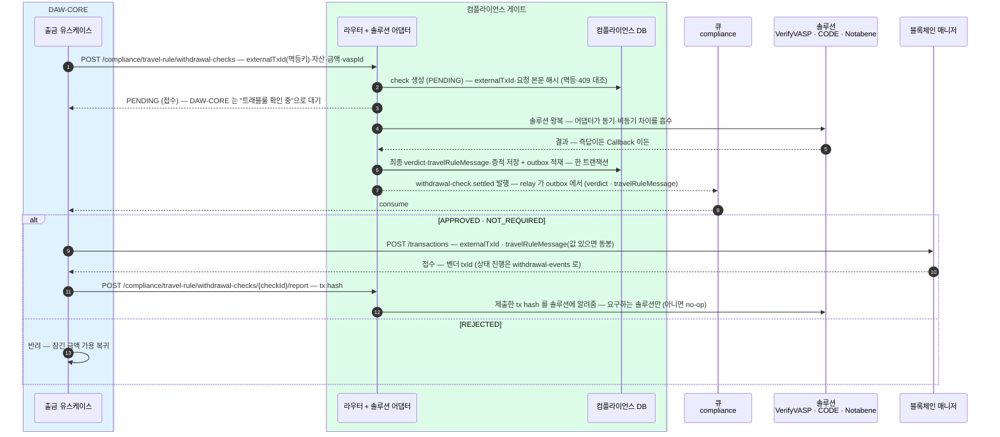
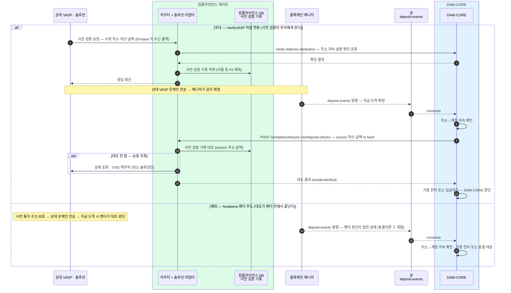
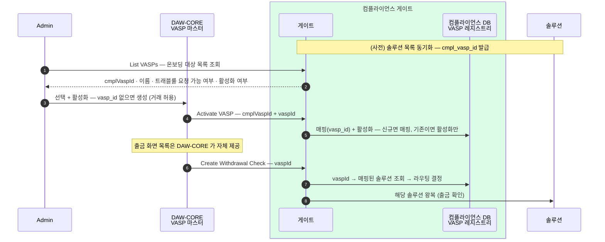

컴플라이언스 게이트의 흐름 — 출금 확인, 입금 판별, VASP 온보딩, 주기 배치, 상태 enum.
게이트는 **규제 확인의 솔루션 연동 창구**다. DAW-CORE 의 확인 요청을 받아 솔루션(VerifyVASP·CODE·Notabene) 왕복을 대행하고, 솔루션 원어를 공통 verdict(TrVerdict)로 번역해 돌려준다. API 필드는 [컴플라이언스 API](?cat=컴플라이언스&sub=API) 뷰어에 있다.

## 경계 — 무엇이 게이트고 무엇이 DAW-CORE 인가

게이트는 **솔루션 연동과 사전 검증 기록 보관**만 한다. 돈·계정·잔고에 대한 판단은 DAW-CORE 가 쥔다.

| 하는 일 | 주인 |
|---|---|
| 솔루션 왕복(트래블룰 확인) · 솔루션 원어 → TrVerdict 번역 | 컴플라이언스 게이트 |
| 상대 VASP 사전 검증 수신 → 사전 검증 기록 적재 · 입금 도착 시 1차 대조 | 컴플라이언스 게이트 |
| 주소↔계정 귀속 판단 · 잔고 가용 전이 · 출금 상태 흐름 | DAW-CORE |
| 거래 허용(고객 화면에 보일 거래소) · VASP 정체 | DAW-CORE (VASP 마스터 `daw_vasp_m`) |

개인지갑 출금은 게이트에 오지 않는다 — 등록·소유 인증된 본인 지갑 확인은 고객 데이터의 주인인 DAW-CORE 가 자체 처리한다. 게이트는 거래소(VASP) 상대 트래블룰만 다룬다.

## 출금 확인

거래소로 나가는 출금은 제출 전에 트래블룰 확인을 거친다. **모든 솔루션을 비동기(큐)로 통일**한다 — 동기 솔루션(CODE·Notabene)도 게이트가 "즉시 완료되는 비동기"로 접어, Create 는 항상 `PENDING`(접수)으로 답하고 최종 verdict 는 `compliance` 큐 이벤트로만 도착한다. DAW-CORE 는 응답 분기 없이 한 경로만 탄다.

- **거래소 목록은 게이트가 답하지 않는다** — 고객에게 보일 "거래할 수 있는 거래소"는 DAW-CORE 가 자기 VASP 마스터에서 낸다. 게이트는 출금 확인이 들어온 순간 `vaspId` 를 받아 솔루션으로 라우팅만 한다.
- **`travelRuleMessage` 는 이벤트에 그대로 실린다** — 값을 만드는 솔루션(Notabene)이면 값이, 사전 승인이라 값이 없는 솔루션(VerifyVASP·CODE)이면 null 이 온다. DAW-CORE 는 Get 없이 이벤트만으로 제출한다.
- **Report(tx hash 보고)는 비차단** — 이 호출의 실패는 출금 흐름과 무관하다(재시도만 하면 된다). 사전 검증과 실 거래를 잇는 용도.
- **발행은 outbox 경로** — verdict 저장과 settled 이벤트 적재가 **한 트랜잭션**이고 relay 가 발행한다(at-least-once). 저장 후 중단돼도 이벤트가 유실되지 않고, 재발송은 DAW-CORE 의 checkId 멱등이 흡수한다. 매니저·코어(ADR-002)와 같은 패턴 — 테이블은 [게이트 DB](05-compliance-db.md) `cmpl_outbox_l`.
- **Get Withdrawal Check** 는 이벤트 유실·재기동 복구 전용 — 정상 흐름에서는 호출하지 않는다.

### verdict — 솔루션 원어를 하나로 접는다

각 솔루션이 돌려주는 상태·응답은 게이트가 아래 넷 중 하나로 접어 DAW-CORE 에 준다.

| TrVerdict | 뜻 |
|---|---|
| `NOT_REQUIRED` | 트래블룰 대상 아님 — 금액이 한국 기준(원화 100만원) 미만이거나, 수취가 개인지갑이라 교환할 상대 VASP 가 없다 |
| `APPROVED` | 통과 — 정보 교환·검증이 승인됐다 |
| `PENDING` | 아직 결과 없음 — 결과가 나면 `withdrawal-check.settled` 로 알린다 |
| `REJECTED` | 거절 — 상대 거절 또는 PENDING 만료 |

`settled` = check 가 최종 결과(`NOT_REQUIRED`·`APPROVED`·`REJECTED`)에 도달해 더는 바뀌지 않음을 뜻한다. 솔루션별 원어 대응(Notabene `Saved`/`Completed`, VerifyVASP Callback, CODE 동기 즉답)은 [컴플라이언스 API](?cat=컴플라이언스&sub=API) 뷰어.

## 입금 판별

입금은 방향이 반대다 — 상대 VASP 가 보내는 **사전 검증**을 게이트가 받아 기록해 두고, 자금이 도착하면 그 기록과 대조한다. 국내(VerifyVASP 직접 연동)와 해외(Notabene 벤더 주도)가 갈린다.

- **사전 검증 기록은 게이트가 보관**하고, 대조 결과만 DAW-CORE 에 준다. 귀속·가용 전이 판단은 DAW-CORE.
- **국내**는 우리 수신 사슬(중앙 → Enclave → 게이트 수신 콜백)이 사전 검증에 응답해야 상대가 전송한다 — 이 사슬의 가용성이 곧 입금 가용성이다.
- **해외**는 대조·판단이 벤더 안에서 끝나 인바운드 API 가 없다 — 매니저의 감지 이벤트에 벤더 판단이 접힌 채로 온다.

## VASP 온보딩

거래 허용·VASP 정체는 DAW-CORE 의 VASP 마스터가 갖고, 게이트는 **솔루션 라우팅**을 맡는다. Admin 이 게이트 목록에서 VASP 를 골라 활성화하는 순간, 코어가 `vasp_id` 를 만들어 게이트에 매핑한다. 그 뒤 출금 확인은 `vaspId` 하나만 실으면 게이트가 매핑을 보고 솔루션을 정한다.

Deactivate 하거나 솔루션 목록에서 사라진 VASP 는 새 출금 확인이 열리지 않는다 — 매핑은 남아 있어 재활성화하면 그대로 복구된다.

## 주기 배치 — 게이트가 스스로 도는 작업

DAW-CORE 호출 없이 게이트가 주기적으로 실행한다.

| 배치 | 하는 일 |
|---|---|
| **솔루션 목록 동기화** | 솔루션(VerifyVASP·Notabene)에서 VASP 목록을 받아 레지스트리에 UPSERT — 신규엔 `cmpl_vasp_id` 발급, 기존은 매핑·활성화 보존, 빠진 항목은 "트래블룰 요청 불가"로 표시. 운영 API(Sync)로도 즉시 실행 |
| **PENDING 만료 스캔** | 기한 지난 PENDING check 를 찾아 `REJECTED`(만료)로 확정하고 `withdrawal-check.settled` 를 발행 — 이것이 만료 verdict 를 만드는 유일한 경로 |
| **outbox relay** | `cmpl_outbox_l` 의 미발송(`P`)을 오래된 순으로 집어 `compliance` 큐로 발행하고 `S` 표시 — settled 발행의 실제 발송기. 미발송 적체 깊이가 지연·정지 신호 |

사전 검증 기록 보존 기간 만료 배치는 보존 기간 값이 정해지면 이 자리에 추가된다(미확정).

## 미확정

- **입금 확인 장애 시 태도** — 사전 검증 기록이 게이트에 있으므로, 게이트 장애 중 도착한 입금의 가용 전이를 어떻게 할지(보류가 기본 후보). 국내 시간 규칙과 함께 정한다.
- **목록 동기화·사전 검증 기록 보존 주기** — 값 미정.
- **check 운영 조회·감사 기록 열람** — Admin 운영 경로 중 미설계분. 운영 요구가 확정되면 설계한다.
- **AML·OFAC 모듈 수용 기준** — 지금은 벤더(Fireblocks) 안 별개 통합. 게이트로 옮기는 조건은 열린 결정.
