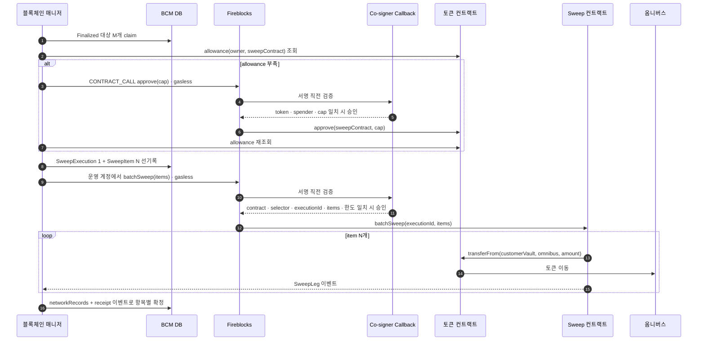

설계자 sweep 정책(2026-07 공유 · 일부 — 나머지 정책 자료 대기 중)을 우리 구조에 적용하는 설계다.
정책 자체는 그대로 옮기고, **"우리가 어떻게 처리하나"** — 트리거 계산·실행 방식·Fireblocks 기능 대응 — 를 정한다. 현행 흐름은 [블록체인 매니저 — 흐름](02-bcm-flow.md) sweep 절, 테이블은 [DB](03-bcm-db.md) `bcm_swp_trgt`.

## 정책 요약 — 두 계층의 sweep

| 계층 | 방향 | 트리거 | 실행 |
|---|---|---|---|
| ① 입금 모으기 | 고객 vault → 옴니버스 | 자산별 — 고객 vault 잔액이 총자산 대비 일정 비율(예: 1%) 이상 · 가스비 한도 안에서 | 보유량 많은 순 M개 묶어 배치 전송, 완료 후 재체크 loop |
| ② 핫·콜드 균형 (밴드S) | 옴니버스 ↔ 외부 cold | 핫월렛백분율이 상한 초과 → 콜드로 · 하한 미만 → 콜드에서 충전 | 전 자산 동일 비율로 이동해 핫월렛균형으로 복귀 |

위 표의 "M개 묶음"은 대상 선정 단위이자 한 온체인 배치의 최대 후보 수다. 실행 방식은 **`approve + transferFrom` 배치 sweep** 으로 채택했다(2026-08-12 설계 결정). 고객 vault 는 자산별로 sweep 컨트랙트에 제한된 allowance 를 설정하고, 전용 운영 계정이 `batchSweep` 한 건을 제출해 M개 vault 의 자산을 옴니버스로 모은다. EIP-3009·2612·EIP-7702 직접 pull과 per-vault 일반 전송은 sweep 구현안에서 제외한다. Universal Gasless 내부의 EIP-7702 사용은 별개다. 근거와 실측은 [배치 sweep 메커니즘](98-batch-sweep.md)과 [approve 배치 sweep PoC](95-approve-pull-poc-result.md)에 남긴다.

공통 전제:

- **Finalized 이후에만 sweep 대상** — 받은 tx 가 더블스펜딩이면 sweep tx 가 무효화돼 멤풀에 남고(가스 낭비·예측 못한 sweep), sweep 후 reorg 면 DB 에 rollback 레코드가 남아 복잡해진다.
- **핫월렛(고객 vault + 옴니버스 + 출금 풀)은 법정최대치 20% 를 넘을 수 없다** — 밴드 설계의 뿌리.
- 가치 기준은 **원화환산가치** = 이용가능잔액 × 고시환율 × NAV. NAV(순자산가치)는 토큰 1개를 실제로 뒷받침하는 준비금 가치 — 완전 준비금이면 ≈1, 준비금 가치가 움직이면 1에서 벗어난다. 액면 대신 실제 가치로 규제 비율(20%)을 재기 위한 보정이고, 환율과 함께 코어가 공급하는 회계 데이터다.

### 주소 3계층 ↔ 우리 구조

| 정책 용어 | 우리 구조 | 비고 |
|---|---|---|
| 받는주소들 | 고객별 vault (입금 식별·수신 전용) | 그대로 대응 |
| 보내는주소들 | **옴니버스 vault + 출금 풀 vault** | 정책의 한 계층을 우리가 둘로 쪼갰다 |
| 콜드월렛들 | **TAP allowlist 고정 외부 cold 주소** | 첫 출시는 외부 오프라인 서명 체계 |

정책은 계층이 셋인데 우리는 vault 가 셋이다. **보내는주소 하나를 둘로 쪼갠 것**이고, 쪼갠 이유는 규제와 무관하다 — 옴니버스는 sweep 이 모이는 보관처, 출금 풀은 EVM 의 vault 당 nonce 직렬을 피하려고 복수로 둔 제출 창구다.

1차 sweep 목적지는 **옴니버스 vault**다(2026-08-05). 옴니버스 → 출금 풀 이동은 **같은 칸 안에서의 이동이라 밴드S 판정을 바꾸지 않는다** — 어디에 얼마를 둘지의 운영 배분 문제다. 콜드 계층 이동만 별도 정책으로 다룬다.

**아래 산식은 우리 vault 이름으로 쓴다.** 정책 원문과 대조할 때만 위 표를 본다.

### 밴드S 산식

| 항목 | 정의 |
|---|---|
| 총자산합 (=100%) | **고객 vault + 옴니버스 + 출금 풀 + 외부 cold** 전체 이용가능잔액의 원화환산 합에 아래 델타 순잔액을 일관되게 반영 |
| 핫월렛합 · 핫월렛백분율 | **고객 vault + 옴니버스 + 출금 풀**의 원화환산 합에 아래 hot 델타 조정 적용 · 핫월렛합×100/총자산합 |
| 핫월렛상한 | 법정최대치(20%) − 운영 버퍼(예: 2%) = 18%. 고객 vault를 hot에 포함하므로 받는주소최대를 다시 빼지 않음 |
| 핫월렛하한 | 예: 5% |
| 핫월렛균형 | (상한−하한)/2 + 하한 — 예: 12.5% |
| 이동량 | 총Sweep합 = 핫월렛합 − 균형액 · **자산전송비율 = 총Sweep합/핫월렛합** — 전 자산 동일 비율, 이동 후 균형 도달 |

**2026-08-17 확정 — 델타 미정산분을 분모와 분자에 함께 반영한다.** 온램프·오프램프는 원장을 먼저 반영하고 온체인 이동은 델타 배치로 나중에 한다. 그 사이 구간에는 **원장과 온체인이 어긋난 몫**이 생기고, 방향이 서로 반대다.

| | 원장 | 온체인 토큰 |
|---|---|---|
| 온램프 미정산 | 고객 잔액에 이미 반영 | 아직 회사자산 쪽 |
| 오프램프 미정산 | 고객 잔액에서 이미 차감 | 아직 고객자산 쪽 |

둘이 반대라 **델타원장 순잔액 하나가 조정항**이 된다.

```
규제 기준 고객자산 = 온체인 커스터디 + 델타원장 순잔액

델타원장 순잔액 = 미정산 회사→고객 − 미정산 고객→회사
```

**부호 규약을 반드시 같이 적어야 한다.** 델타원장은 수량을 항상 양수로 두고 방향을 `from → to` 로 표현하므로, 위 식의 부호는 방향에서 나온다. 그리고

- **미정산의 범위** — `PENDING` 과 처리 중을 포함하고 정산 완료는 뺀다. **역델타도 방향대로 반영**한다
- **집계 단위** — (자산, 네트워크) 별로 순액을 먼저 구하고 그다음 원화환산한다. 자산이 섞인 채 환산하면 방향이 상쇄돼 값이 뭉갠다

**분모만이 아니라 분자도 봐야 한다.** 미정산분을 고객자산으로 계상하면 그 자산이 어디 있느냐에 따라 핫·콜드 구분도 달라진다.

| | 자산 위치 | 분자에 미치는 영향 |
|---|---|---|
| 온램프 미정산 | 회사 vault | 분모에만 더하고 분자에서 빼면 **핫 비율이 인위적으로 낮아진다** |
| 오프램프 미정산 | 고객 vault·옴니버스 | 분자에 남아 있어 **비율을 높인다** |

델타 양쪽 vault 가 모두 핫이면 **분자에도 같은 순잔액 조정항을 적용**하면 된다. 한쪽이 콜드면 따로 봐야 한다.

DAW-CORE가 양방향 미정산을 같은 snapshot에서 계산하고, 분자는 실제 자산 위치가 hot인지 cold인지에 따라 같은 조정항을 반영한다.
한쪽 방향만 반영하거나 분모에만 반영한 snapshot은 유효하지 않다. 같은 조정항은 [대사](../../블록체인매니저/설계/08-balance-history.md)에도 쓴다.

**2026-08-17 확정 — 받는주소최대를 이중 공제하지 않는다.** 고객 vault는 이미 핫월렛합에 포함되므로 법정최대치에서
받는주소최대를 다시 빼지 않는다. 예시 상한 18%는 법정최대치 20%에서 운영 버퍼 2%만 뺀 값이다.

계산 예 (환율 1,000 · NAV 1): 콜드 41,010(74.5%) + 핫 14,005(25.5%) = 55,015 → 핫이 상한 18% 초과 → 균형 6,876(12.5%) → 총Sweep 7,129 → 비율 0.509 → 자산별 핫 보유량 × 0.509 를 콜드로.

## ① 입금 모으기 — 어떻게 처리하나

### 그대로 되는 것 — Finalized 조건

현행 설계가 이미 정책과 일치한다 — 입금 **확정(벤더 COMPLETED = DCCP 임계 도달, 계약 상태 `FINALIZED`)** 관찰 시에만 `bcm_swp_trgt` 에 마킹한다. 벤더 가이드도 같은 순서(COMPLETED 수신 → sweep 트리거)를 권장한다 ([Sweep to Omnibus](https://developers.fireblocks.com/reference/sweep-to-omnibus-1)).

### 바뀌는 것 — 트리거 기준

| | 현행 | 정책 적용 |
|---|---|---|
| 트리거 | 주기 배치 + **최소 금액**(운영 설정값) | 자산별 — 고객 vault 잔액이 **총자산 대비 비율**(예: 1%) 이상 |
| 가스비 | 조건 없음 | **가스비 한도** — 비싼 타이밍 회피 (수수료 관측 주기 작업의 시계열을 판단 입력으로 씀) |

벤더 가이드의 권장 트리거 요인(잔액 임계·주기·네트워크 수수료 여건)과 같은 축이라 벤더 모델과 충돌이 없다. 비율 트리거의 분모(총자산합)는 원화환산이 필요해 아래 "환산 입력" 문제와 같이 걸린다.

### 실행 방식 — approve + transferFrom 배치 (채택 설계)

고객 vault 는 토큰 컨트랙트에 `approve(sweepContract, allowanceCap)` 를 제출한다. 승인된 뒤에는 고객 vault 의 새 MPC 서명 없이 sweep 컨트랙트가 `transferFrom` 으로 자산을 옴니버스에 옮길 수 있다. 같은 네트워크·토큰의 대상 M개를 한 `batchSweep` 호출로 묶는다. `approve`와 `batchSweep`은 모두 Fireblocks `CONTRACT_CALL`로 제출하고 Universal Gasless를 요청한다.



배치는 **부분 성공**을 허용한다. 한 vault 의 잔액·allowance·토큰 상태가 달라졌다고 정상 항목까지 전부 되돌리지 않는다. 컨트랙트는 항목마다 원천·토큰·요청금액·실제금액·성공 여부·실패 코드를 이벤트로 내고, 실패 항목만 다음 회차에서 잔액과 allowance 를 다시 확인한다. 최상위 Fireblocks 거래의 `COMPLETED`는 배치 호출의 성공일 뿐 N개 항목 전체 성공이 아니다.

#### 운영 컨트랙트 ABI

PoC의 `batchSweep(address[],uint256[])`는 외부발 인출과 부분 성공 관찰만 위한 최소 구현이다. 운영 계약은 실행 재사용 차단과 항목 대사를 위해 아래 ABI를 쓴다.

```solidity
struct SweepRequest {
    address owner;
    uint256 amount;
}

function batchSweep(
    bytes16 executionId,
    address token,
    SweepRequest[] calldata items
) external;

event SweepLeg(
    bytes16 indexed executionId,
    uint32 indexed itemSeq,
    address indexed owner,
    uint256 requestedAmount,
    uint256 actualAmount,
    bool success,
    bytes32 failureCode
);

event SweepDone(
    bytes16 indexed executionId,
    uint32 itemCount,
    uint32 successCount,
    uint256 actualTotalAmount
);
```

- `executionId`는 UUID v7의 16바이트 값이다. DB와 로그에서는 표준 36자 UUID 문자열로 보관하고 ABI에서만 하이픈을 뺀 `bytes16`으로 바꾼다.
- `items`는 EVM 원천 주소의 20바이트 값 오름차순으로 정렬하고 `itemSeq`는 그 순서의 1부터 시작한다. 같은 네트워크에서 입금 주소가 유일하므로 동률은 허용하지 않는다.
- `amount`는 토큰 최소 단위 정수다. DB의 사람 단위 십진 금액은 토큰 `decimals`로 정확히 환산하며 나머지가 생기면 제출하지 않는다.
- 컨트랙트는 등록 운영자·token allowlist·최대 M·건별/총액 상한을 검사하고 사용한 `executionId`를 영구 재사용 금지한다. 목적지는 배포 시 불변이다.
- `actualAmount`는 옴니버스의 토큰 잔액 증가분이다. 호출 반환값만으로 성공을 판정하지 않는다. `failureCode`는 성공이면 `bytes32(0)`, 실패면 컨트랙트가 정의한 닫힌 코드다.
- `SweepLeg.itemSeq`와 요청 원천·금액을 DB 항목에 대조한다. 이벤트가 없거나 중복·불일치하면 성공을 추측하지 않고 대사 실패로 격리한다.

### 권한 경계

| 구분 | 블록체인 매니저 책임 | 별도 경계 |
|---|---|---|
| 실행 | 대상 선정·claim, allowance 실측, approve·batch 제출, 항목별 대사, 실패 재시도 | — |
| 실행 의도 | `SweepExecution 1 : N SweepItem` 선기록, canonical hash·`externalTxId` 생성 | — |
| 긴급 회수 | 승인된 비상 모드에서 vault 별 `approve(sweeper, 0)` 제출·진행 추적 | Admin 이 Fireblocks에서 직접 실행하는 독립 경로도 유지 |
| TAP | 활성 정책을 전제로 거래를 제출할 뿐 편집하지 않음 | 정책 관리 서비스의 별도 API user + Admin Quorum·Owner 승인 |
| 서명 | 서명을 요청할 뿐 스스로 승인하지 않음 | 별도 API Co-signer + Callback Handler |
| 컨트랙트 관리 | 현재 배포 주소·코드 해시를 검증하고 호출 | Fireblocks Security Admin Vault가 pause·운영자 교체. 비업그레이드형이 기본 |

거래 제출 자격과 정책 편집·최종 서명·컨트랙트 관리자 자격을 한 서비스에 모으지 않는다. 블록체인 매니저가 침해돼도 목적지와 함수, 자산·금액 상한을 자기 힘으로 바꾸지 못하게 하는 경계다.

### 보안 권한 정책

**Fireblocks TAP은 기본 거부**다.

- 고객 vault의 approve는 등록된 네트워크·토큰 컨트랙트, 현재 sweep 컨트랙트, vault·자산별 allowance cap, sweep 전용 initiator에만 허용한다. 그 밖의 고객 vault `APPROVE`·`CONTRACT_CALL`은 차단한다.
- 긴급 `approve(sweeper, 0)`는 정상 batch 정책을 차단한 뒤에도 실행할 수 있는 별도 revoke rule과 전용 initiator를 둔다. 이 경로는 금액 상향이나 다른 spender 승인을 허용하지 않는다.
- 운영 계정은 화이트리스트된 sweep 컨트랙트의 `batchSweep`만 호출한다. 다른 전송·컨트랙트 호출은 차단한다.
- 거래 initiator, API Co-signer, 정책 편집 API user, Fireblocks Security Admin Vault를 서로 분리한다.
- 정책·화이트리스트·allowance cap 상향·운영자 변경은 자동화하지 않고 Admin Quorum과 보안 관리자 승인을 거친다.

**Co-signer Callback은 실제 calldata를 fail-closed로 검증**한다.

- `approve`: chain, token contract, 함수 selector, spender, 금액이 활성 설정과 일치해야 한다.
- `batchSweep`: chain, sweep contract, 함수 selector, `executionId`, 원천·금액 목록이 선기록한 실행 의도와 일치해야 한다.
- 배치 최대 M, 건별·배치 총액, 실행 빈도, 토큰 allowlist, 컨트랙트 코드 해시를 다시 확인한다.
- DB·정책 스냅샷을 조회할 수 없거나 해석하지 못한 calldata면 승인하지 않는다.

Fireblocks의 `APPROVE`·`applyForApprove`·Approve Amount Cap이 `CONTRACT_CALL + approve calldata` 제출에 실제로 어떻게 매칭되는지는 운영 전 정책 PoC로 확정한다. 확인 전에는 Fireblocks Amount Cap만으로 spender·승인금액 통제가 끝났다고 보지 않는다.

**Sweep 컨트랙트가 마지막 경계를 강제**한다.

- 옴니버스 목적지는 배포 시 불변 고정하고 함수 인자로 받지 않는다.
- 등록된 운영자만 호출하고, 토큰 allowlist·배치 최대 M·건별/총액 상한·`executionId` 재사용 방지를 둔다.
- 임의 외부 호출·`delegatecall`·임의 주소로의 rescue를 두지 않는다.
- `pause`와 운영자 교체 권한만 Fireblocks Security Admin Vault의 온체인 주소에 둔다. 별도 온체인 multisig 컨트랙트는 1차 필수조건으로
  두지 않으며, Fireblocks 전용 TAP rule과 DAW-ADMIN 독립 승인 정족수로 관리자 거래를 통제한다. BCM에는 Security Admin Vault 자격증명을
  주지 않고, 가능하면 컨트랙트는 비업그레이드형으로 배포한다.
- 토큰 호출은 반환값과 실제 잔액 변화를 확인하고 항목별 결과 이벤트를 남긴다.

### allowance 운영

- 무제한 `uint256.max` 승인은 금지하고 vault·토큰별 `operational allowance cap`을 둔다.
- 현재 allowance가 예정 sweep 금액 이상이면 재승인하지 않는다. 부족하면 cap까지 보충하고 **온체인 allowance 재조회가 성공한 뒤에만** 배치에 넣는다.
- 잔여 allowance·vault 잔액·cap 초과를 상시 감시한다. cap 변경은 일반 실행 값이 아니라 승인된 정책 변경으로 취급한다.
- 0이 아닌 allowance를 새 cap으로 바꿀 때는 해당 vault·토큰의 active batch가 없는지 확인하고 `approve(0)` 확정 뒤 새 cap을 승인한다. 토큰 구현 차이와 기존 allowance·신규 allowance의 이중 사용 경쟁을 함께 피한다.
- `pause`는 allowance를 지우지 않는다. 사고 시 TAP batch 차단 → 컨트랙트 pause → 운영자 제거 → 전체 vault `approve(sweeper, 0)` 순서로 회수한다.

#### 비상 전량 회수 실행

전량 회수는 현재 `bcm_swp_auth_m` 행을 호출 시점마다 다시 훑는 단순 loop가 아니다. 운영자는 활성 sweep contract version과
allowance가 0보다 큰 vault·자산 목록을 snapshot으로 만들고, `ALLOWANCE_REVOKE/FUND` 변경 요청에서 정확한 목록·contract binding
revision·전체 hash를 승인받는다. 승인 뒤 항목이 늘거나 spender·token contract·source vault가 바뀌면 기존 승인을 쓰지 않고 새
snapshot과 diff를 만든다.

실행은 모든 항목을 먼저 예약한 뒤 vault별 `approve(sweeper, 0)` 의도와 기존 제출 원장 `REQUESTED`를 벤더 호출 전에 남긴다.
각 제출 직전에도 같은 네트워크·컨트랙트의 진행 중 batch와 대상 vault의 active item이 없음을 다시 확인한다. 이미 시작한 항목은
같은 externalTxId로 응답 유실을 회수하며, 한 항목 실패가 다른 항목의 증적을 지우지 않는다. 화면과 API는 전체 건수, 0 확인 건수,
제출 중·실패 건수와 vault별 최신 event를 보여 준다.

Fireblocks 접수·거래 완료나 로컬 `REVOKED` 상태는 회수 완료 근거가 아니다. 토큰 컨트랙트의 `allowance(owner, sweeper)`를 다시 읽어
각 항목이 0임을 추가 전용 event로 남기고, 전체 항목이 `ZERO_CONFIRMED`일 때만 실행을 완료한다. 일부만 0이면 `PARTIAL`로 유지하며
실패·프로세스 재시작 뒤에도 미완료 항목만 같은 실행에서 재개한다.

### 논스·M개 선정·loop

운영 계정의 배치 거래 논스는 Fireblocks가 관리한다. 같은 실행의 중복 제출은 제출 원장의 멱등·claim 경계와 컨트랙트의 `executionId` 소진 기록으로 이중 차단한다. 같은 운영 계정의 동시 제출은 직렬화한다.

`bcm_swp_trgt`에서 같은 네트워크·토큰이고 트리거 조건을 만족한 대상을 보유량 많은 순으로 고른다. 예상 gas가 블록 gas limit 대비 운영 상한을 넘지 않는 최대 M개만 고른 뒤, 실행 의도와 calldata는 위 ABI 규칙대로 원천 주소 오름차순으로 다시 정렬해 `SweepExecution` 하나에 넣는다. 성공 항목은 잔액을 재확인해 정리하고, 실패·잔액 잔존 항목은 다음 실행 대상으로 되돌린 뒤 loop한다. 항목 하나인 경우도 같은 1:N 모델에서 N=1로 처리한다.

## ② 밴드S — 어떻게 처리하나

### 환산 입력과 계산 주체 (2026-08-17 확정)

밴드 판정에는 매니저가 모르는 **고시환율·NAV·원장 정본**이 필요하다. 따라서 DAW-CORE Treasury/Admin 백엔드가
환산·밴드 판정과 immutable input snapshot을 만들고, 블록체인 매니저는 승인된 자산별 이동량을 검증·멱등 제출·대사한다.

snapshot에는 정책 version, 기준·만료 시각, 자산별 환율·NAV·공급자, 고객 vault·옴니버스·출금 풀과
외부 cold의 관찰 잔액, 진행 중 이동 예약, 입력 hash를 포함한다. 누락·만료·hash 불일치가 있으면 simulation과 승인을 막는다.

### 비율과 예약분 산식

- 총자산 `A = 관찰 hot H + 관찰 cold C`.
- 상한 초과 시 목표 이동량은 `H - 목표비율 × A`, 하한 미달 시 필요 충전량은 `목표비율 × A - H`.
- hot 범위는 고객 vault, 옴니버스, 출금 풀의 체인 관찰 잔액이다. 고객 vault의 미sweep 잔액도 분모와 hot에 포함하지만 직접 cold로 보내지 않는다.
- 진행 중 hot→cold 예약분은 유효 hot에서 **한 번만** 빼고 분모 `A`에서는 빼지 않는다. cold→hot 예약분도 유효 hot에 한 번만 더한다.
- 같은 정책 version·snapshot으로 생성한 이동안만 승인·실행할 수 있다. 실행 중 잔액·정책·목적지가 달라지면 새 snapshot을 요구한다.

### 핫 → 콜드 (상한 초과)

외부로 나가는 출구는 **옴니버스 하나**다(2026-08-18 결정 — 1차 설계에서 treasury egress vault 를 제외한다).

1. 고객 vault 잔액은 기존 sweep으로 옴니버스에 모은다.
2. 출금 풀의 초과 잔액은 회수(출금 풀 → 옴니버스 내부이체)로 옴니버스에 모은다.
3. 옴니버스에서 TAP allowlist에 등록된 네트워크·자산별 고정 외부 cold 주소로 일반 전송한다.
4. 각 중간 거래가 FINALIZED 된 뒤 다음 단계를 열고, 진행 중 금액은 예약분으로 잡아 같은 이동을 다시 제안하지 않는다.

출금 풀 회수는 풀별 최소 운영잔액을 침해할 수 없다. 이동 가능 잔액이 제안량보다 작으면 고객 vault를 직접 보내거나 상한을
임의 완화하지 않고 이동안을 차단한다. 목적지 변경은 [Admin](08-bcm-admin.md)의 보안 변경 정족수와 TAP 재검증을 거친다.

**treasury egress vault 는 재검토 후보로 남긴다** — 외부 전송 권한을 별도 vault 로 격리해야 할 필요(정책 분리·감사 요구 등)가
생기면 그때 다시 본다. 도입하면 옴니버스의 TAP 에서 외부 cold 주소가 빠지고 egress 가 유일한 외부 출구가 된다.

### 콜드 → 핫 (하한 미만 · 충전)

첫 출시는 외부 cold의 오프라인 서명 절차로 옴니버스에 입금한다. Admin은 서명하지 않고 입금의 온체인 FINALIZED를
재조회한다. 확인 뒤 출금 풀 보충(옴니버스 → 출금 풀)은 재개와 같은 강화 정족수로 승인한다. hot→cold와 cold→hot의 소요 시간을 같다고 가정하지 않는다.

Fireblocks cold workspace는 첫 경로가 아니다. 같은 Customer Domain 이동 방식·수수료·정책·API user 권한을 실측한 뒤
별도 정책 version과 출시 게이트로 추가할 수 있다.

## Fireblocks 기능 대응표

| 정책 요소 | 벤더 기능 | 근거 |
|---|---|---|
| 입금 확정 판정 | DCCP (확정 임계) + `transaction.status.updated` | 현행 감지 설계 그대로 |
| allowance 설정 | 고객 vault 에서 `CONTRACT_CALL + approve calldata` | 제출·온체인 반영은 [PoC](95-approve-pull-poc-result.md)로 확인. TAP 매칭·gasless는 출시 게이트 |
| sweep 실행 | 운영 계정에서 sweep 컨트랙트 `batchSweep` 1건 | `networkRecords` 원천 귀속·부분 성공은 [PoC](95-approve-pull-poc-result.md)로 확인 |
| sweep gas | approve와 batch 호출 모두 **Universal Gasless** 요청 | 제품 범위는 Contract Call. 실제 workspace·정책·relay 처리는 출시 전 실측 |
| 배치 결과 | `transaction.network_records.processing_completed` + receipt의 항목별 이벤트 | 최상위 `COMPLETED`만으로 항목 성공을 판정하지 않음 |
| 트리거 요인 | 벤더 권장 = 잔액 임계·주기·수수료 여건 — 정책과 같은 축 | [Sweep to Omnibus](https://developers.fireblocks.com/reference/sweep-to-omnibus-1) |
| 콜드 계층 | 옴니버스 일반 전송 → TAP 고정 외부 cold | hot→cold 출구는 옴니버스 1개. cold→hot은 외부 오프라인 서명 |

## 구현 반영 문서

- **[02 흐름](02-bcm-flow.md)** — allowance 준비 → 배치 선기록 → 제출 → 항목별 확정 순서.
- **[03 DB](03-bcm-db.md)** — allowance 상태와 `SweepExecution 1 : N SweepItem`, Admin·밴드S 물리 원장 설계 게이트.
- **[99 감지 상세](99-detection-detail.md)** — network records 구독과 receipt 이벤트 기반 1:N 결과 판정.
- **[01 개요](01-infra.md)** — DAW-CORE 계산·외부 cold 경계.

## 미확정 · 벤더 문의 후보

- **출시 게이트** — TAP의 `APPROVE`·`applyForApprove`가 CONTRACT_CALL approve의 token·spender·금액을 어디까지 제한하는지, Approve Amount Cap이 API 제출에도 적용되는지, approve와 batch CONTRACT_CALL에 Universal Gasless가 적용되는지 실측한다. Gasless batch에서 sweep 컨트랙트가 관찰하는 `msg.sender`가 등록 운영자와 일치하는지도 함께 확인한다.
- **부하 게이트** — 한 배치 M=수십 건에서 gas 추정 오차, network records 개수·이벤트 지연·부분 실패 결과를 실측해 운영 최대 M을 정한다.
- **보안 게이트** — 컨트랙트 독립 감사, Callback fail-closed 시험, 운영자 침해·pause·전체 `approve(0)` 회수 훈련을 통과한다.
- **cold workspace 후속 게이트** — 같은 Customer Domain 내 워크스페이스 간 전송 방식·수수료·정책·API user 권한. 첫 출시는 외부 cold 경로만 사용한다.
- **비율 snapshot 산출 주기** — DAW-CORE가 총자산합을 갱신하는 주기와 허용 신선도는 운영 정책값으로 확정한다.
- **M·버퍼·상하한·받는주소최대 값** — 운영 설정값. 정책 예시(1%·18%·5%·12.5%)는 예시.
- **가스비 한도의 기준** — 수수료 관측 시계열의 어떤 지표(절대값·백분위)로 끊나.
