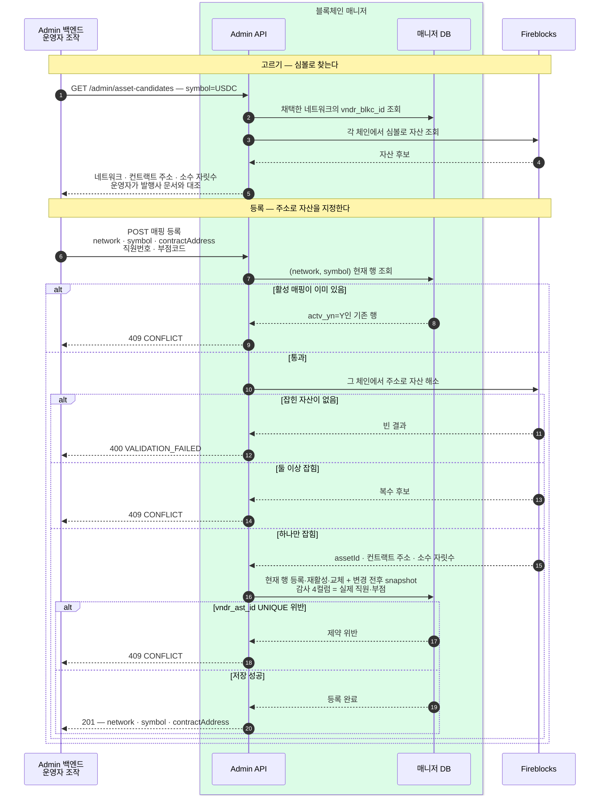

우리 (네트워크, 토큰)이 Fireblocks 에서 무엇으로 불리는지 담는 표와, 그 표를 채우는 절차를 정한다.
어떤 자산을 지원할지는 여기서 정하지 않는다 — 상품 결정이다.

## 매니저가 갖는 것과 갖지 않는 것

우리 계약은 자산을 **네트워크 + 토큰** 두 값으로 다룬다([흐름](02-bcm-flow.md)). 벤더는 `USDC_POLYGON` · `BASECHAIN_ETH` 처럼 자체 체계의 assetId 하나로 다룬다. 둘을 잇는 표를 매니저가 갖는다.

| 값 | 소관 |
|---|---|
| 이 자산이 벤더에서 무엇인가 (`vndr_ast_id`) | 매니저 |
| 어떤 자산을 지원하는가 | 상품 결정 |
| 소수 자릿수 | 보관하지 않는다 |
| 컨트랙트 주소 | 등록 때 대조한 근거의 사본으로 보관 |

현재 매핑 표는 매핑만 담는다. **자산은 벤더를 따라 동기화하지 않는다** — 지원하기로 한 자산만 등록하고, 늘어나면 한 줄 더한다. 블록체인 목록은 하루 한 번 받아 둔다(아래 "표 셋").

**범위 (시작 시점)** — 스테이블코인만, 네트워크는 `ETHEREUM` · `BASE` 둘. 벤더 자산 분류는 NATIVE · FT · FIAT · NFT · SFT · VIRTUAL 로, 스테이블코인이라는 분류는 없다.

## 네트워크 코드와 토큰 심볼

**이름은 우리가 정하고, 동일성 판단은 표준 값으로 한다.**

| 우리 값 | 함께 보관하는 표준 값 | 어디서 얻나 |
|---|---|---|
| `ntwk_cd` = `BASE` | **chainId** (EIP-155) | 카탈로그 동기화가 벤더 `GET /v1/blockchains` 의 `onchain.chainId` 로 채운다 |
| `tkn_smbl` = `USDC` | **컨트랙트 주소** | 등록 요청의 주소를 벤더 `GET /v1/assets` 응답에서 해소해 저장 |

심볼은 표시용이다 — 동일성은 chainId 와 컨트랙트 주소로 판단한다.

계약에서 이 값을 부르는 이름은 `symbol` 하나다 (2026-08-06 확정). `token` 은 인증 토큰·ERC-20 토큰과 겹쳐 이름만으로 무엇인지 알 수 없고, DB 컬럼 `tkn_smbl` 과도 어긋난다. **후보 조회의 `symbol` 은 벤더 표기**이고 등록할 때 우리 값을 정한다 — 대개 같지만 같아야 하는 것은 아니다.

- **네트워크 코드는 벤더 값을 쓰지 않는다.** 우리 이름을 쓰고 벤더 식별자는 `vndr_blkc_id` 로 따로 들고 대조한다.
- **테스트넷은 별도 코드로 둔다** — `BASE` 와 `BASE_SEPOLIA` 는 다른 네트워크다.
- **CAIP-2 / CAIP-19** 는 `eip155:` + chainId 로 조립할 수 있어 저장하지 않는다.
- **ISO 24165 (DTI/DLI)** 는 지금 도입하지 않는다. chainId 와 컨트랙트 주소가 있으면 나중에 매핑할 수 있다.

## 표 셋 — 카탈로그·현재 매핑·변경 snapshot

**벤더 블록체인 카탈로그는 동기화하고(체인 135개), 자산 매핑은 손으로 등록한다. 매핑 이력은 별도 version으로 관리하지 않고 변경 전후 snapshot으로 남긴다.**

```sql
-- 벤더 블록체인 카탈로그 — 일 1회 동기화. 고르기 위한 참조 데이터다
CREATE TABLE bcm_blkc_m (
  vndr_blkc_id  VARCHAR(64)  PRIMARY KEY,  -- 벤더 blockchainId
  ntwk_cd       VARCHAR(20)  NULL,         -- 우리 네트워크 코드 — 채택한 체인만 채운다
  chain_id      BIGINT       NULL,         -- EIP-155 chainId (EVM 만)
  dspl_nm       VARCHAR(64)  NOT NULL,     -- 벤더 표시명
  test_yn       VARCHAR(1)   NOT NULL,     -- 시험망 여부 (벤더 onchain.test)
  deprc_yn      VARCHAR(1)   NOT NULL,     -- 벤더가 폐기 표시 (metadata.deprecated)
  sync_dttm     VARCHAR(16)  NOT NULL,     -- 마지막 동기화 일시
  -- 감사 4컬럼
  UNIQUE (ntwk_cd)
);

-- 자산의 현재 매핑 — 손으로 등록하며 물리 삭제하지 않는다
CREATE TABLE bcm_vndr_ast_m (
  ntwk_cd       VARCHAR(20)  NOT NULL,   -- 우리 네트워크 코드
  tkn_smbl      VARCHAR(16)  NOT NULL,   -- 토큰 심볼 (표시용)
  vndr_ast_id   VARCHAR(64)  NOT NULL,   -- 벤더 assetId — 벤더 호출에만 쓴다
  cntr_addr     VARCHAR(128) NULL,       -- 등록 때 대조한 컨트랙트 주소 (네이티브는 NULL)
  actv_yn       VARCHAR(1)   NOT NULL,   -- 현재 지원 여부 Y/N
  reg_dttm      VARCHAR(16)  NOT NULL,
  -- 감사 4컬럼
  PRIMARY KEY (ntwk_cd, tkn_smbl),
  UNIQUE (vndr_ast_id),
  FOREIGN KEY (ntwk_cd) REFERENCES bcm_blkc_m (ntwk_cd)
);

-- 매핑 변경 원장 — 변경 전후 상태를 추가 전용으로 보관한다
CREATE TABLE bcm_vndr_ast_chng_l (
  chng_id          VARCHAR(36)  PRIMARY KEY,
  ntwk_cd          VARCHAR(20)  NOT NULL,
  tkn_smbl         VARCHAR(16)  NOT NULL,
  actn_dvcd        VARCHAR(16)  NOT NULL, -- REGISTER/DEACTIVATE/REACTIVATE/REPLACE
  before_snps      JSONB        NULL,     -- 변경 전 현재 매핑 snapshot
  after_snps       JSONB        NULL,     -- 변경 후 현재 매핑 snapshot
  req_id           VARCHAR(64)  NOT NULL, -- Admin 요청 추적 id
  chng_dttm        VARCHAR(16)  NOT NULL,
  -- 감사 4컬럼
  FOREIGN KEY (ntwk_cd, tkn_smbl) REFERENCES bcm_vndr_ast_m (ntwk_cd, tkn_smbl)
);
```

| 제약 | 무엇을 막나 |
|---|---|
| `PRIMARY KEY (ntwk_cd, tkn_smbl)` | 같은 자산이 두 줄로 갈라지는 것 |
| `UNIQUE (vndr_ast_id)` | 현재 한 벤더 자산이 여러 (네트워크, 토큰)에 붙는 것 |
| `FOREIGN KEY (ntwk_cd)` | 채택하지 않은 네트워크로 매핑이 생기는 것 |
| `UNIQUE (ntwk_cd)` (카탈로그) | 우리 이름 하나가 두 벤더 체인을 가리키는 것 |
| 현재 매핑 직접 덮어쓰기 금지 | 검증·snapshot 없이 벤더 자산이나 컨트랙트 주소가 바뀌는 것 |
| 변경 원장 `UPDATE`·`DELETE` 금지 | 변경 전후 snapshot이 사라지거나 고쳐지는 것 |

**네트워크 채택은 카탈로그 행에 `ntwk_cd` 를 붙이는 것**이다. `chain_id` 와 `dspl_nm` 은 동기화가 채운다.

`bcm_vndr_ast_m`은 (네트워크, 토큰)별 현재값 하나만 보관한다. `actv_yn=Y`인 행만 "이 자산은 벤더로 보낼 수 있다"는 뜻이며 일반 조회와 업무 요청도 활성 매핑만 사용한다. 등록·해제·재활성·교체 때는 현재 행 변경과 `bcm_vndr_ast_chng_l` 추가를 한 DB 트랜잭션으로 묶는다.

snapshot에는 `network`·`symbol`·`vendorAssetId`·`contractAddress`·`activeYn`을 담는다. 최초 등록은 `before_snps=NULL`, 해제는 변경 전후 값을 모두 남긴다. snapshot은 감사와 장애 대조용이지 현재값을 읽는 테이블이 아니다.

## 동기화 — 하루 한 번, 카탈로그만

`GET /v1/blockchains` 를 페이징해 `bcm_blkc_m` 을 갱신한다.

- **새 체인은 행을 추가**한다. `ntwk_cd` 는 비운다 — 채택은 별도 행위다.
- **기존 체인은 `dspl_nm`·`test_yn`·`deprc_yn`·`sync_dttm` 을 갱신**한다.
- **벤더 목록에서 사라진 체인은 지우지 않는다.** 폐기 표시는 `deprc_yn` 으로만 남긴다.
- **`chain_id` 가 바뀌면 갱신하지 않고 경보**한다.

## 변환은 벤더 경계에서 한 번

우리 어휘는 끝까지 (네트워크, 토큰)으로 가고, **벤더를 부르는 지점에서만** assetId 로 바꾼다. 호출 지점은 넷 — 주소 발급 · 잔액 조회 · 출금 제출 · sweep.

매핑에 없으면 **`ASSET_NOT_SUPPORTED`** 로 거절한다(요청 형식 오류 `VALIDATION_FAILED` 와 구분). 여러 네트워크 발급에서는 네트워크별 실패로 떨어진다.

캐시는 두지 않는다.

## 등록

**Admin 백엔드는 벤더를 모른다** (2026-08-06 확정).

- 자산은 **컨트랙트 주소**로 가리킨다. 네이티브 자산은 주소를 비운다.
- 채택 전 체인은 목록에서 받은 **손잡이**(`candidateId`)로 가리킨다. Admin 은 해석하지도 보관하지도 않는다.
- **chainId 로 채택하지 않는다** — 비 EVM 에는 없다. 찾는 데만 쓴다(`GET /admin/networks?chainId=8453`).
- **자산 후보는 심볼로 찾고 네트워크는 결과로 받는다.** 채택한 네트워크에서만 찾는다.



색: **초록 상자 = 매니저 안쪽**. 되돌아오는 점선이 실패 응답이다. 벤더 id 는 초록 상자 밖으로 나가지 않는다.

등록 요청에는 `vndr_blkc_id` · `chainId` 를 싣지 않는다 — 네트워크와 벤더 체인의 대응은 카탈로그에만 있고 매니저가 `ntwk_cd` 로 찾는다.

**관문 넷**

- **채택한 네트워크만** — FK 가 막는다.
- **주소로 자산이 하나만 잡혀야 한다** — 없으면 400, 둘 이상이면 409.
- **중복 등록 차단** — 활성 (network, symbol)이 있으면 409다. 비활성 행은 같은 매핑이면 재활성하고, 다른 매핑이면 다시 검증한 뒤 교체한다.
- **한 자산은 한 매핑** — 해소된 assetId 를 이미 쓰는 행이 있으면 DB 가 막는다.

등록·재활성·교체는 현재 행을 바로 덮어쓰는 일반 수정이 아니다. 위 관문을 모두 다시 통과한 뒤 현재 행과 변경 전후 snapshot을 한 트랜잭션으로 기록한다.

사람이 판단하는 지점은 둘이다 — **네트워크 채택 때 올바른 체인에 이름을 붙이는 것**, **토큰마다 발행사 문서에서 컨트랙트 주소를 확인하는 것**.

## Admin API — 같은 서비스의 `/admin/*` (2026-08-06 확정)

★ **벤더 어휘가 이 API 를 넘어가지 않는다** — 요청·응답 어디에도 벤더 assetId·blockchainId 가 없다. 계약은 [API 스펙](../../bcm-api-docs/openapi.yaml)의 `Admin` 태그가 정의한다.

| 오퍼레이션 | 하는 일 |
|---|---|
| `GET /admin/networks` | 쓸 수 있는 체인 목록. `adopted` 로 채택 전/후를 가르고, `q` · `chainId` 로 좁힌다 |
| `PUT /admin/networks/{code}` | **네트워크 채택** — 목록에서 고른 후보에 우리 이름을 붙인다 |
| `DELETE /admin/networks/{code}` | 채택 논리 해제 — 매핑이 남아 있으면 409 |
| `GET /admin/asset-candidates` | **심볼로** 자산 후보를 찾는다 — 채택한 네트워크마다 잡히는 것이 한 번에 온다 |
| `GET /admin/asset-mappings` | 등록된 매핑 목록 |
| `POST /admin/asset-mappings` | 등록 — `network` · `symbol` · `contractAddress` |
| `DELETE /admin/asset-mappings/{network}/{symbol}` | 논리 해제 — **그 (네트워크, 토큰)으로 발급된 주소가 하나도 없을 때만** 허용, 있으면 409 |

수정 오퍼레이션은 두지 않는다. 주소·현재 매핑·감사 흔적을 물리 삭제하지 않으며, 해제는 `bcm_vndr_ast_m.actv_yn=N`으로 표시한다. 잘못된 매핑은 논리 해제한 뒤 등록 절차를 다시 거쳐 같은 현재 행을 교체한다. 별도 mapping version이나 활성 binding 테이블은 두지 않고, 등록·해제·재활성·교체의 변경 전후 상태를 `bcm_vndr_ast_chng_l`에 추가 전용 snapshot으로 남긴다.

**감사 흔적** — 자동 처리 행은 시스템 센티넬(`SYSTEM`/`9999`), **Admin 수동 개입은 실제 직원번호·부점코드**를 남긴다([DB 명명 규약](03-bcm-db.md)).
직원번호·부점코드 헤더는 인증이 아니라 감사 전달값이다. Blockchain Manager Admin BFF가 검증한 단기 JWT 신원에서 만들고 BCM은 JWT와
헤더가 다르면 거절한다. 브라우저가 보낸 헤더를 그대로 신뢰하지 않는다.

**이 경로의 호출 주체는 Blockchain Manager Admin BFF 하나다.** `/admin/*`는 같은 `bcm-api` 애플리케이션의 private listener/ingress에
분리하고 공유 환경에서는 BFF→BCM mTLS와 5분 이하 단기 JWT를 함께 검증한다. 일반 업무 API의 내부망 신뢰와 별도 경계다.
T10.2 기능 테스트 profile은 loopback에서만 실행한다. 기본은 읽기 전용이나, 로컬 자산 매핑 관리를
명시적으로 활성화한 경우에만 네트워크 후보 채택·자산 후보 조회·자산 등록을 BFF에 노출한다. 이 예외는
`FUNCTION_TEST+loopback`에 고정하고, 조회는 단순 form이 만들 수 없는 전용 헤더를, 채택·등록은 이 헤더와 브라우저와 동일한
Origin·JSON 요청을 모두 확인한다. BFF는 로컬 설정의
감사 actor를 BCM에 전달하며 브라우저가 직원번호·부점코드 헤더를 직접 만들지 않는다. 공유 환경의 등록은 mTLS·단기 JWT
인증·인가가 완성되기 전에는 계속 닫는다. 네트워크·자산 논리 해제와 자산 교체는 주소 발급과 변경 snapshot 운영 조건을 필요로 하므로
로컬 UI에서도 열지 않는다.

### 해제 운영 조건

- mapping·network 해제는 서비스 운영 중 수행하는 무중단 기능이 아니라 유지보수 작업이다. 해제 전에 주소 발급 요청 유입을 차단하고 진행 중인 요청이 없음을 확인한다.
- 해제 시 해당 자산으로 발급된 주소가 없는지 다시 확인한다. 주소가 하나라도 있으면 409로 거절하고, 없을 때만 `actv_yn=N` 변경과 전후 snapshot을 한 트랜잭션으로 기록한다.
- 이 전제를 적용하므로 주소 발급 intent나 해제와 발급 사이의 온라인 경합 제어는 두지 않는다. 운영 중 해제가 필요해지면 그때 별도 설계한다.
- 논리 해제된 현재 행과 변경 snapshot은 조회 가능하게 남기고 일반 등록 목록은 활성 매핑을 기본으로 반환한다.

## 뒤로 미룬 것 — 네트워크 장애 대응

체인 장애 때 출금 제출을 네트워크 단위로 멈추는 스위치. 붙일 자리는 카탈로그(`bcm_blkc_m`)다.

- 대상은 **출금 제출**. 입금 감지는 막지 않고, sweep 은 미루고, 주소 발급·잔액 조회는 막지 않는다.
- **차단은 수동, 감지는 자동** — 막힘 점검이 "확정 지연이 체인별 임계 초과"를 경보한다([흐름](02-bcm-flow.md)).
- 이미 나간 tx 는 스위치와 무관하다 — 막힘 점검·boost·경보가 맡는다.

## 아직 못 정한 것

- **컨트랙트 주소의 정본 출처** — 대조에 쓸 "진짜 USDC 주소" 를 어디서 가져올지, 누가 확인해 등록 요청에 넣을지.

## 확인한 것

Fireblocks `GET /v1/assets` 는 `blockchainId` · `assetClass` · `symbol` 등으로 거를 수 있지만 **컨트랙트 주소 필터는 없다**. 후보 조회는 운영자가 입력한 심볼로 좁히되, 등록 검증은 우리 토큰 심볼과 벤더 표기가 다를 수 있으므로 심볼에 기대지 않는다. 채택한 네트워크의 `blockchainId` 로 자산을 끝까지 페이징하고 응답 `onchain.address` 를 매니저가 대조해 하나로 해소한다. 네이티브 자산은 `assetClass=NATIVE` 로 해소한다.

## 참고 — 벤더 조회 API

| 엔드포인트 | 쓰임 |
|---|---|
| `GET /v1/assets` | 자산 조회. `blockchainId` · `assetClass` · `symbol` 로 거를 수 있다. 응답에 `id` · `legacyId` · `blockchainId` · `decimals` · `assetClass` |
| `GET /v1/blockchains` | 벤더가 지원하는 네트워크 전체. 응답에 `id` · `legacyId` · `displayName` · `nativeAssetId` · `onchain{protocol · chainId · test · signingAlgo}` |
| `GET /v1/supported_assets` | 구 버전 자산 목록 — `id` · `name` · `type` · `contractAddress` · `nativeAsset` · `decimals` |
