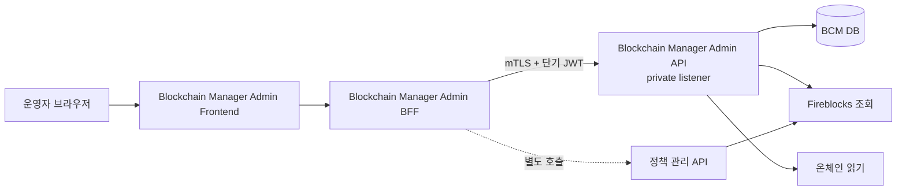

블록체인 매니저 전용 Admin의 범위·권한 경계·화면·운영 흐름을 정한다.
운영자는 여기서 자산 이동을 직접 조립하지 않고, 매니저가 보유한 사실을 조사하고 승인된 정책과 비상 절차 안에서만 상태를 바꾼다.

## 목적

Admin은 단순 설정 CRUD가 아니라 다음 운영 순서를 한곳에서 이어 주는 콘솔이다.

```text
이상 발견 → 대상 검색 → 근거 조사 → 변경안 작성 → 승인 → 실행 → 결과 대사 → 감사
```

- 네트워크·자산·거래·sweep·allowance·boost의 현재 상태를 찾는다.
- 블록체인 매니저가 사용하는 sweep 컨트랙트와 실행 정책을 버전으로 관리한다.
- 밴드S 이동 제안을 검토하고 승인된 실행을 추적한다.
- 네트워크·sweep 중지, allowance 회수, 웹훅 복구 같은 사고 대응을 절차대로 수행한다.
- 누가 언제 어떤 근거로 무엇을 바꿨고 실제로 어떻게 끝났는지 재현한다.

## 범위와 경계

### 포함

| 영역 | Admin이 제공하는 것 |
|---|---|
| 네트워크·자산 | 네트워크 채택·해제, 자산 후보 조회·매핑, 출금 중지 상태 |
| 거래 조사 | txId·externalTxId·계정·주소 검색, 상태·웹훅·발행·대사·boost 연결 조회 |
| sweep | 실행 1:N 항목, 부분 성공·재시도, allowance 실제값·cap·회수 상태 |
| 컨트랙트 | 매니저가 호출할 sweep 컨트랙트의 버전·주소·검증 증적·활성 상태 |
| 실행 정책 | sweep·boost·출시 게이트·네트워크별 실행 값의 버전·승인·활성화 |
| 밴드S | 입력 snapshot·계산 결과·이동 제안·승인·제출·대사 상태 |
| 비상 운영 | 출금/sweep/approve 중지, 웹훅 복구, allowance 전량 회수, 재개 승인 |
| 감사 | 변경 요청·승인·실행·외부 상태 대조 이력 |

### 제외

| 영역 | 소관 |
|---|---|
| 전사 사용자·역할 관리 | Admin 인증·권한 시스템 |
| 일반 스마트 컨트랙트 소스·빌드·배포 | 별도 컨트랙트 저장소와 보안 배포 절차 |
| Fireblocks TAP 정책 직접 편집 | [정책 관리](../../정책관리/설계/00-scope.md)와 벤더 거버넌스 |
| Co-signer 최종 서명·multisig 승인 | 각각의 독립 보안 경계 |
| 고객 원장·회계·귀속 잔액 | DAW-CORE |
| 환율·NAV 정본 | 코어/상품·회계 데이터 공급자 |
| stablecoin mint·burn | 별도 발행·소각 도메인 |

정책 관리 서비스는 Fireblocks Policy Editor 드래프트와 게시 요청을 다루는 별도 구성 요소다. 이 Admin은 그 서비스를 흡수하지 않고, 필요할 때 기대 정책과 실제 활성 정책의 일치 여부 및 외부 승인 상태를 보여 준다.

## 호출 구조와 신뢰 경계



- 브라우저가 블록체인 매니저 API를 직접 호출하지 않는다.
- Admin Frontend와 BFF는 DAW-CORE와 분리된 매니저 전용 애플리케이션으로 이 저장소에서 함께 운영한다.
- T10.2의 첫 용도는 읽기 전용 기능 테스트다. frontend·BFF와 대상 BCM은 기본적으로 loopback에 바인딩하고 상태 변경 API를 BFF에 노출하지 않는다.
- BFF가 Admin 세션·역할을 확인하고 운영자 식별자를 전달한다.
- `X-Employee-No`·`X-Branch-Code`는 감사 정보이며 그 자체가 인증 수단은 아니다.
- 블록체인 매니저 Admin API는 `bcm-api`와 같은 애플리케이션으로 배포하되 일반 업무 API와 분리한 private listener/ingress에 두고 Admin BFF만 접근시킨다.
- 공유 환경의 BFF→BCM은 mTLS 서비스 신원과 5분 이하의 단기 서명 JWT를 함께 검증한다. JWT는 `aud=bcm-admin-api`, 직원번호, 부점코드, 역할, 세션·요청 ID를 담는다.
- Fireblocks 자격·RPC 자격·multisig 자격은 브라우저에 전달하지 않는다.
- 사내 인증 제공자의 실제 그룹은 BFF에서 아래 BCM 역할 claim으로 매핑한다. 기능 테스트 profile은 조회 역할만 사용하고 loopback 밖에서 시작하지 않는다. 구체 인증 제품은 이 설계의 경계를 바꾸지 않는다.

## 사용자와 권한

역할의 발급·회수는 외부 Admin 권한 시스템 소관이다. 이 문서는 기능별 필요한 권한만 정의한다.

| 역할 claim | 역할 | 할 수 있는 일 |
|---|---|---|
| `BCM_VIEWER` | 조회자 | 운영 상태·정책·컨트랙트·감사 이력 조회 |
| `BCM_OPERATOR` | 운영자 | 변경 요청 작성, 복구 요청, 허용된 신속 중지 |
| `BCM_APPROVER` | 승인자 | 정책·밴드S 실행·재개 요청 검토와 승인·거절 |
| `BCM_SECURITY_APPROVER` | 보안 승인자 | 컨트랙트 활성화, 보안 상한 확대, 운영자 변경 확인 |
| `BCM_AUDITOR` | 감사자 | 요청·승인·외부 응답·실행 결과의 읽기 전용 조회 |

### 위험 등급과 정족수

| 위험 등급 | 대표 작업 | 필요한 사람 |
|---|---|---|
| 조회 | 상태·감사·증적 조회 | 해당 조회 역할 1명 |
| 신속 중지 | 출금·sweep·approve 신규 실행 중지 | 운영자 1명, 사후 감사 필수 |
| 일반 변경 | hard ceiling 안의 운영값 변경, 웹훅 복구 요청 | 요청자 + 독립 승인자 1명 |
| 자금 실행 | 승인된 밴드S hot→cold, allowance 회수 | 요청자 + 독립 승인자 1명 |
| 보안 변경 | 컨트랙트 활성화, 상한 확대, 고정 목적지 변경 | 요청자 + 서로 다른 승인자 2명, 그중 보안 승인자 1명 |
| 재개 | 중지 해제, 보안 기능 재활성화 | 요청자 + 서로 다른 승인자 2명, 그중 보안 승인자 1명 |

공통 규칙:

- 요청자와 최종 승인자를 분리한다.
- 고위험 요청의 두 승인자는 서로 다른 사람이어야 하고 요청자는 어느 정족수에도 포함하지 않는다.
- 거절·만료·대상 snapshot 변화 뒤에는 기존 승인을 재사용하지 않는다.
- 중지는 복구보다 빠르게 할 수 있어야 한다. 재개·상한 확대·컨트랙트 활성화는 중지보다 강한 승인 조건을 쓴다.
- 프론트 권한 표시는 편의 기능이다. 실제 허용 여부는 서버가 판단한다.

## 정보 구조

| 메뉴 | 목적 | 대표 화면 |
|---|---|---|
| 대시보드 | 지금 처리해야 할 항목을 찾는다 | 주의 필요, 승인 대기, 중지·drift 현황 |
| 통합 검색 | 식별자 하나로 관련 운영 사실을 잇는다 | 거래·sweep·컨트랙트·변경 요청 검색 |
| 네트워크·자산 | 지원 체인과 벤더 자산 매핑을 관리한다 | 네트워크, 자산 후보, 매핑 |
| 거래 조사 | 제출부터 대사까지 한 거래의 원인을 추적한다 | 거래 목록, 거래 상세 타임라인 |
| Sweep·Allowance | 배치 실행과 vault 권한을 조사한다 | 실행, 항목, allowance, 회수 |
| 컨트랙트 | BCM이 호출하는 컨트랙트의 검증·활성 상태를 관리한다 | 레지스트리, 버전 비교, drift |
| 정책 | 실행 값을 버전·승인 단위로 관리한다 | 정책 목록, diff, 변경 요청 |
| 밴드S | 핫·콜드 균형 제안을 검토하고 실행을 추적한다 | 현황, simulation, 이동안, 실행 |
| 승인함 | 내가 요청했거나 승인할 변경을 모은다 | 승인 대기, 승인·거절, 적용 결과 |
| 비상 운영 | 사고 대응 순서와 진행률을 한곳에 모은다 | 중지, 웹훅 복구, allowance 회수 |
| 감사 | 상태 변경의 전 과정을 재현한다 | 요청·승인·실행·외부 대조 이력 |

## 핵심 화면 와이어프레임

와이어프레임은 정보 우선순위와 행동 위치의 계약이다. 사내 디자인 시스템이 없으므로 아래 토큰과
`blockchain-manager-svc/docs/admin-reference/`의 Dashboard·Transaction Detail·Policy Approval·Band S Simulation
기준 화면을 초기 UI 정본으로 사용한다.

### 디자인 토큰

| 구분 | 토큰·값 |
|---|---|
| 배경 | canvas `#080d12`, shell `#0d141b`, panel `#121c25`, raised `#172530`, selected `#17312f` |
| 선 | subtle `#22313e`, strong `#395064` |
| 텍스트 | primary `#eef5f7`, secondary `#a7bac5`, muted `#758b99` |
| 의미색 | accent `#5ee0c1`, info `#78adff`, success `#75d98b`, warning `#f2bd5a`, danger `#ff7770` |
| 간격 | 4·8·12·16·24·32px |
| 모서리 | 3px·6px. 상태 pill과 과도한 둥근 카드는 쓰지 않는다 |
| 글꼴 | UI `IBM Plex Sans KR` 우선, 식별자·금액 `IBM Plex Mono` 우선. 대체 글꼴은 배포 셸이 제공한다 |
| 동작 | 장식 애니메이션 없음. 필요한 상태 피드백은 opacity·transform만 200ms 이하, reduced motion 존중 |

- 화면은 운영 관제 원장처럼 증적과 다음 행동을 먼저 보여 주며 화면마다 주 accent는 하나만 쓴다.
- 상태는 아이콘·텍스트·색을 함께 쓰고, 금액·비율·시각은 tabular 숫자로 정렬한다.
- destructive action은 diff와 영향 범위를 다시 보여 주는 접근 가능한 확인 대화상자를 거친다.

### 공통 셸과 대시보드

```text
┌ 환경 PROD ─ Blockchain Manager Admin ─ [통합 검색________________] ─ 내 승인 3 ┐
├──────────────┬───────────────────────────────────────────────────────────────┤
│ 대시보드     │ 조치 필요 12                 마지막 갱신 2026-08-14 02:45 UTC │
│ 네트워크·자산│ ┌ 중지·차단 2 ┐ ┌ 승인 대기 3 ┐ ┌ Drift 1 ┐ ┌ 미종결 6 ┐    │
│ 거래 조사    │ └─────────────┘ └──────────────┘ └─────────┘ └──────────┘    │
│ Sweep        │                                                               │
│ 컨트랙트     │ 우선 확인                                                     │
│ 정책         │ 위험  대상/원인              관찰 시각       다음 행동         │
│ 밴드S        │ 높음  BASE sweep 중지         02:41 UTC       비상 운영 열기    │
│ 승인함       │ 높음  구 컨트랙트 allowance   02:40 UTC       회수 현황 보기    │
│ 비상 운영    │ 중간  tx-… 대사 추적 중단     02:38 UTC       거래 상세 열기    │
│ 감사         │                                                               │
│              │ 네트워크 상태 · 외부 모니터링 상세 링크                      │
└──────────────┴───────────────────────────────────────────────────────────────┘
```

- 모든 카드의 숫자는 대응 목록으로 이동한다.
- 조치 필요 항목은 위험도만 보여 주지 않고 원인·관찰 시각·다음 행동을 한 행에 둔다.
- 전역 환경과 데이터 갱신 시각은 스크롤해도 잃지 않는다.

### 거래 상세

```text
┌ 거래 tx-root-…  FINALIZED ─ [ID 복사] [모니터링] ─ 기준 02:31 UTC ┐
│ 요약: WITHDRAWAL · BASE/USDC · externalTxId · root/active tx · hash │
├───────────────────────────────────┬──────────────────────────────────┤
│ 상태 타임라인                     │ 현재 진단                        │
│ 02:20 intent 선기록               │ 벤더 status/subStatus            │
│ 02:20 제출 → SUBMITTED            │ confirmation · networkStatus     │
│ 02:22 웹훅 → CONFIRMED            │ 대사 확인/중단 시각              │
│ 02:31 대사 복구 → FINALIZED       │ 가능한 action과 금지 사유        │
├───────────────────────────────────┴──────────────────────────────────┤
│ 관련: boost 2회 | fee quote | outbox 이벤트 | sweep execution 없음 │
└──────────────────────────────────────────────────────────────────────┘
```

- 타임라인에는 관찰 사실과 매니저 판단을 구분한다.
- root와 active 물리 거래를 같은 값처럼 보이지 않는다.
- raw payload 대신 조사에 필요한 구조화 필드와 관련 원장 링크를 제공한다.

### 정책 변경·승인

```text
┌ 변경 요청 PCR-…  승인 대기 1/정족수 ─ 요청자 123456 ─ 만료 03:00 UTC ┐
│ 대상: BASE/USDC sweep-policy v4 → v5          작업 티켓 OPS-…       │
├ 이전 v4 ───────────────────────┬ 신규 v5 ───────────────────────────┤
│ minimumAmount  100             │ minimumAmount  150                 │
│ allowanceCap   1,000           │ allowanceCap   1,000               │
│ batchSize      30              │ batchSize      20                  │
├────────────────────────────────┴────────────────────────────────────┤
│ 영향: 대기 대상 42 · 열린 실행 0 · hard ceiling 통과 · drift 없음  │
│ 증적: policy snapshot · TAP · Callback · code hash · 갱신 시각      │
│ 요청 사유: …                                                        │
│                                            [거절] [승인]            │
└──────────────────────────────────────────────────────────────────────┘
```

- 변경된 필드와 영향만 먼저 보여 주고 전체 snapshot은 보조 상세로 둔다.
- 승인 버튼 직전에 서버가 snapshot과 외부 상태를 다시 검사한다.
- 승인할 수 없는 사용자는 버튼 대신 필요한 역할·선행조건을 본다.

### 밴드S simulation·실행안

```text
┌ 밴드S · 2026-08-14 02:30 UTC snapshot ─ 신선함 ─ 정책 v3 ┐
│ 하한 8% ───── 목표 12.5% ───── 현재 18.7% ───── 상한 18% │
│ 판정: 콜드 이동 제안                                      │
├ 자산 ─ 네트워크 ─ 출발 ─ 목적지 ─ 제안 금액 ─ 예상 수수료 ┤
│ USDC   BASE        …       cold-A   12,000      …           │
│ USDC   ETHEREUM    …       cold-B    8,000      …           │
├─────────────────────────────────────────────────────────────┤
│ 실행 후 예상 12.5% · 입력 6/6 유효 · 차단 사유 없음       │
│ [입력·산식 근거] [이동안 요청]                              │
└─────────────────────────────────────────────────────────────┘
```

- 현재 위치와 하한·목표·상한을 숫자와 축으로 함께 보여 준다.
- 오래되거나 빠진 입력이 있으면 이동안 요청을 막고 어떤 입력이 문제인지 표시한다.
- simulation과 승인·실행 상세에서 같은 정책 버전과 snapshot ID를 계속 보여 준다.

## 공통 UI·UX 규칙

### 탐색·검색

- 상단 통합 검색은 txId, externalTxId, executionId, accountId, 주소, 컨트랙트 주소, 네트워크·심볼, 변경 요청 ID, 작업 티켓을 받는다.
- 목록의 필터·정렬·페이지는 URL에 보존해 링크를 공유하고 상세에서 돌아와도 같은 위치를 유지한다.
- 자주 쓰는 필터를 저장할 수 있게 하되, 공유 범위와 저장 위치는 프론트 구현 전에 확정한다.
- 식별자·주소는 목록에서 축약해도 상세·확인 화면에서는 전체값과 복사 기능을 제공한다.

### 상태·시간·신선도

- 같은 상태는 모든 화면에서 같은 이름과 의미를 쓴다. 색만으로 상태를 전달하지 않는다.
- 운영·testnet 환경을 상단 고정 배너와 명시적 텍스트로 구분한다.
- API 시간은 UTC `Z`를 사용한다. 화면은 사용자 시간대로 변환하되 UTC 원문을 함께 확인할 수 있어야 한다.
- 외부 조회·계산 값에는 기준 시각, 마지막 갱신 시각, 허용 신선도와 만료 여부를 표시한다.
- 새로고침 실패 시 이전 값을 최신인 것처럼 보이지 않는다.

### 변경·위험 작업

- 변경은 이전 값과 새 값을 나란히 비교한 뒤 요청한다.
- 고위험 작업은 변경 사유와 작업 티켓을 필수로 받는다.
- 활성화·상향·재개·자금 이동은 optimistic update를 쓰지 않는다. 서버의 실제 상태 재조회로 완료를 확인한다.
- 장시간 작업은 요청 ID, 현재 단계, 마지막 관찰 시각, 재시도 가능 여부를 보여 준다.
- 서버가 금지한 작업은 실행하지 못하며, 비활성 사유와 필요한 선행조건을 설명한다.
- 오류 문구는 내부 예외를 노출하지 않고 실패 대상·현재 상태·다음 조치를 알려 준다.

### 표시와 접근성

- 운영 데스크톱을 우선하되 읽기 화면은 태블릿에서도 사용할 수 있게 한다.
- 키보드 탐색, 포커스 표시, 스크린리더 레이블, 충분한 명도 대비를 제공한다.
- 큰 표는 열 고정·밀도 조절·필요 열 선택을 지원한다. 다운로드 기능을 둘 경우 권한과 민감정보 마스킹을 별도로 정한다.
- 금액은 문자열/정밀 십진 계약을 유지하고 프론트 부동소수점으로 재계산하지 않는다.

## 화면별 기능

### 대시보드 — 행동 대기열

단순 누적 통계보다 운영자가 확인하거나 조치해야 하는 항목을 먼저 보여 준다.

| 영역 | 보여 줄 것 | 이동 위치 |
|---|---|---|
| 중지·차단 | 출금/sweep/approve 중지 네트워크 | 비상 운영·네트워크 상세 |
| 거래 | 장시간 미종결, 대사 추적 중단, 제출 충돌 | 거래 상세 |
| sweep | 부분 성공·실패·장시간 대사 중 실행 | sweep 실행 상세 |
| allowance | cap 초과, 구 컨트랙트 잔여, 회수 실패 | allowance 상세 |
| 컨트랙트 | code hash·불변값·TAP/Callback drift | 컨트랙트 상세 |
| 정책 | 승인 대기, 적용 실패, 외부 활성 정책 불일치 | 정책·승인함 |
| 밴드S | 상·하한 이탈, 오래된 입력, 승인 대기 이동안 | 밴드S 상세 |
| 웹훅 | 구독 비활성, 복구 실행 필요 | 비상 운영 |

인박스·outbox·오류율·heartbeat의 원시 메트릭과 경보 판단은 외부 모니터링 소관이다. Admin 대시보드는 조치가 필요한 요약과 모니터링 상세 링크를 제공한다.

### 네트워크·자산

기존 [자산 매핑](07-asset-master.md)의 Admin API를 기본으로 한다.

- 채택/미채택, testnet, chainId, 동기화 시각으로 네트워크를 찾는다.
- 자산 후보의 벤더 심볼과 온체인 컨트랙트 주소를 운영자가 나란히 대조한다.
- 등록 단계는 네트워크 선택 → 후보 검색 → 주소 비교 → 영향 확인 → 사유 확인 → 등록 순서다.
- 주소가 발급된 매핑은 삭제할 수 없다. 물리 삭제 감사 유실과 주소 발급 경합 문제는 실제 자산 운영 전에 해결한다.
- 네트워크 출금 중지는 출금 제출만 막고 입금 감지·주소·잔액 조회는 유지하며 sweep은 미룬다. 이미 제출한 거래에는 적용하지 않는다.

### 거래 조사

- 기간·상태·네트워크·심볼·계정·거래 유형으로 목록을 거른다.
- root 논리 거래, active 물리 거래, externalTxId와 tx hash의 관계를 보여 준다.
- 제출 intent, 벤더 관찰, 공통 상태 전이, outbox 발행, 대사, boost를 시간순으로 잇는다.
- 벤더 subStatus·networkStatus·confirmation과 대사 확인 횟수·중단 시각을 운영 조사 필드로 보여 준다.
- 일반 제출·내부이체·sweep approve·sweep batch를 구분하고 고객 이벤트 발행 여부를 함께 보여 준다.
- 관련 boost 시도, 당시 fee level·수수료 견적, sweep 실행을 상세에서 바로 연다.
- 수신 원문 payload·서명·시크릿은 일반 화면에 노출하지 않는다. 사고 증적 열람은 별도 권한·감사 절차를 결정하기 전 제공하지 않는다.

### Sweep·Allowance

- 실행 상태, 항목 수, 요청/실제 총액, 운영 계정, 컨트랙트, 벤더 거래와 tx hash를 조회한다.
- 항목별 요청/실제 금액, 성공·실패·재시도, 실패 코드, log index를 보여 준다.
- 최상위 거래 `COMPLETED`와 항목별 대사 완료를 구분한다.
- vault·네트워크·심볼·컨트랙트별 allowance 실제값, 정책 cap, 승인/회수 상태를 비교한다.
- 구·신 컨트랙트에 allowance가 동시에 남은 경우를 별도 위험으로 표시한다.
- 실패 항목에는 다음 회차 재시도, 운영 확인, 정책 불일치, 회수 필요 등 서버가 판정한 다음 행동을 보여 준다.

### Sweep 컨트랙트

Admin은 BCM이 호출할 컨트랙트의 레지스트리와 활성 binding을 관리한다. 배포와 multisig 서명은 하지 않는다.

- 소스·ABI·재현 빌드는 별도 `blockchain-manager-contracts` 저장소의 서명된 immutable release가 정본이다.
- release에는 source commit, compiler·optimizer 설정, ABI/artifact SHA-256, 예상 runtime bytecode hash, 배포 manifest를 포함한다.
- 실제 주소·code·불변값은 BCM 서버가 사내 RPC gateway에서 pinned block 기준으로 읽은 온체인 값이 정본이다.
- 활성화·재개 때 서로 독립된 두 RPC endpoint의 `chainId`, code hash, 불변값이 모두 일치해야 한다. 실패·stale·불일치는 fail-closed다.
- 감사·TAP·Callback·Gasless·회수 훈련 문서는 승인된 문서 보관소 URI와 SHA-256으로 등록하고 Admin DB에는 불변 evidence snapshot을 남긴다.

| 보관·검증 대상 | 내용 |
|---|---|
| 식별 | 용도, 네트워크, 버전, 주소 |
| 배포 | 배포 tx·블록, artifact/ABI hash |
| 온체인 | runtime bytecode hash, pause, 운영자, 관리자 multisig |
| 불변값 | 옴니버스 목적지, 허용 selector와 ABI |
| 상한 | token allowlist, 최대 M, 건별·배치 총액 |
| 증적 | 독립 감사, TAP·Callback·Gasless·회수 훈련 결과와 검증 시각 |

상태는 후보 → 검증 완료 → 활성 → 중지 → 은퇴 순서이며 실제 저장코드와 불변 원장에서의 파생 규칙은
[DB](03-bcm-db.md#상태코드와-현재-상태-파생)를 따른다.

- 주소·버전은 직접 수정하거나 삭제하지 않는다.
- 같은 네트워크·용도에는 활성 컨트랙트 하나만 허용한다.
- `verified` 한 값이 아니라 무엇을 누가 언제 어떤 hash로 확인했는지 증적을 보관한다.
- 활성화 전에 온체인 code hash와 불변값, TAP·Callback 기대 설정, 출시 게이트를 다시 대조한다.
- 온체인 조회 실패나 drift는 성공으로 간주하지 않는다.

### 실행 정책

정책은 행을 직접 수정하지 않고 불변 버전을 생성한다. 상태는 초안 → 검토 → 승인 → 활성 → 대체 순서이며 실제 저장코드와
현재 상태 파생 규칙은 [DB](03-bcm-db.md#상태코드와-현재-상태-파생)를 따른다.

| 정책 층 | 예 | 변경 통제 |
|---|---|---|
| 배포 hard ceiling | 서비스 전체 kill switch, 허용 최대 batch·금액 | 배포 변경. Admin이 완화할 수 없음 |
| 보안 정책 | 컨트랙트/code hash, token allowlist, allowance·금액 최대치 | 강화된 승인·외부 정책 대조 |
| 운영 정책 | 최소 sweep 금액, 주기, 실제 batch size, boost 횟수 | 승인된 상한 안에서 버전 변경 |
| 비상 상태 | 네트워크·sweep·approve 중지 | 중지는 신속, 재개는 강화된 승인 |

- 정책 화면은 현재 활성값, 변경안, 영향 대상, 적용 시각, 요청자·승인자, 외부 drift를 보여 준다.
- 실행은 적용한 정책 버전 또는 snapshot hash를 원장에 남겨 과거 판단을 재현한다.
- 정책 변경은 이미 선기록된 실행의 의미를 바꾸지 않는다.
- 프론트가 허용 범위나 금액을 계산하지 않는다. 서버가 검증한 diff와 action만 표시한다.

### 밴드S

밴드S는 고객 vault → 옴니버스 sweep과 다른 핫·콜드 유동성 관리다. 계산·입력·실행 경계는 [sweep](06-sweep.md)이 정본이다.

| 화면 | 내용 |
|---|---|
| 현황 | 핫·콜드 가치, 현재 비율, 하한·목표·상한, 기준 시각 |
| 입력 | 자산별 잔액, 환율, NAV, 데이터 공급자, 신선도 |
| simulation | 정책 적용 시 이동 방향·총액·자산별 금액·예상 실행 후 비율 |
| 이동안 | 출발 vault, 콜드 목적지, 네트워크·자산·금액, 예상 수수료, 차단 사유 |
| 승인 | 정책 버전, 입력 snapshot hash, 변경 사유, 승인 진행 |
| 실행 | 제출 intent, 벤더 거래, 공통 상태, 완료 후 잔액 대사 |

- 프론트는 밴드S 금액을 계산하지 않는다.
- DAW-CORE Treasury/Admin 백엔드가 환율·NAV·원장과 체인 관찰 잔액으로 immutable input snapshot과 이동안을 계산한다.
- 블록체인 매니저 서비스는 승인된 실행 지시를 검증·멱등 제출·추적하는 실행기다.
- 고객 vault 잔액은 기존 sweep으로, 출금 풀 초과분은 회수 내부이체로 옴니버스에 모은다. 외부 콜드로 나가는 출구는 옴니버스 하나다(1차 설계 — treasury egress vault 는 재검토 후보, [sweep](06-sweep.md)).
- 첫 출시는 TAP allowlist의 고정 외부 콜드 주소만 허용한다. Fireblocks cold workspace는 이동·권한·수수료 실측 뒤 별도 정책 버전으로 추가한다.
- cold→hot은 외부 콜드 서명 절차로 옴니버스 입금을 확인한 뒤 강화 정족수로 출금 풀 보충을 승인한다.
- 오래되거나 일부 누락된 입력으로 이동안을 승인할 수 없다.
- simulation과 실제 실행은 같은 정책 버전·입력 snapshot을 참조해야 한다.
- 총자산 `A=관찰 hot H+관찰 cold C`, 상한 초과 이동량은 `H-목표비율×A`다. 진행 중 hot→cold 예약분은 유효 hot에서 한 번만 빼고 분모 `A`에서는 빼지 않는다.
- 자동화는 읽기 전용 → shadow simulation → 수동 승인 실행 → 제한 자동화 순으로 연다.

### 승인함

- 내가 요청한 건, 내가 검토할 건, 완료·거절된 건을 구분한다.
- 목록에서 위험 등급, 변경 대상, 요청자, 정족수 진행, 만료 여부를 보여 준다.
- 상세에서 이전/신규 값, 영향 네트워크·자산·vault, simulation, 검증 증적, 사유·티켓을 확인한다.
- 같은 사람이 요청자와 최종 승인자가 되는 것을 서버에서 막는다.
- 승인 직전 서버가 정책·외부 상태·선행조건을 다시 검사한다. 화면을 연 뒤 상태가 바뀌면 승인하지 않고 새 diff를 요구한다.

### 비상 운영

비상 운영 센터는 여러 시스템의 실제 상태와 정해진 조치 순서를 한 화면에 모으되 각 보안 경계를 우회하지 않는다.

| 조치 | 이 Admin의 역할 |
|---|---|
| 네트워크 출금 중지 | BCM 제출 차단 상태 변경·확인 |
| sweep/approve 중지 | 신규 실행 차단 상태 변경·확인 |
| 컨트랙트 pause | multisig 조치 요청·온체인 결과 확인. 서명은 외부 |
| 운영자 제거 | multisig 결과 확인 |
| allowance 전량 회수 | 승인된 비상 경로로 vault별 `approve(0)` 제출·진행 추적 |
| 웹훅 구독 복구 | 구독 상태 확인·재활성화 도구 실행 |
| `resend_failed` | 수동 실행·결과와 호출 시각 기록 |
| 재개 | 원인 해소·drift 없음·회수/검증 조건 확인 후 승인 |

sweep 사고의 기본 순서는 TAP batch 차단 → 컨트랙트 pause → 운영자 제거 → 전체 allowance 회수다. 외부 조치가 필요한 단계는 완료를 추측하지 않고 재조회한 사실을 표시한다.

allowance 전량 회수는 자금 실행 요청으로 분리한다. 요청 화면은 활성 sweep contract version·binding revision, allowance가 0보다 큰
vault·네트워크·자산·spender·관찰값의 불변 목록과 전체 snapshot hash를 보여 주며, 요청자 외 독립 승인자 1명이 정확한 목록을
승인한다. 승인 뒤 대상 또는 binding이 바뀌면 실행 버튼을 비활성화하고 새 snapshot을 요구한다.

실행 화면은 `READY/IN_PROGRESS/PARTIAL/COMPLETED` 서버 계산 상태와 전체·0 확인·제출 중·실패 건수를 먼저 보여 주고, 항목별
`RESERVED/SUBMIT_INTENT/SUBMITTED/ZERO_CONFIRMED/FAILED`, externalTxId·vendor txId, 마지막 관찰값·시각, 실패 코드와 다음 행동을
펼쳐 본다. 신규 batch 또는 대상 vault의 active item이 발견되면 미완료 항목 제출을 멈추고 금지 사유를 표시한다. 접수·거래 완료를
성공으로 낙관 표시하지 않으며, 모든 vault의 온체인 allowance 0 재확인 전에는 `PARTIAL`에서 `COMPLETED`로 바꾸지 않는다.

웹훅 복구는 `BCM_OPERATOR`의 요청과 요청자와 다른 `BCM_APPROVER` 1명의 독립 승인을 받은 접수, 외부 호출 결과를 분리한다.
승인자·승인 시각은 요청과 함께 불변 snapshot으로 남긴다. 요청은 webhook ID, 필수 이벤트 집합 snapshot,
`FAILED_LAST_24H` 범위, 사유·작업 티켓·멱등 키를 불변 원장에 먼저 남기고 즉시 `ACCEPTED`를 반환한다. 실행기는 상태 조회 →
필수 이벤트 대조 → 필요할 때만 재활성화 → 활성 상태 재확인 → `resend_failed` 순서로 진행하며, 각 외부 호출 전에 intent를
선기록하고 성공·실패 결과를 별도 event로 추가한다. `resend_failed`의 실제 범위는 호출 시각 기준 최근 24시간이며 API 요청
파라미터가 아니라 벤더 endpoint의 고정 범위이므로 intent에 계산한 시작·종료 시각을 감사값으로 남긴다.

화면은 `ACCEPTED/IN_PROGRESS/AMBIGUOUS/FAILED/COMPLETED`와 요청·호출·응답 시각, 구독 전후 상태, 필수 이벤트 누락,
재전송 예약 건수와 실패 코드를 서버 계산값으로 보여 준다. intent 뒤 결과가 없는 호출은 성공으로 추측하거나 자동 재호출하지 않고
기한 경과 후 `AMBIGUOUS`로 표시한다. `RESEND_ACCEPTED`는 벤더가 배차를 접수했다는 뜻일 뿐 재수신 완료가 아니며, 5분 뒤 수신
지표와 tx 대사를 확인하게 한다. 24시간보다 오래된 공백은 `resend_failed`로 복구됐다고 표시하지 않는다. 인증 경계가 완성되기
전에는 브라우저 mutation route를 열지 않고 기본 비활성 관리 listener에서만 요청·실행한다.

외부 통제 관찰은 TAP 관리면과 pinned block 기준의 독립 RPC 2곳을 매번 새로 조회한다. 한 snapshot에 TAP batch 차단 여부,
두 RPC의 pause 여부·운영자 집합 hash·관찰 시각과 source 오류를 함께 고정한다. 화면은 `CONFIRMED/DRIFT/STALE/UNCONFIRMED/ERROR`,
작업 티켓, 관찰·만료 시각, 서버 계산 issue를 보여 주며 `CONFIRMED`가 아닌 상태를 완료로 표시하지 않는다. 조회 과정은 외부 조치나
multisig 서명을 만들지 않고, 인증 경계가 없는 기능 테스트 단계에는 관찰 실행 버튼이나 mutation route도 열지 않는다.

재개 요청 화면은 네트워크·게이트 범위, 현재 중지 event/sequence, 활성 contract·binding revision, 최신 contract evidence,
완료된 allowance 회수, 원인 분석 문서 URI·hash, 복구 뒤 기대 운영자 집합 hash를 하나의 diff로 보여 준다. 요청자가 입력한
기대 운영자 hash와 원인 증적은 승인 snapshot에 포함하며 승인 뒤 수정하지 않는다. 요청자와 다른 승인자 2명, 그중 보안 승인자
1명이 같은 snapshot을 승인해야 한다.

실행 직전 서버는 TAP과 독립 RPC 2곳을 새로 조회해 TAP batch 열림, pause 해제, pinned block 일치, 승인된 운영자 hash 일치를
추가 전용 check로 남긴다. 동시에 최신 중지 event, 활성 contract binding과 최신 `VALID` evidence, 모든 allowance 항목의
`ZERO_CONFIRMED`, 요청 만료·거절·정족수를 다시 검사한다. 화면은 `PENDING/APPROVED/BLOCKED/READY/RESUMED`와 서버 계산
금지 사유를 표시하며 `DRIFT/STALE/UNCONFIRMED/ERROR`, 회수 미완료, 새 중지 또는 snapshot 변경 중 하나라도 있으면 재개 버튼을
비활성화한다. 성공을 낙관 표시하지 않고 재개 event와 서버 재조회 뒤에만 `RESUMED`로 표시한다.

인증 경계가 완성되기 전에는 재개 HTTP mutation route를 열지 않는다. 기능 테스트에서는 application service와 실제 PostgreSQL로
중지→외부 통제 확인→회수→강화 승인→외부 정상화 재조회→재개를 관통하고 stale·drift·동시 요청을 함께 검증한다.

### 감사

감사는 상태 변경 행의 마지막 작업자만 보는 화면이 아니다. 변경 한 건의 요청부터 실제 결과까지 이어야 한다.

- 요청 ID, 대상, 오퍼레이션, 이전/신규 값
- 요청자, 승인자, 각 판단 시각과 의견
- 사유, 작업 티켓, 정책·컨트랙트·입력 snapshot hash
- 활성화/실행 요청과 서버 응답
- Fireblocks·온체인·정책 관리 외부 대조 결과
- 실패·재시도·취소·대체 관계

감사 원장은 추가 전용이며 물리 삭제 없이 영구 보존한다. 외부 감사 보관소 합류가 확정되면 검증된 archive migration으로만
보존 정책을 바꾼다. RPC credential·시크릿·raw payload는 저장하지 않고 논리 endpoint ID와 구조화된 관찰값만 남긴다.

## API 계약 원칙

- HTTP 정본은 서비스 저장소의 `docs/api/openapi.yaml`이다. 이 문서는 기능·상태·경계를 정한다.
- 모든 목록은 예상 최대량을 검토해 커서 또는 명시적 페이지네이션을 제공한다.
- 상태 변경은 실제 작업자 식별, 사유, 작업 티켓을 받는다. 헤더와 본문 중 각 값의 위치는 OpenAPI에서 단일화한다.
- 중복 요청이 자금 이동·승인·활성화를 반복하지 않도록 요청 ID와 멱등 범위를 정의한다.
- 변경 요청 생성과 승인·실행을 한 오퍼레이션으로 합치지 않는다.
- 서버는 현재 상태에서 가능한 action과 불가능한 이유를 응답할 수 있어야 한다. 프론트가 상태 전이를 재구성하지 않는다.
- 장시간 외부 작업은 접수와 완료를 구분하고 상태 조회 경로를 제공한다.
- 벤더 id·원어·payload를 외부 계약에 무분별하게 노출하지 않는다. 운영에 필요한 벤더 원어는 권한이 제한된 상세 진단 필드로 분리한다.

## 구현·출시 순서

1. **설계·UX 계약** — 범위, 역할, 상태 전이, 와이어프레임, OpenAPI를 확정한다.
2. **읽기 전용 MVP** — 네트워크·자산, 통합 검색, 거래, sweep·allowance, 컨트랙트·정책 조회를 연다.
3. **변경·승인** — 정책 변경 요청, diff, 승인·거절, 활성화를 연다.
4. **밴드S** — 현황·simulation을 먼저 열고 수동 승인 실행을 뒤에 붙인다.
5. **비상 운영** — 중지, 웹훅 복구, allowance 회수, 재개 승인과 훈련을 붙인다.
6. **제한 자동화** — 네트워크별 PoC·감사·회수 훈련을 통과한 기능만 단계적으로 활성화한다.

## 완료 기준

- 운영자가 식별자 하나로 거래 제출부터 웹훅·발행·대사·boost/sweep 관계를 재현할 수 있다.
- 정책·컨트랙트·밴드S 실행이 요청자와 승인자를 분리하고 적용한 snapshot을 남긴다.
- 브라우저가 매니저·Fireblocks·RPC를 직접 호출하지 않는다.
- Admin 정책이 배포 hard ceiling과 외부 보안 정책을 완화할 수 없다.
- 중지·회수·복구·재개의 실제 상태를 재조회로 확인하고 장애 훈련으로 검증한다.
- 빈 상태·권한 없음·stale data·부분 실패·동시 변경·중복 클릭을 프론트와 API 테스트로 고정한다.
- 접근성, UTC 표시, 식별자 복사, URL 필터 보존과 위험 작업 diff를 사용자 흐름 테스트로 확인한다.
- 설계 사본·OpenAPI 생성물 신선도, design-sync·code-reviewer를 통과한다.

## 기존 문서 반영점

| 문서 | 후속 반영 |
|---|---|
| [개요](01-infra.md) | 독립 Blockchain Manager Admin Frontend·BFF, 기능 테스트와 공유 환경 경계 |
| [흐름](02-bcm-flow.md) | 네트워크 중지, 정책 활성화, 밴드S 실행·복구의 도메인 흐름 |
| [DB](03-bcm-db.md) | 컨트랙트·정책·승인·감사 원장과 실행 snapshot의 물리 설계 게이트 |
| [sweep](06-sweep.md) | 컨트랙트 교체, allowance 회수, DAW-CORE 계산·외부 cold 경계 |
| [자산 매핑](07-asset-master.md) | BFF 인증과 감사 식별자 분리, 네트워크 중지·매핑 해제 후속 |

## 확정 이력 (2026-08-17)

- 2026-08-17 후속 사용자 결정으로 Admin Frontend·BFF는 DAW-CORE와 분리해 이 저장소의 독립 애플리케이션으로 둔다. 첫 출시는 loopback 읽기 전용 기능 테스트 profile이며, 공유 환경의 BCM Admin API는 private listener/ingress에서 mTLS와 단기 JWT를 함께 검증한다.
- 역할 claim 5개와 위험 등급별 정족수를 위 표대로 확정했다. 중지는 운영자 1명이 즉시 수행할 수 있고, 재개·보안 변경은 요청자 외 2명과 보안 승인자 1명이 필요하다.
- 컨트랙트 release·문서 hash·2-RPC 온체인 대조를 증적 정본으로 확정했다.
- 밴드S는 DAW-CORE가 계산하고 BCM이 실행한다. 옴니버스→TAP 고정 외부 cold를 첫 경로로 사용하며 예약분은 hot에서 한 번만 공제한다.
- `blockchain-manager-svc/docs/admin-reference/`의 토큰과 네 기준 화면을 사용자 승인 기준 화면으로 확정했다.

## 미확정

- 정책·컨트랙트·승인·감사 테이블의 물리 스키마와 보존 기간.
- 외부 모니터링·정책 관리·multisig 상태를 Admin에서 연결하는 API와 갱신 주기.
- 운영자용 다운로드·증적 열람의 마스킹·권한·감사 기준.
- 실제 사내 인증 제공자 그룹과 BCM 역할 claim의 배포 환경별 매핑.

## 관련

- [블록체인 매니저 — 흐름](02-bcm-flow.md)
- [블록체인 매니저 — DB](03-bcm-db.md)
- [sweep 설계](06-sweep.md)
- [벤더 자산 매핑](07-asset-master.md)
- [정책 관리 — 범위와 경계](../../정책관리/설계/00-scope.md)
- [정책 변경](../../정책관리/설계/01-policy-change.md)
- [정책 감사와 자격](../../정책관리/설계/02-audit-access.md)
