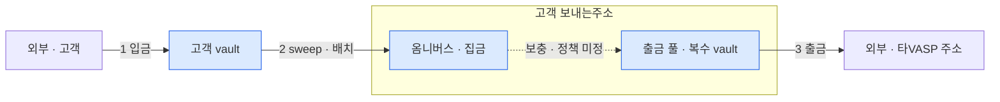
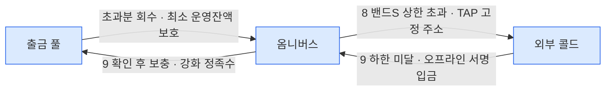

시나리오마다 자산이 어느 vault 에서 어느 vault 로 움직이는지를 한 장에 모은다. 각 이동의 상세는 원천 문서에 있고, 이 문서는 결론만 조립한다 — 원천이 바뀌면 여기도 같이 고친다.

## 책임과 용어

이 문서에서 **CORE는 DAW-CORE**다. 설계자 [원장 v0.1.2](../원장_v0.1.2.pdf)의 DAWBC 범위는 BCM이 담당한다.
DAW-CORE는 고객·회사 소유권 원장과 업무상 잔액 인정을 관리하고, BCM은 관리 주소의 온체인 수량·거래 상태·이동 증적을 관리한다.
PDF의 all sync는 변경 예정 설명이며 전 구간 동기 처리를 요구하지 않는다.

## 주소와 vault 매핑

**2026-09-08 후속 정정**: 사용자가 설명한 설계자 의도는 **고객 받는주소 → 핫 출금 풀 직접 Sweep**이다. 집금과 출금을 같은 풀에서 수행하며 별도 중간 집금 vault를 필수로 두지 않는다. 앞서 분리안을 최종 매핑으로 표시한 것은 AI의 성급한 확정이었다.
아래 표와 이동 그림은 **현재 분리 설계·구현의 대조 기준**으로 남긴다. 직접 집금으로 전환할 때 목적지 풀 선정·고정 목적지 컨트랙트 연결·잔고 예약·밴드S 경로를 함께 설계해야 한다([PLAN #51](../../PLAN.md)).

| 자산 구분 | PDF 주소 용도 | 물리 보관처 | 물리 역할 | 매핑 원칙 |
|---|---|---|---|---|
| 고객자산 | 받는주소 | 고객 vault | 입금 수신·고객 식별 | 고객별 수신 주소에서 옴니버스로 Sweep |
| 고객자산 | 보내는주소 | 옴니버스 vault | Sweep 집금·공동 재고 보관 | 고객 보내는주소의 집금 역할. 출금 풀과 별도 vault |
| 고객자산 | 보내는주소 | 출금 풀 vault | 고객 출금 실행 | 복수 vault round-robin, 밴드C 재고 대상. 옴니버스에서 보충 |
| 고객자산 | 콜드월렛 | 고객 전용 외부 콜드 주소 | 고객자산 콜드 보관 | 첫 출시는 외부 오프라인 서명. Fireblocks vault 연결을 필수로 하지 않음 |
| 회사자산 | 고객거래주소 | 회사 고객거래용 vault | 고객과의 거래·정산, 발행·소각 관련 자산 이동 | 고객자산 vault 및 회사 외부입출금용 vault와 구분 |
| 회사자산 | 외부입출금주소 | 회사 외부입출금용 vault | 외부 상대방과의 입출금 | 회사 고객거래용 vault와 구분 |
| 회사자산 | 콜드월렛 | 회사 전용 콜드 보관처의 주소 | 회사자산 콜드 보관 | 고객 콜드와 구분. 외부 주소도 등록 가능하며 제품·서명 연동 방식은 별도 확정 |

회사 '고객거래주소'는 **고객과 거래하는 회사자산 주소**다. 고객 소유 주소 또는 옴니버스를 가리키지 않는다.
발행·소각 용도 표기는 업무상 매핑이며 해당 API나 컨트랙트 기능의 구현 완료를 뜻하지 않는다.
고객 받는주소는 장기 보관처가 아니지만 Sweep 전 온체인 잔고가 있으므로 잔고 관찰 대상이다.
고객 콜드의 vendor cold workspace 전환은 기존과 같이 실측 후 검토할 후보이며 현재 외부 콜드 매핑을 대체하지 않는다.

### 식별과 관계

- **자산 구분**(회사/고객), **업무 용도**(받는/보내는/콜드/고객거래/외부입출금), **물리 역할**(수신/집금/출금 등)을 분리한다. 현행 조합은 위 표와 같으며, 직접 집금안의 고객 보내는주소는 집금과 출금 역할을 함께 갖는다.
- `CUSTOMER/SYSTEM`은 DAW-CORE 참조 ID의 이름 공간이다. `SYSTEM`에 고객 공동 vault와 회사 vault가 모두 들어갈 수 있으므로 자산 구분이나 용도 대신 쓰지 않는다.
- 업무 용도 하나에 여러 vault·주소가 대응할 수 있다. 고객 보내는주소 합계에는 옴니버스와 모든 출금 풀의 해당 자산 주소를 한 번씩 포함한다.
- 현재 vendor 매핑은 `(계정유형, ref) → BCM accountId → vaultId`, 발급 주소는 `(accountId, network, symbol) → address`다. 같은 역할의 vault가 여러 개면 별도 계정으로 식별한다.
- Dfns 후속 매핑은 `BCM accountId → (origin, network)별 wallet → 자산 수신 주소`로 분리한다([연결 계약](13-dfns-contracts.md#계정주소-api의-후속-연결-계약)). 계정 모델·지갑 원장·생성/회수 유스케이스·공개 계정/주소 API 연결까지 구현했다 — 운영 설정이 EVM 계정 모델로 확인한 네트워크에서 지갑 주소를 `(accountId, network, symbol)` 주소로 저장한다. 발급 시점 자산 locator 컬럼과 tag/memo 체인은 후속이며 기존 vault 매핑·업무 용도·직접 집금 과제는 바꾸지 않는다.
- 잔고는 `(network, asset, address)` 단위다. 주소 문자열이 같아도 네트워크가 다르면 별개이며, 같은 주소가 여러 자산을 보유할 수 있다. vault 잔액을 모든 주소에 복제해 합산하지 않는다.
- 같은 주소를 회사·고객에 중복 귀속하지 않는다. 직접 집금안처럼 한 주소가 집금·출금 역할을 함께 맡아도 잔고는 역할별로 중복 합산하지 않는다. 기존 발급 이력과 외부 콜드 주소를 함께 식별하는 DB 관계는 [주소별 온체인 잔고 설계](03-bcm-db.md#주소별-온체인-잔고--구현-대상-설계)를 따른다.
- Sweep 제출용 operator 계정은 자산 보관처인 옴니버스와 별개다. 위 업무 주소 표를 근거로 operator를 고객 보내는주소로 자동 분류하지 않는다. 운영 계정의 native 수수료 자산 구분은 별도로 관리한다.

## 그림 — 네 흐름으로 나눠 본다

한 장에 다 그리면 선이 겹쳐서, 성격이 다른 네 흐름으로 나눈다. 점선이 미정이다 — 아래 "미정·검토 중" 참조.

**고객 자금의 큰 흐름** — 들어와서 나가기까지 (1 → 2 → ? → 3)

**출금 풀 재고와 교환** — 옴니버스가 허브 (6 · 보충·회수)

**고객 콜드 왕복** — 외부 출구는 옴니버스 하나 (7 ~ 9)

콜드교환(7)의 두 다리도 같은 경로다 — 옴니버스 ↔ 외부 콜드. 밴드S 충전(9)은 옴니버스 입금을 확인한 뒤 **강화 정족수 승인을 거쳐 출금 풀 보충**으로 내려간다. treasury egress vault 는 1차 설계에서 제외했다 — 외부 전송 권한을 별도 vault 로 격리할 필요가 생기면 재검토([sweep](06-sweep.md)).

**델타 정산 — 자산 경계를 넘는 이동** (4 · 5)

## 현행 분리 구조의 이동

| # | 시나리오 | 이동 | 누가 내나 | 감지 계열 | 상세 |
|---|---|---|---|---|---|
| 1 | 고객 입금 | 외부 → 고객 vault | 고객 | `DEPOSIT` → deposit-events | [흐름](02-bcm-flow.md) |
| 2 | sweep — 입금 모으기 | 고객 vault → 옴니버스 | DAW-CORE가 완료 처리한 FINALIZED eventId로 batch 요청, 매니저가 approve + transferFrom 실행 · gasless | `SWEEP` → sweep-events (항목별 상태·결과) | [sweep](06-sweep.md) |
| 3 | 고객 출금 — 타VASP 송금 | 출금 풀 → 외부 주소 | DAW-CORE 가 매니저 API 로 제출 — gasless · 컴플라이언스 게이트 통과 후 | `WITHDRAWAL` → withdrawal-events | [흐름](02-bcm-flow.md) |
| 4 | 델타 정산 — 온램프 대응 | 회사 고객거래용 vault → 옴니버스 | 델타 배치 — 원장 선반영 후 사후 이동 | `INTERNAL` → internal-events | 외부 업무 설계: 램프·스왑 (`10-ramp-swap.md`) |
| 5 | 델타 정산 — 오프램프 대응 | 옴니버스 → 회사 고객거래용 vault | 〃 | 〃 | 〃 |
| 6 | 브릿지교환 | **옴니버스 ↔ 회사 고객거래용 vault** — 남는 BC자산을 주고 부족한 BC자산을 받는 맞교환 (2026-08-18 결정 — 교환 당사자는 옴니버스) | 운영 | 두 다리를 짝으로 기록 | 외부 업무 설계: 브릿지 (`01-problem.md`) |
| 7 | 콜드교환 | **옴니버스 ↔ 외부 콜드** — 맞교환. 콜드 쪽은 서명·전파 분리, 진행 중 그 콜드월렛의 다른 출금 잠금 | 운영 | — | 〃 |
| 8 | 밴드S — 핫 → 콜드 | 출금 풀 초과분을 옴니버스로 회수 → **옴니버스 → 외부 콜드** (TAP 고정 주소) — 상한 초과 시 전 자산 동일 비율. 단계마다 FINALIZED 후 진행, 진행분은 예약 | 판정 코어 · 실행 매니저 | — | [sweep](06-sweep.md) |
| 9 | 밴드S — 콜드 → 핫 | 외부 콜드 → 옴니버스 → **보충으로 출금 풀에** — 하한 미달 시. 입금 FINALIZED 확인 후 보충은 강화 정족수 | 콜드 오프라인 서명. 자동화하지 않음 | — | 〃 |

## 미정·검토 중

위 매핑은 현행 분리 구조를 설명한다. 직접 집금안의 전환 계약은 별도 검토 중이다. 아래 흐름의 세부 정책 및 정산 TID별 완료·실패 처리는 별도 확정 대상이다.

| 이동 | 상태 |
|---|---|
| **옴니버스 ↔ 출금 풀** (보충·회수) | 정책 미정 — 밴드S 는 안 바뀌고 **보충은 밴드C 를 늘리고 회수는 줄인다**. 트리거는 밴드C 하한·상한인데 복수 풀 배분·가스·이벤트가 안 정해졌다. [sweep](06-sweep.md) · 외부 검토자료: `04-usdc-gateway-fit.md` |
| 회사 콜드 입출금 | 회사 전용 콜드 주소를 잔고 관리에 포함한다. 보관 제품·서명 연동·핫 측 상대 vault·실행 정책은 별도 확정하며 고객 밴드S 흐름을 그대로 적용하지 않는다 |
| Gateway 예치·인출 | **도입 미정** — 도입 시 회사자산 vault ↔ Gateway 잔액. 인출은 최종 목적지로 바로 — 브릿지교환 지급이면 옴니버스. 고객자산 Gateway 는 옴니버스 복귀가 우선안(같은 vault 인출 지원 확인 전까지 출금 풀 직행이 대안). 외부 검토자료: `07-usdc-gateway-operating.md` |

## 자산 경계로 보면

| 구분 | 이동 | 성질 |
|---|---|---|
| 고객자산 안 | 1 · 2 · 3 · 7 · 8 · 9 · 옴니버스↔출금 풀 보충·회수 | 경계를 안 넘는다. 밴드S 는 이 안의 핫·콜드 비율 |
| **경계를 넘는다** | 4 · 5 델타 — 그래서 내부 이체 중 유일하게 `INTERNAL` 로 큐에 실린다 · 6 교환 — 맞교환이라 두 다리를 짝으로 기록 | 대가 없는 단방향 이동은 없다 |
| 회사자산 안 | 도입 시 Gateway 예치 | 규제 산식 밖 |
