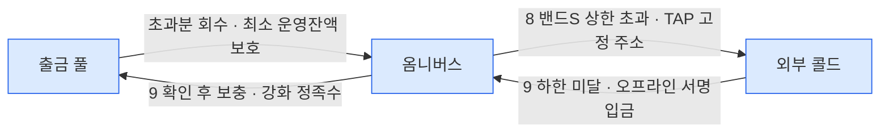

시나리오마다 자산이 어느 vault 에서 어느 vault 로 움직이는지를 한 장에 모은다. 각 이동의 상세는 원천 문서에 있고, 이 문서는 결론만 조립한다 — 원천이 바뀌면 여기도 같이 고친다.

보관처는 다섯이다.

| 보관처 | 역할 | 자산 경계 |
|---|---|---|
| 고객 vault | 입금 식별·수신 전용 — 보관처 아님 | 고객자산 |
| 옴니버스 vault | sweep 이 모이는 중앙 보관처 | 고객자산 |
| 출금 풀 vault | 출금 전용 — 복수 vault round-robin. 밴드C 재고 대상 | 고객자산 |
| 회사자산 vault | 수탁 운영용 토큰 재고 — 용도별 매핑(코드값 미정) | 회사자산 |
| 콜드월렛 | 첫 출시는 **외부 콜드** (오프라인 서명). 벤더 cold workspace 는 실측 후 후보 | 고객자산 |

## 그림 — 셋으로 나눠 본다

한 장에 다 그리면 선이 겹쳐서, 성격이 다른 네 흐름으로 나눈다. 점선이 미정이다 — 아래 "미정·검토 중" 참조.

**고객 자금의 큰 흐름** — 들어와서 나가기까지 (1 → 2 → ? → 3)

**출금 풀 재고와 교환** — 옴니버스가 허브 (6 · 보충·회수)

**콜드 왕복** — 외부 출구는 옴니버스 하나 (7 ~ 9)

콜드교환(7)의 두 다리도 같은 경로다 — 옴니버스 ↔ 외부 콜드. 밴드S 충전(9)은 옴니버스 입금을 확인한 뒤 **강화 정족수 승인을 거쳐 출금 풀 보충**으로 내려간다. treasury egress vault 는 1차 설계에서 제외했다 — 외부 전송 권한을 별도 vault 로 격리할 필요가 생기면 재검토([sweep](06-sweep.md)).

**델타 정산 — 자산 경계를 넘는 이동** (4 · 5)

## 확정된 이동

| # | 시나리오 | 이동 | 누가 내나 | 감지 계열 | 상세 |
|---|---|---|---|---|---|
| 1 | 고객 입금 | 외부 → 고객 vault | 고객 | `DEPOSIT` → deposit-events | [흐름](02-bcm-flow.md) |
| 2 | sweep — 입금 모으기 | 고객 vault → 옴니버스 | 매니저 — approve + transferFrom 배치 · gasless | `SWEEP` — 큐에 싣지 않음 | [sweep](06-sweep.md) |
| 3 | 고객 출금 — 타VASP 송금 | 출금 풀 → 외부 주소 | DAW-CORE 가 매니저 API 로 제출 — gasless · 컴플라이언스 게이트 통과 후 | `WITHDRAWAL` → withdrawal-events | [흐름](02-bcm-flow.md) |
| 4 | 델타 정산 — 온램프 대응 | 회사자산 vault → 옴니버스 | 델타 배치 — 원장 선반영 후 사후 이동 | `INTERNAL` → internal-events | [램프·스왑](../../블록체인매니저/설계/10-ramp-swap.md) |
| 5 | 델타 정산 — 오프램프 대응 | 옴니버스 → 회사자산 vault | 〃 | 〃 | 〃 |
| 6 | 브릿지교환 | **옴니버스 ↔ 회사자산 vault** — 남는 BC자산을 주고 부족한 BC자산을 받는 맞교환 (2026-08-18 결정 — 교환 당사자는 옴니버스) | 운영 | 두 다리를 짝으로 기록 | [브릿지](../../블록체인매니저/브릿지/01-problem.md) |
| 7 | 콜드교환 | **옴니버스 ↔ 외부 콜드** — 맞교환. 콜드 쪽은 서명·전파 분리, 진행 중 그 콜드월렛의 다른 출금 잠금 | 운영 | — | 〃 |
| 8 | 밴드S — 핫 → 콜드 | 출금 풀 초과분을 옴니버스로 회수 → **옴니버스 → 외부 콜드** (TAP 고정 주소) — 상한 초과 시 전 자산 동일 비율. 단계마다 FINALIZED 후 진행, 진행분은 예약 | 판정 코어 · 실행 매니저 | — | [sweep](06-sweep.md) |
| 9 | 밴드S — 콜드 → 핫 | 외부 콜드 → 옴니버스 → **보충으로 출금 풀에** — 하한 미달 시. 입금 FINALIZED 확인 후 보충은 강화 정족수 | 콜드 오프라인 서명. 자동화하지 않음 | — | 〃 |

## 미정·검토 중

| 이동 | 상태 |
|---|---|
| **옴니버스 ↔ 출금 풀** (보충·회수) | 정책 미정 — 밴드S 는 안 바뀌고 **보충은 밴드C 를 늘리고 회수는 줄인다**. 트리거는 밴드C 하한·상한인데 복수 풀 배분·가스·이벤트가 안 정해졌다. [sweep](06-sweep.md) · [기능검토](../기능검토/04-usdc-gateway-fit.md) |
| Gateway 예치·인출 | **도입 미정** — 도입 시 회사자산 vault ↔ Gateway 잔액. 인출은 최종 목적지로 바로 — 브릿지교환 지급이면 옴니버스. 고객자산 Gateway 는 옴니버스 복귀가 우선안(같은 vault 인출 지원 확인 전까지 출금 풀 직행이 대안). [기능검토](../기능검토/07-usdc-gateway-operating.md) |

## 자산 경계로 보면

| 구분 | 이동 | 성질 |
|---|---|---|
| 고객자산 안 | 1 · 2 · 3 · 7 · 8 · 9 · 옴니버스↔출금 풀 보충·회수 | 경계를 안 넘는다. 밴드S 는 이 안의 핫·콜드 비율 |
| **경계를 넘는다** | 4 · 5 델타 — 그래서 내부 이체 중 유일하게 `INTERNAL` 로 큐에 실린다 · 6 교환 — 맞교환이라 두 다리를 짝으로 기록 | 대가 없는 단방향 이동은 없다 |
| 회사자산 안 | 도입 시 Gateway 예치 | 규제 산식 밖 |
