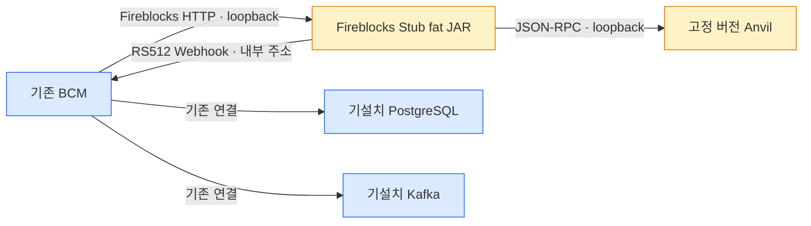

Fireblocks 사용 가능 여부와 무관하게 BCM의 벤더 HTTP 계약과 실제 EVM 결과를 반복 검증하는 전용 환경이다.
Stub이 Fireblocks 전체를 흉내 낸다고 주장하지 않고, **실제 체인 결과·벤더 시뮬레이션·실 Fireblocks 전용 영역을 분리**한다.

## 목적과 비목적

이 환경이 검증하는 것은 다음 두 경계를 한 흐름으로 잇는 일이다.

1. 기존 BCM `FireblocksClient`가 사용하는 HTTP 요청·응답, 상태 전이, 웹훅 서명·복구 계약
2. 실제 EVM의 잔액·nonce·gas·receipt·event log와 ERC-20 `approve`·`transferFrom`·batch sweep 결과

다음은 목적이 아니다.

- Fireblocks MPC, DKG, API Co-signer, TAP 평가 엔진을 복제하거나 보안 등가성을 주장하는 일
- 실제 Universal Gasless Relay의 운영·과금·실패 동작을 Stub 결과만으로 보증하는 일
- Fireblocks Sandbox/Testnet 계약 검사를 로컬 Stub으로 대체하는 일
- 네이티브 BandChain이나 비EVM 체인을 1차 범위에 포함하는 일
- BCM 운영 DB·Kafka 데이터를 로컬 체인 `reset`이 함께 지우는 일

운영 Domain Port나 프로덕션 코드에 Stub 전용 분기를 추가하지 않는다. 기존 클라이언트의 Base URL과 EVM RPC 등 외부 설정만 바꾼다.

## 실행 모드 — 세 조합만 허용

벤더 모드와 체인 모드는 프로세스 시작 때 고정한다. Admin에서 실행 중 전환하지 않는다.

| 벤더 모드 | 체인 모드 | 허용 | 용도 |
|---|---|---:|---|
| `STUB` | `LOCAL` | O | 개발자 PC·CI·폐쇄망 일반 Linux 서버의 결정적 통합 테스트 |
| `FIREBLOCKS` | `TESTNET` | O | 실제 Fireblocks Sandbox/Testnet 계약·통합 검사 |
| `FIREBLOCKS` | `MAINNET` | O | 운영 배포. 자동 테스트 기본 대상이 아님 |
| 그 밖의 모든 조합 | - | X | 시작 검증에서 거부. 특히 `FIREBLOCKS+LOCAL`, `STUB+MAINNET` 금지 |

`STUB+LOCAL`은 실제 Fireblocks Secret이나 외부 RPC URL이 들어오면 시작을 거부한다. Stub·Anvil·bootstrap은 loopback 또는 같은 서버의 내부 주소에만 바인딩하고 외부로 공개하지 않는다.

## BCM이 실제 사용하는 Fireblocks API 계약

지원 범위는 현재 BCM 코드가 호출하거나 파싱하는 항목까지다. 새로운 Fireblocks 기능이 필요해지면 이 표와 계약 테스트를 먼저 바꾼다.

### Vault·자산 카탈로그·잔액

| 기능 | 메서드·경로 | BCM이 보내는 값 | BCM이 읽는 값 | Stub |
|---|---|---|---|---|
| Vault 생성 | `POST /v1/vault/accounts` | `name`, `Idempotency-Key` | `id`, `name` | 상태형 구현 |
| Vault wallet·주소 생성 | `POST /v1/vault/accounts/{vaultId}/{assetId}` | `Idempotency-Key`, 본문 없음 | `address`, 선택 `tag` | 결정적 EVM 주소 할당 |
| Vault 자산 잔액 | `GET /v1/vault/accounts/{vaultId}/{assetId}` | 경로 식별자 | `total`, `available`, `pending`, `frozen`, `lockedAmount` | Anvil 상태를 기준으로 산출하되 Fireblocks 잔액 구분은 시뮬레이션 |
| 블록체인 목록 | `GET /v1/blockchains` | `pageSize=500`, 선택 `pageCursor` | 필수 `data[].id/displayName`; 선택 `metadata.deprecated`, `onchain.protocol/chainId/test/signingAlgo`, `next` | 로컬 EVM 카탈로그 |
| 자산 목록 | `GET /v1/assets` | `blockchainId`, `pageSize=1000`, 선택 `symbol/pageCursor` | 필수 `id/blockchainId/displaySymbol`; 선택 `displayName`, `decimals` 또는 `onchain.decimals`, `assetClass`, `onchain.address`, `next` | native·테스트 ERC-20 카탈로그 |

### 거래 제출·조회

두 제출 오퍼레이션은 같은 `POST /v1/transactions`를 사용한다.

| 오퍼레이션 | BCM 요청의 필수 모양 | 선택 값 | Stub 실행 |
|---|---|---|---|
| `TRANSFER` | `operation=TRANSFER`, `externalTxId`, `assetId`, source `VAULT_ACCOUNT`, destination `ONE_TIME_ADDRESS`·`VAULT_ACCOUNT`·`EXTERNAL_WALLET`, 십진 문자열 `amount`, `useGasless` | `note`, `travelRuleMessage`, `replaceTxByHash`, `feeLevel=LOW|MEDIUM|HIGH` | 결정적 EVM 키로 raw transaction을 서명해 Anvil 제출 |
| `CONTRACT_CALL` | `operation=CONTRACT_CALL`, `externalTxId`, 네트워크별 native gas `assetId`, source vault, destination contract `ONE_TIME_ADDRESS`, `amount="0"`, `useGasless`, `extraParameters.contractCallData` | 현재 BCM은 추가 선택 필드를 보내지 않음 | calldata를 그대로 사용해 Anvil contract call 제출 |

성공 응답에서 BCM은 `id`를 필수로 읽는다. `externalTxId`는 멱등·응답 유실 회수 키다. 같은 키와 같은 요청은 같은 벤더 거래를 반환하고, 같은 키에 다른 자금 이동 내용을 허용하지 않는다.

| 기능 | 메서드·경로 | 요청·필터 | BCM이 읽는 응답 |
|---|---|---|---|
| 거래 단건 | `GET /v1/transactions/{txId}` | tx id | 아래 거래 공통 필드. 404는 없음으로 처리 |
| external id 조회 | `GET /v1/transactions/external_tx_id/{externalTxId}` | external id | 거래 공통 필드 또는 404 |
| 거래 목록 | `GET /v1/transactions` | `after`, `before`, 선택 `status`, `sort=ASC|DESC`, `limit=1..500`, 선택 `next`, vault 범위면 `sourceType=VAULT_ACCOUNT&sourceId=...` | 거래 배열, `next-page` 응답 헤더. 요청 vault 밖 거래가 섞이면 BCM이 오류로 거부 |

거래 공통 필드 계약은 다음과 같다.

| 구분 | 필드 |
|---|---|
| 필수 | `id`, `assetId`, `status`, `source.type`, `destination.type`, `amountInfo.amount`, `createdAt`, `lastUpdated` |
| 선택 peer 식별자 | `source.id`, `destination.id` — 요청 vault 범위 검증처럼 해당 흐름이 요구할 때 사용 |
| 상태 판단 | `subStatus`, `numOfConfirmations` — 확인 수가 없으면 조회 응답에서는 0으로 취급 |
| 체인 결과 | `txHash`, `sourceAddress`, `destinationAddress` |
| 회수·귀속 | `externalTxId`, `extraParameters.contractCallData` |
| batch 대사 | `networkRecords[].type/source/destination/destinationAddress/txHash/assetId/netAmount/isDropped` |

Webhook 판단 워커는 여기에 더해 입금에서 `sourceAddress`·`destinationAddress`를 요구한다. 체인에 오르기 전 vault 발신 알림의 `destinationAddress`는 비어 있을 수 있다.

### 수수료·Webhook 운영

| 기능 | 메서드·경로 | BCM 계약 | Stub |
|---|---|---|---|
| 네트워크 수수료 견적 | `GET /v1/estimate_network_fee?assetId=...` | `low`, `medium`, `high` 각각에서 `feePerByte/gasPrice/networkFee/baseFee/priorityFee` 중 하나 이상 | 결정적 시뮬레이션 값. 필요하면 Anvil base fee를 입력으로 쓰되 실제 Fireblocks 견적과 동일하다고 보지 않음 |
| Webhook 조회 | `GET /v1/webhooks/{id}` | `id`, `status=ENABLED|DISABLED|SUSPENDED`, `events` | 상태형 구현 |
| Webhook 활성화 | `PATCH /v1/webhooks/{id}` | 요청 `enabled=true`, 같은 조회 응답 | 상태 변경 |
| 실패 알림 재전송 | `POST /v1/webhooks/{id}/notifications/resend_failed` | 빈 객체, 응답 `total` | 실패 큐 재전송과 건수 반환 |

### Fireblocks API 요청 인증

모든 BCM→Fireblocks 요청에는 `X-API-Key`와 `Authorization: Bearer <JWT>`가 실린다. JWT는 RS256이며 BCM 구현이 사용하는 claim은 `uri`, 매 요청 고유 `nonce`, `iat`, `exp`, `sub`, 원문 body의 SHA-256 `bodyHash`다.

- 기본 `STUB+LOCAL` 경로는 API key·Bearer 존재, JWT 3-part와 필수 claim·요청 URI/body 형태를 검사한다. 로컬 기능 시나리오가 인증 구현 세부에 종속되지 않게 한다.
- 별도의 작은 인증 계약 테스트는 대응 공개키로 RS256 서명, `sub`, `uri`, `nonce` 재사용, `iat/exp`, `bodyHash` 불일치를 엄격히 검사한다.
- 실제 Fireblocks 계약 검사는 공식 서버가 최종 판정한다. Stub 통과는 실벤더 인증 호환성의 증명이 아니다.

근거: [Signing a request — JWT structure](https://developers.fireblocks.com/reference/signing-a-request-jwt-structure).

## 거래 상태와 Webhook 계약

Stub은 Anvil 결과를 관찰해 Fireblocks 원어 상태를 만들고, BCM은 이를 공통 `TxStatus`로 번역한다.

| Fireblocks 원어 | BCM 상태 | 로컬 발생 기준 |
|---|---|---|
| `SUBMITTED`, `PENDING_SIGNATURE`, `QUEUED`, `BROADCASTING` | `SUBMITTED` | 접수·서명·전파 대기 상태를 시뮬레이션 |
| `CONFIRMING` | `CONFIRMED` | Anvil receipt가 생겼고 finality 임계 전 |
| `COMPLETED` | 확인 수가 정책 임계 이상이면 `FINALIZED`, 아니면 `CONFIRMED` | receipt와 블록 진행을 실제 관찰 |
| `REJECTED`, `BLOCKED` | `REJECTED` | 주입한 벤더 거부 결과. TAP 자체를 평가한 결과가 아님 |
| `FAILED` | `FAILED` | RPC 실패·revert·drop 또는 주입한 벤더 실패 |

`AUTO_FREEZE`, `FROZEN_MANUALLY`, `REJECTED_AML_SCREENING` subStatus는 raw status보다 우선해 `REJECTED`로 번역한다. 이 값을 주입해 BCM 동결 처리는 검증할 수 있지만 실제 Fireblocks 스크리닝·TAP 정책을 검증하는 것은 아니다.

Stub Webhook은 기존 BCM 수신 경로를 그대로 지난다.

- 헤더: `Fireblocks-Webhook-Signature`
- 서명: Stub 전용 RSA 키의 RS512 detached JWS, `kid`로 Stub JWKS 공개키 선택, 수신 원문 byte 서명
- 지원 이벤트: `transaction.created`, `transaction.status.updated`, `transaction.approval_status.updated`, `transaction.network_records.processing_completed`
- 최상위 필수 값: `id`, `eventType`; `data.id`는 알림의 vendor transaction id
- 판단 워커 필수 값: `data.id`, `assetId`, `source.type`, `amountInfo.amount`, `status`, `numOfConfirmations`, `createdAt`
- 중복·역순·유실·지연, 잘못된 서명, 낯선 `kid`, 재전송은 실패 시나리오에서 제어할 수 있어야 한다.

Webhook 재시도 간격과 실제 벤더 스케줄러를 완전히 복제하지 않는다. Stub은 결정적 가상 시각 또는 명시적 trigger로 재현하며, BCM의 수신·중복 제거·복구 결과를 검증한다. 실제 재시도 정책은 [공식 Responses & retries](https://developers.fireblocks.com/reference/webhooks-gettingstarted-responsesretries)와 실벤더 계약 검사에서 확인한다.

## 오류·응답 유실 계약

Stub은 정상 응답 외에 다음을 endpoint·externalTxId·호출 횟수 기준으로 결정적으로 주입한다.

| 주입 | BCM에서 확인할 계약 |
|---|---|
| `400` | 거래 제출은 즉시 중복/검증 오류로 단정하지 않고 `externalTxId` 조회로 소유권 회수 |
| `401`, `403` | 인증·권한 오류, 자동 재시도하지 않음 |
| `404` | 거래 단건·external id 조회에서 없음 반환, 그 밖의 endpoint는 오류 |
| `409`, `422` | 제출의 확정적 거절로 처리 |
| `429` + `Retry-After` | BCM 클라이언트의 유일한 HTTP 자동 재시도 대상. 상한 내 backoff |
| `5xx`, 연결 timeout | 결과 미확정 오류와 재대사 경계 검증 |
| 체인 제출 성공 뒤 HTTP 응답 유실 | 재요청 시 `externalTxId` 조회로 같은 tx를 회수하고 이중 제출하지 않음 |
| 장기 pending·Webhook 유실 | 단건·목록 대사와 운영 경보·복구 흐름 검증 |

Stub의 오류 body는 BCM이 소비하는 최소 형식만 제공한다. Fireblocks 전체 오류 코드와 문구를 복제하지 않으며, 실제 목록은 [공식 API error codes](https://developers.fireblocks.com/reference/api-error-codes)에서 별도 확인한다.

## 실제·시뮬레이션·미지원 경계

| 분류 | 로컬에서 검증하는 것 | 해석 |
|---|---|---|
| `REAL_LOCAL` | Anvil 블록·receipt·log, EVM 주소·잔액·nonce·gas, native/ERC-20 전송, allowance, contract call, revert, batch sweep 결과 | 실제 EVM 실행 결과. 선택한 Anvil 버전·fork 규칙의 범위 |
| `SIMULATED_VENDOR` | Vault 객체·카탈로그, Fireblocks transaction id와 상태 머신, HTTP 오류·429, Webhook 구독·서명·재전송, `networkRecords`, BLOCKED/REJECTED, 수수료 응답 | BCM 벤더 어댑터와 복구 계약 검증용. Fireblocks 내부 구현의 증거가 아님 |
| `REAL_FIREBLOCKS_ONLY` | MPC/DKG, API Co-signer, TAP 정책 평가, 실제 custodial signing, 실제 Webhook 스케줄·rate limit, Fireblocks 내부 이체 semantics, 실제 Universal Gasless Relay·청구 | 사용자 승인 아래 Sandbox/Testnet 또는 제한된 운영 계약 검사로만 확인 |
| `UNSUPPORTED` | 네이티브 BandChain, 비EVM 일반화, Fireblocks cold workspace, Policy Editor/TAP Admin API, 실 Travel Rule·screening | 별도 설계·구현 없이는 테스트하지 않음 |

EVM 네트워크의 BAND ERC-20은 일반 ERC-20으로 포함할 수 있다. 네이티브 BandChain 서명·수수료·finality는 이 환경의 범위가 아니다.

Universal Gasless는 Anvil Prague와 사용 라이브러리의 EIP-7702 type-4 지원을 먼저 검증한다. 로컬에서 확인하는 것은 delegation·fee payer·nonce/replay/deadline·revert 같은 프로토콜 결과와 BCM 관찰값이다. Fireblocks MPC·TAP·Relay가 같은 방식으로 작동한다는 결론은 내리지 않으며, 확정된 `approve + transferFrom` batch sweep을 임의로 EIP-7702 직접 pull로 바꾸지 않는다.

## 배치와 배포

### 개발자 PC·CI

개발자·CI는 Anvil과 Stub을 테스트 수명에 맞춰 기동하고, 전체 BCM E2E일 때만 Testcontainers의 PostgreSQL·Kafka를 함께 사용한다. 작은 Stub 계약 테스트는 BCM DB·Kafka 없이 실행할 수 있어야 한다.

### 폐쇄망 일반 Linux 서버

원격 서버는 Docker와 인터넷 접속을 요구하지 않는다.

폐쇄망 반입물은 연결 환경에서 미리 빌드·검사한 버전 고정 `tar.gz`다. CPU 아키텍처별 Anvil, 전용 JRE·Stub JAR, chain bootstrap, contract artifact·배포 manifest, 설정 예시, systemd unit, start/stop/reset/health-check, checksum·license 정보를 포함한다. 설치·기동 중 외부 다운로드가 발생하면 실패다.

systemd 기동 순서는 Anvil health → chain bootstrap/manifest 검증 → Stub health다. BCM은 Stub과 JWKS가 준비된 뒤 연결한다. PostgreSQL·Kafka는 패키지에 포함하지 않고 설치·초기화·reset하지 않는다.

## 키와 신뢰 경계

세 키는 목적·알고리즘·보유 프로세스가 다르며 재사용하지 않는다.

| 키 | 알고리즘·용도 | private 보유 | public·설정 |
|---|---|---|---|
| Fireblocks API 요청 키 | RSA, BCM 요청 JWT RS256 | BCM. 로컬에서는 테스트 전용 키만 | Stub strict-auth profile에 public key |
| Webhook 서명 키 | RSA, detached JWS RS512 | Stub만 | BCM은 Stub JWKS URL과 `kid`만 사용 |
| EVM 거래 키 | secp256k1, local raw transaction | Stub/Anvil 테스트 런타임만 | seed manifest에는 주소·체인 결과만 노출 |

- private key·실 Secret은 Git·배포 설정 예시에 넣지 않는다. 설치 또는 테스트 run이 권한 제한된 런타임 경로에 테스트 키를 만들고, CI 키는 실행 종료와 함께 폐기한다.
- `STUB+LOCAL`은 허용된 테스트 key fingerprint/표식을 확인하고 실 Fireblocks API key·private key, 외부 RPC, mainnet chain id를 fail-closed한다.
- 테스트 EVM 계정은 설치·run 때 런타임 경로에 생성하거나 주입한 테스트 전용 seed로 결정적으로 재현한다. seed 값은 Git·배포 예시에 저장하지 않고 reset 사이에만 보존하며, 운영 키·운영 주소를 입력으로 받지 않는다.
- Stub API·JWKS·제어 endpoint는 loopback/서버 내부 전용이다. 제어 endpoint를 BCM 업무망이나 외부 ingress에 공개하지 않는다.

## reset 소유권과 순서

`reset`은 **테스트 벤더·체인 환경만** 초기화한다.

| reset 대상 | 포함 | 제외 |
|---|---:|---:|
| Stub Vault·transaction·externalTxId 멱등 상태 | O | - |
| Stub Webhook queue·실패·재전송·오류 주입 상태 | O | - |
| Anvil snapshot, block/nonce, seed 잔액·ERC-20·contract 배포 | O | - |
| 기존 BCM PostgreSQL | - | X |
| 기존 Kafka topic·offset | - | X |
| 실 Fireblocks workspace·실 체인 | - | X |

안전한 순서는 BCM의 신규 제출·배치 작업 중지 → Stub 진행 중 작업 없음 확인 → Anvil snapshot 복원과 bootstrap manifest 검증 → Stub 상태 초기화·seed 재결합 → health check → BCM 작업 재개다. 활성 트래픽 중 reset은 허용하지 않는다. BCM DB에 남은 tx가 reset된 Stub 상태를 가리킬 수 있으므로, 전체 E2E 초기화는 실행별 전용 DB/topic·run id와 별도 BCM cleanup 절차가 소유한다.

같은 seed와 같은 시나리오 입력은 같은 vault/address/asset/contract와 같은 의도된 상태 전이 순서를 만들어야 한다. 블록 hash처럼 실행 시각에 영향을 받는 값은 동일성 기준에서 제외하고 manifest와 논리 결과를 비교한다.

## 실제 Fireblocks 계약 테스트 승인 경계

로컬 Stub과 별도로 `FIREBLOCKS+TESTNET` golden contract test를 둔다. 기본 실행·일반 CI·폐쇄망 패키지 smoke에서는 호출하지 않는다.

| 등급 | 예 | 기본 정책 |
|---|---|---|
| 읽기 전용 | 인증, blockchain/asset 목록, 기존 거래·Webhook 조회, fee 견적 | 사용자 명시 승인 + 허용 workspace/API user + Secret이 있을 때만 수동 실행 |
| 자원 생성 | 테스트 Vault·wallet 생성 | 실행마다 별도 승인. 이름 prefix·정리 책임·잔존 자원 확인 필수 |
| 자금·정책 영향 | 거래 제출, contract call, Webhook PATCH·실패 알림 재전송 | 작업별 승인. 테스트 자산·수수료·TAP·수신 endpoint·정리 계획을 실행 전에 제시 |
| Mainnet mutation | 실제 자산 이동·정책 또는 Webhook 변경 | 자동화 기본 범위에서 금지. 별도 운영 변경 승인 없이는 실행하지 않음 |

계약 테스트는 응답 전체를 고정하지 않고 BCM이 실제 소비하는 필수 필드·enum·경로·헤더만 대조한다. golden 자료는 Secret, JWT, 서명, 주소 외 민감정보를 제거한 뒤 보관한다. 실제 서버 오류·rate·Webhook 시간 특성은 측정 환경과 시각을 함께 기록한다.

이 승인 경계는 다음 두 사실을 고정한다.

1. **Stub 테스트 통과만으로 Fireblocks 호환 완료라고 판정하지 않는다.**
2. **실 Fireblocks 쓰기 계약 테스트는 사용자가 매번 범위와 비용·자금 영향을 보고 승인한다.**

## 완료 판정

- 이 문서의 API·필드·상태 표마다 BCM 소비 계약 테스트가 있다.
- `STUB+LOCAL`의 정상·실패·응답 유실·Webhook 복구가 실제 Anvil receipt/log와 BCM 원장 결과로 이어진다.
- 잘못된 실행 조합, 실 Secret, 외부 RPC, mainnet chain id가 로컬 모드에서 시작 전에 거부된다.
- 원격 tarball이 Docker·PostgreSQL·Kafka 번들·runtime 다운로드 없이 설치→기동→reset→재기동된다.
- reset 전후 기존 BCM PostgreSQL·Kafka가 변경되지 않음을 검증한다.
- `REAL_LOCAL`, `SIMULATED_VENDOR`, `REAL_FIREBLOCKS_ONLY`, `UNSUPPORTED`가 테스트 리포트에 표시된다.
- 실제 Fireblocks 계약 테스트는 위 승인 경계 밖에서 실행되지 않는다.

## 공식 계약 링크

- [Create a vault account](https://developers.fireblocks.com/api-reference/vaults/create-a-new-vault-account) · [Create a vault wallet](https://developers.fireblocks.com/api-reference/vaults/create-a-new-vault-wallet) · [Get vault asset balance](https://developers.fireblocks.com/api-reference/vaults/get-the-asset-balance-for-a-vault-account)
- [List blockchains](https://developers.fireblocks.com/api-reference/blockchains-%26-assets/list-blockchains) · [List assets](https://developers.fireblocks.com/api-reference/blockchains-%26-assets/list-assets)
- [Create a transaction](https://developers.fireblocks.com/api-reference/transactions/create-a-new-transaction) · [Get by external transaction id](https://developers.fireblocks.com/api-reference/transactions/get-a-specific-transaction-by-external-transaction-id)
- [Estimate network fee](https://developers.fireblocks.com/api-reference/transactions/estimate-the-required-fee-for-an-asset)
- [Get webhook](https://developers.fireblocks.com/api-reference/webhooks-v2/get-webhook-by-id) · [Update webhook](https://developers.fireblocks.com/reference/updatewebhook) · [Resend failed notifications](https://developers.fireblocks.com/api-reference/webhooks-v2/resend-failed-notifications)
- [Validate Webhook signatures](https://developers.fireblocks.com/reference/validating-webhooks) · [Webhook best practices](https://developers.fireblocks.com/reference/webhooks-best-practices)
