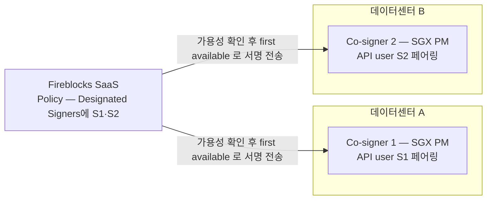

물리 장비(PM) 2대에 API Co-signer 를 설치해 active-active 로 운영하는 구성·설치·운영 절차를 정한다.
장비별 설치는 서로 독립이고, 2대를 묶는 것은 Fireblocks Policy 의 Designated Signers/Groups 설정 한 곳이다.

## 1. 구성 요약

- HA 방식은 **active-active** — 한 대가 죽거나 응답하지 못하면 나머지가 그대로 서명을 이어간다. active/standby 전환 절차가 따로 없다.
- **키 조각을 나눠 갖지 않는다.** 각 Co-signer 는 자기 API user 의 **독립된 MPC key share set** 을 가진다 — set 마다 1 share 는 그 Co-signer 에, 2 share 는 Fireblocks cloud 에 있고, 서명 장치 둘이 같은 set 을 공유하는 일은 없다. 두 set 은 모두 Owner 의 set 에서 파생돼 같은 워크스페이스 지갑에 추가되는 것이고(공식 문서), 담당자 확답으로는 같은 master seed 라 지갑 주소가 바뀌지 않는다. 어느 대가 서명해도 같은 vault 를 다룬다. 장비 간 키 복사는 없다. 키가 어디에 있고 어떻게 서명하는지는 [Fireblocks 키 관리](../기능검토/09-fireblocks-key-management.md)에 있다.
- Fireblocks 권장: Co-signer 들을 **서로 다른 데이터센터**에 배치. 온프레미스로만 구성할 때도 같은 원칙이다.
- 백업 복구는 DR 1순위가 아니다 — 공식 권장은 "추가 Co-signer 를 active-active 로 두고 장애 시 그걸 쓰는 것". 백업의 1차 용도는 장비 업데이트·교체 시 다운타임 최소화다.

## 2. 장비 요건 (온프레미스 SGX)

장비 신청서에 아래 스펙과 BIOS·네트워크 요건을 함께 넣는다. 2대 동일 스펙.

| 항목 | 요건 |
|---|---|
| CPU | Intel SGX 지원 프로세서, 최소 4 core |
| RAM | 최소 16GB |
| 스토리지 | 최소 128GB |
| SGX 메모리 | 최소 2GB EPC |
| OS | Ubuntu 22.04 또는 24.04 LTS + 최신 kernel + 최신 Intel microcode(BIOS 업데이트) |

BIOS 설정 — 설치 전에 인프라 팀에 요청해야 하는 항목:

- Intel SGX enable, DCAP(FLC) enable
- Hyper-threading disable, Intel SpeedStep disable, Onboard VGA disable

네트워크 — outbound allowlist (443, 5000):

- Fireblocks 도메인(연결된 SaaS 환경에 따라 다름 — EU/스위스 SaaS 는 별도 표)
- Intel SGX 드라이버 `download.01.org`, Co-signer 이미지 registry `registry.gitlab.com/customer-cosigner`, PyPI 계열

설치 후 `cpuid -1 | grep -i sgx` 로 SGX supported / SGX_LC true 확인.

원문: [Install SGX On-prem API Co-signer](https://developers.fireblocks.com/reference/install-api-cosigner-onprem)

## 3. 설치 절차 — 장비별로 독립 수행 (2회 반복)

| 단계 | 내용 | 승인 |
|---|---|---|
| 1. 환경 준비 | 2절 스펙·BIOS·allowlist 충족 확인 | - |
| 2. Co-signer 등록 | Console/API 에서 **Signer role API user 생성** → 그 API user 로 워크스페이스에 Co-signer 등록 | Owner + Admin Quorum |
| 3. 설치·페어링 | 설치 스크립트를 장비에서 실행, pairing token 으로 페어링 (**token 유효 1시간**) | Owner 가 모바일 앱에서 신규 MPC key share 승인 |

- pairing token 이 만료되면 HTTP 500 "Failed to pair device" — 새 token 으로 재페어링.
- Callback Handler 를 쓰는 경우 API user 단위로 설정한다. 한 Co-signer 안에서도 API user 마다 Callback Handler 를 다르게 두거나 없이 둘 수 있다.

원문: [API Co-signer Installation Flow](https://developers.fireblocks.com/reference/api-cosigner-installation-flow)

## 4. 2대를 HA 로 묶기 — Policy 설정

설치가 끝난 뒤 Policy 한 곳으로 병렬화한다.

전제: Co-signer 는 Policy 에 직접 등장하지 않는다. Policy 에 등장하는 것은 각 Co-signer 와 페어링된
**API user** 다 — 장비 1 ↔ API user S1, 장비 2 ↔ API user S2 처럼 1:1 로 묶여 있고,
어느 Co-signer 가 서명하는지는 rule 에 어느 API user 가 지정됐는지로 결정된다.

1. 각 Co-signer 에 Signer role API user 최소 1개 (3절에서 생성한 것).
2. Co-signer 가 자동 서명할 거래 범위를 다루는 Policy rule 에서 **Designated Signers / Groups** 필드에 두 API user 를 넣는다. 넣는 방법은 두 가지고 결과는 같다:
   - S1·S2 를 필드에 하나씩 직접 나열
   - S1+S2 를 미리 user group 으로 묶어 두고 필드에는 그 그룹 하나만 지정
3. 해당 rule 의 designated signer 는 **전원 API user 여야 한다** — Console 사용자와 혼합 금지.
4. Owner + Admin Quorum 이 Policy 변경을 승인하면 병렬 동작이 시작된다.

거래 처리 흐름 (승인 후 자동):

1. 거래 개시 (Console 또는 API)
2. Policy rule 매칭 (first-match)
3. rule 의 API user 들과 페어링된 **모든 Co-signer 에 가용성 확인 호출**
4. **first available** API user 의 Co-signer 로 서명 전송
5. Callback Handler 가 있으면 그 로직으로 sign/reject, 없으면 자동 서명

제약:

- **Source 가 exchange/fiat 계정인 rule 에는 다중 API user·그룹 지정 금지** — 매칭되는 거래가 자동 실패한다. 단일 API user 만 지정.
- first-match 원칙과 결합해 rule 을 설계한다. 원문에 포함식(vault source 만 Co-signer 서명)·배제식(exchange/fiat 만 제외) 두 예시가 있다.

원문: [Configuring Multiple API Co-signers in High Availability](https://developers.fireblocks.com/docs/multiple-cosigners-high-availability)

## 5. 운영 — 백업·장비 교체·업데이트

백업 대상은 파일 3개가 전부다:

| 경로 | 내용 |
|---|---|
| `/databases/cosigner/db/secrets.db` | Co-signer 비밀 DB. SGX enclave 에서 생성된 키로 암호화 |
| `/databases/cosigner/backup/` | DB 변경 시마다 자동 생성되는 timestamp 백업 (로컬에만 쌓임) |
| `/databases/cosigner/enclave/ra_loader_enclave.signed.so` | enclave loader |

- 자동 백업은 장비 로컬에만 남는다. **장비 밖 반출 절차(대상 저장소·주기·권한)는 우리가 정해야 한다.**
- 장비 교체: 새 SGX 장비 준비 → `secrets.db` + `ra_loader_enclave.signed.so` 를 같은 경로에 복사 → `./cosigner start`.
- 백업이 없으면: 연결된 API user 를 re-enroll(unpair) 하고 새 Co-signer 를 신규 설치.
- 버전 업데이트: Console 에서 스크립트 URL 취득 → `./cosigner stop` → enclave 파일 백업 → `.revision` 제거 → `./cosigner start`. 실패 시 `/databases` 제거 후 `./cosigner setup` 재설치.
- 운영 명령: `./cosigner logs / list-users / print-public-key / stop / start / restart`. 로그는 `run.log`(설치·설정 이력) + `customer_cosigner.log`(서명·승인 이력, 4.1MB × 10 순환), ELK/Splunk/Datadog 스트리밍 가능. root 권한 필요.

원문: [SGX API Co-signer Maintenance](https://developers.fireblocks.com/reference/api-cosigner-maintenance-sgx)

## 미확정

- `secrets.db` 는 SGX enclave 키로 암호화되는데 다른 물리 장비에서 복호화되는 메커니즘이 공식 문서에 없다. 새 장비 첫 기동 시 Owner 재승인이 필요한지, 복사만으로 기존 페어링·key share 가 유효한지 확인 필요 (Fireblocks Support/CSM).
- 2대 운영 중 한 대씩 업데이트하는 절차(rolling)가 공식 절차로 문서화돼 있는지 확인 필요 — active-active 동작상 가능해 보이나 공식 문구는 없다.
- API user 를 user group 으로 묶어 두면 3대째 증설 때 Policy 재승인 없이 그룹 멤버 추가만으로 되는지 확인 필요.
- Fireblocks 계약상 Co-signer 라이선스·수량 조건 — 영업/CSM 확인.
