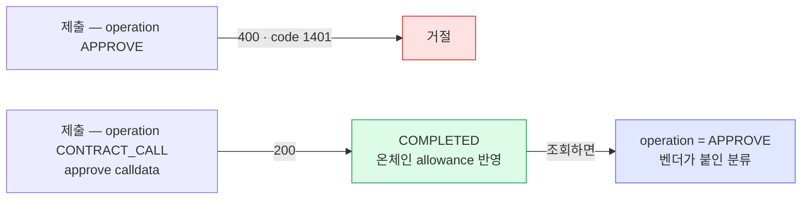
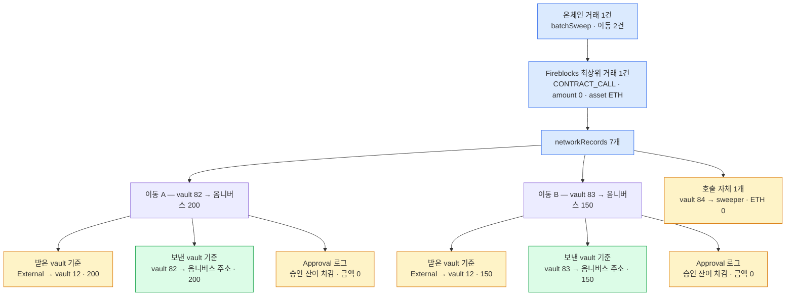

[배치 sweep 메커니즘](98-batch-sweep.md)의 미확인 항목 두 가지를 실물로 확인한 결과다(2026-08-10). ① ERC-20 `approve` 를 Fireblocks 로 어떤 형태로 제출하나 ② 배치 컨트랙트가 여러 vault 의 잔액을 한 거래로 모을 때 거래 기록과 웹훅이 어떻게 오나.

## 환경

- 체인 **이더리움 Sepolia**. 토큰은 파블로 발행한 **kbKRW**(`KBKRW_ETH_TEST5_6KCC` · `0xe64B8b9be27a2DcEF434932d4e7065EB3E098f47` · 18 decimals · 업그레이드 가능한 프록시)
- Fireblocks testnet 워크스페이스
- 웹훅 구독은 기존 3종에 **`transaction.network_records.processing_completed` 를 추가**해서 돌렸다
- **Universal Gasless 는 쓰지 않았다** — vault 에 Sepolia ETH 를 직접 넣고 제출했다. 그래서 대납 적용 여부는 이 PoC 로 답이 나오지 않는다

| 역할 | 주체 | 주소 |
|---|---|---|
| 고객 vault 1 (받는주소) | vault 82 `approve-pull-owner` | `0x429CdEa1DC75bBDa4e006675Abe5F773E299Dddb` |
| 고객 vault 2 (받는주소) | vault 83 `approve-pull-owner2` | `0xB6Df2ad4d9FB89529874636276AF2E367cf091D2` |
| 운영 계정 (sweeper 실행) | vault 84 `approve-pull-operator` | `0xf39864Fe764072cec80feb0DC1E24Db7a00E2B08` |
| 옴니버스 (목적지) | vault 12 `kb-test-stablecoin-issuer` | `0x496E49e0d3F30336079FF0B921F98D77eb00055D` |
| 배치 sweeper 컨트랙트 | 직접 배포 | `0xF95AFc896461a3eb7426714267eC6abb1cd6A1c9` |

## 시나리오 한눈에

| # | 시나리오 | 결과 |
|---|---|---|
| 1 | `approve` 를 두 경로로 제출 | `APPROVE` operation 은 **거절(400)** · `CONTRACT_CALL` 은 성공하고 **기록은 `operation=APPROVE`** |
| 2 | 운영 계정이 이동 2건짜리 배치 제출 | `networkRecords` 7개에 **원천 vault·금액 귀속** · `network_records.processing_completed` 수신 |
| 3 | 한 이동이 실패하는 배치 제출 | 거래는 `COMPLETED` · **되돌려진 이동은 레코드에 안 나왔다** · 온체인 이벤트에만 남는다 |

## 1. approve 제출 경로

**한 것** — vault 82 에서 승인 거래를 두 형태로 제출했다. 승인 대상 주소가 무엇이든 결과는 같으므로 여기서는 제출 형태만 본다.

| 시도 | 요청 | 결과 |
|---|---|---|
| A-1 | `operation: APPROVE` · 토큰 assetId · 목적지 = 승인 대상 | **400** `{"message":"Cannot perform transaction","code":1401}` |
| A-2 | `operation: APPROVE` · 가스 assetId · 목적지 = 토큰 컨트랙트 · approve calldata | **400** 같은 응답 |
| B | `operation: CONTRACT_CALL` · 가스 assetId · 목적지 = 토큰 컨트랙트 · approve calldata | **200 → COMPLETED** |

**결과** — B 만 통했다. 그런데 성공한 그 거래를 조회하면 `operation` 이 **`APPROVE`** 로 나온다.

```
8a43eab7-…  operation=APPROVE  status=COMPLETED  asset=KBKRW_ETH_TEST5_6KCC  amount=200
txHash 0xb442e5f5…   온체인 allowance 200 반영 확인
```

즉 `APPROVE` 는 제출용 operation 이 아니라 **벤더가 calldata 를 보고 붙이는 분류 라벨**이다. 원장에 operation 을 남길 때 제출값과 조회값 중 어느 쪽을 적을지 정해 둬야 한다.



정책 쪽에 `APPROVE` transactionType 과 Contract_Call 룰의 `applyForApprove` 플래그가 있으니 이 분류 위에 정책이 서는 구조로 보이지만, 정책이 실제로 걸리는지는 확인하지 않았다.

## 2. 운영 계정이 이동 2건짜리 배치 제출

**한 것** — 고객 vault 두 곳(82·83)이 `CONTRACT_CALL` 로 sweeper 를 승인(각 300)한 뒤, **운영 계정 vault 84 가 `batchSweep([82주소, 83주소], [200, 150])` 을 CONTRACT_CALL 로 한 번** 제출했다.

**결과** — 온체인 1건(`0xbcc3e816…`), Fireblocks 최상위 거래도 1건(`d98a64ba…` · `operation=CONTRACT_CALL` · `amount=0` · asset 은 가스 자산). 그 거래에 `networkRecords` **7개**가 붙었다.

| # | source | 목적지 주소 | assetId | netAmount |
|---|---|---|---|---|
| 0 | UNKNOWN / External | 옴니버스 | kbKRW | 150 |
| 1 | **vault 83** | 옴니버스 | kbKRW | 150 |
| 2 | vault 83 | sweeper | kbKRW | 0 |
| 3 | UNKNOWN / External | 옴니버스 | kbKRW | 200 |
| 4 | **vault 82** | 옴니버스 | kbKRW | 200 |
| 5 | vault 82 | sweeper | kbKRW | 0 |
| 6 | vault 84 | sweeper | ETH | 0 — 호출 자체 |

- **원천 vault 가 귀속된다** — `source` 에 `{id: "82"/"83", type: "VAULT_ACCOUNT"}` 로 나오고 `netAmount` 도 실린다.
- **`transaction.network_records.processing_completed` 가 왔다** — 알림 순서와 원문은 [배치 sweep payload 실물 샘플](94-batch-payload-sample.md)에 있다.
- 잔액도 맞았다 — 82: 500 → 300 · 83: 400 → 250 · 옴니버스 1139 → **1489**(+350).
- **최상위 거래는 제출 1건뿐이다** — 원천 vault 를 source 로 하는 최상위 거래도, 옴니버스 입금 최상위 거래도 생기지 않았다.
- **레코드는 영수증 로그에서 만들어진다.** 로그 종류마다 행이 생기고, **각 행에는 우리 vault 가 한쪽에만 채워진다.**
  - `Transfer` 하나당 **두 행** — 보낸 vault 기준 한 행(`source` 가 그 vault, 상대는 `ONE_TIME_ADDRESS`), 받은 vault 기준 한 행(`destination` 이 그 vault, 상대는 `UNKNOWN/External`). 반대편이 같은 워크스페이스의 vault 여도 그렇게 온다.
  - `Approval` 하나당 **한 행** — `transferFrom` 이 승인 잔여를 깎으면서 남긴 로그다. 자산이 안 움직여 `netAmount` 가 `"0"` 이고 상대가 sweeper 인 것은 승인을 받은 쪽이 sweeper 라서다.
  - **호출 자체 한 행** — 기준 자산에 우리가 실은 value 가 들어간다. 배치는 value 0 이라 `netAmount` 도 0 이었고, value 0.001 을 실은 호출을 따로 내 보니 그 행에 0.001 이 찍혔다. **가스는 행이 아니라 필드다** — `networkFee` 가 모든 행에 같은 값으로 복사돼 있다.

  로그 수와 맞아떨어진다 — 이동 2건짜리 배치는 `Transfer` 2 + `Approval` 2 + 호출 1 = **7행**, 한 건이 되돌려진 배치는 `Transfer` 1 + `Approval` 1 + 호출 1 = **4행**. 이 모델은 실측 두 건에 들어맞지만 벤더 문서로 확인한 것은 아니다.



## 3. 부분 실패 — 한 이동이 실패하는 배치

**한 것** — 승인 잔여가 100 인 vault 82 에 200 을, 잔여 150 인 vault 83 에 100 을 요청하는 배치를 냈다. 82 의 `transferFrom` 은 승인 금액을 넘어 실패하고 83 은 성공한다.

**결과** — 거래는 `COMPLETED` 로 끝났다. 한 건이 실패해도 배치 전체가 되돌려지지 않는다.

| 관찰 | 결과 |
|---|---|
| 배치 거래 상태 | `COMPLETED` |
| 잔액 | 82 는 300 그대로 · 83 은 250 → 150 · 옴니버스 +100 |
| `networkRecords` | **4개** — vault 83 의 이동 3개 + 호출 1개 |
| 실패한 vault 82 | **레코드에 나오지 않았다** |

영수증에서 `SweepLeg` 이벤트를 디코딩하면 나온다.

```
SweepLeg  from=0x429cdea1…(vault 82)  요청=200  성공=False
SweepLeg  from=0xb6df2ad4…(vault 83)  요청=100  성공=True
SweepDone 이동=2  성공=1
```

이걸 "실패는 레코드에 안 들어온다" 로 일반화하기에는 실패 유형 하나를 한 번 본 것뿐이다.

더 그럴듯한 설명은 따로 있다 — 되돌려진 `transferFrom` 은 **온체인에 `Transfer` 이벤트를 남기지 않는다.** 레코드가 영수증 로그에서 만들어진다면 애초에 적을 것이 없었던 셈이다. 그렇다면 실패해도 이동 흔적이 남는 유형(예: 일부만 옮겨지는 토큰)에서는 레코드가 생길 수 있다. 실제로 레코드에는 `isDropped` 필드가 있어 벤더가 떨어진 레코드를 표시하는 개념을 갖고 있는데, 이번에 본 값은 `false` 뿐이다. 이 설명과 예측은 아직 재보지 않았다.

다만 **요청 자체는 벤더가 들고 있다.** 우리가 보낸 calldata 가 `extraParameters.contractCallData` 에 그대로 있고, 모든 알림과 `GET /v1/transactions/{id}` 응답에 실려 온다. 벤더가 하지 않는 것은 그 값을 푸는 일이다 — calldata 가 "82 에서 200, 83 에서 100" 을 뜻하는지 해석하지 않고, 체인에서 실제로 일어난 것만 레코드로 만든다.

그래서 `bcm_swp_trgt` 를 정리하려면 요청과 결과를 우리가 맞춰야 한다. 두 경로가 있다.

1. **calldata 를 디코딩**해 요청 목록을 만들고 `networkRecords` 와 대조 — 빠진 것이 실패다
2. **영수증의 `SweepLeg` 이벤트**를 읽기 — 어느 이동이 실패했는지 바로 나온다

알림 원문은 [부분 실패 payload 실물 샘플](93-batch-partial-fail-sample.md)에 있다.

## 종합 — 설계에 반영한 것

- **배치 sweep 의 감지·대사에 필요한 기록은 나온다.** 우리 vault 가 제출한 배치 거래라면 원천 vault 와 금액이 `networkRecords` 에 실린다.
- **`network_records.processing_completed` 구독이 검토 대상에서 필수로 바뀐다.** 최상위 거래 1건에는 이동 정보가 없어서, 이 이벤트와 `networkRecords` 없이는 어느 vault 에서 얼마가 빠졌는지 알 수 없다.
- **대사는 보낸 vault 기준 행만 쓴다.** `source` 가 vault 인 행에 원천과 금액이 함께 있다. 받은 vault 기준 행은 상대가 `External` 이고 주소 필드조차 없어 원천을 못 찾는다. `Approval` 행은 자산 이동이 아니므로 합계에서 빼되, 승인 잔여가 얼마나 깎였는지를 알려주는 별개 정보다.
- **되돌려진 이동은 `networkRecords` 에 나오지 않았다.** 요청 calldata 는 벤더가 보관하지만 풀어 주지는 않으므로, 디코딩해서 레코드와 대조하거나 컨트랙트 이벤트를 읽어야 집계가 선다. 다른 실패 유형에서도 같은지는 확인하지 않았다.
- **approve 제출은 `CONTRACT_CALL`** 이고 조회하면 `APPROVE` 로 보인다.

배치 채택 여부는 [sweep 설계](06-sweep.md)에서 결정한다. 2026-08-12 설계 결정은 `approve + transferFrom` 채택이다. 이 PoC가 확인한 제출·기록 경로를 사용하되, 최상위 1건 ↔ 이동 M건의 DB·상태 흐름, allowance 상한·회수, TAP·Callback·컨트랙트 통제는 06의 출시 게이트를 충족해야 한다.

**PoC ABI는 운영 계약이 아니다.** 여기서 배포한 `batchSweep(address[],uint256[])`는 `executionId`·token allowlist·실제 이동량·실패 코드를 갖지 않는다. 운영 구현은 [06의 운영 컨트랙트 ABI](06-sweep.md#운영-컨트랙트-abi)를 사용하며, 이 샘플 calldata와 selector는 관찰 근거로만 남긴다.

## 못 한 것

- **TAP 정책 실측** — 아래 "다음 시나리오" 로 계획을 잡아 뒀다.
- **Universal Gasless 적용** — `CONTRACT_CALL` approve 와 배치 호출을 대납으로 낼 수 있는지, relay 처리량은 얼마인지. 도입에 계약이 선행이라 CSM 질의 대상이다.
- **다른 실패 유형** — 이번에 본 것은 되돌려진 `transferFrom` 하나다. 이동 흔적이 남는 실패에서 레코드가 생기는지, 그때 `isDropped` 가 어떻게 찍히는지는 안 봤다.
- **이동 건수 확대** — 이번은 이동 2건이다. 한 배치에 수십 건을 넣으면 레코드 개수·이벤트 지연·가스가 어떻게 되는지는 안 봤다.
- **사고 상황** — allowance 가 서 있는 상태에서 제3자가 임의 주소로 당겨갈 때 우리가 무엇을 보게 되는지. 배치 설계가 아니라 침해 감지에 해당하므로 별도 시나리오로 다룬다.
- 7702 위임 코드의 운영자 pull 지원도 여전히 미확인이다.

## 다음 시나리오 — TAP 정책 실측

승인 대상·토큰·승인 금액을 정책으로 어디까지 묶을 수 있는지 잰다. 정책 발행이 Owner 콘솔 검토와 모바일 승인을 거쳐야 해서 이번 회차에 넣지 못했다.

**출발점** — 이번 실측에서 approve 를 `CONTRACT_CALL` 로 냈는데 기록에는 `operation=APPROVE`, `amount=200` 으로 남았다. 승인 금액이 calldata 에서 뽑혀 `amount` 에 올라온다는 뜻이라, TAP 의 금액 조건이 그 값에 걸리는지가 관건이다.

Approve Policy 에 네 개를 기본 Allow 룰보다 위에 둔다. first-match 라 순서가 결과를 가른다.

| 순서 | 동작 | 출발지 | 대상 | 자산 | 금액 |
|---|---|---|---|---|---|
| 1 | Block | vault 82 | 제한 없음 | kbKRW | 조건 없음 |
| 2 | Block | vault 83 | 제한 없음 | kbKRW | 100 이상 |
| 3 | Block | vault 83 | sweeper 주소 | kbKRW | 조건 없음 |
| 4 | Block | vault 83 | 토큰 컨트랙트 주소 | kbKRW | 조건 없음 |

Contract Call Policy 에는 하나 — Block · 출발지 vault 84 · 대상 토큰 컨트랙트 주소(sweeper 는 넣지 않는다).

낼 거래와 갈리는 것:

| 거래 | 무엇을 가르나 |
|---|---|
| vault 82 `approve(sweeper, 50)` | 룰 1 에 걸리면 `CONTRACT_CALL` 로 낸 approve 가 `APPROVE` 룰에 잡힌다 |
| vault 83 `approve(sweeper, 300)` | 룰 2 에 걸리면 **승인 금액 조건이 선다** |
| vault 83 `approve(sweeper, 50)` | 룰 3 이면 정책이 calldata 를 본다 · 룰 4 면 목적지(토큰 컨트랙트) 기준이다 |
| vault 84 sweeper 호출 | 통과해야 정상 |
| vault 84 토큰 컨트랙트 호출 | 차단되면 대상 컨트랙트 단위 제한이 선다 |

차단된 거래에는 위반한 rule number 가 표시되므로 어느 룰에 걸렸는지로 판독한다.

벤더 문서는 Policy Engine 이 Contract Call 에 대해 **제한된 정보만 받는다**고 적고 있다 ([Transaction lifecycle](https://support.fireblocks.io/hc/en-us/articles/5530525064476-Transaction-lifecycle)). 그대로라면 세 번째 거래가 룰 4 에 걸리고 두 번째도 통과해 버린다 — 승인 대상과 금액을 정책으로 못 거른다는 뜻이고, 그 경우 상한은 sweeper 코드 쪽에서 강제해야 한다.

## 재현

실행 스크립트는 fbhook 저장소 `scripts/approve-pull/` 에 있다(앱 범위 밖의 일회성 스크립트). 준비 → 승인 → 배치 순으로 번호가 붙어 있고, sweeper 소스도 같은 폴더에 있다. 관찰 원본은 fbhook `NEXT.md` 의 관찰 기록에 적었다.

테스트 잔여물은 지우지 않았다 — vault 82·83·84, 배포한 sweeper 컨트랙트, 시나리오 1 에 쓴 테스트 지갑, 그리고 sweeper 앞으로 남은 allowance(82 는 100 · 83 은 150). 재검토 때 그대로 다시 쓸 수 있다. 치울 때는 `approve(sweeper, 0)` 을 먼저 내고 토큰·가스를 회수한다.
