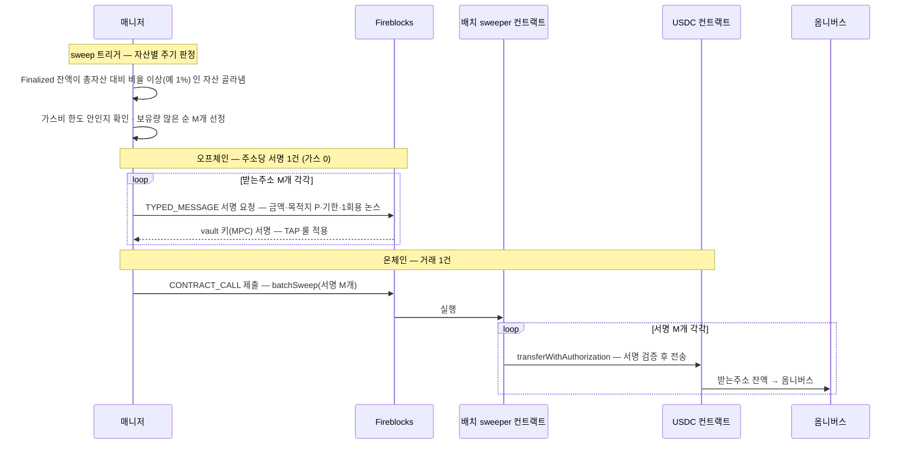
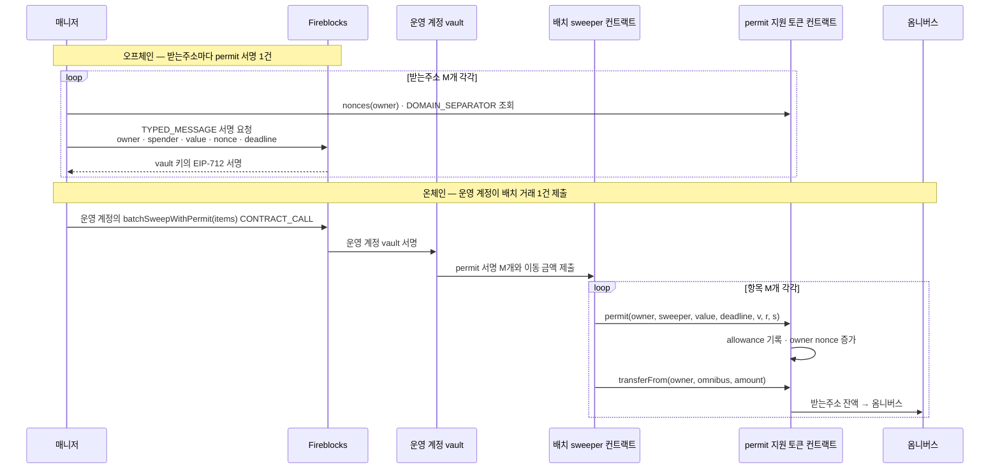
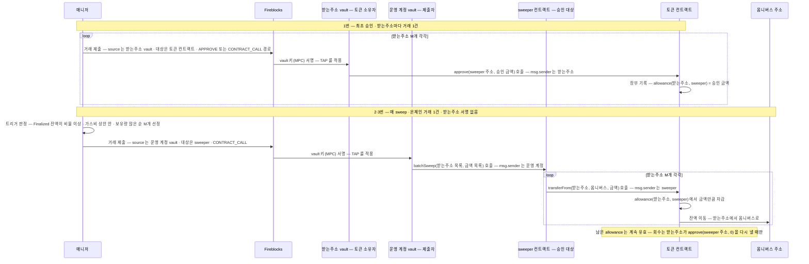
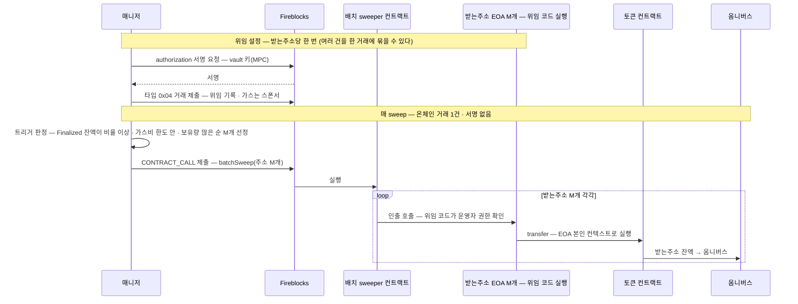

[sweep 설계](06-sweep.md)의 채택 근거를 담는 심화 참고 문서다 — 여러 입금 주소의 자산을 **온체인 거래 한 건**으로 모으는 일이 왜 어렵고, 가능한 방법과 수탁 위험이 무엇인지를 바닥부터 설명한다. 2026-08-12 결정은 `approve + transferFrom`이며, 실제 구현 계약과 권한 통제는 06에서 정의한다. 나머지 방식은 비교 이력으로만 유지한다.

여기서 미확인으로 두던 항목 일부는 2026-08-10 에 직접 확인했다. 시나리오와 관찰 원본은 [approve 배치 sweep PoC 결과보고](95-approve-pull-poc-result.md)에 있다.

## 1. 문제의 뿌리 — ERC-20 은 보유자만 보낸다

ERC-20 의 `transfer` 는 **호출한 계정(msg.sender)의 잔액**을 옮긴다. 받는주소 100개의 USDC 를 모으려면 원칙적으로 100개 주소가 각자 거래를 보내야 한다 — 그래서 벤더의 sweep 도 vault 당 거래 1건이다.

배치 컨트랙트 하나가 100개 주소의 잔액을 움직이려면, 각 주소가 "내 돈을 옮겨도 된다"는 **권한 증명**을 어떤 형태로든 줘야 한다. 배치 sweep 의 설계는 결국 **이 권한 증명을 무엇으로 만드느냐**의 선택이다. 방법은 넷이다:

| | 권한 증명 | 한 줄 요약 |
|---|---|---|
| 방법 1 — EIP-3009 | **1회용 전송 지시 서명** | "금액 X 를 주소 P 로, 기한 T까지" 를 서명 — 서명 자체가 전송 지시 |
| 방법 2 — EIP-2612 | **한도 부여 서명** (permit) | "컨트랙트 S 가 내 토큰 X 만큼 쓸 수 있다" 를 서명 — 이후 S 가 transferFrom |
| 방법 3 — ERC-20 approve | **온체인 한도 부여 거래** | 각 주소가 컨트랙트 S 에 allowance 를 먼저 설정 — 이후 S 가 transferFrom |
| 방법 4 — EIP-7702 | **코드 위임** | 내 계정이 위임한 코드가 잔액을 움직인다 — 서명은 위임 설정 때 한 번 |

3009·2612·7702의 권한 증명은 서명으로 만들 수 있지만, 일반 ERC-20 `approve`는 **각 받는주소가 보내는 온체인 거래**다. 따라서 approve 방식은 최초 설정만으로 이미 주소 수만큼 거래가 필요하고, 그 뒤 allowance 가 남아 있는 동안에만 배치 호출 1건의 이득이 생긴다.

## 2. 가스 구조 — 배치가 자동으로 싸지지 않는 이유

거래 한 건의 비용 = **고정비**(기본 21k gas + 서명·calldata) + **실행비**(토큰 이동 자체, ERC-20 ~45k 안팎). 배치가 아끼는 건 고정비인데, 주소마다 **권한 증명을 검증하는 비용**이 새로 붙는다.

| 방식 | 주소당 비용 구조 | 대략치 |
|---|---|---|
| 개별 전송 (기준) | 고정비 21k + 실행 ~45k | ~66k |
| 배치 + 회차별 서명 증명 (3009·2612) | 서명 검증(ecrecover ~3k) + 논스 기록(~20k대) + 실행 ~45k | **~70k대 — 절감이 미미하거나 역전** |
| 배치 + 사전 approve | 최초 approve M건 + 이후 allowance 확인 + 실행 | 최초 회차는 역전 · allowance 재사용 시에만 절감 가능 |
| 배치 + 상시 권한 (7702 운영자) | 권한 확인(~수 k) + 실행 ~45k | **~50k — 진짜 절감** |

이 대략치에서는 **가스 절감이 분명하게 나타나는 쪽이 상시 권한 방식**이다. 회차별 서명 방식은 배치했더라도 권한 검증·nonce 기록 때문에 개별 전송보다 싸다고 단정할 수 없다. 대신 제출·추적할 온체인 tx를 1건으로 줄이고 가스비가 싼 창에 함께 실행하며 실패 관리를 모을 수 있다. 실제 gas는 토큰 구현·storage 상태·calldata·부분 실패 처리에 따라 달라지므로 채택 전 실측한다. 2612 allowance를 회차 사이에 재사용하면 이후 비용은 사전 approve 방식과 같아지지만 상시 권한도 함께 남는다(4절).

## 3. 방법 1 — EIP-3009 transferWithAuthorization

USDC(Circle v2+, 이더리움·Base)가 네이티브로 지원하는 기능. 보유자가 **"금액 X 를 주소 P 에게, 유효기간 T, 1회용 논스 N"** 을 EIP-712 typed 서명으로 만들어 주면, **누구든** 그 서명을 토큰 컨트랙트에 제출해 전송을 실행할 수 있다.

핵심 성질:

- **목적지가 서명에 묶인다** — 배치 컨트랙트가 해킹돼도 서명된 목적지(옴니버스) 밖으로는 못 보낸다.
- **1회용·기한부** — 논스가 한 번 쓰이면 끝, 기한이 지나면 무효. 상시 권한이 남지 않는다.
- **논스가 32바이트 랜덤** — 순서 제약이 없어 M개 서명을 병렬로 만들고 아무 순서로 실행해도 된다 (아래 7절 논스 비교).

## 4. 방법 2 — EIP-2612 permit

`permit`은 ERC-20 `approve`를 서명으로 대신하는 확장이다. 받는주소 vault가 온체인 거래를 내는 대신 **"컨트랙트 S가 내 토큰을 X만큼 쓸 수 있다"**는 EIP-712 typed message를 서명하고, 배치 컨트랙트가 그 서명을 토큰 컨트랙트에 제출한다. 토큰 컨트랙트가 서명을 검증하면 `allowance[owner][spender] = value`를 기록하고 owner의 permit nonce를 1 올린다. 그 다음에야 sweeper가 `transferFrom`으로 자산을 옴니버스로 옮긴다 ([EIP-2612](https://eips.ethereum.org/EIPS/eip-2612)).

`permit` 자체는 전송 지시가 아니다. **allowance를 만드는 방식만 `approve` 거래에서 오프체인 서명으로 바꾼다.** 따라서 실제 인출 권한과 목적지 통제는 방법 3과 마찬가지로 allowance와 sweeper 코드에 남는다.

### 서명이 무엇을 허용하나

표준 permit message는 다섯 값을 서명한다.

| 필드 | 뜻 | 배치 설계에서의 값 |
|---|---|---|
| `owner` | 토큰 소유자 | 고객 받는주소 vault의 EVM 주소 |
| `spender` | allowance를 받을 주소 | 승인된 sweeper 컨트랙트 |
| `value` | 새 allowance 값 | 회차 이동량 또는 승인된 운영 상한 |
| `nonce` | owner별 순차 permit nonce | 서명 직전 토큰 컨트랙트에서 읽은 값 |
| `deadline` | permit 제출 만료시각 | 배치 제출·재시도 시간을 포함한 짧은 유효기간 |

일반적인 EIP-712 domain은 토큰 이름·버전·chainId·토큰 컨트랙트 주소(`verifyingContract`)로 서명 영역을 가른다. 그래서 message 다섯 값이 같아도 다른 체인·토큰의 서명으로 대신할 수 없다. 반대로 **목적지(옴니버스)는 message에 없다** — `spender`가 누구인지만 묶이고 그 spender가 어디로 보낼지는 컨트랙트 코드가 정한다.

토큰이 `permit`이라는 이름을 가졌다고 곧 EIP-2612 호환인 것도 아니다. EIP-2612 이전의 DAI형 permit은 `value` 대신 `allowed`를 쓰고 `deadline` 대신 `expiry`를 쓰는 등 서명 schema가 다르다. 자산 온보딩 때 함수 ABI만이 아니라 `DOMAIN_SEPARATOR`·message type·nonce 의미까지 실측해야 한다.

### allowance를 회차마다 만들지, 재사용할지

permit도 `approve`와 같은 allowance를 만들기 때문에 두 방식으로 운영할 수 있다.

| 운용 | 서명·제출 | 실행 뒤 권한 | 성질 |
|---|---|---|---|
| **회차형** — 이동할 금액만 permit | 매 sweep마다 permit 서명 M건 + 배치 1건 | 전액 이동 성공 시 allowance 0 | 권한은 좁지만 매 회차 M개 서명이 남는다 |
| **재사용형** — 운영 상한으로 permit | 최초 permit 서명 M건 + 배치 1건, 이후 배치 1건 | 사용하고 남은 allowance 유지 | 최초 approve 거래를 없애지만 이후 위험은 방법 3과 같다 |

회차형은 받는주소가 gas를 내는 `approve` M건을 없애고 온체인 제출을 배치 1건으로 접는다. 그러나 Fireblocks에는 여전히 vault별 typed-message 서명 M건을 요청해야 하고, batch 내부에서도 `permit + transferFrom`이 M번 실행되므로 실행 gas는 M에 비례한다.

재사용형은 다음 회차부터 벤더 호출도 배치 1건으로 줄지만, 그 이득은 allowance를 남겨 두기 때문에 생긴다. 즉 **permit의 장점은 최초 온체인 approve를 서명으로 바꾸는 데 있고, allowance를 재사용하는 순간 수탁 위험은 방법 3과 같아진다.**

### nonce와 재시도

permit nonce는 토큰 컨트랙트가 owner별 순차 카운터로 보관한다. 서로 다른 받는주소는 nonce가 독립이라 병렬 서명이 가능하지만, 같은 `(owner, token)`에서 두 permit을 동시에 만들면 둘이 같은 nonce를 읽을 수 있고 먼저 실행된 하나만 유효하다.

- 대상 claim부터 서명·제출이 끝날 때까지 같은 `(owner, token)` permit 작업은 하나만 허용한다.
- 서명 직전에 `nonces(owner)`를 읽고, 서명 원문·nonce·deadline을 실행 항목에 같이 보관한다.
- 제출 결과가 불명확하면 새 서명부터 만들지 않는다. 온체인 nonce와 allowance를 먼저 읽어 기존 permit의 소비 여부를 판정한다.
- nonce가 이미 증가했지만 필요한 allowance가 없으면 다른 permit이 소비한 상태다 — 기존 서명을 재제출하지 않고 새 nonce로 다시 만든다.
- deadline 만료는 영구 실패가 아니라 재서명 대상이다. 너무 긴 deadline은 탈취된 서명의 유효 창을 넓히고, 너무 짧으면 승인·서명·배치 대기 중 정상 만료가 늘어난다.

누구든 서명을 얻으면 `permit`을 먼저 제출할 수 있다. 제3자가 먼저 제출해도 allowance 자체는 같은 값이지만, 뒤따르는 배치의 `permit` 호출은 nonce 불일치로 revert할 수 있다. 배치 컨트랙트가 `allowance(owner, sweeper)`를 먼저 확인해 충분하면 permit 단계를 생략하도록 만들 수는 있으나, 이 분기도 실행 의도·이벤트·재처리 계약에 명시해야 한다. 특히 회차형에서 기존 allowance가 요청금액보다 크다는 이유만으로 permit을 생략하면 **서명한 정확한 `value`로 allowance를 덮어쓴다**는 통제가 사라진다. 회차형은 기존 allowance가 0인지 확인한 뒤 permit을 실행하거나, 기존 allowance를 허용하는 별도 정책을 둬야 한다.

`permit`도 기존 ERC-20 approval 변경 경쟁 조건을 그대로 가진다. 이미 0이 아닌 allowance를 다른 0이 아닌 값으로 덮어쓰면 spender가 변경 전 allowance와 변경 후 allowance를 모두 소비할 여지가 있다. 우리 구조에서는 회차형의 시작 allowance를 0으로 제한하고, 재사용형의 상한 변경은 `0`으로 내린 사실을 확인한 뒤 새 permit을 만드는 절차가 필요하다.

### 부분 성공 배치에서 남는 상태

`permit` 성공 뒤 `transferFrom`이 실패했는데 batch가 그 실패만 잡아 계속 진행하면, **토큰은 안 움직였지만 nonce는 소비되고 allowance는 남을 수 있다.** 다음 회차가 "전송 실패"만 보고 같은 서명을 재사용하면 nonce 불일치로 다시 실패한다.

항목별 부분 성공을 허용하려면 한 항목의 `permit + transferFrom`을 하나의 원자 실행 경계로 묶는다. 단순히 batch 함수가 `permit`을 호출한 뒤 `transferFrom`만 `try/catch`하면 안 된다 — transfer 실패를 잡는 순간 앞서 성공한 permit의 nonce·allowance는 그대로 남는다. `permit + transferFrom` 전체를 별도 외부 호출 프레임(예: 권한 제한된 self-call 또는 전용 helper)에 넣고, transfer 실패 시 그 프레임 전체를 revert한 뒤 바깥 batch가 항목 실패를 잡아 다음 항목으로 진행해야 한다. 토큰이 `false`를 반환하는 구현도 명시적으로 revert시켜야 같은 원자성이 성립한다. 이 구조 자체의 재진입·호출자 검증은 별도 감사 대상이다.

### Fireblocks에서 성립하는 경로와 미실측

Fireblocks 공식 문서는 EIP-712 `TYPED_MESSAGE` 서명을 지원하고, EVM 호환 체인에서도 API의 `assetId`는 `ETH`를 사용한다고 설명한다 ([Sign Typed Messages in Ethereum](https://developers.fireblocks.com/reference/sign-typed-messages-for-ethereum-and-evm-networks)). 이 경로를 우리 구조에 놓으면 다음과 같다.

| 단계 | Fireblocks source | operation | gas |
|---|---|---|---|
| permit 생성 | 각 고객 vault | `TYPED_MESSAGE` | 오프체인 서명이라 없음 |
| batch 실행 | sweep 운영 계정 vault | `CONTRACT_CALL` | 운영 계정 직접 부담 또는 Gasless relay |

Circle Gateway 공식 기술 문서도 USDC 입금 수단으로 EIP-2612 permit을 열거한다 ([Gateway Technical Guide](https://developers.circle.com/gateway/references/technical-guide)). 다만 체인별 토큰 프록시가 같은 구현 버전을 가리킨다는 보장은 별도이므로 실제 채택은 `(network, token contract)`별 `permit`·`nonces`·`DOMAIN_SEPARATOR` 실측을 전제로 한다.

여기까지는 공식 기능을 조합하면 성립하는 경로다. **우리 Fireblocks workspace와 batch 컨트랙트로 실측한 것은 아니다.** 출시 후보로 되돌리려면 다음을 확인해야 한다.

- Permit typed message가 TAP·API Co-signer·Callback을 어떤 transaction type으로 통과하는지, Callback에서 domain과 다섯 message 값을 모두 검증할 수 있는지.
- Fireblocks가 돌려주는 서명을 토큰별 `v/r/s` 형태로 정확히 정규화할 수 있는지.
- 서명 주체는 고객 vault지만 온체인 제출 주체는 운영 계정인 거래에서 `networkRecords`가 원천 vault·금액을 방법 3 실측과 동일하게 귀속하는지.
- batch CONTRACT_CALL만 Gasless로 제출할 때 어느 vault가 EIP-7702 upgrade 대상인지. 고객 vault는 온체인 gasless 거래가 아니라 typed message만 서명하므로 **고객 vault까지 upgrade된다고 현재 근거로 단정하지 않는다.**
- M개 typed-message 서명 요청의 처리량·정책 승인 지연·rate limit이 배치 주기를 감당하는지.

### 수탁 경계와 현재 판단

회차형 permit은 목적지가 서명에 묶이지 않고 spender만 묶인다는 점에서 EIP-3009보다 권한이 넓다. 재사용형 permit은 allowance가 남는다는 점에서 방법 3과 같은 긴급 회수·sweeper 침해 위험을 가진다. 최소 통제도 두 성질을 따라간다.

- spender는 승인된 비업그레이드형 sweeper로 고정하고, sweeper의 목적지는 배포 시 옴니버스로 불변 고정한다.
- 회차형은 `value = 요청금액`을 기본으로 하고 deadline 상한을 둔다. 재사용형이면 무제한 대신 vault·토큰별 운영 상한과 잔여 allowance 모니터링을 둔다.
- Callback은 token domain·owner·spender·value·nonce·deadline을 선기록한 실행 의도와 대조하고, 서명 hash를 보관한다.
- 항목별 permit 소비 여부·allowance·실제 이동량·실패 코드를 이벤트와 온체인 조회로 대사한다.

**현재 구현안에서는 제외한다.** 이유는 ① 모든 대상 토큰이 EIP-2612를 지원하지 않고, ② 회차형은 vault별 서명 M건이 계속 남으며, ③ 재사용형은 방법 3과 같은 상시 allowance가 되고, ④ 방법 3만 Fireblocks 제출·`networkRecords` 귀속·부분 실패를 end-to-end로 실측했기 때문이다. 서명형을 택한다면 USDC가 지원하고 목적지·금액·기한을 한 번에 묶는 EIP-3009가 우선이고, permit은 3009가 없는 EIP-2612 토큰의 차선이다.

3009와의 차이를 한 표로 접으면 다음과 같다.

| | 3009 | 2612 |
|---|---|---|
| 서명이 정하는 것 | 금액 + **목적지** + 기한 | 금액 + **쓸 컨트랙트** + 기한 — 목적지는 컨트랙트 로직 몫 |
| 실행 후 잔여 | 없음 (1회용) | transferFrom 이 부분 실행되면 **allowance 잔여** 가능 — 관리 필요 |
| 논스 | 랜덤 — 순서 무관 | **소유자별 순차** — 같은 주소의 permit 두 장을 한 배치에 순서 없이 못 싣는다 |
| 토큰 지원 | 3009 지원 토큰만 (USDC O) | 2612 가 더 흔함 — 3009 없는 토큰의 차선 |

## 5. 방법 3 — ERC-20 approve + transferFrom

잔액은 받는주소에 그대로 두고, **토큰을 옮길 권한만 컨트랙트에 미리 넘겨 두는** 방식이다. 그래서 sweep 때는 그 컨트랙트를 한 번 호출하는 것으로 M개 주소가 함께 비워진다. ERC-20 표준의 `approve` 와 `transferFrom` 두 함수만 쓰므로 토큰 쪽에 추가 확장이 필요 없다 ([ERC-20](https://eips.ethereum.org/EIPS/eip-20)).

### 주소 네 개가 나온다

| 자리 | 우리 쪽 | 하는 일 |
|---|---|---|
| owner | 받는주소 vault | 토큰을 실제로 들고 있다. `approve` 를 내는 주체 |
| spender | 배치 sweeper 컨트랙트 | 허가를 받아 `transferFrom` 을 호출한다 |
| to | 옴니버스 vault | 자금이 도착한다 — 허가와는 무관한 수취 주소 |
| 제출자 | 운영 계정 vault | 매 sweep 마다 sweeper 를 호출하는 Fireblocks 거래를 낸다 |

`spender` 는 토큰 컨트랙트 장부의 칸 이름이고, sweeper 는 우리가 배포해 그 칸에 적어 넣는 컨트랙트다 — 둘은 같은 것을 가리킨다. 토큰 컨트랙트가 들고 있는 것은 `allowance[owner][spender] = 금액` 한 줄뿐이라, 그 주소가 어떤 코드인지도 자금이 어디로 갈지도 모른다.

승인 대상 자리에 운영자 EOA 를 넣어도 `transferFrom` 은 된다. 다만 EOA 는 한 거래에 호출 하나라 M개를 옮기려면 거래도 M건이 되어 배치가 아니다. 한 거래 안에서 `transferFrom` 을 M번 돌리려면 반복문을 담을 코드가 필요해서 승인 대상이 컨트랙트가 된다.

여기서 **거래를 내는 주체와 자금을 옮길 권한을 가진 주체가 갈린다**. 거래는 운영 계정이 내고, 권한은 sweeper 에 있고, 잔액이 주는 건 고객 vault M개다. 아래 위험과 감사 부담은 대부분 이 분리에서 나온다.

### 순서

1. 받는주소 M개가 각각 sweeper 컨트랙트를 승인 대상으로 지정해 `approve` 거래를 제출한다.
2. allowance 가 확인된 뒤 운영 계정이 `batchSweep` 컨트랙트를 한 번 호출한다.
3. 컨트랙트가 각 주소에 대해 `transferFrom(받는주소, 옴니버스, 금액)` 을 실행한다.
4. allowance 가 남아 있으면 다음 sweep 부터는 2번만 반복할 수 있다.

### 승인 금액을 얼마로 주나

`approve(spender, value)` 의 `value` 가 **승인 금액**이다. "sweeper 가 내 토큰을 여기까지 가져가도 된다" 는 상한이고, 토큰 컨트랙트에 `allowance(받는주소, sweeper)` 라는 숫자로 남는다. `transferFrom` 이 실행될 때마다 그만큼 깎이고, 0 이 되면 그 주소는 `approve` 를 다시 내야 한다. (트리거 조건에 나오는 가스비 상한이나 받는주소 잔액 상한과는 다른 값이다.)

그래서 이 숫자를 얼마로 잡느냐가 곧 방법 3의 성격이다.

| 승인 금액 | approve 거래 | 남는 권한 |
|---|---|---|
| 무제한 또는 넉넉히 | 첫 회 M건, 이후 없음 | 승인한 만큼 계속 서 있다 — 배치 이득이 여기서 나온다 |
| 그때 옮길 금액만 | 매 sweep M건 | 실행 직후 0 — 대신 배치 이점이 사라진다 |

**배치로 얻는 이득과 남겨 두는 권한의 크기가 같이 움직인다** — 방법 3을 한 줄로 말하면 이것이다.

### 이 방식으로 안 되는 것

- **컨트랙트가 1번을 대신 낼 수 없다** — `approve` 의 소유자는 함수 인자가 아니라 `msg.sender` 다. 컨트랙트가 호출하면 그 컨트랙트가 가진 잔액의 allowance 만 바뀐다. 받는주소마다 자기 거래를 내야 한다.
- **네이티브 ETH 는 묶을 수 없다** — allowance 는 ERC-20 토큰 컨트랙트 안에만 있는 장치다.
- **목적지는 표준이 지켜 주지 않는다** — allowance 에는 어디로 보내라는 정보가 없다. 옴니버스로만 나간다는 보장은 sweeper 코드에만 있다.

### Universal Gasless 로 낼 수 있나

받는주소에도 운영 계정에도 ETH 를 두지 않는 설계라, approve M건과 배치 호출 모두 대납 경로가 필요하다. [Fireblocks Gasless](../../디지털%20자산/가스대납/03-fireblocks-gasless.md) 기준으로 다섯 가지가 걸린다.

- **제품 범위 자체는 맞는다** — Universal Gasless 는 upgrade 된 vault 의 이더리움 자산에 대해 Transfer·Contract Call·Mint·Burn 을 대납하고, 지원 체인에 Ethereum 과 Base 가 들어 있다. `approve` 와 `batchSweep` 은 둘 다 컨트랙트 호출이라 범위 안이다.
- **★ gasless 를 쓰면 받는주소가 7702 위임 계정이 된다** — 첫 gasless 거래 때 vault(EOA)가 smart contract wallet 으로 upgrade 되기 때문이다. approve 노선을 골라도 방법 4의 상시 위임이 함께 깔린다는 뜻이라, 9절 비교표의 "approve 는 allowance 까지 · 7702 는 영속 위임" 대비는 대납을 쓰지 않을 때만 성립한다. 이 upgrade 는 건별 전송을 쓰는 현재 설계에도 이미 해당된다.
- **막힌 거래는 수동 처리** — Gasless Relay 는 auto-boost 를 지원하지 않는다. approve M건 중 막힌 것은 수동 boost 대상이고, 그 주소는 allowance 가 서지 않아 그 회차 배치에서 빠진다.
- **relay 거절이라는 실패 모드** — relay 가 요청을 거절하거나 gas 를 대지 못하면 거래가 실패한다. 그래서 배치 대상 선정은 "approve 를 제출했다" 가 아니라 **allowance 실측**을 근거로 해야 한다.
- **initiator 와 signer 를 같게 둘 수 없다** — 도입 요건에 relay 측 Contract call policy 에 Gasless-Orchestrator 를 initiator 로 명시하는 rule 이 있고, initiator 와 signer 는 같을 수 없다는 제약이 붙는다. 운영 계정이 배치를 제출하는 구성이 이 제약에 걸리는지 확인이 필요하다.

아래 "제출 형태" 에서 확정한 CONTRACT_CALL 경로에 gasless 가 적용되는지는 아직 실측하지 않았다 — 이번 실측은 vault 에 ETH 를 직접 두고 냈다. 확인 전에는 다이어그램에 relay 부담을 확정값으로 두지 않는다.

### 제출 형태 — 실측 확정 (2026-08-10)

이더리움 Sepolia · KBKRW(`KBKRW_ETH_TEST5_6KCC`) · vault 가 EOA 를 승인 대상으로 두고 직접 확인했다.

- **`operation: APPROVE` 로 직접 제출하면 거절된다** — `400 {"message":"Cannot perform transaction","code":1401}`. 토큰 assetId + 승인 대상을 목적지로 둔 형태, 가스 assetId + 컨트랙트 목적지 + calldata 형태 둘 다 같은 응답이었다.
- **`operation: CONTRACT_CALL` + approve calldata 는 통한다** — 제출 200 → `COMPLETED`, 온체인 allowance 반영까지 확인.
- 그런데 **그 거래를 조회하면 `operation` 이 `APPROVE`** 로 나온다. 즉 `APPROVE` 는 제출용 operation 이 아니라 **벤더가 calldata 를 보고 붙이는 분류 라벨**이다. 스키마 enum 에 이름이 있는 것과 제출 경로로 쓸 수 있는 것은 다르다.
- 따라서 TAP 의 `APPROVE` transactionType·`applyForApprove` 도 이 분류 위에 서 있을 것으로 보이나, 정책이 실제로 걸리는지는 실측하지 않았다.

### Fireblocks 쪽에서 정해야 할 것

정책에는 `APPROVE` transactionType 과 Contract_Call 룰의 `applyForApprove` 플래그가 있어 approve 거래를 골라내는 기능이 있고([Configure Policies](https://developers.fireblocks.com/reference/configure-transaction-authorization-policy)), Console 에는 Approve Amount Cap 도 있다([Interact with smart contracts](https://developers.fireblocks.com/docs/interact-with-smart-contracts)). 다만 승인 대상·토큰이 정책 입력에 어떻게 노출되는지, Amount Cap 이 API 로 제출한 두 경로에 모두 적용되는지, 정책 설정 API 로 allowance 상한을 강제할 수 있는지는 확인되지 않았다.

### 왜 수탁 경계가 바뀌나

현재 건별 전송은 매 sweep 마다 해당 vault 의 MPC 서명과 Fireblocks 정책 판단을 거쳐 **그때 승인된 한 거래**를 만든다. approve 방식은 최초 승인 뒤 실제 인출 권한이 토큰 컨트랙트의 allowance 와 sweeper 코드로 이동한다. 이후 `transferFrom` 에는 받는주소 vault 의 새 서명이 필요하지 않다.

그래서 위험은 단순히 "컨트랙트를 하나 더 운영한다"가 아니다.

- **지속 권한** — 큰 allowance 를 주면 운영자 키·sweeper·프록시 관리자 중 하나가 침해됐을 때 여러 고객 vault 의 승인 잔액이 함께 노출된다. sweep 마다 정확한 금액만 승인하면 노출은 줄지만 approve M건이 매번 필요해 배치 이점이 사라진다.
- **목적지 통제** — allowance 자체에는 목적지 정보가 없다. 옴니버스 주소 고정은 sweeper 코드가 보장해야 한다. 업그레이드 가능한 프록시라면 관리자 침해로 그 보장을 바꿀 수 있다.
- **긴급 회수 지연** — allowance 취소는 각 받는주소가 `approve(spender, 0)` 을 다시 제출해야 한다. 컨트랙트 pause 는 정상 코드의 실행을 막을 뿐 토큰에 남은 allowance 를 지우지 않으며, M개 vault 의 권한을 즉시 일괄 회수하는 ERC-20 표준 기능은 없다.
- **영향 범위 확대** — 건별 거래 한 건의 오류가 한 vault 에 머무는 현재 구조와 달리, batch 호출·컨트랙트 버그·잘못된 운영 입력 한 번이 M개 vault 에 영향을 준다.
- **1:N 감사·대사** — Fireblocks 에 제출하는 거래는 운영 계정의 CONTRACT_CALL 1건이고 온체인 자산 이동은 M건이다. 실측(8절)에서 그 1건의 `networkRecords` 에 **원천 vault 와 금액이 귀속돼 나온다**는 것이 확인됐다. 다만 최상위 거래는 1건뿐이라 원장·감지가 반드시 network records 를 펼쳐야 하고, 이동 한 건당 레코드가 관점별로 2~3개씩 나오므로 중복 제거 규칙이 필요하다. 실측에서 **되돌려진 이동은 레코드에 나오지 않았으므로** 요청 calldata 디코딩이나 컨트랙트 이벤트로 집계를 세워야 한다.
- **토큰별 차이** — allowance 변경 규칙, fee-on-transfer, 반환값, pause·blocklist 같은 토큰 동작이 다를 수 있다. 자산별 호환성 검증 없이 공통 배치로 묶을 수 없다.

### 채택한다면 필요한 최소 통제

- 목적지는 배포 시 정한 옴니버스 주소로 **불변 고정**하고 호출자가 임의 주소를 넘기지 못하게 한다.
- 네트워크·토큰·승인 대상을 allowlist 로 고정하고, 무제한 allowance 대신 자산·vault 별 상한과 잔여 allowance 모니터링을 둔다.
- 가능하면 비업그레이드형 컨트랙트를 사용한다. 업그레이드가 필요하면 운영 호출자와 업그레이드 권한을 분리하고 multisig·timelock 을 강제한다.
- pause·호출 빈도·배치 최대 M·건별 최대 금액을 제한한다. pause 는 긴급 완화 수단일 뿐 allowance 회수 수단은 아니라는 런북을 둔다.
- 이동 한 건마다 원천 vault·token·요청금액·실제금액·결과를 담은 이벤트를 내고, 전체 revert 와 부분 성공 중 한 정책을 명시해 DB 재처리와 일치시킨다.
- 배포 전 독립 보안 감사, 포크/테스트넷 부하·가스 실측, 운영자 키 침해 및 `approve(0)` 회수 훈련을 통과한다.

### Fireblocks 에서 확인할 것

- 정책의 `APPROVE` transactionType·`applyForApprove`·Console Amount Cap 이 **승인 대상·토큰·승인 금액을 어디까지 잡는가**. 제출 경로와 기록 형태는 실측으로 확정했고, 정책이 실제로 걸리는지가 남았다.
- approve 와 batch CONTRACT_CALL 의 rate limit·정책 승인·Co-signer 경로가 대량 vault 에서 감당 가능한가. 선택된 approve operation 에 Universal Gasless 를 적용할 수 있는지, 가능하다면 relay 처리량은 얼마인가.
- gasless 도입 요건의 "initiator 와 signer 는 같을 수 없다" 제약 아래에서, 운영 계정 vault 가 배치 CONTRACT_CALL 을 제출하는 구성이 성립하는가.
- 토큰 승인을 0 으로 낮추는 긴급 거래를 일반 sweep 보다 높은 우선순위로 제출할 수 있는가.

### 현재 판단

**채택 설계는 approve + transferFrom이다(2026-08-12).** allowance를 회차 사이에 유지해 반복 sweep의 벤더 호출과 고정 gas를 줄인다. 대신 무제한 승인은 금지하고 vault·토큰별 운영 상한, 목적지 불변 컨트랙트, TAP 기본 거부, Callback calldata 검증, 긴급 `approve(0)` 회수를 출시 조건으로 둔다. 구현 계약은 [sweep 설계](06-sweep.md)에 정의한다.

## 6. 방법 4 — EIP-7702 코드 위임

2025년 Pectra 업그레이드로 이더리움 프로토콜에 들어간 기능이다(Base 등 채택 EVM 포함). **EOA 가 주소·키·잔액을 그대로 유지한 채 컨트랙트 코드를 빌려 쓰게** 한다 — 계정 종류가 바뀌는 게 아니라 코드만 위임된다.

**위임 설정 (한 번)** — EOA 소유자(수탁 모델에서는 vault 키 = MPC)가 authorization tuple `[chain_id, 위임 대상 주소, nonce, 서명]` 을 만들고, 누군가(스폰서)가 이를 새 거래 타입 0x04 에 실어 제출하면, 프로토콜이 그 EOA 의 코드 자리에 위임 지정자(`0xef0100 ‖ 대상주소`)를 기록한다. 이후 이 EOA 를 호출하면 **위임 대상 컨트랙트의 코드가 EOA 본인의 컨텍스트에서 실행**된다 — 잔액·스토리지는 EOA 것. 한 거래에 authorization 여러 건을 실을 수 있어 **대량 받는주소의 위임 설정을 묶어서** 할 수 있다.

**배치 sweep 이 되는 원리** — 위임된 코드는 그 EOA 의 잔액을 움직일 수 있다. 위임 코드에 "지정 운영자(배치 sweeper)의 인출 호출을 허용한다"는 규칙이 들어 있으면, sweeper 가 각 받는주소를 호출해 그 주소 본인으로서 `transfer` 를 실행한다 — **매 sweep 서명이 필요 없고, allowance 도 필요 없고, 토큰이 무엇이든 된다**(3009·2612 같은 토큰 확장 불필요).

성질:

- **sweep 1회당 벤더 호출 1건** (3009와 회차형 2612는 서명 M건이 남는다) · 주소당 gas 도 최저(~50k) — 권한 검증이 서명 복원 없이 규칙 확인뿐이라서.
- **대가는 상시 인출 권한** — 위임은 영속이다(자동 만료 없음 · 해제는 0 주소로 재위임). 1회용 서명 모델과 달리 "언제든 뺄 수 있는 권한"이 서 있는 상태가 되고, **어떤 코드를 위임하느냐가 보안의 전부**다.
- **주소·키 불변** — 입금 주소 재발급·재고지가 필요 없다. 수탁 모델에서 7702 노선의 최대 이점.
- **Fireblocks 접점** — Universal Gasless 가 이미 이 메커니즘으로 vault 를 upgrade 한다(첫 gasless 거래 때 위임 설정). 단 위임 서명은 vault 키(MPC)로만 만들 수 있어 반드시 벤더를 거치고, **벤더는 자기가 만든 지갑 코드로만 위임시킨다**(Vault account upgrade policy — 위임 코드는 잔액을 전부 뺄 수 있어서 벤더가 통제). 따라서 배치가 되려면 **벤더의 그 지갑 코드에 "지정 운영자의 인출 실행" 기능이 있거나, 우리 코드 위임을 예외 허용해야** 한다 — 어느 쪽인지 미확인(벤더 문의 ④).

## 7. 논스 4종 — 헷갈리기 쉬운 지점

배치 sweep 논의에 서로 다른 논스 네 개가 등장한다. 섞으면 안 된다:

| 논스 | 어디 있나 | 성질 | 배치에서의 의미 |
|---|---|---|---|
| **계정 논스** | 체인 계정 레코드 | 거래마다 1 증가 | **제출 계정**의 직렬화 지점 — 연속 배치 loop 가 이 계정을 공유하면 제출 순서 관리 필요 |
| **3009 논스** | 토큰 컨트랙트 (소유자별 사용 기록) | 32바이트 랜덤 · 1회용 | 순서 무관 — 병렬 서명·임의 순서 실행 가능 |
| **2612 논스** | 토큰 컨트랙트 (소유자별 카운터) | 순차 증가 | 같은 소유자의 permit 은 순서대로만 유효 |
| **7702 논스** | authorization tuple | 계정 논스와 연동 | 위임 설정 때만 관여 — 매 sweep 과 무관 |

## 8. 모든 방법의 공통 함정 — 외부발 인출의 감지

네 방법 모두 결과는 같다: **vault 가 스스로 보낸 거래 없이 잔액이 빠진다** — "EOA 잔액은 본인이 보낸 거래로만 줄어든다"는 오랜 전제가 깨지는 지점이다(7702 는 위임 코드로, 3009·2612 는 서명만 있으면 제3자 거래로, approve 는 남겨 둔 allowance 로 — 같은 결과).

### 실측 결과 (2026-08-10)

이더리움 Sepolia 에 배치 컨트랙트를 올려 확인했다 — 고객 vault 두 곳(82·83)이 sweeper 를 승인하고, **운영 계정 vault(84)가 `batchSweep` 을 CONTRACT_CALL 로 한 번 제출**했다. 상세는 [PoC 결과보고](95-approve-pull-poc-result.md).

operator 거래 아래 `networkRecords` 7개가 붙고, **원천 vault 가 귀속된다.**

| # | source | 목적지 주소 | netAmount |
|---|---|---|---|
| 0 | UNKNOWN / External | 옴니버스 | 150 |
| 1 | **vault 83** | 옴니버스 | 150 |
| 2 | vault 83 | sweeper | 0 |
| 3 | UNKNOWN / External | 옴니버스 | 200 |
| 4 | **vault 82** | 옴니버스 | 200 |
| 5 | vault 82 | sweeper | 0 |
| 6 | vault 84 | sweeper | ETH 0 — 호출 자체 |

`transaction.network_records.processing_completed` 웹훅도 도착했다. 잔액도 맞았다(82: 500→300 · 83: 400→250 · 옴니버스 +350).

정리하면:

- **배치 sweep 은 감지·대사가 성립한다** — 원천 vault·금액이 `networkRecords` 에 나온다.
- **대신 최상위 거래는 1건뿐이다** — 원천 vault 를 source 로 하는 최상위 거래도, 옴니버스 입금 최상위 거래도 생기지 않는다. 원장·감지는 반드시 `networkRecords` 를 펼쳐 읽어야 하고, 그래서 `transaction.network_records.processing_completed` 구독은 검토 대상이 아니라 **필수**가 된다 ([감지 상세](99-detection-detail.md) 이벤트 표).
- **레코드는 영수증 로그에서 만들어진다.** 로그 종류마다 행이 생기고, **각 행에는 우리 vault 가 한쪽에만 채워진다.**
  - `Transfer` 하나당 **두 행** — 보낸 vault 기준 한 행(`source` 가 그 vault, 상대는 `ONE_TIME_ADDRESS`), 받은 vault 기준 한 행(`destination` 이 그 vault, 상대는 `UNKNOWN/External`). 반대편이 같은 워크스페이스의 vault 여도 그렇게 온다.
  - `Approval` 하나당 **한 행** — `transferFrom` 이 승인 잔여를 깎으면서 남긴 로그다. 자산이 안 움직여 `netAmount` 가 `"0"` 이고 상대가 sweeper 인 것은 승인을 받은 쪽이 sweeper 라서다.
  - **호출 자체 한 행** — 기준 자산에 우리가 실은 value 가 들어간다. 배치는 value 0 이라 `netAmount` 도 0 이었고, value 0.001 을 실은 호출을 따로 내 보니 그 행에 0.001 이 찍혔다. **가스는 행이 아니라 필드다** — `networkFee` 가 모든 행에 같은 값으로 복사돼 있다.

  로그 수와 맞아떨어진다 — 이동 2건짜리 배치는 `Transfer` 2 + `Approval` 2 + 호출 1 = **7행**, 한 건이 되돌려진 배치는 `Transfer` 1 + `Approval` 1 + 호출 1 = **4행**. 이 모델은 실측 두 건에 들어맞지만 벤더 문서로 확인한 것은 아니다.

  대사는 **보낸 vault 기준 행**만 쓴다 — 원천과 금액이 그 행에 함께 있다.
- **제출 주체가 우리 vault 일 때의 결과다** — 서명만 넘겨 외부가 제출하는 구성(3009·2612 를 제3자가 실행)에서도 같은지는 재보지 않았다.

- 부분 실패는 실측했다 — 한 이동이 실패해도 배치 거래는 `COMPLETED` 로 끝나고 나머지는 옮겨진다. 단 **되돌려진 이동은 벤더 레코드에 나오지 않았다**(실패 유형 하나만 확인). 성공/실패 집계는 요청 calldata 를 디코딩해 레코드와 대조하거나 영수증의 컨트랙트 이벤트를 읽어 `bcm_swp_trgt` 를 건별 정리해야 한다.

## 9. 비교 한 장

| | 3009 | 2612 | approve + transferFrom | 7702 운영자 |
|---|---|---|---|---|
| 상시 권한 | 없음 | 잔여 allowance 가능 | **있음 — allowance 소진·취소까지** | **있음 — 영속 위임** |
| 목적지 고정 | **서명에 묶임** | 컨트랙트 로직 몫 | 컨트랙트 로직 몫 | 위임 코드 몫 |
| sweep 1회당 벤더 호출 | M(서명)+1(제출) | 회차형 M+1 · 재사용형 최초 M+1, 이후 1 | 최초 M(approve)+1, 이후 1 | **1** |
| 주소당 gas | ~70k대 | ~75k대 | 최초 approve 비용 + 이후 transferFrom | **~50k** |
| 토큰 조건 | 3009 지원 (USDC O · KRWK 미확인) | 2612 지원 (USDC O · KRWK 미확인) | ERC-20 approve 호환 | 무관 |
| 벤더 의존 | TYPED_MESSAGE 서명 (지원 확인됨 · [문서](https://developers.fireblocks.com/reference/sign-typed-messages-for-ethereum-and-evm-networks)) | 동일 | **CONTRACT_CALL 로 제출 · 기록은 operation=APPROVE · 배치 안의 이동은 networkRecords 에 원천 vault 로 귀속 (실측 확정)** · 정책 매칭·gasless 는 미실측 | 위임 코드 구현 (미확인) |

읽는 법 — **안전(1회용·목적지 고정)을 잡으면 서명 M건이 남고(3009), 호출·가스 최소를 잡으면 allowance 또는 위임의 상시 권한을 감수한다(approve·7702).** 현재 06의 채택안은 Fireblocks에서 실행 경로를 실측한 `approve + transferFrom`이다. 다른 방식은 구현 범위에서 제외한다.

**상시 권한 칸의 단서** — approve 방식은 고객 vault가 최초 approve를 Gasless 거래로 제출하므로 그 vault에 Fireblocks의 EIP-7702 위임이 함께 선다(5절 "Universal Gasless 로 낼 수 있나"). 반면 3009·2612 방식은 고객 vault가 typed message만 서명하고 운영 계정이 온체인 거래를 제출한다. 이 경우 고객 vault까지 upgrade되는지는 공식 근거와 실측이 없어 단정하지 않고, 운영 계정의 Gasless 적용 범위와 함께 확인 대상으로 둔다.

**토큰 조건의 정확한 뜻** — 3009·2612 는 ERC-20 표준이 아니라 발행자가 배포 때 넣는 **선택 확장**이다. 최소 스펙(transfer/approve 만)으로 배포된 토큰이면 그 자산의 배치는 7702(토큰 무관 — 계정 쪽 기능)나 approve 방식만 남는다. 불변 컨트랙트면 나중에 확장을 추가할 수도 없다 — **원화 SC 발행 스펙에 관여할 수 있는 단계라면 EIP-3009(+2612) 포함을 발행 요구사항으로 넣는 것이 최선**이다(구현 비용은 표준 라이브러리 수준).

## 10. 출시 게이트와 확인 목록

- **실측 완료 (2026-08-10)** — ① approve 제출 경로는 CONTRACT_CALL, 기록은 `operation=APPROVE`(5절). ② **우리 vault 가 제출한 배치는 `networkRecords` 에 원천 vault·금액이 귀속되고 `transaction.network_records.processing_completed` 도 온다** — 감지·대사 성립(8절).
- **벤더 실측 — 남은 것** — TAP의 `APPROVE`·`applyForApprove`가 승인 대상·토큰·승인 금액을 어디까지 제한하는가 · Console Amount Cap이 API 제출에도 걸리는가 · CONTRACT_CALL approve와 batch 호출에 Universal Gasless를 적용할 수 있는가 · 한 배치 M=수십 건에서 network records 개수·이벤트 지연이 얼마인가.
- **토큰** — 자산별 ERC-20 approve/transferFrom 호환, 0 선행 allowance 변경 요구, 반환값·pause·blocklist·fee-on-transfer 동작을 온보딩마다 판정한다.
- **컨트랙트** — 옴니버스 목적지 불변, 권한 분리, pause, batch 상한, 이동 건별 이벤트, 부분 실패 정책을 확정하고 독립 감사를 통과한다.
- **매니저 모델** — batch tx 1건 ↔ 원천 이동 M건의 DB 식별·멱등·claim·웹훅·영수증·재처리·대사를 설계하고 장애 테스트를 통과한다. 보낸 쪽 기준 레코드에 원천 vault id 가 들어 있으므로 주소 매핑은 필요 없다. 대신 **요청 목록과 레코드를 맞추는 처리**가 필수다 — 되돌려진 이동은 레코드에 안 나온다.
- **운영 복구** — 운영자·관리자 키 침해, 컨트랙트 취약점, 잘못된 batch 입력을 가정한 정지와 vault 별 `approve(0)` 회수 훈련을 통과한다.
- **경제성** — 건별 일반 전송과 동일 조건에서 총가스·벤더 호출·운영 복잡도를 실측해 순이익이 확인돼야 한다.

채택 결정과 운영 출시는 구분한다. 구현 방향은 확정됐지만 위 게이트를 모두 통과하기 전에는 운영망에서 allowance를 설정하거나 batch sweep을 활성화하지 않는다.
