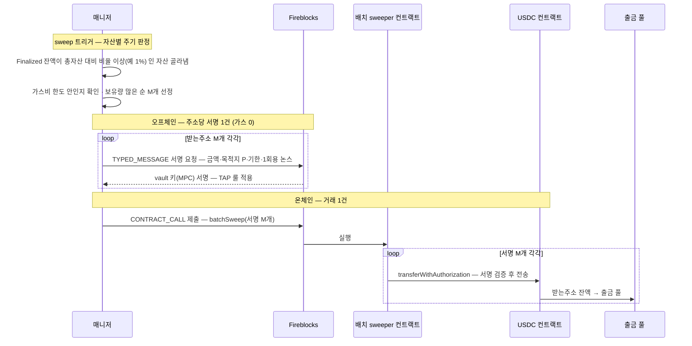
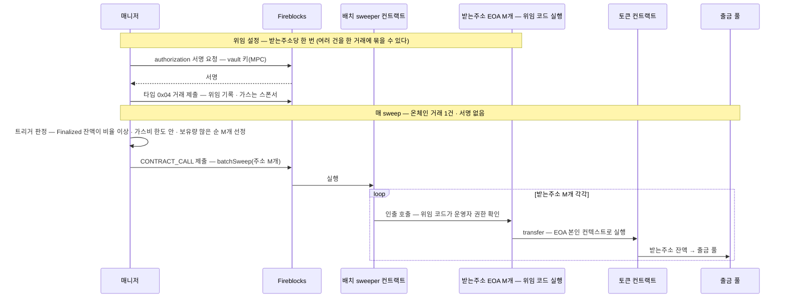

[sweep 설계](06-sweep.md)의 B(배치) 검토를 위한 심화 참고 문서다 — 여러 입금 주소의 자산을 **온체인 거래 한 건**으로 모으는 일이 왜 어렵고, 가능하게 하는 방법이 무엇인지를 바닥부터 설명한다. 설계 결정은 06 이 하고, 이 문서는 그 판단 재료다.

## 1. 문제의 뿌리 — ERC-20 은 보유자만 보낸다

ERC-20 의 `transfer` 는 **호출한 계정(msg.sender)의 잔액**을 옮긴다. 받는주소 100개의 USDC 를 모으려면 원칙적으로 100개 주소가 각자 거래를 보내야 한다 — 그래서 벤더의 sweep 도 vault 당 거래 1건이다.

배치 컨트랙트 하나가 100개 주소의 잔액을 움직이려면, 각 주소가 "내 돈을 옮겨도 된다"는 **권한 증명**을 어떤 형태로든 줘야 한다. 배치 sweep 의 설계는 결국 **이 권한 증명을 무엇으로 만드느냐**의 선택이다. 방법은 셋이다:

| | 권한 증명 | 한 줄 요약 |
|---|---|---|
| 방법 1 — EIP-3009 | **1회용 전송 지시 서명** | "금액 X 를 주소 P 로, 기한 T까지" 를 서명 — 서명 자체가 전송 지시 |
| 방법 2 — EIP-2612 | **한도 부여 서명** (permit) | "컨트랙트 S 가 내 토큰 X 만큼 쓸 수 있다" 를 서명 — 이후 S 가 transferFrom |
| 방법 3 — EIP-7702 | **코드 위임** | 내 계정이 위임한 코드가 잔액을 움직인다 — 서명은 위임 설정 때 한 번 |

셋 다 서명은 **오프체인**(가스 0)이고, 온체인 거래는 배치 컨트랙트를 부르는 **1건**이다.

## 2. 가스 구조 — 배치가 자동으로 싸지지 않는 이유

거래 한 건의 비용 = **고정비**(기본 21k gas + 서명·calldata) + **실행비**(토큰 이동 자체, ERC-20 ~45k 안팎). 배치가 아끼는 건 고정비인데, 주소마다 **권한 증명을 검증하는 비용**이 새로 붙는다.

| 방식 | 주소당 비용 구조 | 대략치 |
|---|---|---|
| 개별 전송 (기준) | 고정비 21k + 실행 ~45k | ~66k |
| 배치 + 서명 증명 (3009·2612) | 서명 검증(ecrecover ~3k) + 논스 기록(~20k대) + 실행 ~45k | **~70k대 — 절감이 미미하거나 역전** |
| 배치 + 상시 권한 (7702 운영자) | 권한 확인(~수 k) + 실행 ~45k | **~50k — 진짜 절감** |

즉 **"배치 = 가스 절감"은 상시 권한 방식에서만 성립**하고, 서명 방식 배치의 이득은 가스가 아니라 다른 데 있다 — 제출·추적할 온체인 tx 가 1건(가스비 싼 창을 확실히 잡음, 실패 관리 단순), 그리고 방식에 따라 벤더 호출 감소. 수치는 대략치라 실제 채택 전 실측이 필요하다.

## 3. 방법 1 — EIP-3009 transferWithAuthorization

USDC(Circle v2+, 이더리움·Base)가 네이티브로 지원하는 기능. 보유자가 **"금액 X 를 주소 P 에게, 유효기간 T, 1회용 논스 N"** 을 EIP-712 typed 서명으로 만들어 주면, **누구든** 그 서명을 토큰 컨트랙트에 제출해 전송을 실행할 수 있다.

핵심 성질:

- **목적지가 서명에 묶인다** — 배치 컨트랙트가 해킹돼도 서명된 목적지(출금 풀) 밖으로는 못 보낸다.
- **1회용·기한부** — 논스가 한 번 쓰이면 끝, 기한이 지나면 무효. 상시 권한이 남지 않는다.
- **논스가 32바이트 랜덤** — 순서 제약이 없어 M개 서명을 병렬로 만들고 아무 순서로 실행해도 된다 (아래 6절 논스 비교).

## 4. 방법 2 — EIP-2612 permit

"컨트랙트 S 에게 내 토큰 X 만큼의 사용 한도(allowance)를 준다"를 typed 서명으로 만들고, 배치 컨트랙트가 `permit(서명)` → `transferFrom` 두 단계로 가져간다. 3009 와 비교했을 때의 차이만 보면 된다:

| | 3009 | 2612 |
|---|---|---|
| 서명이 정하는 것 | 금액 + **목적지** + 기한 | 금액 + **쓸 컨트랙트** + 기한 — 목적지는 컨트랙트 로직 몫 |
| 실행 후 잔여 | 없음 (1회용) | transferFrom 이 부분 실행되면 **allowance 잔여** 가능 — 관리 필요 |
| 논스 | 랜덤 — 순서 무관 | **소유자별 순차** — 같은 주소의 permit 두 장을 한 배치에 순서 없이 못 싣는다 |
| 토큰 지원 | 3009 지원 토큰만 (USDC O) | 2612 가 더 흔함 — 3009 없는 토큰의 차선 |

수탁 관점에서는 3009 가 우선이고, 2612 는 **3009 를 지원하지 않는 토큰의 차선책**이다.

## 5. 방법 3 — EIP-7702 코드 위임

2025년 Pectra 업그레이드로 이더리움 프로토콜에 들어간 기능이다(Base 등 채택 EVM 포함). **EOA 가 주소·키·잔액을 그대로 유지한 채 컨트랙트 코드를 빌려 쓰게** 한다 — 계정 종류가 바뀌는 게 아니라 코드만 위임된다.

**위임 설정 (한 번)** — EOA 소유자(수탁 모델에서는 vault 키 = MPC)가 authorization tuple `[chain_id, 위임 대상 주소, nonce, 서명]` 을 만들고, 누군가(스폰서)가 이를 새 거래 타입 0x04 에 실어 제출하면, 프로토콜이 그 EOA 의 코드 자리에 위임 지정자(`0xef0100 ‖ 대상주소`)를 기록한다. 이후 이 EOA 를 호출하면 **위임 대상 컨트랙트의 코드가 EOA 본인의 컨텍스트에서 실행**된다 — 잔액·스토리지는 EOA 것. 한 거래에 authorization 여러 건을 실을 수 있어 **대량 받는주소의 위임 설정을 묶어서** 할 수 있다.

**배치 sweep 이 되는 원리** — 위임된 코드는 그 EOA 의 잔액을 움직일 수 있다. 위임 코드에 "지정 운영자(배치 sweeper)의 인출 호출을 허용한다"는 규칙이 들어 있으면, sweeper 가 각 받는주소를 호출해 그 주소 본인으로서 `transfer` 를 실행한다 — **매 sweep 서명이 필요 없고, allowance 도 필요 없고, 토큰이 무엇이든 된다**(3009·2612 같은 토큰 확장 불필요).

성질:

- **sweep 1회당 벤더 호출 1건** (3009·2612 는 서명 M건이 남는다) · 주소당 gas 도 최저(~50k) — 권한 검증이 서명 복원 없이 규칙 확인뿐이라서.
- **대가는 상시 인출 권한** — 위임은 영속이다(자동 만료 없음 · 해제는 0 주소로 재위임). 1회용 서명 모델과 달리 "언제든 뺄 수 있는 권한"이 서 있는 상태가 되고, **어떤 코드를 위임하느냐가 보안의 전부**다.
- **주소·키 불변** — 입금 주소 재발급·재고지가 필요 없다. 수탁 모델에서 7702 노선의 최대 이점.
- **Fireblocks 접점** — Universal Gasless 가 이미 이 메커니즘으로 vault 를 upgrade 한다(첫 gasless 거래 때 위임 설정). 단 위임 서명은 vault 키(MPC)로만 만들 수 있어 반드시 벤더를 거치고, **벤더는 자기가 만든 지갑 코드로만 위임시킨다**(Vault account upgrade policy — 위임 코드는 잔액을 전부 뺄 수 있어서 벤더가 통제). 따라서 배치가 되려면 **벤더의 그 지갑 코드에 "지정 운영자의 인출 실행" 기능이 있거나, 우리 코드 위임을 예외 허용해야** 한다 — 어느 쪽인지 미확인(벤더 문의 ③).

## 6. 논스 4종 — 헷갈리기 쉬운 지점

배치 sweep 논의에 서로 다른 논스 네 개가 등장한다. 섞으면 안 된다:

| 논스 | 어디 있나 | 성질 | 배치에서의 의미 |
|---|---|---|---|
| **계정 논스** | 체인 계정 레코드 | 거래마다 1 증가 | **제출 계정**의 직렬화 지점 — 연속 배치 loop 가 이 계정을 공유하면 제출 순서 관리 필요 |
| **3009 논스** | 토큰 컨트랙트 (소유자별 사용 기록) | 32바이트 랜덤 · 1회용 | 순서 무관 — 병렬 서명·임의 순서 실행 가능 |
| **2612 논스** | 토큰 컨트랙트 (소유자별 카운터) | 순차 증가 | 같은 소유자의 permit 은 순서대로만 유효 |
| **7702 논스** | authorization tuple | 계정 논스와 연동 | 위임 설정 때만 관여 — 매 sweep 과 무관 |

## 7. 모든 방법의 공통 함정 — 외부발 인출의 감지

세 방법 모두 결과는 같다: **vault 가 스스로 보낸 거래 없이 잔액이 빠진다** — "EOA 잔액은 본인이 보낸 거래로만 줄어든다"는 오랜 전제가 깨지는 지점이다(7702 는 위임 코드로, 3009·2612 는 서명만 있으면 제3자 거래로 — 같은 결과).

- **Fireblocks 가 이 인출을 거래로 기록하고 웹훅을 내는가** — 배치 sweep 감지·대사의 성립 조건. DeFi 에서 vault 가 approve 한 컨트랙트가 나중에 pull 하는 선례가 이미 있어 가능성은 있으나, 확인 전엔 미정 (벤더 문의 ②).
- 배치 tx 를 운영 vault 의 CONTRACT_CALL 로 제출하면 그 거래의 **networkRecords** 에 M개 이동이 담긴다 — `transaction.network_records.processing_completed` 구독 검토가 여기서 실질 의미를 가진다 ([감지 상세](99-detection-detail.md) 이벤트 표).
- 부분 실패: 컨트랙트는 불량 항목을 revert 말고 **skip + 이벤트**로 남겨야 한 건 때문에 배치 전체가 죽지 않는다 — 성공/실패 집계는 영수증 로그를 읽어 `bcm_swp_trgt` 를 건별 정리.

## 8. 비교 한 장

| | 3009 | 2612 | 7702 운영자 |
|---|---|---|---|
| 상시 권한 | 없음 | 거의 없음 (allowance 잔여 관리) | **있음 — 영속** |
| 목적지 고정 | **서명에 묶임** | 컨트랙트 로직 몫 | 위임 코드 몫 |
| sweep 1회당 벤더 호출 | M(서명)+1(제출) | M+1 | **1** |
| 주소당 gas | ~70k대 | ~75k대 | **~50k** |
| 토큰 조건 | 3009 지원 (USDC O · KRWK 미확인) | 2612 지원 (USDC O · KRWK 미확인) | 무관 |
| 벤더 의존 | TYPED_MESSAGE 서명 (지원 확인됨 · [문서](https://developers.fireblocks.com/reference/sign-typed-messages-for-ethereum-and-evm-networks)) | 동일 | 위임 코드 구현 (미확인) |

읽는 법 — **안전(1회용·목적지 고정)을 잡으면 서명 M건이 남고(3009), 호출·가스 최소를 잡으면 상시 권한을 감수한다(7702).** 어느 쪽이 맞는지는 06 의 설계 결정이다.

**토큰 조건의 정확한 뜻** — 3009·2612 는 ERC-20 표준이 아니라 발행자가 배포 때 넣는 **선택 확장**이다. 최소 스펙(transfer/approve 만)으로 배포된 토큰이면 그 자산의 배치는 7702(토큰 무관 — 계정 쪽 기능)나 approve 방식만 남는다. 불변 컨트랙트면 나중에 확장을 추가할 수도 없다 — **원화 SC 발행 스펙에 관여할 수 있는 단계라면 EIP-3009(+2612) 포함을 발행 요구사항으로 넣는 것이 최선**이다(구현 비용은 표준 라이브러리 수준).

## 9. 확인 목록

- **벤더** ① TYPED_MESSAGE 대량 서명의 TAP 통제·성능(분당 처리량) ② 외부발 인출(서명 pull)의 거래 기록·웹훅 여부 ③ (7702 노선) 위임 코드의 운영자 pull 지원.
- **발행사** ④ 자산별 EIP-3009/2612 지원 여부 — 원화 SC 를 여럿 다루므로 **자산 온보딩마다 판정**한다. 미지원 자산은 개별 전송(A) 또는 7702 만 남는다. 발행 스펙에 관여 가능한 자산(KRWK — 스펙 미정)은 3009 포함을 요구사항으로.
