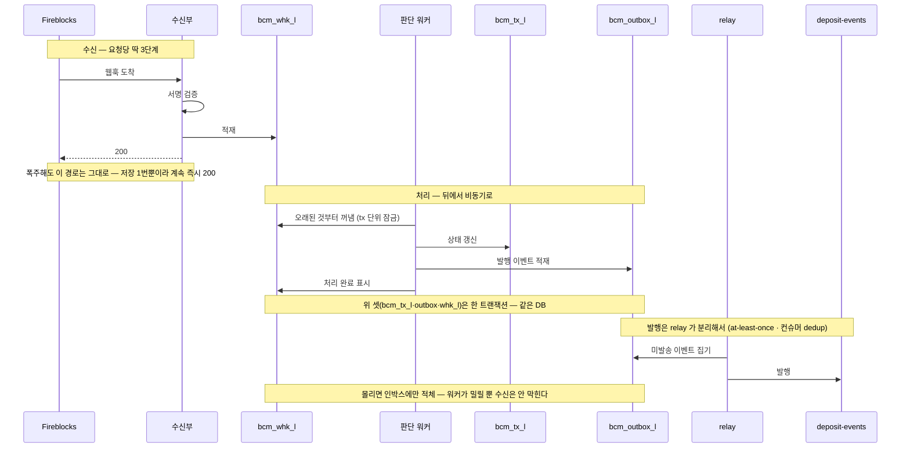
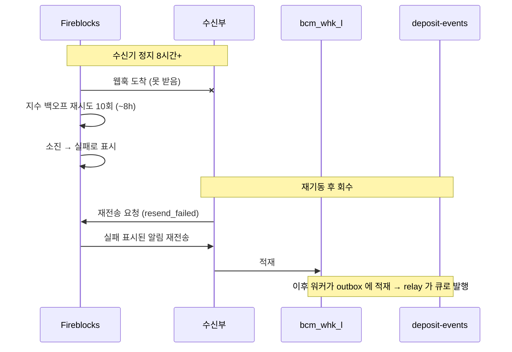
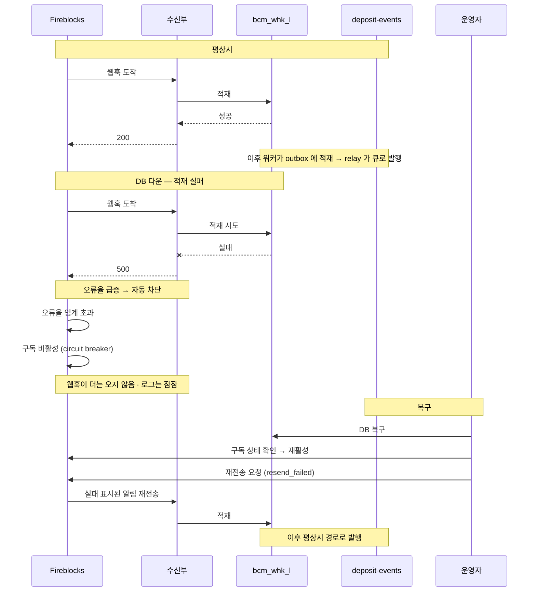
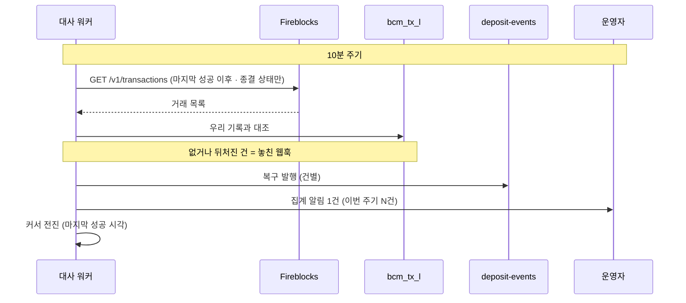

[흐름](02-bcm-flow.md) 감지 절의 심화 참고 문서다 — 웹훅이 **한꺼번에 몰릴 때**와 **놓쳤을 때**를 어떻게 견디는지만 따로 모았다. 본 흐름 이해에 필수는 아니고, 구현·부하 설계 때 본다.

이 문서의 수신부·판단 워커·relay는 모두 독립 실행물 **BCM Webhook**의 책임이다. 업무 REST API인 `bcm-api`와
PostgreSQL·Kafka 계약은 공유하지만 endpoint·scheduler·프로세스 수명은 공유하지 않는다. 따라서 Webhook 장애·배포가 업무 API
재기동을 요구하지 않고, API만 살아 있는 상태를 Webhook 정상으로 오판하지 않도록 health·로그·경보도 구성 요소별로 분리한다.

## 입금이 몰릴 때 — 수신은 3단계, 처리는 뒤로

도착 속도는 벤더가 정한다. EVM 입금 통지는 채굴 시점에 생성돼 **블록 단위로 뭉쳐 온다** — 부하는 평균이 아니라 **체인별로 몰리는 양을 더해서** 잡는다.

- **이더** — 약 12초마다 블록. 그 블록에 담긴 tx 들이 한꺼번에 온다 (예: 10분 1만 건이면 블록당 ~200 tx).
- **Base** — 약 2초마다 블록. 뭉치는 작아도 **6배 잦아** 스트림이 촘촘하다.

두 체인이 겹쳐 오고, 여기에 **tx당 알림 수**가 곱해진다 — 생애 2~3개(created·CONFIRMING·COMPLETED)인지 **컨펌마다**인지에 따라 순간치가 몇 배로 갈린다(미확인). 새 체인이 붙으면 그만큼 더해진다. **정확한 순간 최댓값은 부하테스트로 확정한다.**

버티는 방법은 하나다 — **받는 일과 처리하는 일을 나눈다.** 수신부는 요청당 딱 3단계만 하고, 무거운 판단·발행은 뒤의 워커가 맡는다.

| 단계 | 수신부가 하는 일 |
|---|---|
| 서명 검증 | 진짜 벤더가 보낸 게 맞는지 확인 (공개키는 캐시에서만 읽어 네트워크 왕복 0) |
| 수신 적재 | 알림 원본을 인박스 테이블(`bcm_whk_l`)에 저장. 같은 알림이 또 오면 키 충돌로 자동 무시 |
| 200 응답 | 저장 성공 즉시 "받았다" 응답 |

★ **본문 바이트는 한 번만 읽어 세 곳에 같은 배열을 쓴다** — 서명 검증 · 원문 저장(`payload`) · 해시 계산(`payload_hash`). 중간에 문자열이나 JSON 으로 바꿨다 되돌리면 바이트가 달라져 서명이 맞지 않고, 나중에 원문임을 증명할 수도 없다(2026-08 PoC 실측). 서명 헤더 원문도 이때 `sign_vl` 에 함께 남긴다 — 셋 다 수신 시점에만 만들 수 있다. 상세는 [DB](03-bcm-db.md) 의 `bcm_whk_l`.

"캐시에서만 읽어 왕복 0"에는 전제가 있다 — **JWKS 를 처음(또는 키 로테이션 때) 가져오는 조회는 외부 I/O 라서, 짧은 타임아웃(수 초)을 걸고 요청 처리 스레드 밖(워커 스레드)에서 해야 한다.** 타임아웃 없이 요청 스레드에서 돌면 외부 통신이 막힌 순간 벤더 재시도가 올 때마다 스레드가 하나씩 잠기고, 헬스체크에도 응답하지 못해 **폭주가 아닌 평시에도 수신기가 재시작을 반복한다** (2026-08 PoC 에서 실제로 겪었다).

요청당 비용이 "저장 한 번(수 ms)"으로 고정이라, 아무리 몰려도 **수신부는 멈추지 않고 계속 즉시 응답**한다. 이게 핵심인 이유 — 벤더는 우리가 응답을 자꾸 못 하면 웹훅을 아예 꺼버리기 때문이다(circuit breaker). 판단 워커는 인박스에 쌓인 걸 오래된 것부터 집어가고, 필요하면 여러 대로 늘릴 수 있다. **폭주의 대가는 "처리 지연"뿐이고, 유실은 없다.**

무거운 일은 판단 워커가 뒤에서 맡는다:

| 단계 | 판단 워커가 하는 일 |
|---|---|
| 집기 | 인박스(`bcm_whk_l`)에서 미처리 알림을 오래된 것부터 꺼낸다 — **tx 단위 잠금**으로 같은 tx 의 동시 처리·대사 겹침을 막는다 |
| 분류·귀속 | 방향을 가린다(발신자가 우리 vault? 목적지가 매핑된 입금 주소?) + accountId 귀속(주소→계정 조회) |
| 전이 비교 | 마지막 발행 상태(`bcm_tx_l.last_pub_stcd`)와 견줘 **[허용 전이 표](02-bcm-flow.md)에 있는 전이만** 가려낸다 (중간 컨펌 갱신은 기록만 · `cnfm_cnt` 는 큰 값으로만 갱신) |
| 원자 기록 | **한 트랜잭션**으로 `bcm_tx_l` 갱신 + `bcm_outbox_l` 에 발행 이벤트 적재 + 알림 처리 완료(`prcs_stcd=S`)를 함께 커밋 |

**판단이 계속 실패하는 알림은 격리한다** (2026-08-06 확정). 파싱 실패나 판정 예외가 나면 그 알림은 미처리로 남아 다음 주기에 또 집히고, 고쳐지지 않는 원인이면 영원히 반복된다. `bcm_whk_l.prcs_stcd` 를 `P`(미처리) · `S`(처리완료) · `F`(격리) 셋으로 두고, 실패마다 `rtry_cnt` 를 올려 상한을 넘으면 `F` 로 옮기고 `err_msg` 에 사유를 남긴 뒤 **경보한다**. 워커는 `P` 만 집으므로 격리된 건은 다시 집히지 않는다. 원본(`payload`·`payload_hash`·`sign_vl`)이 남아 있어 원인을 고친 뒤 `P` 로 되돌리면 재처리된다. 발행 outbox 의 `evnt_stcd`·`rtry_cnt`·`err_msg` 와 같은 모양이라 다룰 개념이 하나다.

★ **격리는 유실이다** — `F` 로 옮긴 건은 그 tx 의 상태 변화가 큐로 나가지 않았다는 뜻이다. 경보를 반드시 사람이 받아야 하고, 놓쳐도 [tx 대사](#tx-대사--놓친-웹훅을-잡는-최종-안전망)가 뒤늦게 잡는다.

발행 자체는 워커가 하지 않는다 — 별도 **relay** 가 `bcm_outbox_l` 의 미발송 이벤트를 큐로 내보낸다. 왜 이렇게 나누는지는 아래 "이중처리는 어떻게 막나" 절.

relay 에는 순서 요건이 하나 있다 — **같은 계정(파티션 키) 안에서는 `evnt_id` 순으로 순차 발송**해야 한다. 파티션 키는 **큐에 들어간 순서**만 보장하므로, relay 가 병렬로 내보내면 같은 tx 의 감지·확정이 뒤바뀐 순서로 큐에 담긴다. 계정이 다르면 병렬로 보내도 된다.

받는 즉시 200, 무거운 처리는 뒤 워커로 — 호출 순서로 보면:



색: **보라 = 벤더가 보낸 웹훅 도착 · 청록 = DB 테이블 · 노랑 = 메시지 큐.** 아래 복구 절의 그림들은 발행을 효과로 축약한다 — outbox·relay 단계는 이 그림과 [DB 문서](03-bcm-db.md) 입금 그림에 있다.

```anim
db
hook: Fireblocks 웹훅 | 도착
table: bcm_whk_l | 알림 | 처리
table: bcm_tx_l | 거래 | 상태
table: bcm_outbox_l | 이벤트 | 발송
queue: deposit-events | 발행
step: 평상시 — 수신·워커 | 수신부가 저장하고 200 · 워커가 처리해 tx 행을 만들고 outbox 에 적재한다 (whk_l 완료 표시까지 한 트랜잭션)
ins: Fireblocks 웹훅 | 입금 감지
ins: bcm_whk_l | n-01 | 완료
ins: bcm_tx_l | tx-01 | CONFIRMED
ins: bcm_outbox_l | ev-01 | P
step: 평상시 — relay 발행 | relay 가 미발송(P)을 큐로 보내고 S 로 표시한다
ins: deposit-events | 감지
upd: bcm_outbox_l | 1 | 발송=S
step: 폭주 — 웹훅이 쏟아진다 | 블록 뭉치로 웹훅이 한꺼번에 도착 — 수신부는 저장만 하고 즉시 200 (멈추지 않음)
ins: Fireblocks 웹훅 | 입금 감지
ins: Fireblocks 웹훅 | 입금 감지
ins: Fireblocks 웹훅 | 입금 감지
ins: bcm_whk_l | n-02 | 대기
ins: bcm_whk_l | n-03 | 대기
ins: bcm_whk_l | n-04 | 대기
step: 적체 소화 — 워커 | 수신은 계속 받고, 밀린 알림 셋을 워커가 오래된 것부터 처리한다 — tx 행을 만들고 outbox 에 적재(P)
upd: bcm_whk_l | 2 | 처리=완료
upd: bcm_whk_l | 3 | 처리=완료
upd: bcm_whk_l | 4 | 처리=완료
ins: bcm_tx_l | tx-02 | CONFIRMED
ins: bcm_tx_l | tx-03 | CONFIRMED
ins: bcm_tx_l | tx-04 | CONFIRMED
ins: bcm_outbox_l | ev-02 | P
ins: bcm_outbox_l | ev-03 | P
ins: bcm_outbox_l | ev-04 | P
step: 적체 소화 — relay 발행 | relay 가 미발송(P)을 차례로 큐로 보내고 S 로 표시한다
ins: deposit-events | 감지
ins: deposit-events | 감지
ins: deposit-events | 감지
upd: bcm_outbox_l | 2 | 발송=S
upd: bcm_outbox_l | 3 | 발송=S
upd: bcm_outbox_l | 4 | 발송=S
step: 정상 복귀 | 적체가 다 비워졌다 — 대가는 처리 지연뿐, 놓친 건 없다
```

**트랜잭션 이벤트는 5종**, 초기 범위에서는 **3종을 구독**한다:

| 이벤트 | 무엇을 알리나 | 구독 |
|---|---|---|
| `transaction.created` | tx 가 처음 생김 — 신규 감지(입금 등장)의 시작 | O |
| `transaction.status.updated` | 상태 전이(예: CONFIRMING → COMPLETED) — 확정·무효 이벤트 발행의 주 신호 | O |
| `transaction.approval_status.updated` | 승인 상태 변화 — 정책·승인 흐름 진행(주로 출금) | O |
| `transaction.alert.stuck` | EVM vault+base asset에서 `CONFIRMING`으로 막힌 head-of-queue와 `txHash`·권장 `BOOST_TRANSACTION`을 알림 | 초기 X — 주기 DB 점검이 correctness 기준. 운영에서 안정성을 확인하면 후보 발견을 앞당기는 보조 신호로 추가하되 이 이벤트 유실만으로 막힘을 놓치지 않게 한다 |
| `transaction.network_records.processing_completed` | 한 거래가 **여러 원천 이동을 포함할 때** network records 처리가 끝났음을 알린다 | **O — approve + transferFrom 배치 sweep의 항목별 대사 트리거. 일반 고객 이벤트로는 발행하지 않는다** |

부하 검증 항목은 p99 응답(1초 이내 목표) · 오류율(circuit breaker 감안 ~0) · 적체 소화 속도.

### 배치 sweep 결과 판정 — 최상위 1건을 항목 N건으로 펼친다

`SWEEP_BATCH`의 Fireblocks 거래와 온체인 tx hash는 하나지만 자산 이동은 N건이다. `transaction.status.updated=COMPLETED`는 컨트랙트 호출이 체인에서 완료됐다는 뜻일 뿐 모든 `transferFrom` 성공을 뜻하지 않는다.

판정 순서는 다음과 같다.

1. 제출 전에 `bcm_swp_exec_l` 1건과 `bcm_swp_item_l` N건을 고정하고 그 목록으로 calldata를 만든다.
2. 최상위 상태가 `COMPLETED`가 되면 실행을 `RECONCILING`으로 바꾼다.
3. `transaction.network_records.processing_completed`를 받으면 보낸 vault 관점의 records를 원천 vault·토큰·금액으로 정규화하고 관점 중복을 제거한다.
4. 같은 tx receipt의 `SweepLeg(executionId, itemSeq, source, requestedAmount, actualAmount, success, failureCode)` 이벤트를 읽는다.
5. 요청 N건, 성공 network records, `SweepLeg` N건을 대조해 항목별 `SUCCEEDED/FAILED`와 실제 금액을 확정한다.
6. 성공 항목은 원천 잔액을 재조회해 비었으면 대상 행을 지운다. 실패하거나 잔액이 남으면 대상 claim을 풀고 `RETRY`로 둔다.

부분 실패 PoC에서는 되돌려진 이동이 network records에 나타나지 않았다. 따라서 **record가 없다는 사실만으로 실패 사유를 만들지 않는다.** 요청 항목과 컨트랙트 이벤트가 항목 집합의 정본이고, network records는 성공 이동 금액과 Fireblocks vault 귀속을 확인하는 근거다. 이벤트가 없거나 세 집합이 맞지 않으면 자동 추측하지 않고 실행을 대사 예외로 격리한다.

웹훅 중복·순서 뒤바뀜은 기존 인박스 멱등을 그대로 쓴다. `network_records.processing_completed`가 최상위 `COMPLETED`보다 먼저 와도 원본을 적재해 두고 두 조건이 모두 충족된 뒤 한 번만 대사한다. receipt 조회 실패는 백오프로 재시도하며, 항목 상태를 성공으로 선반영하지 않는다.

막힘 점검은 이 미구독 때문에 벤더 상태를 추측하지 않는다. DB의 오래된 `SUBMITTED`·`CONFIRMED`는 후보일 뿐이고, boost 직전에 단건 조회로 `CONFIRMING`·`txHash` 있음·0 confirmation을 확인한다. `transaction.alert.stuck`을 나중에 구독해도 같은 재검증을 생략하지 않는다. 상세는 [흐름의 막힘 점검](02-bcm-flow.md#막힘-점검--자동-boost).

## 이중처리는 어떻게 막나 — outbox·멱등·크래시 세이프

돈이 걸린 감지에서 가장 비싼 사고는 **같은 입금을 두 번 반영**(유령 돈)하거나 **놓치는 것**(누락)이다. 재처리·재시작이 이 둘을 만들지 않도록 장치를 겹친다.

**뿌리 문제 — 이중 쓰기.** 워커는 두 가지를 해야 한다: ① `bcm_tx_l` 상태 갱신, ② 큐 발행. 이 둘은 서로 다른 시스템이라 "둘 다 되거나 둘 다 안 되거나"로 못 묶는다. 발행 먼저 → DB 갱신 전 크래시면 재처리 때 **또 발행**(유령), DB 먼저 → 발행 전 크래시면 **영영 발행 안 함**(누락). 순서를 어떻게 잡아도 샌다.

- **장치 1 — 한 트랜잭션(같은 DB).** 워커는 `bcm_tx_l` 갱신과 발행 이벤트의 `bcm_outbox_l` 적재를 **한 커밋**으로 한다. 같은 DB 한 트랜잭션이라 원자적 — 상태와 "발행 예약"이 함께 남거나 함께 사라진다. 발행 결정에 크래시 틈이 없다.
- **장치 2 — relay 가 발송, 컨슈머가 dedup.** 별도 relay 가 `bcm_outbox_l` 의 미발송(`P`) 이벤트를 집어 큐로 보내고 `S` 로 표시한다(at-least-once). 보낸 뒤 표시 전에 중단돼 재발송해도 컨슈머가 `evnt_id` 로 접는다 → 효과는 한 번.
- **장치 3 — per-tx 락 + 전이 비교.** 같은 tx 의 알림 두 건이 동시에 처리되면 둘 다 "새 상태"로 보고 이중 적재할 수 있다. 그래서 tx 단위로 직렬화(집기 때 잠금)하고, `last_pub_stcd` 와의 전이 비교로 앞으로 가는 전이만 outbox 에 넣는다.

크래시가 어디서 나든 재처리 결과:

| 크래시 지점 | 재처리하면 | 결과 |
|---|---|---|
| 200 직후(whk_l 적재됨), 워커 전 | `prcs_stcd=P` → 나중에 집음 | 정상 1회 |
| 벤더가 같은 알림 재전송 | `noti_id` PK 충돌 → 무시 | 이중 없음 |
| 워커 트랜잭션 커밋 전 | 롤백 → `prcs_stcd` 그대로 P → 재처리 | 이중 없음 (원자성) |
| 워커 커밋 후, relay 발송 전 | outbox 미발송분 → relay 복구 후 발송 | **유실 없음** |
| relay 발송 후, `S` 표시 전 | 재발송 → 컨슈머가 `evnt_id` 로 dedup | 이중 효과 없음 |
| 같은 tx 알림 2건 동시 | per-tx 락으로 직렬화 | 이중 없음 |

정리하면 — **correctness 급 멱등은 `bcm_tx_l`(전이 비교) + outbox 원자 커밋 + 컨슈머 dedup 이 함께 보장**하고, `noti_id` PK 는 벤더 재전송을 값싸게 거르는 최적화다. 이 패턴은 코어 DB 의 ADR-002 Outbox 와 같다.

## 웹훅을 놓쳤을 때 — 복구 3겹

웹훅은 유실·지연·순서 뒤바뀜이 있을 수 있다. 세 겹으로 메운다 — 앞의 둘은 벤더 기능이고, 마지막은 우리가 벤더 기록을 직접 대조하는 안전망이다.

| 복구 수단 | 무엇인가 | 언제 |
|---|---|---|
| **벤더 재시도** | 우리가 200 을 안 주면 벤더가 **자동으로 다시 보낸다** — 공식 문서는 지수 백오프 총 10회(합산 ~8시간). **실측(2026-08 [PoC](97-webhook-poc-result.md))은 분 단위 배증**: 첫 재시도 +21~60초 → 1분 → 1분 → 3분 → 6분 → …, 도착이 분 tick(:00)에 정렬. 우리가 할 일 없음 | 수신기가 잠깐 멈췄을 때 자동으로 메워짐 |
| **재전송 API** ([Fireblocks 문서](https://developers.fireblocks.com/reference/resend-webhook-notifications)) | 재시도로도 실패 처리된 알림을 **우리가 "다시 보내줘"라고 요청**하는 벤더 API (`POST /v1/webhooks/{id}/notifications/resend_failed`). 원 이벤트로부터 **30일 내** 가능 · 같은 이벤트는 5분에 1회. 수신기가 오래 정지했다 재기동하면 그 직후 한 번 호출해 정지 구간을 회수. 실측: 응답 `202 {"total":N}` 의 N 은 **호출 시점에 실패 상태인 알림 수만** 집계(이미 2xx 받은 건 제외), 재전송은 다음 분 tick 에 도착 | 수신기가 ~8시간 넘게 정지했을 때 재기동 후 |
| **tx 대사** | 벤더가 **알림을 만들지도 못한 구간**(벤더 장애 등)은 위 둘로 못 메운다. 그래서 우리가 주기적으로 벤더 거래 목록을 읽어 우리 기록과 대조 — 아래 절 | 최종 안전망 (10분 주기 상시) |

"재전송 API"의 요지는 **"벤더는 이미 만든 알림을 우리 요청으로 다시 보낼 수 있다"**는 것이다 — 벤더가 알림 자체를 안 만든 구간만 tx 대사의 몫으로 남는다.

### 재전송 API — 수신기가 오래 정지했다 재기동한 뒤

수신기가 ~8시간 넘게 멈추면 벤더 재시도가 소진돼 그 알림들은 벤더 쪽에서 "실패"로 표시된다. 재기동 직후 재전송 API 를 한 번 호출하면, 벤더가 실패 처리한 알림을 다시 보내 다운 구간을 메운다. 원 이벤트로부터 30일 안, 같은 이벤트는 5분에 한 번 제한이 있다. 벤더가 알림 자체를 안 만든 구간은 여기서 못 메우고 다음 절의 tx 대사가 맡는다.

벤더 재시도가 소진된 뒤, 재기동 후 우리가 회수를 요청하는 순서:



색: 보라 = 웹훅 도착·재전송 요청 · 청록 = 인박스(`bcm_whk_l`) · 노랑 = 큐 · **빨강 깜박임 = 못 받아 유실 위험**.

```anim
db
hook: Fireblocks 웹훅 | 도착
source: 재전송 API | 요청
table: bcm_whk_l | 알림 | 처리
queue: deposit-events | 발행
step: ① 평상시 | 웹훅이 오면 인박스에 적재하고 워커가 처리해 큐로 발행된다
ins: Fireblocks 웹훅 | 입금 감지
ins: bcm_whk_l | n-01 | 완료
ins: deposit-events | 감지
step: ② 수신기 정지 8시간+ — 장애! | 웹훅이 와도 못 받는다 · 벤더 재시도도 소진돼 벤더 쪽에서 "실패"로 표시된다(빨강)
ins: Fireblocks 웹훅 | 입금 감지
ins: Fireblocks 웹훅 | 입금 감지
alert: Fireblocks 웹훅 | 2
alert: Fireblocks 웹훅 | 3
step: ③ 재기동 → 재전송 요청 | 재기동하면 재전송 API 를 한 번 호출해 "전달 실패한 것을 다시 보내줘"라고 요청한다
ins: 재전송 API | resend_failed
step: ④ 벤더가 다시 보낸다 | 벤더가 그 알림들을 다시 보낸다 → 인박스에 적재되고 큐로 발행돼 공백이 메워진다
ins: bcm_whk_l | n-02 | 완료
ins: bcm_whk_l | n-03 | 완료
ins: deposit-events | 감지
ins: deposit-events | 감지
clear: Fireblocks 웹훅 | 2
clear: Fireblocks 웹훅 | 3
```

정지·장애가 어떻게 나든 복구는 "재기동 + 재전송 + (경우에 따라) 웹훅 재활성화"로 수렴하고, 어느 경우도 **유실은 없다**:

| 시나리오 | 그동안 | 복구 | 유실 |
|---|---|---|---|
| 판단 워커만 정지 (수신 정상) | 수신은 200 유지, 적체만 증가 | 재기동 → 밀린 것부터 소화 | 없음 — 가장 안전한 고장 |
| 수신기 정지 ≤ ~8시간 (배포·점검 포함) | 벤더 재시도가 대기해 준다 | 재기동만 하면 재시도가 이어짐 (+ 재전송 1회) | 없음 |
| 수신기 정지 > ~8시간 | 벤더 재시도 소진 → 실패 마킹 | **재전송 API 로 30일 내 회수** | 없음 |
| DB 만 다운 (수신이 500 응답) | 오류율 상승 → **웹훅 자동 차단(circuit breaker) 위험** | 복구 절차: 웹훅 활성 상태 확인 → 재활성화 → 재전송 | 없음 — 재활성화를 빠뜨리면 조용한 정지 |
| 벤더 장애·점검 | 알림 자체가 안 옴 (우리 오류는 0) | 벤더 상태 모니터링이 잡음 → **tx 대사가 최종 안전망** | 대사가 메움 |

### DB 만 다운 — 재활성화를 빠뜨리면 조용한 정지

위 표에서 가장 위험한 줄이다. 인박스 적재가 실패하면 수신부가 200 대신 500 을 준다. 오류율이 오르면 벤더가 웹훅 구독을 스스로 꺼버린다(circuit breaker). 이때부터는 웹훅이 아예 오지 않는데도 우리 쪽 오류 로그는 잠잠해서 알아채기 어렵다 — 재활성화를 빠뜨리면 조용한 정지가 된다. 복구는 DB 를 복구한 뒤 **구독 상태를 확인해 다시 켜고**, 꺼져 있던 구간은 재전송 API 와 tx 대사로 회수한다.

500 → 자동 차단 → 재활성화까지, 행위자 사이 호출 순서:



색: 보라 = 웹훅 도착 · 청록 = 인박스·수신 서버 상태 · 노랑 = 큐 · **빨강 깜박임 = 500 응답·웹훅 차단**.

```anim
db
hook: Fireblocks 웹훅 | 도착
table: bcm_whk_l | 알림 | 처리
table: 웹훅 수신 서버 | 상태
queue: deposit-events | 발행
step: ① 평상시 | 웹훅이 오면 인박스에 적재(200)하고 발행한다 · 수신 서버 정상
ins: 웹훅 수신 서버 | 정상
ins: Fireblocks 웹훅 | 입금 감지
ins: bcm_whk_l | n-01 | 완료
ins: deposit-events | 감지
step: ② DB 다운 — 적재 실패로 500 | 웹훅은 오는데 인박스에 못 넣는다 → 200 대신 500 을 준다(빨강)
ins: Fireblocks 웹훅 | 입금 감지
alert: Fireblocks 웹훅 | 2
step: ③ 오류율 급증 → 웹훅 자동 차단 | 벤더가 오류율을 보고 이 서버로의 웹훅을 꺼버린다(circuit breaker) · 이제 웹훅이 아예 안 온다 — 로그는 잠잠해 알아채기 어렵다
upd: 웹훅 수신 서버 | 1 | 상태=차단
alert: 웹훅 수신 서버 | 1
step: ④ 복구 — 재활성화 + 구간 회수 | DB 복구 후 재활성화해 수신 서버를 되살리고, 차단 구간은 재전송 API·tx 대사로 메운다
upd: 웹훅 수신 서버 | 1 | 상태=정상
clear: 웹훅 수신 서버 | 1
clear: Fireblocks 웹훅 | 2
ins: bcm_whk_l | n-02 | 완료
ins: deposit-events | 감지
```

## tx 대사 — 놓친 웹훅을 잡는 최종 안전망

10분 주기로 벤더 거래 목록을 읽어 우리 기록(`bcm_tx_l`)과 대조하되 **종결된 건만 본다** — 진행 중(`CONFIRMING`·`SUBMITTED`)은 웹훅이 계속 갱신하므로 대사의 몫이 아니고, 놓치면 사고 나는 **종결 결과만** 대조·복구한다. 없거나 뒤처진 종결 건을 **웹훅과 똑같은 처리 경로**로 흘려 복구한다(자금은 건별로 큐에 발행). 동시에 운영 알림도 올리는데, 건별이 아니라 **주기당 1건으로 집계**한다 — 크게 터진 뒤 수백 건이 잡혀도 사람에게 가는 알림은 하나다. 누락이 잡혔다는 것 자체가 웹훅 경로 이상 신호라, 급증할 때만 호출(page)로 올린다.

벤더 목록을 당겨 대조하고, 자금은 건별·운영 알림은 집계로 나누는 순서:



색: 보라 = 웹훅 도착 · 청록 = DB · 노랑 = 큐 · **빨강 깜박임 = 장애·누락**. `bcm_tx_l` 의 "벤더 상태" 칸은 대사가 그 순간 벤더 목록에서 확인한 값이다(저장 컬럼이 아니라 대조용).

```anim
db
hook: Fireblocks 웹훅 | 도착
table: bcm_tx_l | 거래 | 우리 상태 | 벤더 상태
table: bcm_job_m | 대사작업 | 마지막성공
queue: deposit-events | 발행
step: ① 감지 웹훅 도착 | CONFIRMING 웹훅이 와서 우리 기록이 생긴다
ins: Fireblocks 웹훅 | 입금 감지
ins: bcm_tx_l | tx-91c | CONFIRMED | 
ins: bcm_job_m | tx-대사 | 11:50
step: ② 확정 웹훅 유실 — 장애! | COMPLETED 웹훅이 오지 않는다 — 우리 상태가 CONFIRMED 에 멈춰 빨갛게 경보
alert: bcm_tx_l | 1
step: ③ tx 대사 — 벤더 목록 대조 | 대사가 벤더 목록에서 이 거래를 확인 → 벤더는 COMPLETED, 우리는 CONFIRMED (한 줄에서 불일치가 보인다)
upd: bcm_tx_l | 1 | 벤더 상태=COMPLETED
step: ④ 복구 발행 | 웹훅과 같은 경로로 확정을 발행하고 운영 알림도 올린다 → 우리 상태를 맞추고 경보 해제
upd: bcm_tx_l | 1 | 우리 상태=FINALIZED
clear: bcm_tx_l | 1
ins: deposit-events | 입금 확정
step: ⑤ 커서 전진 | 마지막 성공 시각을 앞으로 — 다음 대사는 여기서 이어붙여 공백이 없다
upd: bcm_job_m | 1 | 마지막성공=12:00
```

- **종결된 건만 대조한다** — `COMPLETED`(입금 finality)와 종결 실패(`FAILED`·출금 `REJECTED`·`BLOCKED`)가 대상이다. 진행 중(`CONFIRMING`·`SUBMITTED`)은 웹훅이 갱신하니 그냥 두고, 입금 `REJECTED`(동결·보류)는 비종결이라 제외한다. 대사의 책임은 중간 컨펌까지 벤더와 맞추는 게 아니라 **종결 결과를 하나도 놓치지 않는 것**이다.
- **대조 범위** = 최근 1시간과 마지막 성공 대사 시각 중 이른 쪽부터 — 대사가 오래 멈춰도 재기동하면 공백 없이 이어붙는다(마지막 성공 시각은 `bcm_job_m` 이 들고 있다).
- **웹훅과 같은 처리 경로를 쓴다** — 대사가 잡은 건도 per-tx 락·전이 비교·outbox 적재를 그대로 지나므로(relay 가 발행) 이중 반영이 없다.
- 호출량은 주기당 목록 조회 1~수 회라 벤더 한도에 영향이 없다.
