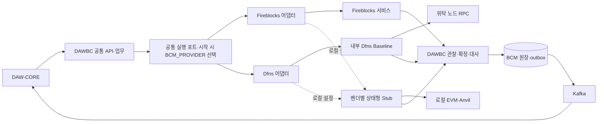

# Fireblocks·Dfns·로컬 블록체인 호환 계획

작성일: 2026-09-14. 상태: **Fireblocks·Dfns·로컬 호환을 첫 목표로 조정, 멀티체인 실구현 후속·기반 인터페이스 구현 시작/Dfns 수용 미착수**.
**첫 번째 목표는 Fireblocks(파블)·Dfns·로컬 블록체인을 같은 BCM 업무 계약으로 사용할 수 있게 하는 것이다.**
Fireblocks와 Dfns를 지원 대상으로 유지하고 로컬에서도 실제 체인 실행·이벤트·복구를 검증한다. 멀티체인 실구현은 후속 과제다.
이 문서는 작업 순서와 검증 기준이며 현행 [설계 정본](design/README.md)·[HTTP 계약](api/openapi.yaml)을 대체하지 않는다.
착수 결과: [29 API·24영역 인벤토리](design/evidence/92-provider-compatibility-inventory.md),
[제공자 선택·공통 포트 계약](design/12-provider-compatibility.md). 첫 구현은 `VendorExecutionLimits`와 API/BAT 5개 조립 지점의 구체 벤더 의존 분리다.
후속으로 Fireblocks/로컬 선택 조립·웹훅 공통 경계·`WalletCreationPolicy` 분리를 구현했다.
네트워크 지갑의 생성·조회 공통 포트와 보수적 회수 판정도 구현했다. [지갑 계약](design/13-dfns-contracts.md)의 내부 인터페이스이며, 그 Dfns 실행 어댑터는 이후 `DfnsClientConfig`가 `bcm.provider=dfns`에서만 조립한다.
V22에는 생성 의도·조회 페이지/후보·완료 지갑을 저장하고 최초 제출 권한·회수/완료 원자성을 검증했다.
V23 계정 모델·논리 계정 예약과 내부 지갑 생성/회수 서비스를 구현했다. 이후 V24 증적 저장소, Dfns HTTP 어댑터, 공개 계정·주소 API 연결(`DfnsAccountConfig`)까지 조건부 조립으로 구현했다 — 거래·출금·Sweep·Admin 조회는 후속이고 전체 기동 차단은 유지된다.
[DB 원천 binding](design/03-bcm-db.md#제공자-원천-binding--후속-물리-계약)은 V21·조회 Repository·세 앱 기동 guard까지 구현했다. 실제 원천 등록/권한 설정·운영 적용은 미수행이다.
Dfns 채택 완료나 운영 전환 승인으로 해석하지 않는다. 작업 현황은 [PLAN](../PLAN.md), 인계는 [PROGRESS](../PROGRESS.md)에서 관리한다.

2026-09-14 사용자 정정: API 명세는 Dfns 공식 홈페이지에서 직접 확인한다. 공식 현재/버전별 OpenAPI를 다운로드·파싱했으며
[계약13의 출처·버전·해시](design/13-dfns-contracts.md#공식-openapi-재확인과-구현-근거-2026-09-14-사용자-정정)를 기록했다.
공개 명세를 근거로 어댑터·계약 테스트 개발을 진행한다. 실제 Baseline 버전 대조·명세에 없는 보장·서명 원문은 운영 연결 전 수용 항목으로 구분한다.

## 1. 완전 호환의 정의

**DAW-CORE가 사용하는 API·이벤트·멱등성과 운영자가 의존하는 통제·복구 결과를 보존한다.**
벤더 제품의 모든 기능을 복제하는 것이 아니라, BCM의 전체 계약을 충족하는 것이 범위다.

- 기준 A: 현재 구현된 모든 업무·Admin API, 웹훅 처리, 배치, 비상 운영, 로컬 통합 검증의 회귀 0.
- 기준 B: 기존 API·업무 의미·보안·복구를 세 실행 환경에서 검증한다. 로컬 모사는 실제 MPC/벤더 정책의 수용 증거와 구분한다.
- 별도 후속 책임: 주소별 온체인 잔고·소유/용도 식별·직접 집금(#51)은 계속 추적한다. 기존 기능 호환과 신규 기능 완성은 별도 마일스톤이다.
- 기준 C: 승인한 모든 운영 network·token·주소 역할 조합에서 같은 기준을 통과한다. 한 체인 PoC 성공을 전체 성공으로 일반화하지 않는다.
- 기준 D: 운영 중인 주소·진행 거래·이벤트·예약·allowance·감사 이력이 전환 과정에서 유실되거나 중복 처리되지 않는다.
- `문서상 지원`, `담당자 확답`, `로컬 검증`, `실환경 수용 통과`를 별개로 기록한다. 미확인은 호환 판정이 아니다.
- 필수 기능의 비활성화, 성공 응답만 흉내 내기, 확정 기준 하향, 보안 승인 생략으로 호환율을 올리지 않는다.
- 초기 범위의 기능 호환 완료와 전체 멀티체인 호환 완료를 구분한다. 후속 체인 미구현은 초기 출시를 막지 않으며, 전체 지원으로 표시하지 않는다.

Dfns 실행 환경의 목표 구성은 **노드를 직접 운영하는 인프라 업체 + DFNS baseline + DAWBC + DAW-CORE**다.
이 구성은 지원 대상 중 Dfns 경로이며 Fireblocks 경로나 로컬 실행 환경을 없애는 결정이 아니다.
초기 모델은 **Ethereum(사용자 표현 ETH)·Base·Solana와 각 체인의 스테이블코인**으로 잡는다.
DAWBC는 이 저장소의 BCM 책임에 대응하며 별도 중복 서비스를 신설한다는 뜻이 아니다. ETH는 여기서 체인 지칭이며 스테이블코인 이름이 아니다.
대상 종목은 **USDC·KRWK**로 사용자 확정됐다. 체인별 실제 발행·발행사·contract/mint, baseline의 계약/릴리스별 제공 기능,
기존 주소 유지·실운영 여부, 규모/SLO는 DF0에서 검증·확정한다. 3체인×2종목의 여섯 조합이 이미 발행·지원됐다는 뜻은 아니다.

### 첫 번째 호환 목표 — 세 실행 환경

| 대상 | 역할·연결 | 완료 증거 |
|---|---|---|
| Fireblocks | 기존 어댑터를 공통 포트에 연결하고 계속 지원 | API·이벤트·멱등·집금·운영/복구 회귀, 실제 벤더 통제의 수용 증적 |
| Dfns | 동일 포트에 Dfns Baseline 어댑터 추가 | 같은 업무 시나리오·오류/상태 의미 검증, 내부 API/RPC·실제 승인/대납 수용 |
| 로컬 블록체인 | 외부 벤더 없이 로컬 EVM에서 거래·로그·잔고를 실행하는 개발/검증 환경 | 계정/주소→입금→출금/집금→이벤트→대사, 실패·중복·재시작을 실제 체인 결과로 검증 |

Fireblocks/Dfns는 지갑 실행 제공자, 로컬 블록체인은 체인 실행 환경이라는 차이는 내부 모델에 보존한다.
`provider`와 `chainEnvironment`를 별도로 다루고 검증된 조합만 활성화한다. 세 대상을 하나의 벤더 enum에 억지로 합치지 않는다.
현재 로컬 경로는 `FireblocksClient → 상태형 Fireblocks Stub → Anvil`이며 전용 `RuntimeModeBoundary`가 로컬 자격·endpoint를 검증한다.
이를 재사용하고 Dfns 어댑터용 상태형 Stub도 같은 로컬 체인 시나리오에 연결하는 계획이다. Dfns 전체 플랫폼 설치를 로컬 실행의 선행 조건으로 두지 않는다.
별도 직접 RPC 로컬 어댑터가 필요한지는 DF1에서 기존 구조와 대조한다. 첫 목표가 세 대상 호환이라는 이유만으로 동일한 로컬 실행기를 중복 개발하지 않는다.

로컬은 단순 성공 응답 mock으로 완료하지 않는다. 토큰 이동·receipt·로그·잔고가 실제로 바뀌어야 하며,
벤더 MPC/정책/대납의 모사 여부는 시험 결과에 별도 표시한다. 로컬 결과만으로 실제 벤더 수용 완료라고 보고하지 않는다.
시나리오는 공통 업무 계약을 재사용하고 벤더별 원문 parser·인증은 각 실제 schema/증적에 따라 따로 검증한다.

### 실행 시 환경변수로 제공자 선택

사용자 확정 방식은 **애플리케이션 시작 시 환경변수 값으로 구현 하나를 선택**하는 것이다.
설정 이름은 `BCM_PROVIDER`(`bcm.provider`)다. 현재 Fireblocks/로컬 조건부 조립에 더해 Dfns의 계정·주소·잔액, 자산 등록 관문, 웹훅 수신 프로토콜, 웹훅 **입금** 판단 워커를 `bcm.provider=dfns`에서만 뜨는 조건부 빈으로 구현했다. 거래·출금 제출·Sweep·Admin 조회와 발신 이동 대조는 후속이다. 조립과 무관하게 `dfns` 선택은 여전히 기동을 거절한다 — 차단 해제는 Baseline 수용과 함께 사용자 결정이다.

| 환경변수 | 시작 시 조립할 경로 |
|---|---|
| `BCM_PROVIDER=fireblocks` | Fireblocks 클라이언트·지갑/거래 어댑터·웹훅 검증/parser·조회/대사·수수료 구현 |
| `BCM_PROVIDER=dfns` | Dfns 내부 API 클라이언트와 같은 역할의 Dfns 구현 |
| `BCM_PROVIDER=local` | 로컬 실행 구성: 기존 상태형 Stub→Anvil, 로컬 인증/관찰·복구 설정 |

`local`은 실행 구성의 편의 선택값이며 내부 자산 원장에 실제 벤더 이름으로 저장하지 않는다. 내부 제공자와 체인 환경 구분은 유지한다.
Dfns 어댑터의 로컬 Stub 시험도 별도 테스트 구성으로 유지한다. 공개 선택값을 불필요하게 늘리지 않는다.

- 같은 빌드 산출물을 사용하고 시작 시 선택한 구현만 공통 포트에 주입한다. 업무 서비스가 환경변수를 직접 읽고 분기하지 않는다.
- 변수 값은 하나만 받는다. API key 존재 여부로 제공자를 추정하지 않는다. 미설정/빈 값/알 수 없는 값은 설정 오류로 기동을 중단한다.
- 기존 Fireblocks 실행 스크립트·로컬 배포 예제·CI에는 명시적 선택값을 추가해 기존 구동 경로를 유지한다. 기존 env와의 우선순위/충돌도 DF3에서 검증한다.
- 선택한 제공자의 필수 설정만 검증하고 비선택 클라이언트·웹훅 키 조회·스케줄러는 생성/호출하지 않는다. 비선택 벤더 시크릿은 요구하지 않는다.
- 같은 배포 단위의 API·Webhook·BAT는 동일 선택값과 조직/환경을 사용한다. Admin은 해당 backend를 조회하며 자체 벤더 클라이언트를 만들지 않는다.
- 요청/계정마다 Fireblocks와 Dfns를 선택하는 다중 벤더 routing은 초기 범위에서 제외한다. 환경변수 변경은 재시작 후 적용하고 실행 중 fallback/hot switch는 하지 않는다.
- 저장된 지갑/진행 거래의 원천 식별자는 보존한다. 현재 제공자와 다른 원천의 자금 실행은 거절하며 다른 벤더의 ID로 재제출하지 않는다.
- 연결 대상 변경 자체가 기존 지갑·잔고·진행 거래를 이전하지는 않는다. 실제 이전은 8절의 별도 작업이다.

DF3 완료 증거: 각 선택값으로 애플리케이션 조립 성공, 포트별 구현 1개, 비선택 벤더 호출 0,
비선택 시크릿 없이 기동, 잘못된 값/선택 설정 누락 거절, API/Webhook/BAT 구성 일치, 기존 Fireblocks·로컬 실행 회귀.

### 구현 범위 조정 — 인터페이스 선행

2026-09-14 사용자 후속 지시에 따라 **멀티체인 실구현은 후속으로 미루고, 초기에는 인터페이스와 확장 지점을 먼저 마련한다.**
Ethereum·Base·Solana와 USDC·KRWK는 모델의 목표 범위다. 초기 Dfns 실행은 선택한 EVM 범위부터 진행하는 계획이며,
정확한 네트워크·자산은 DF0에서 고정한다. 기존 Fireblocks의 Ethereum/Base 회귀 범위는 유지한다.

| 구분 | 이번 구현 단계의 범위 | 후속 체인 확장 때 할 일 |
|---|---|---|
| 자산 식별 | 체인/환경·자산 locator·정밀도, 지갑/토큰 계정 구분 계약과 초기 구현 | 추가 체인의 주소 정규화·토큰 등록·조회 어댑터 |
| 거래 확정 | 원시 관찰·체인 증거·업무 확정 정책의 분리, 초기 체인 판단 구현 | Base/Solana 등 추가 체인의 관찰·확정·reorg 판정 |
| 가스 대납 | 견적·지불자·예산·실비·실행 경로 인터페이스와 초기 구현 | 추가 체인의 대납·fee payer·계정 생성 비용 연동 |
| 집금·재시도 | 실행 의도/결과·지원 능력 경계, 기존 EVM 동작 보존 | Solana 집금 프로그램·권한 철회·재제출·노드/E2E·감사 |

미구현 어댑터는 등록·활성화하지 않는다. 지원하지 않는 조합은 외부 제출·서명 전에 명시적으로 거절하고,
빈 성공값·EVM 자동 대체·가짜 확인 수로 처리하지 않는다. 정확한 오류 표현은 기존 OpenAPI 오류 계약과 맞춘다.
아래 3체인 비교표·Solana 상세·P8/P9는 후속 구현 체크리스트다. 초기 선택 체인에 해당하는 항목만 초기 인수 게이트에 적용한다.

### DFNS Baseline의 의미와 참고 범위

사용자가 지정한 waas-wiki `WaaS 도입·구축/Dfns`의 02 배포 백엔드·05 구성도·06 통합 설계·07 계획·08 핵심 계약·09 RPC·10 멀티체인·11 대납·12 API 대응표를 대조했다(2026-09-14).
Baseline은 **고객 환경에 설치하는 전체 Dfns 플랫폼의 배포 프로필**이다. 지갑·키·서명만 제공하는 최소 요금제를 뜻하지 않는다.
제공된 배포 백엔드 자료는 HashiCorp Vault KV/Transit/PKI·Kubernetes 인증/Agent injector,
Kafka SCRAM·PostgreSQL/Redis 비밀번호 인증을 설명한다. 플랫폼 API·정책·인덱싱·MPC coordinator/signer와 전용 데이터 저장소가 운영 범위다.
여기서 HashiCorp Vault는 Dfns의 자산 관리 Vault나 Fireblocks Vault Account와 다른 제품/개념이다.

근거 위치: 로컬 wiki의 `blockchain-manager/docs/WaaS 도입·구축/Dfns/02-deployment-backends.md`, `06-daw-integration-design.md`,
벤더 원본 `blockchain-manager/sources/dfns/2026-09-08__dfns__deployment-backends-baseline-vs-aws-native-v1.0.pdf`.
wiki는 이번 계획의 참고 자료이며 외부 clone·동기화는 개발 선행 조건이 아니다. 위 요약과 이 저장소의 설계·검증 계약으로 작업한다.
사내 데이터센터 전체 배치를 목표로 하되, AWS 외 환경의 공식 지원·배포 키트·계약 릴리스·라이선스 범위는 업체 확인 전이다.
wiki의 제안 자원 수를 확정 용량으로 채택하지 않으며, 노드 외주 계약에 Dfns 플랫폼 운영이 자동 포함되지 않는다.

### 초기 구성의 책임과 인수 조건

아래는 사용자 구성에 따른 역할 설계안이다. 상품 기능의 계약 포함 여부나 노드 업체의 제공 능력이 확인됐다는 뜻은 아니다.

| 구성 요소 | 책임 | DAWBC와의 계약 |
|---|---|---|
| 노드 인프라 업체 | Ethereum·Base·Solana 노드 직접 운영, 동기화·업그레이드·RPC/구독·과거 데이터·장애 복구 | 원시 블록/거래/영수증·slot/commitment·잔고 조회, 이력 보존·누락 회수·제출 능력과 SLA. 업무 귀속·CORE 원장 판단은 하지 않음 |
| DFNS baseline | 고객 환경의 지갑 API·정책·MPC·일반 거래 구성/전파·인덱싱 플랫폼 | 내부 API·Webhook·이력 조회로 연동. 위탁 RPC와 실제 릴리스의 기능·권한·가스·복구를 인수 시험 |
| DAWBC(BCM) | API·자산 식별·실행 의도/요청 조정·확정 판정·온체인 잔고/예약·Sweep·독립 관찰/대사·이벤트 | 체인별 구현을 공통 업무 계약으로 변환. 커스텀 거래 구성은 검증한 경로만 담당. 독립 승인 주체는 요청 프로세스와 자격·배포·권한 분리 |
| DAW-CORE | 고객/회사 소유권 원장·업무 잔액 인정·출금/Sweep 지시·정산 | 기존 API, eventId 소비 멱등·완료 기록, 업무 정책·밴드S 책임 유지 |

기본 입금 경로는 **위탁 노드 → Dfns 인덱싱/Webhook → DAWBC inbox·판단·outbox → CORE**다.
DAWBC의 직접 RPC 조회는 독립 검증·대사·부족한 관찰 보완용이다. 부족한 이력/감지를 확인한 뒤 수집기 개발 범위를 정한다.
체인 사실과 벤더 요청 상태가 불일치하면 각각 보존해 조사하며 Dfns의 Confirmed 문자열만으로 CORE에 FINALIZED를 발행하지 않는다.
Dfns 내부 DB/Kafka와 BCM DB·CORE 업무 Kafka의 스키마·권한·복구 책임을 분리하고 내부 DB/토픽 직접 연동을 기본안으로 두지 않는다.

### 체인별로 분리할 세 가지 계약

아래 확정 판정은 기술 근거를 연결하는 목표 매핑안이다. **업무 상태 FINALIZED와 프로토콜의 finalized는 별개**이며
현행 DCCP/확인 수 정책과의 차이·지연·CORE 반영 조건을 DF1에서 확정한 뒤 구현한다. 이번 계획으로 기존 상태 전이를 변경하지 않는다.

| 구분 | Ethereum | Base | Solana |
|---|---|---|---|
| 자산의 물리 식별 | 환경/chainId + ERC-20 contract | 환경/chainId + ERC-20 contract. Ethereum의 같은 심볼과 별개 | cluster/genesis 식별 + Token Program ID + mint. wallet owner와 token account 분리 |
| 관찰할 거래/이동 | tx hash + receipt + log 위치 + block hash | L2 tx/receipt/log와 L2 block, L1 기준 확정 증거 | transaction signature + instruction/inner instruction 위치 + token account 이동 + slot/block 식별 |
| 감지/확정 | 성공 receipt·canonical block, 정책상 CONFIRMED; FINALIZED는 finalized head에 포함되는지 검증 | L2 포함/필요 시 preconfirmation은 조기 관찰, safe/finalized 및 L1 기준 증거를 구분. L2 포함만으로 FINALIZED 금지 | processed는 조기 관찰, confirmed는 오류 없는 CONFIRMED 후보, finalized+성공 실행은 FINALIZED 후보. slot 수를 EVM 확인 수로 치환하지 않음 |
| 수수료·대납 | ETH 재원, EVM 대납 전략과 승인/배치 실행 검증 | Base의 ETH 재원, L2 실행비·L1 데이터 비용을 포함해 견적/실제값 검증 | SOL fee payer, 우선 수수료·compute budget. 토큰 계정 생성 재원(rent)을 별도 계산 |
| 재제출 | 동일 nonce 대체·원본 선확정·가스 인상 경합 | EVM 대체와 sequencer/노드 지연·확정 경합 | 동일 서명 재방송과 blockhash 만료 후 새 서명 시도를 분리. durable nonce는 별도 지원/잠금/승인 검증 |
| 자금 집금 | 현행 제한 approve+transferFrom 배치 계약 | EVM 메커니즘 공유, 정책·가스·확정 설정은 별도 | SPL 권한·instruction·프로그램 기반 집금 설계를 별도로 확정. Solidity batchSweep/approve(0)를 그대로 적용하지 않음 |

확정 근거: [Ethereum RPC](https://ethereum.org/developers/docs/apis/json-rpc/),
[Base 거래 확정](https://docs.base.org/specifications/transactions/transaction-finality),
[Solana commitment](https://solana.com/docs/rpc). Base 내 전송과 Base→Ethereum 브리지 출금은 다른 업무이며,
초기 3체인 지원 자체가 브리지/CCTP·교환·mint/burn 구현을 뜻하지 않는다.

자산·주소 근거: [Solana token account](https://solana.com/docs/tokens/basics/create-token-account).
Token account는 특정 mint의 잔액을 보유하며 ATA는 owner·mint·Token Program으로 정해지는 대표 주소다.
ATA만 있다고 가정하지 않고 동일 owner의 비ATA token account·동결·폐쇄/재생성도 관찰 범위에 반영한다.
수수료 근거: [Solana fees](https://solana.com/docs/core/fees), [DFNS 대납](https://docs.dfns.co/features/fee-sponsors).
회사 sponsor를 통한 사용자 native 잔액 불필요 경험을 목표로 하되, SOL fee payer와 ATA 생성 payer는 별개일 수 있으므로 둘 다 검증한다.

### 스테이블코인 등록 모델

- 초기 대상 종목은 사용자 확정 **USDC·KRWK**다. 아래 조합은 등록 검증 목록이며 미발행 조합을 임의 토큰이나 브리지 자산으로 대체하지 않는다.
- 내부 불변 asset ID에 체인/환경·표준·contract 또는 mint/Token Program·decimals·발행사·native/bridged 구분·활성 정책을 연결한다.
- 같은 이름·심볼을 같은 온체인 자산으로 합치지 않는다. 같은 발행사의 코인을 CORE 상품으로 묶더라도 DAWBC 잔고·예약·대사는 체인별이다.
- 현행 `(network, symbol)` 공개 계약은 정확한 한 물리 자산에 연결한다. 동일 심볼의 복수 변형을 등록하려면 DF1에서 호환 가능한 식별 계약부터 확정한다.
- contract/mint·decimals는 발행사 공식 목록과 노드 원본으로 대조한다. 임의 주소 예시를 운영 seed로 쓰지 않는다.
- Solana는 SPL Token/Token-2022와 확장 기능, EVM은 pause/blocklist·fee-on-transfer 등 실제 채택 토큰의 동작을 검증한다.
- 수수료 자산 ETH(Base상의 ETH 포함)·SOL은 운영 재원으로 따로 등록한다. 스테이블코인 서비스 범위와 native 잔고 관리 범위를 구분한다.

| 체인 | USDC | KRWK |
|---|---|---|
| Ethereum | 공식 발행 목록·contract·decimals·Dfns 동작 대조 후 등록 | 발행사·배포 여부·contract·decimals·권한 확인 후 등록 |
| Base | native USDC와 브리지 변형 구분, contract·decimals·Dfns 동작 대조 | 발행사·배포 여부·contract·decimals·권한 확인 후 등록 |
| Solana | mint·Token Program·decimals·token account·Dfns 동작 대조 | 발행사·배포 여부·mint·Token Program·decimals·권한 확인 후 등록 |

USDC 등록 근거는 [Circle 공식 주소 목록](https://developers.circle.com/stablecoins/usdc-contract-addresses)을 사용한다.
KRWK는 이름만 확정됐으며 발행사·실제 네트워크는 제공 자료/발행 주체 확인 대상으로 남긴다. 미발행이면 해당 셀의 출시 차단 또는
사용자의 명시적 범위 결정 대상이다. 런타임에서 조용히 제외하고 전체 호환이라고 보고하지 않는다.

### baseline·노드 업체 인수표

| 확인 항목 | 완료 조건 |
|---|---|
| baseline 배포·기능 명세 | 고객 환경 지원·키트/릴리스·라이선스, API/정책/인덱싱/키 복구·ECDSA/Ed25519·대납·감사의 제공 조건 확인 |
| 플랫폼 운영 인수 | K8s·Vault·MPC/keyshares·PostgreSQL·Kafka·Redis의 설치/패치/인증서·자격 교체/백업/복구/당직 담당 지정. 복구 후 키·정책·이력·재인덱싱 일치 입증 |
| 방송 책임 | 일반 전송은 Dfns Transfer의 구성·서명·방송. 커스텀 호출은 Sign & Broadcast 등 검증한 경로. Sign-only/외부 relay가 필요하면 별도 고정 경로로 명세하고 nonce/blockhash/재시도 소유자는 하나로 지정 |
| 자체 RPC 연결 | 개요의 네트워크별 endpoint 설정을 바탕으로 Dfns↔업체 공동 명세 작성. 인증·메서드·지정 RPC 사용 범위·장애 전환·전파·인덱싱·과거 복구까지 실측 |
| Ethereum 노드 | 실행/합의 동기화 상태, safe/finalized head, receipt/log·과거 조회·장애 후 재수집, 제출/nonce 조회 |
| Base 노드 | L2 동기화·safe/finalized head와 L1 데이터 의존 상태·과거 영수증·sequencer 장애 관찰. 단일 EVM 노드와 같은 SLA로 뭉치지 않음 |
| Solana 노드 | commitment별 조회·subscription 재연결, signature/transaction history·inner instructions·token balances·버전 거래 처리·과거 slot 조회 |
| 잔고 스냅샷 | EVM block 기준과 Solana context slot의 의미/일관성 구분. minContextSlot을 특정 과거 slot 조회 또는 동시 스냅샷 보장으로 오해하지 않음 |
| 보존·독립 검증 | 필요한 복구 기간의 원시 데이터·인덱스 보존, endpoint lag/오류/요청 제한·복구 SLA·성능 시험. 두 URL만으로 독립 RPC 조건 충족 판정 금지 |
| 승인 경계 | baseline에 필수 인자 검증을 강제할 방법이 없으면 추가 독립 통제/계약을 확보. 요청 서비스가 자기 서명을 승인하는 방식으로 대체하지 않음 |

노드 업체에는 업무용 서명 키를 제공하지 않는다. 기존 독립 RPC 2곳의 보안 조건은 같은 업체의 실제 운영·장애·데이터 경계가
독립적인지 확인하고, 충족하지 못하면 보조 독립 원천을 확보한다. 계약상 분리된 nonce/slot·서명·가스 기능을 DF2에서 시험한다.

### Solana 집금·결과 모델 설계 게이트 — 후속 확장

EVM의 approve+transferFrom 확정은 EVM 구현에 유지한다. Solana는 같은 업무 결과·승인·상한·회수 가능성을 목표로
SPL 제한 위임과 목적지/실행 의도를 강제하는 프로그램 경로를 먼저 검토한다. 일반 delegate만 주면 목적지 불변 통제가 완성되는 것은 아니다.
프로그램/PDA 권한·token account owner·mint·Token Program·목적지·instruction/계정 목록·실이동량·철회·재실행 방지를 검증하고
배포/업그레이드 권한·독립 감사·운영 STOP까지 후속 MC1/MC2에서 설계·검증한다. 초기 DF1에서는 확장 경계만 정하고 방식을 채택하지 않는다.

Solana 일반 트랜잭션은 instruction 하나가 실패하면 전체 상태 변경이 롤백된다. EVM 부분 성공 배치를 그대로 복제했다고
기록하지 않는다. [Solana 거래 원자성](https://solana.com/docs/core/transactions)
공통 SweepRequest→복수 Execution→고객 Item 구조를 활용해 원자 실행 단위마다 결과를 판정하고, 요청 전체의 부분 성공은
여러 실행 결과로 집계하는 방안을 검증한다. 한 Execution에 여러 tx가 필요하면 현행 1 tx 계약을 임의로 깨지 않고 먼저 모델/API를 검토한다.
실패한 원자 거래의 일부 Item을 성공으로 발행하지 않는다. EVM의 부분 성공 사례는 그대로 회귀 검증한다.
packet/계정 수·compute·서명 수·blockhash 유효기간을 기반으로 배치 크기를 정하고, instruction 추가/ALT 해석·fee payer 변경도 승인 대상에 포함한다.
단순 지갑별 전송으로 자동 대체하지 않는다. 양 체인 계열에서 동등한 통제·업무 결과가 검증돼야 전체 호환이 완료된다.

## 2. 보존할 계약과 현재 의존

근거: [02 거래·이벤트](design/02-bcm-flow.md), [03 DB](design/03-bcm-db.md), [06 Sweep](design/06-sweep.md),
[07 자산](design/07-asset-master.md), [08 Admin](design/08-bcm-admin.md), [09 자산 이동](design/09-asset-map.md).

| ID | 호환 대상 | 전환 작업·완료 증거 |
|---|---|---|
| C01 | 계정 생성·조회 | 기존 accountId/ref와 고객·회사 구분 유지. 응답 유실·동시 생성·저장 실패에도 공개 매핑 1개 |
| C02 | 주소 발급·재조회 | account/network/token 매핑, 동일 주소 공유, Tag/Memo 영속, 생성 의도·회수 원장 보존 |
| C03 | 잔액 응답 | total/available/pending/frozen/locked의 의미와 단위 대조. 미발급 `[]`, 실제 0, vendor drift 오류 구분 |
| C04 | 주소별 온체인 잔고 | PLAN #51: 기준 블록·관찰 이력·이동 증적·예약·외부 cold·소유/용도 식별. 공동 주소 중복 집계 0 |
| C05 | 출금·내부이체 | 주소/관리 계정/등록 목적지, 금액 문자열, 정책·컴플라이언스 입력, 중복 요청·응답 유실 처리 유지 |
| C06 | 거래 조회·목록 | txId/externalTxId/계정 조회, 필터·정렬·안정 커서, 대체 거래 묶음과 과거 Fireblocks 거래 조회 유지 |
| C07 | 입금·출금 이벤트 | DEPOSIT/WITHDRAWAL/INTERNAL 분류, 관리 주소 간 이동 중복 입금 방지, 감지→확정 순서 |
| C08 | 확정·reorg | 네트워크별 CONFIRMED/FINALIZED 의미 유지. 무효화·재포함·FINALIZED 후 새 FAILED 이벤트 검증 |
| C09 | 웹훅 수신 | 원문 바이트·해시·서명 감사, 인증·키 교체, 전달 시도와 논리 사건 중복 구분, 역순·다중 구독 대응 |
| C10 | outbox·CORE 완료 | 상태+outbox+처리 표시 원자성, account 파티션 순서, eventId dedup, 완료 회신·미완료 보관 유지 |
| C11 | DAW Sweep 접수 | 완료된 FINALIZED sourceEvent 귀속, 요청 hash·충돌·다중 요청 합류·분할·STOP 중 접수 계약 유지 |
| C12 | 집금 권한 준비·회수 | EVM 제한 approve/approve(0)·실제 allowance; Solana 제한 위임/철회·프로그램 통제 별도 검증. 구/신 권한 중복 개방 방지 |
| C13 | 배치 집금 실행 | EVM approve+transferFrom, Solana 별도 확정한 집금 경로. 공통 실행 의도 선기록·claim·목적지·운영자·상한·중복 execution 차단 |
| C14 | Sweep 항목 결과 | execution 1:N item, 요청량/실이동량, EVM 부분 성공과 Solana 원자 실행 단위 구분, chainStatus/itemOutcome 분리·재시도·reorg 복구 |
| C15 | 가스·수수료 | Ethereum/Base 대납·SOL fee payer/rent, 견적·실제 비용·native 단위·sponsor 충전/고갈·실패 비용. 법정화폐 정산은 별도 계약 |
| C16 | boost·막힘 점검 | EVM nonce 대체 경합; Solana 동일 서명 재방송·만료 후 새 시도와 원본 확인. 논리 txId 유지, 최종 자산 이동 1회 |
| C17 | 거래 대사·원문 보관 | 벤더별 종결 매핑, 누락 창·페이지 재개·중복 종결 제외, 원문 장기 보관·보존 기간·정리 조건 |
| C18 | 웹훅 수동 복구 | 구독 조회·활성화·누락 회수의 운영 결과 유지. 실제 재전송과 이력 조회/재처리를 구분해 감사 |
| C19 | Network·Asset 관리 | 전체 후보/채택 목록 분리, 정확한 chain/token 식별, decimals·native 연결, 일괄 등록 원자성·실패 index |
| C20 | Vault/Wallet 전체 대사 | 비동기 실행·cursor·재개·bounded memory, 완료 전 MISSING 미확정, 벤더별 원천 분리 |
| C21 | 정책·컨트랙트 운영 | 불변 version/hash·요청/승인/활성화 분리·hard ceiling·독립 검증·실행 시 evidence·drift 차단 |
| C22 | 비상·밴드S·cold | STOP/재개 비대칭, 기존 정족수, 고정 cold 목적지·풀 최소잔액·오프라인 cold 서명 경계 |
| C23 | Admin·감사·관측 | 전 API·BFF·로컬 진단·JMX·배치/웹훅 경보·모든 식별자의 연결, 시크릿/원문 비노출 |
| C24 | 운영·시험·전환 | Fireblocks/Dfns/로컬 공통 계약·실제 로컬 EVM E2E, BCM Linux/systemd와 Dfns K8s/Vault 운영 분리, 위탁 RPC·플랫폼 복구·재시작·롤백 훈련 |

각 행은 DF0에서 체인·토큰별 하위 사례, 소유자, 코드/설계/테스트 위치, 증적, 잔여 결함, 통과 환경으로 확장한다.
현재 구현의 결함·기존 미해결을 Dfns의 정상 동작으로 복제하지 않는다. 의도한 계약을 확정하고 양쪽 회귀 기준을 맞춘다.

### HTTP 계약 전체 점검 목록

현재 OpenAPI의 **29개 operationId**를 아래 그룹으로 추적한다. DF0에서 원본 commit/hash와 실제 method/path를 함께 고정한다.
런타임 전용 JMX·private command·scheduler·BFF 기능은 별도 추출하여 C18/C21~24에 연결한다.

| 그룹 | operationId |
|---|---|
| 계정·주소·잔액 | `createAccount`, `createDepositAddresses`, `depositAddressesOf`, `balancesOf` |
| Network·Asset | `networksOf`, `adoptNetwork`, `releaseNetwork`, `assetCandidatesOf`, `assetMappingsOf`, `registerAssetMapping`, `deleteAssetMapping`, `registerAssetMappings` |
| 거래·Sweep·완료 | `submitTransaction`, `requestSweep`, `completeEvent`, `transactionByExternalTxId`, `transactionOf`, `transactionsOf` |
| 운영 조사 | `transactionInvestigationOf`, `sweepRequestInvestigationOf`, `sweepOperations`, `startAdminVaultReconciliation`, `adminVaultReconciliation` |
| 운영 설정 조회 | `adminContracts`, `adminPolicies`, `adminBandS`, `adminExecutionGates`, `adminRuntimeReadiness`, `adminChangeRequestOf` |

응답 필드뿐 아니라 오류 코드·HTTP 상태·nullable·금액 정밀도·UTC·요청 충돌·cursor 재사용과 권한 거절을 비교한다.
`MISSING_IN_FIREBLOCKS` 같은 벤더 고유 공개 값은 그대로 Dfns 사실에 붙이지 않는다. 기존 소비자 호환 표현과 벤더 중립 확장을
DF1에서 설계하고, 필요한 추가 계약은 기존 소비자가 계속 동작하는 전환 기간과 계약 테스트를 포함한다.

## 3. 공개 문서로 확인한 차이와 해결 조건

2026-09-14 공식 문서 확인 결과다. 아래는 계획의 조사 근거이며 우리 조직·네트워크의 실측 결과가 아니다.

| 쟁점 | 확인한 사실 | 완전 호환을 위한 계획 |
|---|---|---|
| Wallet / Vault | Dfns Vault는 하위 Wallet 직접 서명이 제한되고 전용 이체 API를 사용한다. Wallet은 네트워크 주소와 직접 거래 제어를 제공한다. [근거](https://docs.dfns.co/core-concepts/vaults-wallets-and-keys) | 현행 커스텀 Sweep에는 조직 관리 Wallet 경로를 우선 검증. Vault 이름만으로 Fireblocks와 1:1 대응 금지. 잔액 통제까지 별도로 충족해야 채택 |
| 금액·목적지 정책 | 일반 금액·주소 규칙은 해석 불가한 컨트랙트 호출에서 차단/승인을 유발한다. 서비스 계정 승인은 조직별 직원 활성화가 필요하다. [근거](https://docs.dfns.co/core-concepts/policies) | 독립 검증 주체의 필수 승인과 실제 인자 대조를 PoC. 승인 우회·실제 서명 내용 불일치·조회 장애 시험을 선행 |
| 가스 대납 | UserOperations로 임의 컨트랙트 호출·배치를 대납하는 경로가 문서화돼 있다. 지원 체인이 제한되고 EVM 방식은 EIP-7702를 사용한다. [근거](https://docs.dfns.co/features/fee-sponsors) | approve와 batch 각각 실측. msg.sender·위임 코드·서명 범위·영수증 연결·sponsor 권한을 검증. 현재 금지한 직접 pull로 바꾸지 않음 |
| 사건·전달 ID | 재전송은 새 webhook ID를 갖고 순서가 보장되지 않는다. 이력은 31일 보존하며 수동 retry API는 없다고 명시돼 있다. [근거](https://docs.dfns.co/api-reference/webhook-events) | 원문 시도는 모두 보존, 논리 사건은 따로 dedup. 수동 복구는 이력 회수→정규 처리와 장기 체인 대사로 구현 가능성을 검증 |
| 체인 지원 | Tier-2는 토큰/온체인 이력 추적·웹훅이 제한되고 조기 감지는 일부 체인만 지원한다. [근거](https://docs.dfns.co/networks) | 필수 조합별 지원표. 부족한 관찰은 체인 수집기로 보완. 서명·가스·보안까지 불가능한 조합은 전환 차단 항목으로 남김 |
| 멱등 | Transfer/Transaction 계열 externalId 재요청 계약이 문서화돼 있다. [근거](https://docs.dfns.co/api-reference/idempotency) | 생성/전송/대납/가속마다 적용 범위·보존 시간·조회·충돌·동시성을 별도 확인. 주소 생성도 같은 계약이라고 가정하지 않음 |
| 가속 | EVM pending 거래 speed-up/cancel 경로가 문서화돼 있고 원본과의 경합으로 성공이 보장되지는 않는다. [근거](https://docs.dfns.co/networks/evm) | 기존 boost 계약에 연결. 대납 거래·필수 비EVM 체인별 지원은 별도 수용 사례로 확인 |

## 4. 목표 구조와 설계 작업

### 먼저 마련할 인터페이스

우선 지갑/계정·전송/집금·조회·관찰/이벤트·수수료의 기존 벤더 포트를 세 실행 환경에서 사용할 공통 계약으로 정리한다.
아래 체인별 경계는 이 호환 작업을 지원하는 확장 지점이며 멀티체인 실구현 자체를 먼저 완료하는 순서가 아니다.

아래 이름은 설계 후보로 적은 것이며 **구현 상태는 행마다 다르다**(표의 상태 열). domain은 입출력·판정 계약, infra는 벤더/RPC 구현을 맡는다.
기존 `WalletVendorPort`, `VendorStatusTranslator`, `VendorNetworkFeePort`를 재사용·분리할 지점을 먼저 대조하고 중복 추상 계층을 만들지 않는다.

| 경계 후보 | 입력 → 출력 계약 | 초기 완료 조건 | 상태 |
|---|---|---|---|
| `ChainAssetResolver` | network·환경·자산 locator → 검증한 물리 자산/정밀도·주소/계정 규칙 | 같은 symbol도 체인별 식별, EVM contract만 필수로 강제하지 않음 | **구현** — `domain/vendor/ChainAssetResolver` |
| `ChainFinalityPolicy` | 원시 관찰·유형 있는 체인 증거·정책 버전 → 업무 판정/판정 보류·근거 | 벤더 상태 번역과 구분, EVM 확인 수를 공통 필수값으로 강제하지 않음 | **다른 이름으로 구현** — 후보 이름 대신 `domain/tx/ChainHeadPort`와 `BlockDepthFinality`(블록 깊이 직접 계산, CLAUDE.md 3절) |
| `GasSponsorshipStrategy` | 실행 의도·자산·예산 → 대납 계획/견적·지불자·실비 참조 | 원금/비용 분리, 서명/방송은 기존 실행 경계에서 한 번만 수행 | 후보 — 미생성 |
| 실행 지원 조회 | network·asset·작업·경로·릴리스 → 구현/검증/활성 상태·거절 사유 | 조회 결과로 제출 전 차단, 집금·가속 가능 여부를 전송 지원과 별도로 판단 | 후보 — 미생성 |

공통 값은 network/asset ID·금액·정책/의도 ID를 사용하고, 체인 증거는 명시적 유형으로 구분한다.
`Any`/임의 map이나 nullable 필드 묶음으로 EVM nonce·Solana slot을 같은 의미로 취급하지 않는다.
지원 범위 조회는 동적 플러그인 플랫폼 신설을 뜻하지 않는다. 초기 구현과 명시적 미지원 처리를 조립하는 최소 구조로 시작한다.

인터페이스 마련의 완료 기준은 선언 파일 개수가 아니다. 초기 구현이 실제 호출 경로에서 이 계약을 사용하고,
다른 체인 형태의 **내부 모델 테스트 대역**으로 식별자 보존·증거 분리·구현 교체를 검증하며 미지원 제출의 부작용이 0이어야 한다.
모델 테스트 대역은 벤더 payload fixture나 Solana 실환경 수용 증적이 아니다. 실제 벤더 fixture는 기존 실측 근거 규칙을 따른다.
후속 체인 전용 DDL·노드·수집기·SDK·스마트컨트랙트는 미리 구현하지 않는다. 초기 경로에 필요한 DB 확장만 DF1에서 확정한다.

### 벤더별 구현과 공통 업무 분리

일반 전송은 Dfns가 구성·서명·전파하며, 커스텀 거래는 기능별 실행 경로를 고정한다.
[Dfns API 구분](https://docs.dfns.co/faq#transactions)에 맞춰 Transfer / Sign & Broadcast / Sign을 선택하고 같은 의도를 두 경로에서 방송하지 않는다.
Fireblocks와 Dfns 어댑터는 모두 정식 호환 대상이다. 시작 시 BCM_PROVIDER로 하나를 선택하며 같은 요청을 여러 경로로 방송하지 않는다.
기존 자산 이전·Fireblocks 종료는 별도 요청이 있을 때만 진행하는 운영 작업이며 호환 완료 조건이 아니다.
Dfns만으로 충족하지 못하는 계약을 공통 업무·독립 승인·필요한 체인 수집에서 보완한다.
추가 서비스의 소유자·실행 경계·운영 권한은 DF1에서 확정하며 BCM에 서명 요청과 최종 승인 자격을 함께 넣지 않는다.

### 가스 재원·정산과 플랫폼 인프라

- 사용자 native 잔액이 없어도 실행 가능한 경로를 체인별로 검증한다. Dfns Fee Sponsor는 대납 수단이며 Dfns의 자금 선지급·법정화폐 청구를 의미하지 않는다.
- 회사 sponsor 재원과 외부 대납업체 선지급/법정화폐 정산 중 재원 계약은 별도로 확정한다. 외부 relay/paymaster/bundler는 노드 운영 계약에 자동 포함되지 않는다.
- 견적→예산 예약/승인→실행→실비 조회→미사용 예약 해제→대사를 실행 의도에 연결한다. 원금과 가스·우선 수수료·계정 생성 rent를 구분하고 실패 비용도 추적한다.
- 외부 대납 시 서명 내용·fee payer·수수료 상한과 견적을 결합한다. CORE/재무의 환율·청구서·법정화폐 정산 계약과 DAWBC의 온체인 비용 증적을 대조한다.
- Dfns API 인증 자격, 지갑 MPC 키 조각, Vault 복구/관리 키는 서로 다른 권한이다. 노드 업체에 업무 서명키나 정책 변경 권한을 제공하지 않는다.
- Dfns 플랫폼의 설치·운영은 플랫폼/키 관리팀 소관으로 지정하는 안이다. 별도 위탁 시에도 노드 운영·플랫폼 운영·키 관리 권한과 당직을 분리한다.
- 기존 BCM Linux/systemd 배포 전제는 Dfns 전체 플랫폼의 K8s 배포 방식과 구분한다. 실제 설치·망 연결·백업/재해 복구 계획은 Phase 15와 연계해 인수한다.

| 현재 경계 | 계획 변경 |
|---|---|
| domain/vendor의 WalletVendorPort | Fireblocks vault 생성과 네트워크별 wallet provisioning을 분리. 가짜 외부 vault ID로 맞추지 않음 |
| VendorTransactionPort·VendorContractCallPort | 전송·임의 호출·대납·가속 능력을 명시하고 벤더 고유 필드/오류/재요청 규칙을 구현 내부로 이동 |
| VendorStatusTranslator·WebhookTransactionParser | 원시 상태→관찰 사실→공통 업무 상태를 분리. 단순 문자열 치환으로 확정 처리하지 않음 |
| infra/client | Dfns 인증·요청 서명·오류·rate limit·조회/제출/복구 구현 추가. Fireblocks 구현과 설정은 독립 |
| application·API·Webhook·BAT | BCM_PROVIDER에 맞는 단일 구현 조립·설정 일치 검사, 선택한 제공자의 관찰·공통 원장·이벤트 계약 유지 |
| persistence | 벤더/조직/리소스 종류/ID 매핑, 생성·제출 의도, 전달 시도/논리 사건, 정책 증적·체인 checkpoint 확장 |
| test-support | 기존 Fireblocks Stub 유지, Dfns 전용 상태형 Stub과 동일 업무 시나리오 실행 경로 추가 |

각 원천의 식별자는 `(vendor, environment/organization, resourceKind, resourceId)` 범위를 가진다.
BCM txId와 vendor transferId/transactionId, txHash/user-operation 식별자, 체인 이동 식별자는 별도로 연결한다.
기존 공개 txId·accountId·eventId를 재발급하지 않고 alias/매핑으로 과거 조회를 유지한다. 정확한 컬럼·PK·길이는 03에서 확정한다.

**DB 변경은 필요하다.** 기존 PK/unique의 전역 vendor ID 가정을 조사하고, 확장→Fireblocks 백필→양쪽 호환 코드→검증 순으로 전환한다.
DBA가 적용할 SQL·동시성·잠금 시간·재개·롤백 한계를 제공하고, 과거 감사/원문을 수정하거나 삭제하지 않는다.

### 잔액과 자금 통제

- Wallet의 온체인 수량만으로 기존 available/pending/frozen/locked를 채우지 않는다. 알 수 없는 필드를 0으로 조작하지 않는다.
- 벤더 잔액, 기준 블록의 온체인 관찰, BCM 예약, 컴플라이언스 보류를 각각 보관하고 중복 공제 없는 산식을 03/02에서 확정한다.
- 출금·Sweep·boost·내부이체가 같은 자금을 동시에 사용하지 못하도록 DB 예약과 서명 전 독립 검증을 함께 시험한다.
- 통제 경계를 우회하는 콘솔·직접 Wallet/Key 서명·다른 API 자격·정책/태그 변경으로 보류 자금을 쓸 수 없어야 한다.
- 고객 소유권·업무 잔액 인정은 CORE에 둔다. CORE 입력이나 승인 서비스를 사용할 경우 계약·장애 처리도 완료 범위에 포함한다.

### 서명 전 독립 검증

Dfns 필수 승인→독립 서비스 검증→승인 결정→서명 진행을 후보로 검증한다. 일반 금액/주소 정책만으로 완료 판정하지 않는다.
wiki의 `01-governance-engine.md` r.2는 신원/권한 증명과 정책·정족수·정확한 거래 내용 검증의 범위를 구분하며 후자의 일부를 로드맵으로 남긴다.
따라서 Governance Engine이라는 이름만으로 현행 Callback의 실제 인자 검증을 대체했다고 판정하지 않는다.
계약 릴리스의 MPC 경로에서 필수 승인·최종 payload 결합·우회 차단이 실제 강제되는지 DF2에서 확인한다.
검증 대상은 chain, 서명 wallet, token, 실제 호출 함수, spender, allowance cap, batch executionId, 원천/금액 목록,
불변 목적지, 상한, 정책 snapshot, 위임 코드와 UserOperations 내부 호출 전체다. DB/정책/RPC 조회 실패는 승인하지 않는다.
요청자·독립 승인자·정책 편집자·컨트랙트 관리자·sponsor 운영 권한을 분리하고 최종 서명 payload와 승인 증적의 결합을 확인한다.
Sponsor의 정책 제약은 별도로 실측하며 문서상 대납 제약을 이유로 모든 보안 통제를 제거하지 않는다.
의도 바꿔치기·승인 재사용·승인 후 정책 변경·긴급 중지와 진행 승인 경합·서비스 장애에서 우회할 수 없음을 검증한다.
이미 서명/방송한 거래의 정지 한계는 운영 절차에 명시하고 해당 거래는 끝까지 대사한다.

### 관찰·이벤트·복구

- 전달 시도 ID는 원문 감사 키, 논리 사건은 중복 판정 키, BCM eventId는 상태 전이·CORE 완료 키로 구분한다.
- retryOf 관계, 원천 요청 ID, 체인 이동 위치를 실측해 정규화 규칙을 고정한다. txHash 단독 또는 txId+상태만으로 모든 사건을 합치지 않는다.
- 한 tx 안의 여러 token transfer·SweepLeg, 내부이체의 양쪽 관찰, 대납 외부 tx와 내부 호출을 구분하고 같은 이동을 한 번만 반영한다.
- reorg로 제거됐다 재포함된 사건은 블록 해시·관찰 세대를 통해 구분한다. FINALIZED 이후의 무효화도 새 eventId를 만든다.
- 네트워크별 조기 감지·확정 높이·블록 canonical 여부를 검증한다. 늦은 확정 알림에서 감지를 합성하는 것은 순서 복구이며 조기 감지 지연 충족을 대신하지 않는다.
- 종결 거래 대사 원칙을 유지한다. 웹훅이 부족한 체인은 별도 체인 관찰 경로에서 진행 상태를 수집하고 종결 대사와 혼합하지 않는다.
- 수동 복구는 실제 수행한 이력 조회/로컬 재처리/체인 스캔을 기록한다. 가짜 서명 웹훅을 생성하지 않고 출처·해시·수집 창을 보존한다.
- 체인 스캔은 checkpoint·겹치는 조회 창·재시작·rate limit·다중 실행 잠금·누락 검증을 포함한다. 31일 밖 공백도 회수할 수 있어야 한다.

## 5. 실행 단계와 완료 기준

DF0~6/DF8~9의 첫 목표는 초기 범위에서 Fireblocks·Dfns·로컬 블록체인 호환이다.
DF7(#51 신규 책임 완성)은 후속 기능 마일스톤, 추가 체인 실구현은 MC0~2로 분리한다. 공통 인터페이스는 초기 호환 구현에 필요한 만큼 마련한다.
각 단계는 task 1~2개 단위로 나누고 초기/후속 공수와 외부 대기를 따로 산정한다.

| 단계 | 작업·산출물 | 선행 | 완료 기준 | 주 책임 |
|---|---|---|---|---|
| DF0 | C01~24·29 API의 Fireblocks/Dfns/로컬 지원표, 초기/후속 체인·자산 구분표, baseline/RPC 공동 질문서·책임표·성능/복구 목표 | 없음 | 필수 계약 누락 0, 각 항목 담당자·검증법 지정, 미발행/미확인 구분 | BCM·CORE·운영·Dfns·노드 업체 |
| DF1 | 01/02/03/06/07/08/09 설계 대조, 체인별 자산·확정·가스·집금·재제출, Wallet/Vault·잔액/승인·내부 API/RPC 계약 | DF0 | 기존 불변식 유지, DB/API 차이 명시, 보안 검토, 공통 인터페이스 입출력·초기 구현/후속 확장 경계 확정 | BCM·보안·DBA·플랫폼 |
| DF2 | Baseline 검증환경·위탁 RPC 인수, 초기 EVM 범위의 P0~7 및 해당 체인 추가 사례, 승인·대납·집금 성립성 | DF1 | 지정 RPC로 전송/감지/복구와 초기 필수 조합 차단 요인 해결 또는 전환 불가 판정. 실호출은 별도 사용자 지시 후 | BCM·Dfns·노드 업체·보안 |
| DF3 | 벤더 포트·BCM_PROVIDER 조건부 조립·선택 설정 검증·식별자 DB 확장, Fireblocks 백필, 인증·오류·멱등 Dfns 구현, 체인 인터페이스/초기 어댑터·Stub | DF2 | Fireblocks 기존 계약 회귀 0, ID 충돌/중복 제출/응답 유실·인터페이스 교체·미지원 제출 차단 테스트 통과 | BCM·DBA |
| DF4 | 계정/주소/자산/잔액, 출금/내부이체/조회, 웹훅·정규화·outbox·완료 확인 | DF3 | C01~03/C05~10/C19의 동일 업무 계약 테스트 Fireblocks/Dfns/로컬 통과, 정밀도·상태·순서·오류 일치 | BCM·CORE |
| DF5 | 독립 승인, 초기 EVM approve/batch·권한 회수·부분 결과·대납·재시도·비용 | DF4 | C11~16/C21의 초기 범위 정상·거부·경합·재시작 통과, 잘못된 payload 서명 0, 실이동 1회 | BCM·독립 승인 서비스·보안 |
| DF6 | 거래/잔고/전체 지갑 대사, 장기 보관·수동 복구, Admin·drift·비상·밴드S | DF5 | C17~23 및 PLAN #46/#47/#49/#50 해결, 추적 불가 자금·누락된 복구 경로 0 | BCM·운영·CORE |
| DF7 | 후속 기능 마일스톤: PLAN #51 주소 등록·관찰/이동/예약 물리 구현, 직접 집금·풀 선정·재고·정산 연결 | DF1, DF4, DF5 | C04와 직접 집금 계약 양쪽 검증, 공동 주소 중복 0·동시 예약 초과 0·reorg 재계산 일치 | BCM·CORE·DBA |
| DF8 | 세 실행 환경 공통 E2E·인터페이스 계약·실벤더 수용·RPC 장애, 플랫폼/Vault/MPC 복구·비용 대사, 해당 시 데이터/주소 전환 훈련 | DF6 | 세 실행 환경의 초기 필수 조합 수용 통과, 후속 어댑터 비활성 확인, SLO/RTO/RPO 충족, 결함·未검증 필수 항목 0 | BCM·QA·보안·플랫폼·노드 업체 |
| DF9 | 독립 design-sync→code-reviewer, 외부 통제 증적·운영 인수·전환 승인 자료 | DF8 | 초기 출시 게이트 충족, 독립 리뷰 순차 통과. 실제 배포는 Phase 15 재개·승인 뒤 | 리뷰어·운영·보안 |

DF2의 선행 검증은 작은 실험으로 끝내고, 공통 코드 대규모 수정 전에 기술적으로 불가능한 요구를 발견한다.
승인이 필요한 실호출 전까지는 공식 자료·mock·로컬 체인으로 명세와 실행 스크립트를 준비한다. 승인 대기를 이유로 준비 작업을 중단하지 않는다.
DF7은 신규 기능 책임 완성 작업이며 이미 구현된 Fireblocks 기능이라고 표시하지 않는다. 현행 고정 목적지 계약을 임의로 바꾸지 않고
PLAN #51의 풀별 불변 목적지/컨트랙트 binding·진행 실행 처리 계약을 확정한 뒤 양 벤더에 적용한다.

### 후속 멀티체인 확장 — 초기 출시의 선행 조건 아님

| 단계 | 작업 | 완료 기준 |
|---|---|---|
| MC0 | 추가 체인·자산·어댑터 상세 계약 확정 | 등록 증적·확정 정책·대납/집금/재시도·RPC·초기 인터페이스 변경 영향 확정 |
| MC1 | 해당 체인 어댑터·수집/노드·집금·대납 구현 | 해당 체인 PoC·보안·실이동·실패/복구 검증, 필요한 감사 완료 |
| MC2 | 추가 체인 수용·독립 리뷰·운영 활성화 | 기존 지원 범위 회귀 0, 추가 조합 C01~24 수용, 누락 없는 이벤트/대사와 운영 인수 |

## 6. 초기·후속 PoC

| 순서 | 시나리오 | 반드시 확인할 결과 |
|---|---|---|
| P0 | 사내 Baseline 내부 API와 지정 위탁 RPC 연결·교체·장애·복귀 | 전송/인덱싱/과거 복구, 다른 체인·stale 노드 배제, 자격 분리. 단순 RPC ping 성공은 불충분 |
| P1 | 조직 관리 wallet 생성·주소 재조회·응답 유실·같은 요청 동시 제출 | 멱등 보장 범위·조회 회수·주소 안정성·리소스 1개. Wallet 생성에 transfer 멱등 규칙을 가정하지 않음 |
| P2 | 제한 approve와 2명 이상 batchSweep을 가스 대납 | 실제 발신자/위임 코드/토큰 이동/영수증/항목별 결과 일치. 1건 실패·전건 실패 포함 |
| P3 | spender·금액·함수·배치 목록·위임 대상을 변조 | 독립 승인에서 차단되어 서명/전송 불가. 직접 키 서명·콘솔·태그 변경 우회도 검증 |
| P4 | 정상 정책하 승인 서비스·DB·RPC 장애, STOP 경합, approve(0) | 승인 없는 진행 0. 중지 후 회수 경로 가용, 재개는 강화 승인·최신 증적 필요 |
| P5 | 조기 입금·확정·역순·재전송·다중 이동·reorg | 정확한 관찰 키·확정 기준·새 eventId·CORE 1회 반영. 벤더 알림 부족은 로컬 체인 보완으로 검증 |
| P6 | 수동 누락 복구·장기 공백·대납 거래 boost·원본 선확정 | 복구 가능한 데이터/조회 범위·수용 지연 입증, 가속 후 중복 이동 없음 |
| P7 | 기존 주소 유지 또는 새 주소 전환 리허설 | 기존 지갑 서명권·키 이동 가능 조건 확인, 늦은 입금 회수·현재/과거 주소 조회 계약 확인 |
| P8 | Solana token account·대납·집금/철회·원자 실패·blockhash 만료 | owner/mint/program 귀속, SOL/rent 재원, 실패한 거래의 Item 성공 0, 새 서명 전 원본 대사·중복 이동 0 |
| P9 | Base L2 포함·L1 기준 확정 차이·수수료, 체인별 USDC/KRWK 기능표 | 조기 FINALIZED 0, L2/L1 비용 반영, 발행·자산 등록·권한·잔액/재시도 결과를 조합별 검증 |

초기에는 선택한 EVM 범위에 P0~7을 적용한다. P7은 기존 주소가 있을 때 수행한다.
P8은 Solana 후속 확장용이다. P9는 Base를 초기 범위에 넣으면 초기 인수에, 나중에 넣으면 해당 후속 인수에 적용한다.
후속 Solana 인수에서 P3~4의 보안 사례도 P8 경로로 실행한다. 초기 범위는 자체 출시 판정이 가능하며 전체 멀티체인 지원 완료와 구분한다.

실벤더에서 강제로 만들 수 없는 reorg·장애·악성 입력은 로컬 체인과 고정 fixture로 검증하고, 실벤더가 제공한 원시 데이터와
관찰 API로 같은 판정 경로가 동작하는지 별도로 확인한다. 이를 실환경에서 장애를 재현한 증거로 표시하지 않는다.
증적은 환경·network·token·API 버전·정책 hash·요청/응답(비밀 제거)·tx/블록·예상/실제·판정·시간을 포함한다.
Dfns 자료는 Fireblocks 96/97의 실측 원문을 덮어쓰지 않고 별도 evidence 문서로 추가하고 design/README에서 연결한다.

## 7. 시험 전략과 출시 게이트

기존 [테스트 규칙](testing.md)과 [독립 리뷰](ai/converge-review.md)를 따른다.

- 공통 계약 시험은 벤더별 fixture를 입력으로 같은 업무 결과를 검증한다. 벤더 원시 payload를 같게 만드는 시험은 하지 않는다.
- 계약 로직은 실패 테스트→구현 순서, 실제 PostgreSQL로 unique·claim·rollback·outbox·동시 예약을 검증한다.
- Dfns Stub은 실측/공식 schema 근거를 가진 상태형 장치로 만들고 미지원 기능은 명시적으로 실패시킨다.
- Anvil E2E는 approve/batch·부분 실패·재시도·reorg·실제 이벤트/잔고를 검증한다. 비EVM 실제 시험 환경은 해당 후속 체인 구현 때 확보한다. 초기에는 인터페이스 계약/미지원 차단을 검증한다.
- 대량 지갑·다중 token·늦은 입금·rate limit·페이지 반복·오래된 cursor·DB/Kafka/벤더/RPC 장애·프로세스 종료 후 재개를 포함한다.
- 지갑 수 N, 초당 거래 T, 배치 크기 M, 입금 감지/확정 p95·p99, outbox 지연, 대사 완료 창, 비용 상한, RTO/RPO 수치는 DF0에서 정한다.
- 관련 모듈 테스트·ktlint, OpenAPI 변경 시 build.py 재생성·계약 검증, 시스템 시험을 수행한다. 전체 검증은 DF8 통합 시점에 수행한다.

출시 범위별 호환 조건(초기 DF9와 후속 MC2에 각각 적용):

1. 기존 기능의 해당 출시 범위는 Fireblocks·Dfns·로컬별 API/업무 시나리오 누락·미검증·미해결 0. C04/#51 신규 기능과 후속 체인은 별도 마일스톤으로 관리.
2. API 29개와 런타임 운영 경로, Kafka 이벤트·CORE 완료 계약 회귀 0. 변경된 내부 모델은 기존 데이터로 재현 가능.
3. 중복 자금 이동·초과 예약·무승인 서명·고객 간 귀속 오류·조기 FINALIZED 0.
4. EVM approve/batch 대납·부분 결과·전체 approve(0) 회수 등 기존 06 게이트 충족. Solana 후속 출시 때 인자/목적지 통제·권한 철회·원자 결과·프로그램 독립 감사의 동등 게이트 충족.
5. 현행 잔액/이동/예약 계약의 대사 일치, 누락·장기 공백 복구와 성능·비용·복구 목표 통과. #51의 신규 주소 원장·직접 집금 검증은 DF7에서 별도 수행.
6. 독립 승인 서비스·정책 관리·CORE/DAW-ADMIN·DBA 작업도 완료하고 운영 주체가 인수. 외부 팀 소관을 이유로 미완료를 제외하지 않음.
7. 독립 design-sync 성공 후 code-reviewer 수행, 보안·운영의 인수와 실제 전환 승인 기록.

어느 실행 환경이든 초기 필수 기능을 충족하지 못하면 해당 호환 항목을 미완료로 보고한다.
로컬 정책 모사 통과를 Fireblocks/Dfns 실제 보안 통제 검증으로 대체하지 않는다.
Fireblocks·Dfns·로컬의 초기 범위 기능 호환과 인터페이스 준비가 완료되면 첫 단계를 종료할 수 있다.
전체 멀티체인 호환은 후속 조합의 MC2까지 완료했을 때만 판정한다. Fireblocks를 계속 사용하는 것은 지원 목표에 부합하며 미완료 사유가 아니다.

## 8. 선택적 기존 데이터·주소 이전과 롤백

이 절은 사용자가 실제 벤더 이전을 요청할 때 적용한다. 첫 번째 호환 목표는 이전·Fireblocks 종료 없이 완료할 수 있다.
기존 운영 자산·주소가 있는지 DF0에서 먼저 확인한다. 신규 구축이면 실제 자금/주소 이전은 비적용 근거를 남기고 제외하되,
공통 계약 회귀·감사 이력 보존은 유지한다. 기존 자산이 있다고 가정해 이동 작업을 자동 착수하지 않는다.

1. **현황 고정**: 실운영 여부, 모든 기존 주소·토큰·잔고·allowance·키 보관처·진행 제출/boost/Sweep·미발행/미완료 event를 inventory로 만든다.
2. **확장 배포**: DBA 확장 SQL과 Fireblocks 매핑 백필 검증. 과거 ID/API cursor·조회와 구버전 프로세스의 호환 범위를 확인한다.
3. **읽기 비교**: 동일 주소·동일 블록에서 벤더/체인 관찰을 비교한다. 다른 지갑의 잔고가 같다는 가정으로 비교하지 않는다. 비교 경로는 자금을 실행하지 않는다.
4. **신규 소유권 배정**: 검증된 신규 계정부터 Dfns에 명시적으로 배정. 기존 요청 재시도·진행 거래는 원래 벤더에 고정한다. 실패 시 다른 벤더로 자동 재제출하지 않는다.
5. **기존 주소 전환**: 같은 주소 유지가 필수라면 양측의 지원된 키 이전·복구 절차와 보안 조건을 먼저 확정한다. 키 원문 추출·일괄 export를 기본안으로 두지 않는다.
6. **새 주소 방식의 조건**: 주소 변경이 허용된 경우에만 현행 주소 조회 API의 현재/과거 의미, CORE 통지·캐시, 이전 주소로의 늦은 입금 수신/서명/회수 운영 기간을 확정한다.
7. **진행 자금 정리**: 신규 실행 차단→진행 거래 확정/대사→예약 정리→구 allowance 회수/0 확인→자산 이전·잔고 대사→신규 정책/컨트랙트 활성화 순서를 실행별로 기록한다.
8. **점진 확대**: 대상 cohort·자금 한도·감지 지연·대사 오차·승인 오류의 중단 기준으로 확대한다. 초기 수용 규모와 관찰 기간은 DF0/DF8에서 수치화한다.
9. **최종 종료**: 구 주소 늦은 입금·미종결 거래·미완료 event·잔액·allowance·감사 조회 책임까지 해결한 뒤 Fireblocks 의존 종료를 판정한다.

롤백은 신규 Dfns 배정을 중단하고 양측 수신·대사·진행 제출 복구를 유지하는 방식으로 준비한다.
Dfns에 이미 만든 주소/서명된 거래를 Fireblocks가 자동 인계한다고 가정하지 않는다. 이미 방송한 거래와 온체인 자금 이동은
DB/코드 롤백으로 되돌릴 수 없고, 자금 재이전은 별도 승인된 신규 거래다. DB는 호환 가능한 이전 버전까지만 되돌리며 감사 원장은 삭제하지 않는다.
동일 키를 옮기는 경우 두 벤더의 동시 서명 가능 기간·nonce 충돌·구 권한 폐기 증적을 별도 통제한다.

## 9. 미결정·외부 의존과 일정

| 결정/확인 | 담당 | 필요한 시점 | 실패 시 영향 |
|---|---|---|---|
| 3체인·USDC/KRWK의 발행/주소·역할, 실운영/주소 유지, 규모·SLO | 사용자·CORE·운영·발행사 | DF0 | 조합별 인수 범위·일정·전환 방식 확정 불가 |
| Baseline 사내 지원/키트·릴리스, 플랫폼 운영자, 위탁 RPC 공동 명세 | Dfns·플랫폼·노드 업체 | DF0~DF2 | 전체 플랫폼 구축·전송/인덱싱 경로 미확정 |
| Solana 집금 프로그램/권한 회수·원자 결과·재시도 계약 | BCM·보안·CORE | 후속 MC0~MC1 | EVM 정상 통과만으로 Solana 호환 판정 불가 |
| 가스 재원 주체·외부 대납 여부·법정화폐 정산 및 실패/rent 비용 | 운영·CORE·재무·Dfns/대납업체 | DF1~DF2 | 사용자 native 잔액 없는 실행·비용 회수/정산 미확정 |
| 독립 자동 승인 활성화·payload binding·우회 차단 | Dfns·보안 | DF2 | 현행 자동 Sweep 보안 동등성 미충족 |
| 대상 체인 가스 대납·승인·원문/영수증·재요청 동작 | Dfns·BCM | DF2 | 해당 조합 전환 차단, 보완 설계 필요 |
| 동일 주소 유지 또는 주소 변경 허용 | 사용자·양 벤더·보안 | DF2 | 기능 호환과 별개로 기존 주소 전환 불가 가능 |
| 예약/보류 통제 산식·정족수·고정 cold·직접 집금 계약 | CORE·보안·BCM | DF1/DF6/DF7 | PLAN #21/#36/#46/#47/#49/#50/#51 해당 기능 출시 차단 |
| 외부 승인 서비스·체인 수집/RPC·운영 인프라·재해 복구 | 보안·운영·BCM | DF1~DF8 | 벤더 API 구현만으로 완료 판정 불가 |

**기존 추정 85~135인일은 이번 목표 구성의 확정 공수가 아니다.** 앞선 값은 BCM 호환 70~110인일과 #51 추가 15~25인일의
초기 계획치였다. 전체 Baseline 구축·3체인 인수·Solana 집금 프로그램/감사·법정화폐 대납의 실제 범위를 반영하기 전 수치다.
DF0에서 BCM·CORE·플랫폼·노드·보안/감사별 작업량과 대기를 분리하고, DF2 뒤 실제 gap으로 재산정한다.
Dfns 인덱싱 사용에 따른 보완 수집기 감소 가능성과 Solana/플랫폼 작업 증가를 함께 계산하며, 노드 외주만으로 개발 공수를 줄이지 않는다.
초기 임계 경로는 사내 지원/RPC 합의→초기 검증환경→초기 승인·가스 성립성→인터페이스/어댑터·업무 구현→감사/복구 인수다.
Solana와 추가 체인의 노드·집금·감사·수용 공수는 후속 MC0~2로 분리하며 초기 완료의 선행 조건으로 넣지 않는다.
Phase 15의 운영 배포 보류는 이 계획 작성으로 해제하지 않는다.

### 공식 명세 확인 후 잔여 공수 추정 (2026-09-14)

기준 코드는 `ad25681`이며 완료한 DF3.7까지의 작업은 다시 계산하지 않는다. 공식 OpenAPI와 현행 29 API·24영역 인벤토리,
남은 공통 포트/업무 연결을 기준으로 한 **작업량 추정**이다. 실측 생산성이나 벤더 납기 약속에 근거한 확정 일정은 아니다.
API 명세가 있으므로 개발 공수를 산정할 수 있으며, 실환경 미확정을 이유로 모든 산정을 유보하지 않는다.

산정 가정은 초기 EVM 한 체인과 USDC/KRWK 중 검증된 ERC-20 자산 매핑, 기존 Fireblocks·Stub/Anvil·원장·outbox·테스트 재사용이다.
이는 초기 체인/자산을 확정하거나 실제 발행을 인정하는 결정이 아니다. 자산 식별·확정·대납의 체인별 인터페이스는 포함한다.
현재 공통 API/운영 계약에 대한 호환을 목표로 하며 미지원 기능을 꺼 둔 것만으로 완료 처리하지 않는다.
각 구현 항목에는 해당 설계/DB/API 대조와 단위·계약 테스트를 포함하고, 마지막 공통 E2E 항목은 통합 검증만 계산한다.

| 잔여 작업 | 주요 완료 조건 | 공수(인일) |
|---|---|---|
| 증적 보호 저장소·DB 결합 복구 | 원문/해시·권한·저장 실패·재시작·응답 유실에서 중복 생성 방지 | 3~5 |
| Dfns 인증·요청 서명·HTTP 기반 | 공식 명세 버전 고정, 자격·오류·시간 제한·선택 조립, 지갑 create/read/list | 4~6 |
| 계정·주소·자산·잔액 API | 논리 계정과 네트워크 wallet/자산 매핑, Pending/Conflict 계약, 정밀도 | 4~7 |
| 전송·내부이체·조회·재시도 | 요청/벤더/체인 ID 분리, 상태·수수료·응답 유실 회수, 중복 이동 방지 | 5~8 |
| 웹훅·입금·확정·CORE 이벤트 | 서명/원문·재전달 중복·역순·다중 이동·확정 인터페이스·outbox | 5~8 |
| Sweep·독립 승인·권한 회수·가스 | 기존 EVM 계약 연결, 부분 결과·대납·boost·변조/우회 거절 | 8~12 |
| 대사·운영 복구·Admin/비상 | 지갑/거래·이력 회수·장기 공백·drift·밴드S·#46/#47/#49/#50의 계약·원장 보완 | 8~14 |
| Dfns 상태형 Stub·세 환경 공통 E2E | Stub→Anvil 연결, Fireblocks/Dfns/로컬 동일 업무·장애·재시작 회귀 | 6~10 |
| **코드·계약/로컬 통합 시험 소계** | 실벤더 수용 완료와 구분 | **43~70** |
| 실환경 수용·독립 리뷰·인수 자료 | 초기 P0~7 중 해당 사례, 실제 서명/RPC·승인/가스·복구·성능, design-sync→code-reviewer | 6~10 |
| **BCM 측 잔여 소계** | 환경이 준비된 뒤 수행하는 실제 검증 작업 포함 | **49~80** |

수용 결함 수정·제한적인 API 버전 차이 보완에 약 20% 여유(10~16인일)를 더해 **계획 범위는 약 60~100인일**로 둔다.
1인일은 숙련 엔지니어의 8시간 작업량 환산이며, AI 응답 시간/세션 수나 달력상의 하루와 같지 않다.
주 5일 전담 1인 상당 투입이면 약 12~20근무주다. 독립 리뷰는 별도 리뷰어가 필요하고, 인원 증가로 기간이 단순 반비례하지 않는다.

**별도 범위/대기:** Baseline/Vault/MPC 및 노드 인프라 구축·외부 승인 서비스 자체 개발·외부 컨트랙트 감사·법정화폐 정산,
실제 운영 배포(Phase 15), 기존 주소/자산 이전, #51 신규 책임·직접 집금, Base/Solana 등 추가 체인 실구현은 위 공수에 넣지 않는다.
BCM에서 해당 외부 서비스와 연동·검증하는 작업은 포함한다. 환경 제공·담당자 결정·자격 발급을 기다리는 기간은 인일과 별도로 달력 일정에 추가된다.

하한은 공개 API/기존 통제 경로 재사용과 외부 환경 적기 제공을 가정한다. 상한은 제한적 보완과 실패 시나리오 증가를 반영한다.
독립 승인/대납/과거 조회가 필수 계약을 충족하지 못해 새 통제 시스템·수집기를 만들어야 하면 위 여유로 흡수하지 않고 범위를 재산정한다.
증적 저장소+인증/지갑 어댑터 완료 시 실제 작업량으로 1차 보정하고, 초기 승인·가스 성립성 검증 뒤 2차 보정한다.

첫 구현 세션은 DF0 Fireblocks/Dfns/로컬 기능표 고정과 DF1 환경변수 선택·공통 포트·로컬 연결 계약 검토를 task 1~2개로 수행한다.
2026-09-14 착수 세션에서 공통 호출 시간 인터페이스와 기존 Fireblocks 연결을 구현했다. `BCM_PROVIDER`의 Fireblocks/로컬 조건부 조립과 자격·로컬 주소 검증, 기존 실행 스크립트 연결까지 구현했다. 당시 Dfns 어댑터·원천 DB·웹훅 계약은 후속이었으며 DDL·OpenAPI 변경·실벤더 호출은 없었다.

2026-09-14 후속으로 [Dfns 지갑·원천·웹훅 계약](design/13-dfns-contracts.md)을 공개 명세/사용자 지정 Baseline 자료와 대조하고, 공통 웹훅 수신 헤더/envelope 경계를 구현했다. 실제 Dfns 릴리스·지갑 생성 멱등 보장·서명된 원문은 미확보이며 Dfns 실행/DB/API 변경은 아직 적용하지 않았다.

이어 지갑 생성 재시도 정책, V21 원천 guard, V22 지갑 원장, V23 계정 모델과 내부 생성/회수 서비스를 구현했다. 현재 검증 범위와 결과는 [설계12](design/12-provider-compatibility.md), 실제 등록·권한 절차는 [원천 runbook](runbooks/provider-origin.md)을 따른다. 다음은 증적 보호 저장소와 실제 DB를 연결한 복구 검증이며 공개 API 연결 전에 보류/충돌 계약을 고정한다. Dfns 기동 차단·운영 배포 보류는 유지한다.
