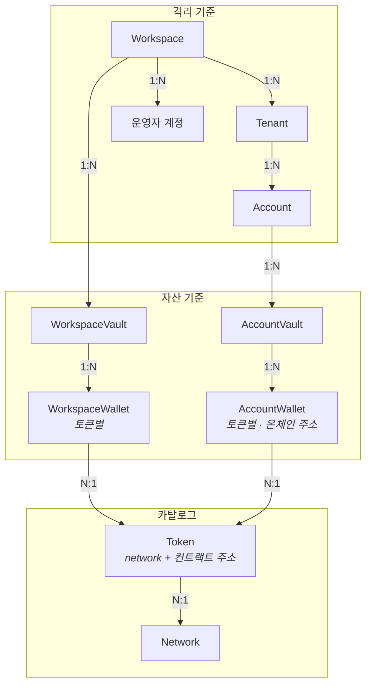
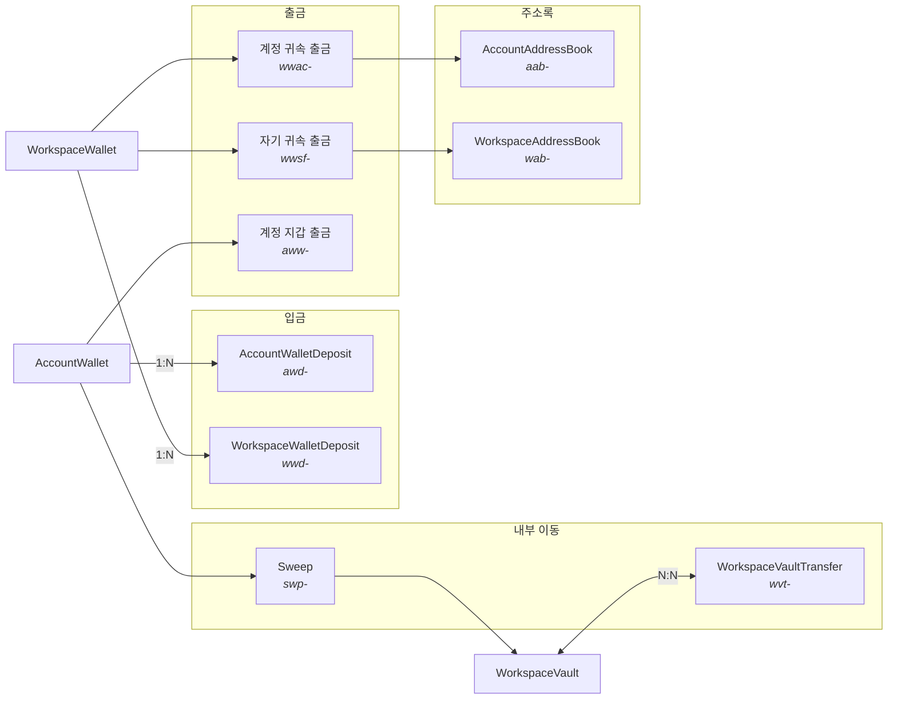

_읽는 사람: 파트너사 개발자. 엔티티의 소유 관계와 개수 대응, 자금 이동 레코드가 어디에 연결되는지를 다룹니다._

도메인 모델은 엔티티가 서로를 어떻게 소유하는지를 나타냅니다. 격리 기준·자산 기준·카탈로그 세
묶음으로 나뉘고, 자금 이동은 지갑이 아니라 별도 레코드로 남습니다. 각 엔티티가 무엇인지는
[계정 계층](/accounts-wallets/accounts)과 [지갑 계층](/accounts-wallets/wallets)에 있습니다.

## 격리와 자산의 구성

엔티티는 두 묶음으로 나뉩니다. **격리 기준이 소유를 정하고 자산 기준이 내용물을 정합니다.**
앞쪽은 어느 데이터가 누구 것인지를, 뒤쪽은 그 안에 무엇이 들어가는지를 답합니다.

두 묶음이 만나는 곳이 둘입니다. Workspace가 `WorkspaceVault`를 직접 소유하고, Account가
`AccountVault`를 소유합니다. 그 아래로는 구조가 같습니다. vault가 토큰별 wallet을 묶습니다.

## Account의 소속

Account는 Tenant에만 속합니다. Account가 Workspace에도 직접 연결된 구조를 떠올릴 수 있는데,
지금 스키마는 그렇지 않습니다. **tenant로 스코프되는 데이터는 workspace 컬럼을 두지 않습니다.**

격리를 이렇게 설계했기 때문입니다. 두 컬럼을 다 두면 workspace만으로 조회하는 쿼리가 문법상 성립하고,
그 쿼리는 같은 workspace의 다른 파트너사 데이터를 함께 냅니다.

격리 기준에서 workspace에 직접 속하는 것은 운영자 계정입니다. 계약 소유자와 인증 방식이 하나로
정해지는 API 경로 묶음인 운영자 표면([자세히](/start/authentication))의 격리 키가
workspace이기 때문입니다.

다만 그 저장소는 지갑이 아니라 [정책 엔진](/policy) 쪽입니다. 지갑은 어드민·세션 테이블을 두지
않습니다. 계층의 자세한 것은 [계정 계층](/accounts-wallets/accounts)에 있습니다.

## 자금 이동 레코드

자금 이동은 지갑이 아니라 별도 레코드에 남습니다. 지갑은 잔고를 갖고 이동은 기록을 갖습니다.
**일곱 이동이 각자 자기 테이블을 갖고, 어느 지갑에서 출발했는지로 지갑과 연결됩니다.**

`WorkspaceVaultTransfer`만 같은 엔티티에 두 번 연결됩니다. 출발 vault와 도착 vault가 둘 다
`WorkspaceVault`라 한 레코드가 두 개를 참조합니다.

계정 귀속 출금은 그림에서 워크스페이스 지갑에서 나가지만 Account 단위로 생성됩니다. 자금이
어느 지갑에 있는지와 누구에게 귀속되는지가 서로 다른 기준이기 때문입니다.

## 주소록의 연결 지점

주소에 등재 근거를 붙이는 장부인 주소록([자세히](/fund-flows/address-book))은 출금에는 입력으로,
입금에는 관측으로 연결됩니다.

출금에서는 목적지 주소의 등재 여부가 정책 입력입니다. 입금은 다릅니다. 온체인 입금은 거부할 수
없어서 등재 여부를 묻는 단계가 없습니다.

대신 발신처가 그 계정 주소록에 있는지를 확정 통지에 `sourceRegistered`로 포함해 보냅니다. 통지는
온체인 이벤트를 파트너사에 보내는 아웃바운드 호출입니다. 파트너사는 그 값을 해제와 집금 판단에
쓰고, 계약은 [웹훅](/fund-flows/webhooks)에 있습니다.

주소록은 둘로 갈리고 격리 기준이 다릅니다. `AccountAddressBook`은 tenant 단위이고,
`WorkspaceAddressBook`은 workspace 단위입니다.

**등재가 곧 허가는 아닙니다.** 미등재는 거절 사유가 아니라 정책 평가의 입력입니다.

등재 근거와 회수, 그 반영 시점은 [주소록](/fund-flows/address-book)에 있습니다.

## 지갑과 토큰의 대응 관계

지갑당 토큰은 하나입니다. `AccountWallet`과 `WorkspaceWallet`은 둘 다 토큰 단위로 만들어집니다.
유일성은 vault와 token의 조합에서 성립합니다.

**그래서 "이 계정의 USDC 지갑"으로 지갑 하나가 유일하게 식별됩니다.** 왜 토큰 단위인지는
[지갑 계층](/accounts-wallets/wallets)에 적었습니다.

## 이 그림에 없는 것

없는 것이 둘입니다.

정책 판단 구간이 없습니다. 이동 레코드가 생기고 온체인으로 나가는 사이에 서명 게이트가
있는데, 그 구조는 도메인 모델이 아니라 [정책](/policy)에 있습니다.

**최종 사용자별 원장이 없습니다.** 사용자마다 얼마인지를 매기는 원장은 파트너사 것이고, Wallet
SDK는 지갑 단위로만 잔액을 관리합니다. 입금·집금·출금이 언제 확정됐는지만 기록합니다. 어느
이동이 무엇을 뜻하는지는 [이동 종류](/fund-flows/movements)에 있습니다.
