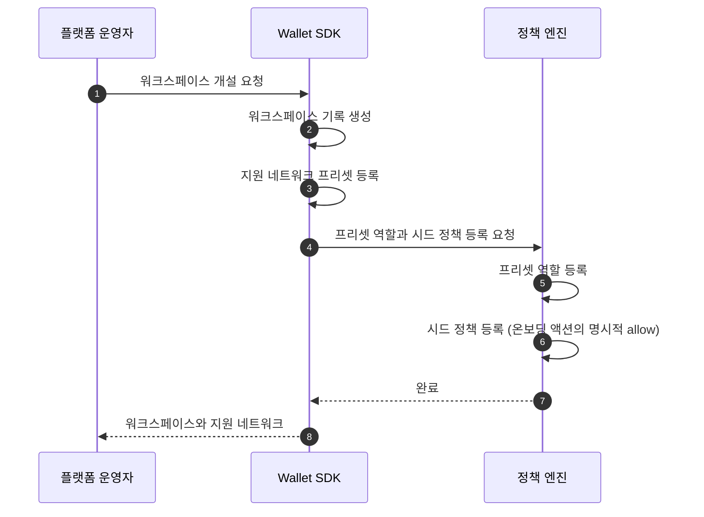
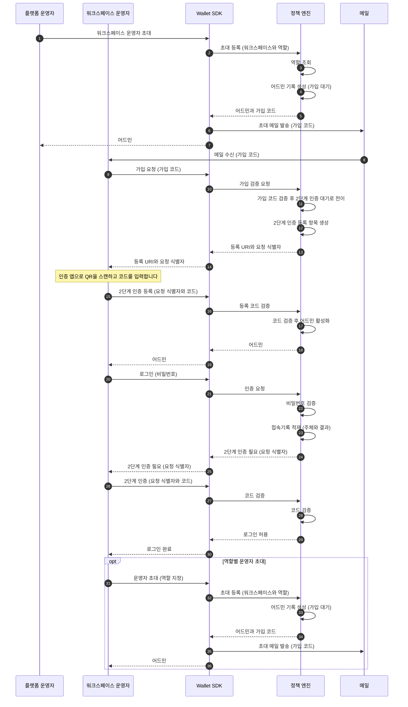
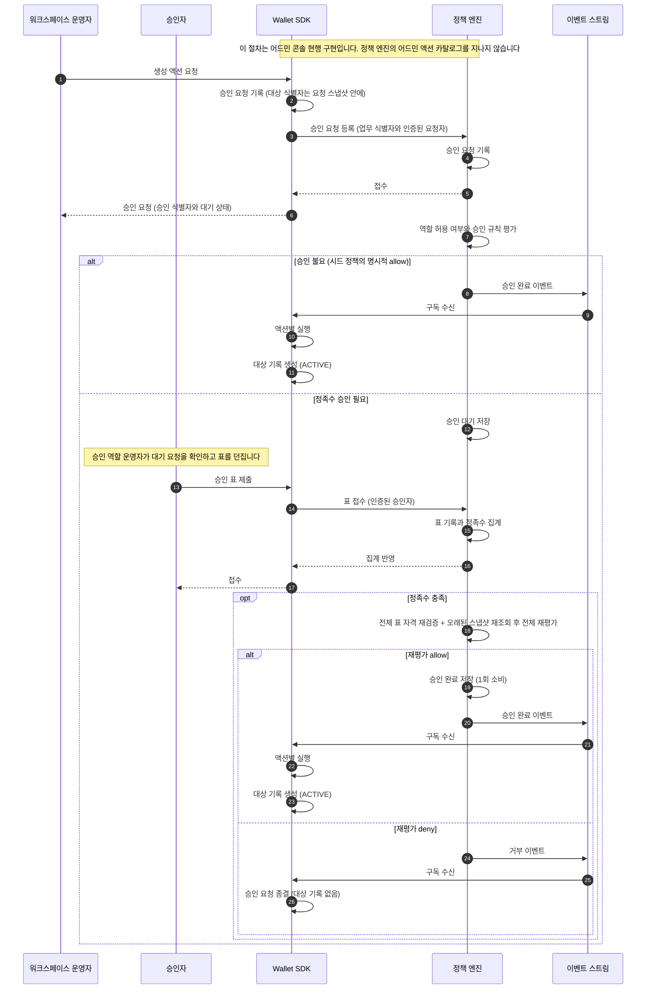
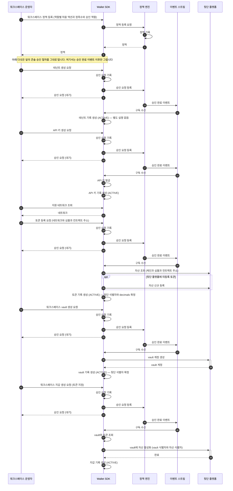

_읽는 사람: 파트너사 개발자. 워크스페이스 개설에서 첫 정책 활성화까지의 순서를 다룹니다._

온보딩은 워크스페이스를 열고 운영자를 들이고 카탈로그와 vault를 세우는 하나의 과정입니다. 이
페이지는 개설과 시드 정책, 운영자 초대와 2단계 인증, 생성 액션 다섯의 승인 절차를 순서대로
다룹니다.

**여기서 만들어지는 것이 이후 모든 자금 이동의 전제입니다.** 파트너 대상 API의 격리 키인 테넌트도
API 키도 토큰도 이 구간에서 나옵니다.

## 개설은 시드 정책까지 함께 앉힙니다

개설은 플랫폼 운영자가 한 번 수행합니다. **워크스페이스만 만드는 것이 아니라 그 안에서 처음
움직일 수 있게 하는 최소 구성까지 함께 앉힙니다.**

앉는 것은 셋입니다. 지원 네트워크 프리셋, 프리셋 역할, 그리고 온보딩 액션을 열어 주는 시드
정책입니다. 시드 정책은 워크스페이스 등록이 심는 첫 번들이고, 저작의 출발점이지 결과가 아닙니다.

## 시드 정책이 없으면 첫 액션이 막힙니다

정책 엔진의 기본값은 거부입니다. 어떤 룰도 매칭되지 않으면 그 요청은 거부로 끝납니다.

**그래서 시드 정책은 예외가 아니라 명시적 allow 룰입니다.** 온보딩 액션을 이름으로 허용하는
룰을 개설 시점에 심어 두는 것이고, 기본 거부 자체는 그대로 남습니다.

워크스페이스가 자기 정책을 활성화한 뒤부터는 그 정책이 기준이 됩니다. 그때부터 같은 액션에
승인이 성립하는 데 필요한 최소 승인자 수인 정족수가 적용됩니다.

## 운영자는 초대로 들어오고 2단계 인증을 마쳐야 활성이 됩니다

다이어그램의 배역은 다섯입니다.

- **플랫폼 운영자**: Workspace 생성과 시드 정책의 권한 뿌리인 합작 법인 쪽 운영자입니다
- **워크스페이스 운영자**: 계약 소유자와 인증 방식이 하나로 정해지는 API 경로 묶음인 운영자 표면([자세히](/start/authentication))을 부르는 사람 주체입니다. API 키와 달리 사람을 식별합니다
- **Wallet SDK**: 파트너 대상 API를 받아 정책 엔진에 판단을 묻고 서명 인프라에 제출하는 서버 컴포넌트입니다
- **정책 엔진**: 자금을 움직이는 요청이 서명 인프라로 가기 전에 그 요청을 심사하는 별도 시스템입니다
- **메일**: 초대 메일을 운영자에게 나르는 채널입니다

**가입 대기 상태로는 로그인할 수 없습니다.** 2단계 인증 등록을 마쳐야 어드민이 활성이 되고,
그 순서를 뒤집는 경로는 없습니다.

등록 URI와 요청 식별자가 두 단계를 잇습니다. 등록에서 받은 요청 식별자를 코드와 함께 되돌려
줘야 검증이 성립합니다.

첫 운영자가 활성이 되면 그 뒤로는 자기가 다른 운영자를 초대합니다. 역할을 지정해 초대하고,
초대받은 쪽은 같은 가입 절차를 거칩니다.

## 어드민 신원은 정책 엔진이 소유합니다

역할·어드민·2단계 인증 자격증명은 전부 정책 엔진 쪽 저장소에 있습니다. **Wallet SDK는 그
저장소를 직접 만지지 않고 정책 엔진을 거쳐서만 접근합니다.**

그래서 위 다이어그램의 초대·가입·2단계 인증은 전부 정책 엔진 안에서 일어납니다. Wallet SDK가
하는 일은 요청을 넘기고 결과를 되돌려 주는 것뿐이고, 자격증명을 저장하지 않습니다.

로그인 시도는 **접속기록**으로 남습니다. 주체와 결과를 함께 적재하며, 이것이 인증 통제를
증명하는 근거입니다.

## 로그인은 정책 판단이 아니라 인증입니다

로그인과 2단계 인증은 정책 엔진의 판단 요청 계약을 따르지 않습니다. **정책 엔진이 어드민 저장소
소유자로서 제공하는 별도 동기 API입니다.**

정책 체크는 로그인 이후의 액션에 적용됩니다. 역할이 그 액션을 할 수 있는지, 승인이 몇 표
필요한지가 그때 평가됩니다.

두 자격이 같은 표면에 공존하는 방식은 [표면과 인증](/start/authentication)에 있습니다.

## 생성 액션 다섯은 콘솔이 자기 승인 절차로 처리합니다

테넌트·API 키·토큰·워크스페이스 vault·워크스페이스 지갑입니다. 다섯이 거치는 절차는 같고
갈리는 것은 승인 완료 이후의 실행 로직뿐입니다.

**이 다섯은 정책 엔진의 어드민 액션 카탈로그에 없습니다.** 어드민 액션은 어드민 권한과 정책
자체를 바꾸는 연산들입니다. 카탈로그에 등재된 여덟은 룰 커널이 판정하지만, 이 다섯의 승인은 어드민
콘솔 현행 구현이 담당합니다.

카탈로그 밖이라는 것이 통제 밖이라는 뜻은 아닙니다. 역할별 허용 액션과 정족수와 승인 역할은
워크스페이스 정책으로 등록되고, 그 정책이 이 다섯에 적용됩니다.

앞 다이어그램에 없던 배역은 둘입니다.

- **승인자**: 승인 역할을 가진 운영자입니다. 대기 중인 요청에 표를 던집니다
- **이벤트 스트림**: 승인 완료와 거부 이벤트를 구독자에게 나르는 경로입니다

## 요청 시점에는 대상 기록을 만들지 않습니다

요청을 받으면 **승인 요청만 쌓고 대상 테이블은 건드리지 않습니다.** 테넌트도 토큰도 vault도
승인이 끝난 뒤에야 행이 생깁니다.

그래서 거부로 끝나도 지울 것이 없습니다. 접수 때 대기 상태 행을 만들어 두면 거부·만료마다
되돌리는 경로가 필요하고, 그 되돌리기가 실패하는 경우를 또 다뤄야 합니다.

대기 상태는 승인 요청의 것이지 대상 엔티티의 것이 아닙니다. 대상 엔티티의 상태는
활성·비활성 둘뿐이고 그 사이에 중간값을 두지 않습니다.

## 정족수가 차면 그때 다시 봅니다

표가 다 모여도 바로 통과가 아닙니다. 표를 던진 승인자의 자격을 전부 다시 검증합니다. 그다음
오래된 스냅샷을 다시 읽고 전체를 재평가한 뒤에야 승인이 완료됩니다.

정족수는 며칠씩 걸릴 수 있습니다. **재개 시점의 활성 정책으로 평가하며**, 대기 중에 정책이
바뀌었어도 옛 정책을 물려주지 않습니다.

자세한 규율은 [승인 게이트](/policy/sequences/approval-gate)에 있습니다.

## 승인 뒤의 실행이 액션마다 다릅니다

앞 다이어그램에 없던 배역은 하나입니다.

- **뒷단 플랫폼**: 지갑과 키를 보관하고 자산을 등록하는 외부 플랫폼입니다

- **테넌트**: 실행 로직이 없습니다. 승인이 곧 활성입니다.
- **API 키**: 승인 뒤에 키를 발급합니다. 발급 응답에는 마스킹된 값만 실리고, 원문은 별도 조회가 한 번만 내줍니다.
- **토큰**: 뒷단 플랫폼에서 자산을 조회하고, 미등록이면 먼저 등록한 뒤 `decimals`를 확정합니다.
- **워크스페이스 vault**: 뒷단 플랫폼에 vault 계정을 만들고 그 식별자를 채웁니다.
- **워크스페이스 지갑**: vault와 토큰을 조회해 그 vault에 해당 자산을 활성화합니다.

## `decimals`는 뒷단 플랫폼이 정합니다

토큰 등록 요청에는 `decimals`가 없습니다. **승인 뒤 자산 조회 응답에서 채워집니다.**

이 값이 금액 표기의 기준입니다. 사람이 읽는 `amount`와 온체인 최소 단위 `amountRaw`를 변환하는
로직이 전부 이 값을 씁니다. 카탈로그 쪽 서술은 [토큰과 네트워크](/accounts-wallets/catalog)에 있습니다.

## 워크스페이스 지갑은 식별자를 조합해 얻습니다

워크스페이스 지갑은 뒷단 플랫폼 식별자를 자기가 갖지 않습니다. **vault의 식별자와 토큰의
식별자를 조합해 자산을 활성화합니다.**

그래서 지갑 생성은 vault와 토큰이 둘 다 활성인 뒤에만 성립합니다. 지갑 계층이 왜 이 모양인지는
[지갑 계층](/accounts-wallets/wallets)에 있습니다.

## 정족수 승인이 필요하면 이벤트가 늦게 옵니다

위 다섯을 이어서 읽으면 연속으로 보이지만 그렇지 않습니다. **승인 완료 이벤트는 정족수
승인에서 시간 간격을 두고 도착합니다.**

요청과 활성화 사이가 며칠일 수 있습니다. 요청 응답으로 받은 승인 식별자로 진행 상태를 조회하는
것이 그 사이의 유일한 확인 수단입니다.

## 이 다섯은 산출물을 누가 적용하느냐로 갈립니다

정책 엔진이 룰로 판정하는 어드민 액션은 여덟이고 그 여덟은 **산출물의 소유자가 정책 엔진
자신**입니다. 어드민 권한이든 번들이든 승인된 레코드를 정책 엔진이 직접 적용합니다.

다섯의 산출물은 전부 Wallet SDK 쪽에 있습니다. 그래서 편입하려면 적용하는 쪽이 정책 엔진 밖인
액션 형태가 필요하고, 그 형태는 아직 없습니다.

**편입 여부는 어드민 콘솔을 정책 엔진 표면으로 옮기는 작업과 한 묶음입니다.** 그 작업은
로드맵의 마지막 구간이고, 그때까지 승인은 위에 그린 콘솔 현행 구현이 담당합니다.

카탈로그와 미등재 값 처리는 [룰 명세](/policy/rule/reference)에 있습니다. 여덟을 정책 엔진이
적용하는 구조는 [승인 게이트](/policy/sequences/approval-gate)에 있습니다.

## 다음으로

- [Admin API](/reference/admin) — 위 요청들의 계약 기준 문서
- [표면과 인증](/start/authentication) — 어느 자격이 무엇을 확정하나
- [승인 게이트](/policy/sequences/approval-gate) — 정족수와 재평가의 규율
- [토큰과 네트워크](/accounts-wallets/catalog) — 카탈로그가 무엇을 담나
- [자금 이동 지도](/fund-flows/movements) — 여기서 만든 것 위에서 도는 이동들
