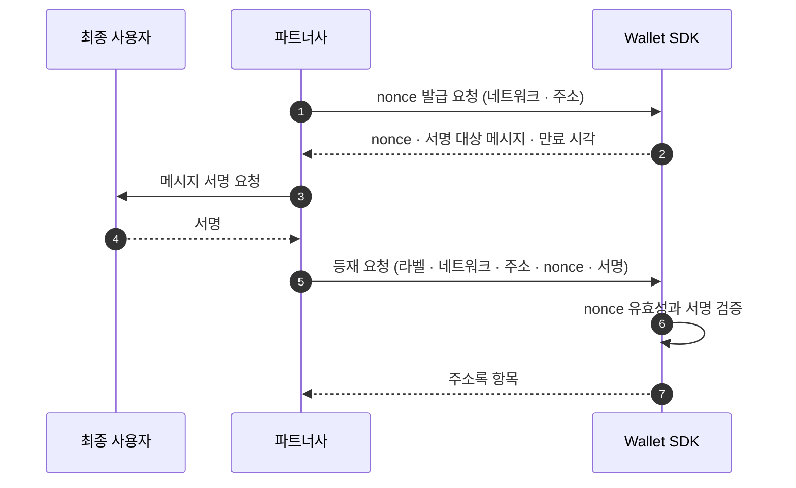

_읽는 사람: 파트너사 개발자. 주소록 등재와 회수, 그리고 그 근거가 정책에 들어가는 지점을 설명합니다._

주소록은 주소에 근거를 붙이는 장부입니다. 그 근거가 출금 목적지 판정과 입금 발신처 판정 양쪽에
쓰입니다. 이 페이지는 두 주소록이 어떻게 나뉘는지와 소유 증명으로 등재가 성립하는 절차, 회수 뒤의
동작을 설명합니다.

**정책 문서와 결정 로그는 같은 것을 화이트리스트(Whitelist)라고 부릅니다.** 두 이름은 쓰는 맥락이
다를 뿐입니다.

표면은 계약 소유자와 인증 방식이 하나로 정해지는 API 경로 묶음입니다. 등재·회수를 다루는 API
표면에서는 주소록이고, "이 주소로 나가도 되는가"를 판단하는 출금 통제에서는 화이트리스트입니다.

## 자금 귀속에 따라 주소록이 둘로 나뉩니다

자금 귀속은 그 자금이 Account 것인지 Workspace 것인지입니다.

| | 계정 주소록 | 워크스페이스 주소록 |
|---|---|---|
| 자금 귀속 | 최종 사용자 | 회사 |
| 격리 기준 | tenant | workspace |
| 등재 근거 | 최종 사용자의 소유 증명 | 미정 — 아래 "알려진 공백" 참조 |
| 출금에서 | 계정 귀속 출금의 개인 지갑 목적지 | 자기 귀속 출금의 목적지 |
| 입금에서 | 개인 지갑 발신처 판정 | 회사 외부 지갑 발신처 판정 |

스코프 축은 어떤 데이터가 어느 스코프 키로 격리되는지의 분류입니다. 두 주소록은 축이 달라, 하나로
합치면 어느 스코프로 조회해야 하는지가 행마다 달라집니다.

## 소유 증명은 nonce에 서명하는 것입니다

소유 증명은 개인 지갑을 주소록에 올리기 전에 최종 사용자가 그 키로 서명해 보이는 절차입니다.

nonce는 만료 시각이 있고 한 번만 쓰입니다. 서명 대상 메시지와 서명 값이 항목에 남아, 그 등재가
무엇으로 성립했는지를 나중에도 확인합니다.

**증명이 선택이 아닙니다.** 계정 주소록은 증명 없이 항목을 만들 수 없습니다. 요청·응답 필드는
[Wallet API](/reference/wallet)에 있습니다.

## 등재는 네트워크 단위입니다

항목마다 네트워크가 하나씩 지정됩니다. 같은 주소 문자열이라도 네트워크가 다르면 별개 항목이고, 한쪽 등재가
다른 쪽 근거가 되지 않습니다.

## VASP 목적지는 이 장부를 타지 않습니다

상대 거래소 수탁 지갑으로 보낼 때는 소유 증명을 요구하지 않습니다. 가상자산 이전 시 송·수신
정보를 사업자끼리 교환하는 규제 의무인 트래블룰이 그 역할을 대신하므로 **제3자 송금이 가능합니다**.

근거가 목적지마다 갈리는 전체 그림은 [이동 종류](/fund-flows/movements)에 있습니다.

## 같은 항목이 입금 판정에도 쓰입니다

입금이 확정되면 발신 주소가 그 계정의 주소록에 있는지를 함께 판정합니다. 결과는 확정 통지의
`sourceRegistered`로 나갑니다.

**판정은 수취를 막지 않습니다.** 등재되지 않은 주소에서 와도 그대로 받고, 다만 해제를 요청할
판단 재료가 하나 줄어듭니다. 통지에 담기는 필드는 [웹훅](/fund-flows/webhooks)에 있습니다.

## 등재는 거절 사유가 아니라 정책 입력입니다

미등재가 곧 거부는 아닙니다. 등재 여부가 정책 입력으로 들어가고 정책이 그것을 보고 판단합니다.

화이트리스트 출금은 이 입력 위에 놓이는 룰입니다. "등재된 주소로만 나간다"는 규칙을 Wallet
SDK가 코드에 박지 않고, 워크스페이스 정책이 `address_ownership` 입력을 보고 정합니다. 그래서 같은
주소록을 두고도 한 워크스페이스는 미등재를 거부하고 다른 워크스페이스는 한도만 걸 수 있습니다.

**등재 여부를 요청에 담지 않고 평가 시점에 읽습니다.** 그래서 회수가 즉시 반영됩니다. 읽는 경로는
평가 시점에 사실을 읽어 오는 수집 경로인 [PIP](/policy/runtime/pip)에 있습니다.

## 회수한 주소를 다시 등재하면 새 항목입니다

항목을 지워도 행이 사라지지 않고 닫힌 것으로 표시됩니다. 같은 주소를 다시 등재하면 새 항목이
생기고 식별자가 새로 발급됩니다. 닫힌 항목의 식별자는 다시 쓰이지 않습니다.

**식별자를 보관해 두었다면 회수 뒤에 다시 받아야 합니다.** 항목 단건 조회와 회수가 식별자를
경로로 받으므로, 옛 식별자를 그대로 쓰면 없는 항목을 가리킵니다.

출금 요청은 이 변화를 타지 않습니다. 요청이 보내는 것은 목적지 주소이고, 등재 여부는 그 주소로
매칭해 판정합니다.

세대가 쌓이므로 항목의 세대가 곧 추가·삭제 이력입니다. 어느 주소가 언제 등재됐다가 언제
닫혔는지를 행으로 확인합니다.

활성 항목이 있는 주소는 다시 등재되지 않습니다. 같은 계정·네트워크·주소에 닫히지 않은 항목이
있으면 등록이 거절되므로, 새 세대는 회수한 뒤에만 생깁니다.

계정을 비활성화하면 그 계정 항목이 전부 닫힙니다. 재활성화해도 복구되지 않습니다. 이유는
[계정 계층](/accounts-wallets/accounts)에 있습니다.

## 알려진 공백이 둘 있습니다

**워크스페이스 주소록에 항목을 만드는 경로가 아직 없습니다.** 등록 근거로 무엇을 남길지가 정해지지
않았고, 그 경로를 여는 변경이 근거 필드를 먼저 추가합니다. 어드민 액션이 승인자의 확인을 거쳐야
실행되는 통제인 승인 게이팅 대상으로 권고돼 있습니다.

출금 목적지 주소가 참조한 항목의 주소와 같은지는 애플리케이션이 검사합니다. 둘을 묶는 스키마
제약이 없어, 항목을 참조했다는 사실만으로 실제 송금 주소가 보증되지는 않습니다.

진행 상황은 [변경 이력](/changelog)에서 추적합니다.

## 다음으로

주소록 근거가 출금 판정에서 어떻게 쓰이는지는 [출금](/fund-flows/withdrawal)에, 입금 발신처
판정에서 어떻게 쓰이는지는 [입금](/fund-flows/deposit)에 있습니다.
