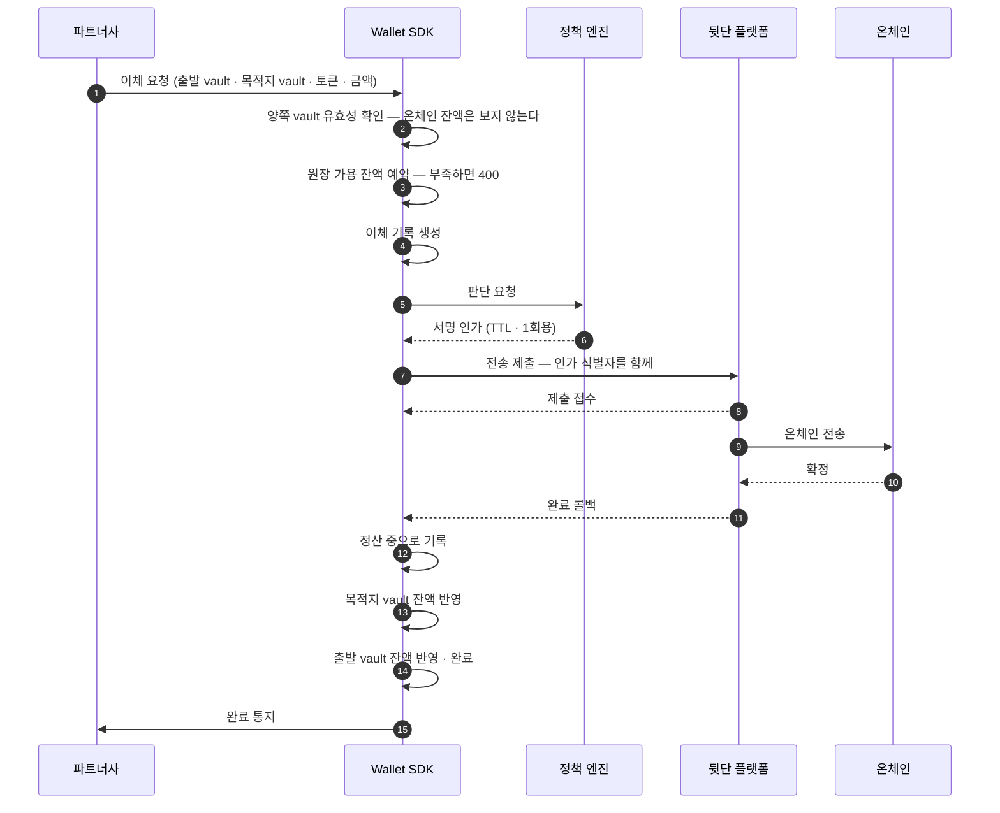

_읽는 사람: 파트너사 개발자. 워크스페이스 vault 사이 이동의 흐름과 실패 계약을 설명합니다._

Vault 이체는 워크스페이스 vault에서 다른 워크스페이스 vault로 자산을 옮기는 이동입니다. 이
페이지는 그 흐름과 확인 근거가 빠지는 이유, 상태 단계와 실패 사유, 재시도 복구 방법을 설명합니다.
출발지와 목적지가 둘 다 Wallet SDK 안의 vault라, 목적지 확인 근거가 필요 없는 유일한 이동입니다.

## 요청 하나가 접수에서 완료 통지까지 한 흐름으로 처리됩니다

다이어그램의 배역은 다섯입니다.

- **파트너사**: Wallet SDK를 도입한 회사, 곧 Workspace 하나입니다
- **Wallet SDK**: 파트너 대상 API를 받아 정책 엔진에 판단을 묻고 서명 인프라에 제출하는 서버 컴포넌트입니다
- **정책 엔진**: 자금을 움직이는 요청이 서명 인프라로 가기 전에 그 요청을 심사하는 별도 시스템입니다
- **뒷단 플랫폼**: 지갑과 키를 보관하고 트랜잭션을 제출하는 외부 플랫폼입니다
- **온체인**: 블록체인 네트워크입니다

## 양쪽 끝이 내부라 확인 근거가 빠집니다

출금은 목적지가 외부라 주소록이나 트래블룰로 근거를 세웁니다. vault 이체는 양쪽이 다 Wallet
SDK가 소유한 vault여서 그 절차가 통째로 빠집니다.

**남는 통과 조건은 서명 인가 하나입니다.** 서명 인가는 승인된 판단 요청이 발급하는 한 번만 쓸 수 있는
서명 근거입니다. 정책은 출발·목적지 vault와 토큰과 금액을 보고 판단합니다. 판단과 집행이 나뉘는
구조는 [서명 게이트](/policy/signing-gate)에 있습니다.

vault의 용도 태그를 정책이 읽는 경로는 신설 예정입니다. 지금은 그 태그를 판단 입력으로 가져오는
수집 경로가 없고, 신설이 정해졌습니다. 상세는 평가 시점에 사실을 읽어 오는 수집 경로인
[PIP](/policy/runtime/pip)에 있습니다.

## 쌍은 종류를 가리지 않되 워크스페이스를 넘지 않습니다

같은 워크스페이스 안이면 어느 vault에서 어느 vault로든 갑니다. vault를 가르는 것은 파트너사가
vault 용도를 정의하는 값인 용도 태그입니다. 그 태그는 이동을 막는 벽이 아니라 정책 판단에 쓰려고
두는 값입니다.

**워크스페이스를 넘는 이동은 없습니다.** 남의 워크스페이스 vault를 목적지로 지목하면 조회 단계에서
없는 것으로 답하고, 정책 쪽에서도 평가에 들어가기 전에 한 번 더 막습니다.

이것을 룰로 막지 않는 이유는 정책이 평가하는 요청 항목에 워크스페이스가 없기 때문입니다. 룰은
목적지 vault의 종류까지만 지목할 수 있어, 그 앞의 수집 단계가 이 역할을 대신합니다.

계정 지갑은 어느 쪽에도 오지 않습니다. 계정 지갑에서 vault로 오는 이동은
[집금](/fund-flows/sweep)이고, vault에서 계정 지갑으로 되돌아가는 경로는 없습니다.

## 잔액 부족은 드러나는 시점이 둘입니다

**원장 가용 잔액이 모자라면 요청 시점에 400입니다**(`WORKSPACE_VAULT_INSUFFICIENT_BALANCE`).
온체인 잔액 부족만 사후에 이체 상태로 드러납니다.

이체를 접수할 때 온체인 잔액이 충분한지는 조회하지 않습니다. 부족은 뒷단 플랫폼이 제출을 거절할
때 드러나고, 그 건은 잔액 부족을 사유로 실패 마킹됩니다.

Wallet SDK 원장 기준의 예약은 그것과 별개로 적용됩니다. vault 이체도 지갑을 출발지로 쓰는 송금이라
접수 시점에 금액을 예약하고, 송금이 성공하면 그 예약을 확정합니다.

송금이 실패하면 예약이 풀립니다. 예약이 막는 것은 동시 요청이 같은 잔액을 두 번 쓰는 것이고,
온체인 충분성은 예약을 통과한 뒤에도 보증되지 않습니다. 예약의 기준 설명은
[자금 동결](/fund-flows/release)에 있습니다.

## 상태는 다섯 단계를 지나고 정산 중 전까지는 어디서든 실패합니다

접수 → 심사 → 온체인 → 정산 중 → 완료 순으로 갑니다. 정산 중은 온체인 완료가 확인됐고 두 vault의
잔액 반영이 남은 구간입니다. 목적지 vault의 잔액이 먼저 오르고, 출발 vault의 잔액이 내려가면서
완료가 됩니다. 완료 통지는 그 뒤에 나갑니다.

**정산 중에 이르면 실패로 끝나지 않습니다.** 온체인에서 이미 옮겨진 자산이라 되돌릴 실패가 없기
때문입니다. 실패는 접수·심사·온체인 단계에서만 옵니다.

정산 중에 머무는 시간은 보통 1초 안입니다. 내부 처리가 끊기면 대사가 몇 분 안에 이어 갑니다. 그
사이 출발 vault의 가용 잔액은 이체 금액만큼 잡혀 있고, 목적지 vault의 가용 잔액은 반영이 끝난
쪽부터 오릅니다.

세부 상태가 그 안을 가릅니다. 접수 단계에서만 비어 있고 그 뒤로는 항상 채워집니다. 정산 중과
완료에서는 `COMPLETED`입니다. 값 목록은 [Wallet API](/reference/wallet)에 있습니다.

## 실패 사유는 드러나는 시점으로 갈립니다

요청 시점에 400으로 거부되는 것은 다섯입니다 — 출발지와 목적지가 같은 vault
(`WORKSPACE_VAULT_TRANSFER_SOURCE_DESTINATION_SAME`), 금액이 0 이하이거나 토큰 정밀도를 넘는 경우
(`..._INVALID_AMOUNT`), 같은 `referenceId`가 이미 쓰인 경우(`..._REFERENCE_CONFLICT`), 어느 한쪽
vault가 비활성인 경우(`WORKSPACE_VAULT_INACTIVE`), 출발 vault의 원장 가용 잔액이 모자란 경우
(`WORKSPACE_VAULT_INSUFFICIENT_BALANCE`)입니다.

정책 거부도 요청 시점에 400으로 옵니다(`..._POLICY_DENIED`). 다만 이체 기록은 남고 실패
상태로 마킹됩니다. 거부된 시도가 조회되지 않으면 무슨 일이 있었는지 되짚을 수 없기 때문입니다.

404는 "없다"로 통일합니다. vault·토큰·해당 지갑이 없을 때가 여기 들어가고, 남의 워크스페이스
자원도 같은 응답입니다. 코드를 갈라 주면 그것이 곧 존재 여부를 알려주는 오라클이 됩니다.

제출 이후에 드러나는 것은 잔액 부족과 트랜잭션 revert, 타임아웃입니다. 상태와 세부 상태에
담겨 오고 요청 응답에는 나타나지 않습니다.

**제출 결과 자체가 불명이면 503입니다**(`..._PROVIDER_UNAVAILABLE`). 이때 이체는 실패가 아니라
접수 상태로 남고, 기록과 뒷단 플랫폼의 사실이 어긋난 것을 바로잡는 2차 방어인 대사가 정리합니다.
나갔는지 모르는 것을 실패로 판정하면 이중 송금이 일어날 수 있습니다.

값 목록과 전체 조건은 [Wallet API](/reference/wallet)가 기준 문서입니다.

## 재시도 복구는 `referenceId`로 합니다

요청에 `referenceId`를 실으면 그 값으로 이체를 되찾을 수 있습니다. 같은 값으로 두 번 만들면
거부되므로 업무 단위 중복도 함께 막힙니다.

`Idempotency-Key` 헤더는 아직 동작하지 않습니다. 현재 상태는 [첫 요청](/start/first-request)에
있습니다.

## 양쪽이 내부라 출금과 확인 근거가 갈립니다

| | vault 이체 | 출금 |
|---|---|---|
| 목적지 | 워크스페이스 vault | VASP · 개인 지갑 · 회사 외부 지갑 |
| 확인 근거 | 없음 — 양쪽이 내부입니다 | 주소록 또는 트래블룰 |
| 트래블룰 | 타지 않습니다 | 계정 귀속 출금의 VASP 목적지만 |
| 자금 귀속 | 워크스페이스 | 최종 사용자 또는 회사 |

## 다음으로

vault 이체는 완료와 실패만 통지합니다 — `VAULT_TRANSFER_FINALIZED`·`VAULT_TRANSFER_FAILED`.
시작 통지가 없으므로 접수 직후 상태는 조회로 확인합니다. 통지 본문은
[웹훅](/fund-flows/webhooks)에 있습니다.

셋으로 나뉜 출금은 [출금](/fund-flows/withdrawal)에 있습니다.
