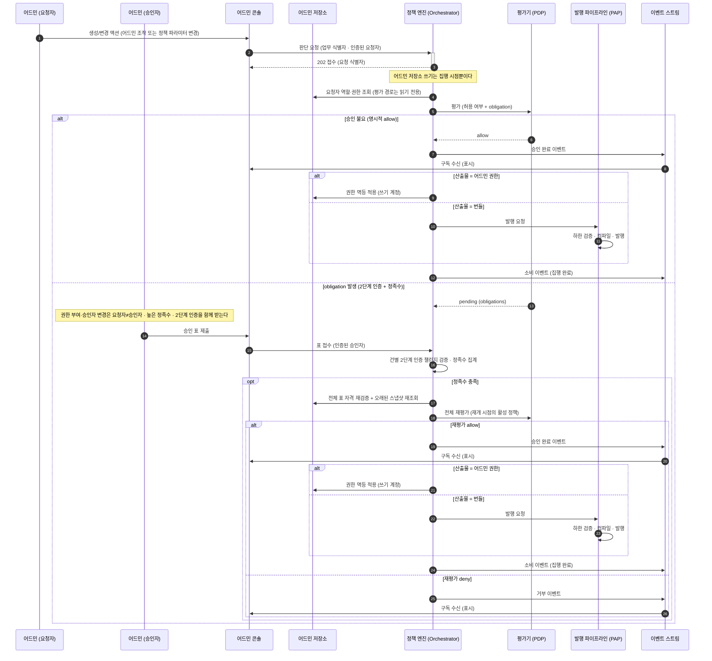

_읽는 사람: 구현팀. 어드민 조작과 정책 변경이 승인을 받아 집행되는 경로를 다룹니다._

승인 게이트는 어드민 조작과 정책 변경이 거치는 승인 경로입니다. 자금 이동 쪽의 2단계는
[서명 게이트](/policy/signing-gate)에 있습니다.

어드민 조작과 정책 변경도 자금 이동과 같은 커널을 거칩니다. 커널은 조건 트리를 평가하고 결정을
결합하는 정책 무관 고정 부분입니다([자세히](/policy/rule/decision)). 다만 결정을 강제하는 지점이
다릅니다.

## 이 전체 흐름은 지금 시작되지 않습니다

계약 소유자와 인증 방식이 하나로 정해지는 API 경로 묶음인 접수 표면이 어드민 액션 연산을 403으로
거부합니다([표면과 인증](/start/authentication)). 그래서 이 페이지가 그리는 흐름은 설계이고, 아래
다이어그램의 2번 단계부터가 아직 코드가 아닙니다.

**없는 것은 요청을 만들 표면이고 판정하는 쪽은 있습니다.** 커널과 룰 모듈, 테스트 벡터는
`admin_action`을 그대로 지원합니다. 저작 세트에 역할 부여 게이트와 룰 변경 게이트가 실제로 있습니다.

승인 뒤의 집행도 마찬가지입니다. 승인 전이는 출발 온체인 주소와 provider vault 식별자로 이루어진
서명 권한 바인딩 값을 요구하는데, 어드민 액션에는 그 값이 없습니다. 승인된 요청에서 권한 적용이나
발행을 실행하는 경로도 없습니다.

## 지금 실제로 동작하는 승인 경로는 둘입니다

위 흐름 대신 두 경로가 각자 승인을 받습니다. 둘 다 어드민 콘솔에서 부르고, 둘 다 커널 평가를
거치지 않습니다.

- **룰 변경**: 번들 발행의 maker-checker입니다. 검증을 통과한 초안 revision에만 승인을 열고, 표는
  그 revision의 내용 해시에 결속됩니다. 승인에 필요한 최소 인원인 정족수가 차면 발행을 따로
  호출하고 활성화를 또 따로 호출합니다.
- **역할 부여**: 초대 표면의 직접 인가입니다. 부여할 역할의 스코프를 요청자의 세션에서 유도해
  즉시 판정합니다. 제안자와 승인자를 가르는 단계가 없습니다.

정족수 집계와 자격 재검증의 규율은 두 경로가 같은 도메인 함수를 씁니다. 갈리는 것은 자격 재검증이
대상 번들의 스코프까지 보는지 여부입니다.

## 이 경로에는 코시너가 없습니다

온체인 트랜잭션이 아니라서 서명 인프라가 개입할 여지가 없습니다. 코시너는 서명 인프라 쪽에서
서명 직전에 정책 엔진 콜백으로 승인을 묻는 구성 요소입니다([자세히](/policy/signing-gate)).
강제 지점은 정책 엔진의 maker-checker 워크플로우 하나입니다. maker-checker는 제안자와 승인자를
갈라 두는 정책 변경 거버넌스입니다([자세히](/policy)).

**집행자도 정책 엔진 자신입니다.** 어드민 권한이든 번들이든 산출물의 소유자가 정책 엔진이라,
결정을 내린 쪽과 적용하는 쪽이 같은 프로세스 안에 있습니다.

## 접수 시점에는 아무것도 쓰지 않습니다

요청을 받아도 어드민 저장소에 임시 레코드를 만들지 않습니다. 쓰기는 집행 시점 한 번뿐입니다.

**그래서 거부로 끝나도 지울 것이 없습니다.** 접수 때 무언가를 써 두면 거부·만료마다 되돌리는
경로가 생기고, 그 되돌리기가 실패하는 경우를 또 다뤄야 합니다.

## 전체 흐름

아래는 설계 흐름입니다. 지금 실행되는 경로는 위 절의 둘입니다.

다이어그램의 배역은 여덟입니다.

- **어드민 (요청자) · 어드민 (승인자)**: 운영자 표면을 부르는 사람 주체입니다. API 키와 달리 사람을 식별합니다
- **어드민 콘솔**: 정책 엔진의 API를 부르는 표면입니다. 자체 저장소가 없습니다
- **어드민 저장소**: 어드민 역할과 권한이 적용되는 저장소입니다. 평가 경로에서는 읽기 전용입니다
- **정책 엔진 (Orchestrator)**: 판단 요청을 접수하고 입력 문서를 조립하고 PIP 수집과 obligation 루프를 조율하는 정책 엔진의 앞단입니다. 판정 자체는 하지 않습니다
- **평가기 (PDP)**: 완성된 입력 문서를 평가해 결정을 내는 역할입니다. 밖을 부르지 않습니다
- **발행 파이프라인 (PAP)**: 룰을 저작·검증·발행하는 경로 전체를 부르는 이름입니다
- **이벤트 스트림**: 승인 완료·거부·소비 이벤트가 흐르는 채널입니다

## 콘솔은 저장소를 갖지 않습니다

어드민 콘솔은 정책 엔진의 API를 부르는 표면입니다. 자체 저장소가 없어 여기에 남는 상태가
없습니다.

**콘솔이 받는 이벤트는 표시 목적입니다.** 집행이 엔진 안에서 끝나므로 콘솔이 결과를 받아 무엇을
실행할 일이 없습니다.

## 정족수가 차면 그때 다시 봅니다

표가 다 모여도 바로 통과가 아닙니다. **오래된 스냅샷을 다시 읽고 전체를 재평가한 뒤에야** 승인이
완료됩니다.

정족수는 며칠씩 걸릴 수 있습니다. 첫 평가 때 참이던 사실이 마지막 표를 받는 시점에도 참이라는
보장이 없습니다.

재개 시점의 활성 정책으로 평가합니다. 대기 중에 정책이 바뀌었어도 옛 정책을 적용하지 않습니다.
재평가가 거부를 내면 거부로 끝납니다.

## 표의 자격을 두 번 검증합니다

표를 받을 때 한 번 보고, 정족수가 찼을 때 **모아 둔 표 전체를 다시** 봅니다.

승인자의 역할이 표를 던진 뒤에 회수될 수 있기 때문입니다. 접수 시점 검증만 두면 이미 회수된
권한으로 던진 표가 정족수에 남습니다.

## 산출물이 둘이라 집행 경로가 둘입니다

어드민 권한은 어드민 저장소에 멱등하게 적용합니다. 역할 부여와 정책 편집 권한 부여가 여기에
해당합니다.

번들은 발행 파이프라인으로 넘어갑니다. 하한 검증과 컴파일을 통과해야 발행되고, 검증 통과가 곧
발행입니다.

어느 쪽이든 **적용을 끝낸 뒤에 소비 상태로 옮깁니다.** 승인된 레코드 자체가 집행 지시라 별도
지시 기록을 만들지 않습니다.

## 집행 직전 재확인은 집행자가 밖에 있을 때만 붙습니다

승인된 요청을 집행하기 직전에 저장소를 다시 읽어 그 승인이 아직 유효한지 보는 절차입니다.
**이 경로에는 붙지 않습니다.**

승인 상태 자체가 집행 지시이고 그 전이가 집행과 원자적이라, 조회와 전이 사이에 재확인이 들어갈
여지가 없습니다. 중복 집행은 멱등 적용이 막습니다.

밖에 있는 집행자는 반대입니다. 자금 이동 쪽은 요청을 소유한 서비스가 집행하므로, 이벤트만 믿으면
중복·지연 도착으로 이미 취소된 승인을 집행합니다. 그래서 그쪽은 실행 전에 조회로 다시 확인하고,
그 규율은 정책 엔진의 내부 인터페이스 명세가 정합니다.

## 권한을 올리는 표면이 가장 강한 게이트를 받습니다

역할 부여, 정책 편집 권한 부여, 승인자 집합 변경입니다. 셋은 통제 자체를 바꾸는 연산이라 다른
액션과 같은 문턱에 둘 수 없습니다.

**요청자와 승인자가 달라야 하고, 정족수는 둘 이상이며, 2단계 인증이 함께 붙습니다.** 필요하면
플랫폼을 운영하는 합작 법인인 JV의 어드민 공동승인까지 받습니다.

정족수를 낮추는 변경 자체도 이 하한 아래로 내려갈 수 없습니다. 먼저 정족수를 내린 뒤 낮아진
정족수로 권한을 올리는 자기참조 경로를 컴파일이 막습니다.

## 워크스페이스 룰 저작도 이 경로입니다

파트너사가 자기 도메인의 룰과 슬롯 값을 고치는 것도 승인 게이트를 거칩니다. 플랫폼 구조를 바꾸는
변경보다는 낮은 문턱이지만 maker-checker는 같습니다.

**정책 변경 자체가 엔진의 피통제 연산입니다.** 룰·카탈로그·소스 선언·하한을 바꾸는 일이 전부
판단 요청으로 접수돼 같은 obligation을 받습니다. 판단 요청은 한 업무 요청을 두고 엔진이 소유하는
판단 기록이고([자세히](/policy/signing-gate)), obligation은 통과로 확정되기 전에 이행해야 하는
조건입니다([자세히](/policy/rules)).

지금은 그 접수 경로가 없어 룰 변경이 번들 발행의 maker-checker로 갑니다. 두 경로는 정족수
집계와 자격 재검증에 같은 도메인 함수를 쓰고, 갈리는 것은 그 판정을 커널이 하는지입니다.

요구하는 정족수 값 자체는 두 경로가 다릅니다. 번들 발행 승인은 코드에 고정된 상수 2를 쓰고, 커널
경로는 `escalation_quorum` 슬롯을 읽습니다. 그 슬롯의 기본값은 3이고 하한은 2입니다.

## 다음으로

- [서명 게이트](/policy/signing-gate) — 자금 이동 쪽의 2단계
- [obligation 수집](/policy/sequences/obligations) — 2단계 인증과 정족수를 어떻게 모으나
- [결정과 결합](/policy/rule/decision) — 재평가 라운드와 obligation 병합
- [구조](/policy/architecture) — 두 집행 형태의 비교
