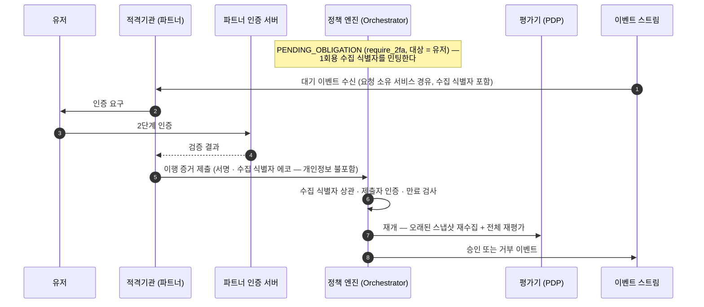

_읽는 사람: 구현팀. 통과 조건으로 붙은 이행을 어느 채널에서 모으는지를 다룹니다._

obligation은 통과로 확정되기 전에 이행해야 하는 조건입니다([자세히](/policy/rules)). 이
페이지는 그 이행을 어느 채널에서 모으고, 모으는 동안 요청이 어디에 머무는지를 씁니다.

obligation은 **"통과시키되 이것을 이행하라"**는 요구입니다. 이행이 끝날 때까지 요청은
`PENDING_OBLIGATION`에 머뭅니다.

## 셋의 수집 채널이 다릅니다

타입은 커널이 고정한 어휘 셋입니다. 저작자가 새 타입을 만들 수 없습니다. 타입마다 이행을 모으는
코드가 실제로 있어야 하기 때문입니다.

| 타입 | 누가 검증하나 | 어디로 들어오나 | 구현 상태 |
|---|---|---|---|
| `require_2fa` (어드민) | 정책 엔진 | 어드민 표면의 챌린지 검증 | 이행을 기록하는 경로가 없습니다 |
| `require_2fa` (유저) | 파트너 인증 서버 | 파트너의 서명된 이행 증거 | 증거를 접수하는 엔드포인트가 없습니다 |
| `require_quorum` | 정책 엔진 | 어드민 표면의 표 접수 | 이행 기록 경로가 있습니다 |
| `attach_travel_rule_payload` | 트래블룰 게이트웨이 | 별도 제출 없이 소스 재수집 | 타입 값만 있습니다 |

표의 「표면」은 계약 소유자와 인증 방식이 하나로 정해지는 API 경로
묶음입니다([자세히](/start/authentication)).

**같은 `require_2fa`인데 채널이 갈립니다.** 요청자가 어드민이면 정책 엔진에 자격증명이 있고
유저면 없기 때문입니다.

## 이행 경로가 코드로 있는 타입은 정족수 하나입니다

이 페이지의 나머지는 설계입니다. 넷 중 이행이 실제로 기록되는 것은 `require_quorum`이고, 그
기록은 표 집계가 승인에 필요한 최소 인원인 정족수의 충족을 판정할 때 일어납니다. 나머지 셋에는 그
기록을 만드는 코드가 없습니다.

- **`require_2fa` (어드민)**: 어드민 표면의 챌린지 검증은 있으나 그 결과를 obligation 이행으로
  기록하지 않습니다. 정족수와 함께 부과되면 정족수만 이행되고 요청은 2단계 인증 데드라인에서
  만료됩니다. 그 데드라인의 기본값은 5분입니다.
- **`require_2fa` (유저)**: 파트너가 부르는 제출 엔드포인트는 PIP 결과 수집으로만 갑니다. 이행
  증거를 받는 엔드포인트가 따로 없습니다.
- **`attach_travel_rule_payload`**: 타입 값은 커널 어휘에 있으나 데드라인 기본값이 선언돼 있지
  않습니다. 부과되면 데드라인을 만들지 못해 그 시점에 요청이 `FAILED`로 종결합니다. 재수집
  대상인 트래블룰 소스도 선언되지 않았습니다.

**그 앞에 obligation을 부과하는 절차 자체가 지금 없습니다.** obligation을 다는 룰은 저작 세트의
어드민 쪽에만 있고, 어드민 액션을 판단 요청으로 접수하는 표면이 아직
없습니다([승인 게이트](/policy/sequences/approval-gate)). 값 이동 세 모듈의 allow 룰에는
obligation이 없습니다.

## 유저의 2단계 인증은 정책 엔진이 검증하지 않습니다

유저 대면 표면과 인증 수단은 파트너 쪽에 있습니다. 정책 엔진에는 유저의 팩터가 등록돼 있지
않습니다.

**그래서 검증은 파트너가 하고 엔진은 이행 증거를 접수합니다.** 수단을 특정하지도 않습니다. 2단계
인증이든 FIDO든 파트너가 자기 최고 보안 존에서 고릅니다.

## 유저 2단계 인증의 흐름

아래는 설계 흐름입니다. 6번 단계의 제출을 받는 엔드포인트가 아직 없어 이 흐름은 지금 성립하지 않습니다.

다이어그램의 배역은 여섯입니다.

- **유저**: 파트너사 서비스의 최종 사용자입니다
- **적격기관 (파트너)**: 유저 대면 표면을 갖고 이행 증거를 엔진에 제출하는 쪽입니다
- **파트너 인증 서버**: 파트너사가 운영하는 인증 수단의 검증 서버입니다
- **정책 엔진 (Orchestrator)**: 판단 요청을 접수하고 입력 문서를 조립하고 PIP 수집과 obligation 루프를 조율하는 정책 엔진의 앞단입니다. 판정 자체는 하지 않습니다
- **평가기 (PDP)**: 완성된 입력 문서를 평가해 결정을 내는 역할입니다. 밖을 부르지 않습니다
- **이벤트 스트림**: 대기·승인·거부 이벤트가 흐르는 채널입니다

## 제출 계약은 PIP와 같은 것을 씁니다

이행 증거를 위한 별도 프로토콜을 만들지 않았습니다. 판단에 필요한 사실을 평가 시점에 읽어 오는
수집 경로인 PIP([자세히](/policy/runtime/pip))에서 파트너가 데이터를 넣는 인바운드 계약을 그대로
씁니다.

그 계약을 공유한다는 것이 설계이고, 지금 그 엔드포인트가 받는 것은 PIP 결과 하나입니다. 제출을
이행 증거로 가르는 경로가 아직 없습니다.

**서명과 1회용 수집 식별자, 도착 규칙이 전부 같습니다.** 파트너 입장에서 "심사 결과를 보내는 것"과
"인증 결과를 보내는 것"이 같은 모양이라 붙일 것이 하나뿐입니다.

엔진의 결정 식별자는 파트너에게 노출하지 않습니다. 파트너가 쥐는 것은 그 건에만 유효한 수집 식별자
하나입니다.

## 트래블룰 이행은 증거를 받지 않습니다

`attach_travel_rule_payload`는 제출을 기다리지 않습니다. **트래블룰 소스를 다시 수집해 이행을
확인합니다.** 트래블룰은 가상자산 이전 시 송·수신 정보를 사업자끼리 교환하는 규제
의무입니다([자세히](/#함께-제공하는-모듈)).

첨부가 실제로 이루어졌는지는 그 소스의 스냅샷이 답합니다. 별도 증거를 받으면 소스와 증거가 갈리는
경우를 또 다뤄야 합니다.

이 재수집은 아직 코드가 아닙니다. 데드라인 기본값과 트래블룰 소스 선언이 둘 다 없어, 이 타입이
부과된 요청은 재수집에 닿기 전에 `FAILED`로 종결합니다.

## 어드민 쪽은 표와 챌린지로 모읍니다

정족수와 어드민 2단계 인증은 어드민 표면에서 받습니다. 표를 던질 때마다 건별 챌린지를 검증하는
스텝업을 함께 적용합니다.

**그 스텝업은 표의 자격 검사이지 `require_2fa`의 이행이 아닙니다.** 지금 이행으로 기록되는 것은
정족수 충족 하나입니다.

챌린지는 그 요청의 내용에 묶여 있습니다. 그래서 승인자가 본 것과 승인된 것이 같음이 보장되고, 다른
요청에 받은 응답을 재사용할 수 없습니다.

상세한 흐름은 [승인 게이트](/policy/sequences/approval-gate)에 있습니다.

## 이행이 끝나도 바로 통과가 아닙니다

증거가 다 모이면 재개합니다. 그때 오래된 스냅샷을 다시 읽고 전체를 재평가한 뒤에야 결과가
나옵니다.

**최신 데이터가 앞선 승인 상태보다 우선합니다.** 재평가가 거부를 내면 거부로 끝납니다. 기다리는
동안 주소가 회수됐거나 정책이 바뀌었으면 그 결과가 우선합니다.

대기 중에 정책이 바뀌었어도 옛 정책을 적용하지 않습니다. 재개 시점의 활성 정책으로 평가합니다.

## 재개는 별도 상태를 만들지 않습니다

재개는 `EVALUATING`으로 되돌아가는 것입니다. 재평가가 사실을 더 요구하면 다시 비동기 수집 대기로
내려가 같은 루프에 합류합니다.

**재개 재평가도 평가 라운드를 하나 씁니다.** 평가 라운드는 한 판단 요청 안에서 평가가 몇 번째로
실행됐는지입니다([자세히](/policy/rule/decision)). 그래서 obligation과 수집 사이를 오가는 진동의
절대 상한이 라운드 상한입니다.

## 만료는 미이행 데드라인의 최솟값입니다

obligation마다 데드라인이 따로 있습니다. 대기 진입 시각에 타입별 TTL을 더해 고정되고, 개별
데드라인은 이후에 움직이지 않습니다.

**요청의 만료 시각은 아직 이행되지 않은 것들의 최솟값입니다.** 하나가 이행될 때마다 남은 것
기준으로 다시 계산되고, 하나라도 데드라인을 넘기면 요청 전체가 만료됩니다.

만료된 요청은 다시 진행되지 않습니다. 재시도는 처음부터이고 새 결정 식별자를 받습니다.

## 다음으로

- [승인 게이트](/policy/sequences/approval-gate) — 정족수와 어드민 2단계 인증의 전체 흐름
- [비동기 수집](/policy/sequences/pending-data) — 파트너를 기다리는 다른 경우
- [룰 쓰기](/policy/rules) — obligation을 룰에 어떻게 다나
- [결정과 결합](/policy/rule/decision) — obligation 병합 규칙
