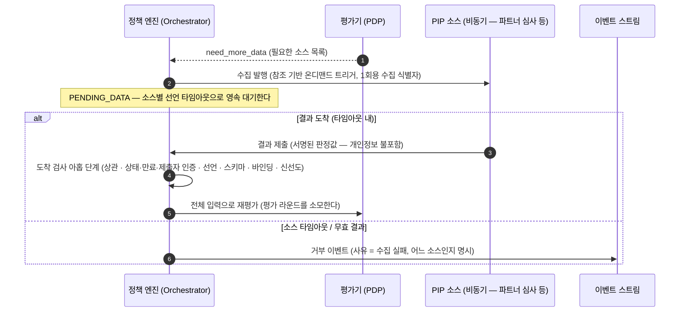

_읽는 사람: 구현팀. 즉시 답이 오지 않는 소스를 기다리는 동안 요청이 머무는 구간을 다룹니다._

파트너 심사처럼 즉시 답이 오지 않는 소스가 있습니다. 그런 소스는 판단에 필요한 사실을 평가
시점에 읽어 오는 수집 경로인 PIP([자세히](/policy/runtime/pip))의 비동기 쪽입니다. 그 답을
기다리는 동안 요청이 머무는 상태가 `PENDING_DATA`입니다.

## 비싼 조회는 룰이 요구할 때만 일어납니다

모든 요청에 AML 심사를 적용하지 않습니다. 룰이 그 사실을 참조해야 발동할 때만 수집이
트리거됩니다.

**발동하지 않는 금액 구간은 조회 자체가 없습니다.** 룰의 `scope`가 요청 필드만 보므로, 어떤 룰이
발동하는지는 데이터를 하나도 읽지 않고 확정됩니다.

## 기다리는 상태를 영속으로 만듭니다

**평가 루프 수집은 mode와 무관하게 `PENDING_DATA`를 거칩니다.** 동기 소스는 그 안에서 어댑터가
인프로세스로 채워 바로 재개하고, 비동기 소스는 파트너의 제출이 도착할 때까지 영속 대기합니다.

대기 시간의 상한은 소스마다 선언됩니다. 레지스트리에 응답 타임아웃이 적혀 있고, 그 값을 넘기면
기다림이 끝납니다.

## 전체 흐름

## 수집 식별자는 1회용입니다

수집을 발행할 때 그 건에만 유효한 식별자를 만들어 함께 보냅니다. 파트너는 결과를 제출하면서 그
식별자를 그대로 되돌려 줍니다.

**엔진의 결정 식별자는 파트너에게 나가지 않습니다.** 파트너가 아는 것은 이 1회용 수집 식별자
하나이고, 그것으로 다른 요청을 건드릴 수 없습니다.

## 도착한 결과는 아홉 단계를 순서대로 거칩니다

제출을 받았다고 바로 입력에 넣지 않습니다. **검사 순서는 싼 것부터가 아니라 좁은 것부터입니다.**
앞 단계를 통과하지 못한 제출에는 뒤 단계의 결과를 알려 주지 않습니다. 아래가 그 순서입니다.

- **대응 확인**: 이 수집 식별자가 실제로 발행된 미결 수집인가
- **상태·만료·제출자 인증**: 아직 소비되지 않았고 시한 안이며 서명이 그 수집이 기대한 파트너의
  것인가
- **선언 존재**: 그 소스의 레지스트리 선언이 아직 있는가
- **스키마 자가 점검**: 그 소스가 자가 점검에서 수집 거부 상태로 표시되지 않았는가
- **스키마 버전**: 수집을 발행한 시점의 스냅샷 스키마 버전과 지금 선언이 같은가
- **부모 요청**: 이 수집을 낸 판단 요청이 재개 가능한 상태로 있는가
- **요청 바인딩**: 제출된 결과가 그 요청의 정규형 내용에 묶여 있는가
- **스냅샷 스키마**: 제출된 스냅샷이 선언된 스키마를 만족하는가
- **신선도**: 소스에 선언된 최대 나이 안인가

단계별 거절 사유 코드는 [PIP](/policy/runtime/pip)에 있습니다.

아홉을 통과한 제출은 단일 소비로 반영됩니다. 다른 제출이 먼저 소비하면 중복으로 접수되고 입력에
들어가지 않습니다.

요청 본문을 신뢰하지 않습니다. 어느 파트너의 제출인지는 인증된 신원이 정하고, 본문이 주장하는
값이 정하지 않습니다.

## 파트너가 보내는 것은 판정값입니다

파트너가 보내는 것은 판정값입니다. **엔진이 하는 일은 그 판정값이 이 요청에 묶인 것인지 확인하는
것입니다.** 심사 기준을 다시 계산하지 않습니다.

위험 점수 임계 같은 세부는 심사 주체가 자기 경계 안에서 판정값으로 요약해 보냅니다. 개인정보가
어디까지 오가는지는 [PIP](/policy/runtime/pip)에 있습니다.

## 타임아웃은 실패가 아니라 거부입니다

선언된 시간 안에 답이 오지 않으면 **거부로 종결**합니다. 예외 없이 fail-closed입니다.

거부 사유에 어느 소스가 못 왔는지를 적고, 사유 코드로 정책 거부와 구분합니다. 그 코드가 재제출
가능함을 식별합니다. 소스가 복구되면 요청을 소유한 서비스가 다시 올립니다.

`FAILED`는 여기에 쓰지 않습니다. 그쪽은 정규화 실패나 평가 크래시 같은 엔진 자체의 오류 전용
신호입니다.

## 재진입도 라운드를 씁니다

결과가 다 모이면 `EVALUATING`으로 돌아가 전체 입력으로 다시 평가합니다. 부분 재평가는 없습니다.

**이 왕복에 상한이 있습니다.** 평가 라운드는 한 판단 요청 안에서 평가가 몇 번째로 실행됐는지입니다.
그 상한은 5이고 재개 재평가도 같은 카운터를 소모합니다. 근거는
[결정과 결합](/policy/rule/decision)에 있습니다.

## 소스 장애가 오래가면 정책을 바꿉니다

장기 장애에 특수 런타임 모드를 두지 않습니다. 장애가 난 소스를 참조하지 않도록 **룰을 고쳐 정식
발행 경로로 내보냅니다.**

제안자와 승인자를 갈라 두는 정책 변경 거버넌스인 maker-checker([자세히](/policy))와 테스트 벡터가
그대로 적용되고, 복구 뒤 원복도 같은 경로입니다. 그래서 감사에 완화와 원복이 전부 남습니다.

## 다음으로

- [PIP](/policy/runtime/pip) — 어떤 소스가 있고 어떻게 선언되나
- [obligation 수집](/policy/sequences/obligations) — 사람을 기다리는 쪽의 대기
- [결정과 결합](/policy/rule/decision) — 평가 라운드 상한
